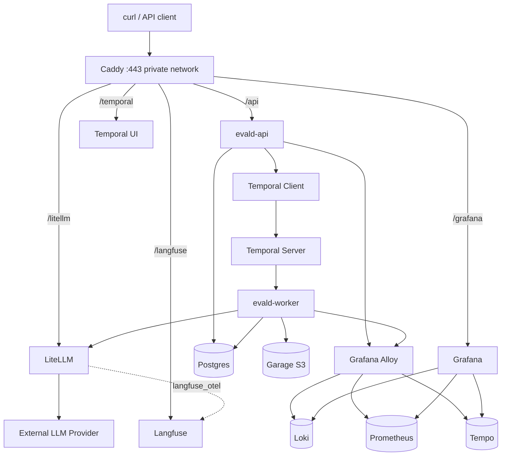

=== document: plans/binary-checklist-eval-mvp.md ===

# Implementation and Test Plan — Binary Checklist Evaluation MVP (evald)

## 1. Title and metadata

- Project name: evald — Binary Checklist Evaluation MVP
- Version: 1.0.0
- Owners: Kirill (product + engineering)
- Date: 2026-07-06
- Document ID: PLAN-EVALD-001
- Summary: This plan drives implementation of a self-hosted LLM-evaluation service that generates binary yes/no checklist questions from a task and context, assigns integer weights (1–4), judges model answers with per-question yes/no verdicts plus evidence, and computes `checklist_pass_rate = satisfied_points / total_possible_points` in deterministic Go code. The stack is Go + Temporal + Postgres + Garage + LiteLLM behind Caddy on a private network, with Grafana/Alloy/Loki/Prometheus/Tempo/Langfuse observability. The repository is greenfield; Phase P00 creates all build/test commands before any later phase references them. Scope is the one-path MVP: one checklist creation path, one evaluation path, one scoring formula, one LLM boundary, one Postgres schema, one Garage layout, one Temporal workflow per product action.

## 2. Design consensus and trade-offs

- Topic: Judge emits scalar quality scores.
  - Verdict: AGAINST
  - Rationale: The judge returns only yes/no per question with evidence; Go owns the arithmetic. This keeps scoring deterministic, auditable, and reproducible from persisted judgments and weights. (ADR-001)
- Topic: Split `context` into system_instruction / rubric / source_documents / product_requirements fields.
  - Verdict: AGAINST
  - Rationale: One canonical `context` field carries all evaluator-side input; splitting multiplies schemas, prompts, and validation paths for no MVP benefit. (ADR-004)
- Topic: Fallback model providers, fallback plain-text parser, schema repair prompts.
  - Verdict: AGAINST
  - Rationale: One-path MVP principle. Schema-constrained JSON is the only parsing path; if the configured model cannot satisfy it, the model profile is unsupported and the conformance gate (P08) blocks workflow rollout.
- Topic: Malformed-JSON handling.
  - Verdict: DECISION — retry exactly once, same prompt, same model, no repair prompt.
  - Rationale: Narrow syntactic retry covers transient decode failures without becoming a fallback path; schema and semantic violations remain non-retryable. (ADR-003)
- Topic: LLM access boundary.
  - Verdict: DECISION — LiteLLM is the sole model boundary; Go knows only `model_profile = checklist-evaluator`.
  - Rationale: One OpenAI-compatible egress point, provider swap via LiteLLM config only, no provider SDKs in Go, no browser/session access. (ADR-002)
- Topic: Weight 0 / exclusion weight.
  - Verdict: AGAINST
  - Rationale: Weights are integers 1–4 only; question quality is the generation step's responsibility, not the weighting step's. (ADR-005)
- Topic: LLM-generated persistent question IDs.
  - Verdict: AGAINST
  - Rationale: Go assigns `q1..qN` in array order after parsing; the LLM owns only semantic content, eliminating ID-collision and traceability failure modes.
- Topic: OpenSearch/Elasticsearch for Temporal visibility.
  - Verdict: AGAINST
  - Rationale: Postgres visibility is sufficient at MVP workflow volume; add search backends only if visibility volume demands it. (ADR-007)
- Topic: Multiple worker binaries.
  - Verdict: AGAINST
  - Rationale: One `evald-worker` binary; use separate Temporal task queues only where concurrency control is useful. (ADR-009)
- Topic: Central auth (Keycloak/Auth0/Authentik).
  - Verdict: AGAINST
  - Rationale: Hashed API keys with scopes in Postgres enforced by the Go API; internal UIs are private-network only behind Caddy. (ADR-008)
- Topic: Artifact store selection.
  - Verdict: DECISION — Garage.
  - Rationale: S3-compatible API designed for self-hosted small/medium deployments; Postgres stores keys and structured state, Garage stores raw text and raw LLM payloads with no duplication. (ADR-006, ADR-010)
- Topic: NATS, Manticore, Sentry, Braintrust, Phoenix LiveView, manual review workflow, offline validation CLI.
  - Verdict: AGAINST for MVP
  - Rationale: Explicit MVP exclusions; each has a defined later trigger (event fanout, search volume, review workflow) and none gates the acceptance criteria.
- Topic: API interaction model.
  - Verdict: DECISION — async API: POST starts a Temporal workflow and returns id + lifecycle status; GET polls status/result; curl-first testing with a smoke script.
  - Rationale: Matches workflow durability semantics and keeps the API surface to four routes.

## 3. PRD / stakeholder and system needs

- Problem: Evaluating LLM answers with scalar judge scores is opaque and non-reproducible. Decomposing criteria into atomic binary questions with independent verdicts yields interpretable, weighted, deterministic scores.
- Users: Internal engineers running answer-quality evaluations via curl/CLI; operators debugging failed runs via RCA bundles and observability tooling.
- Value: Reusable, answer-independent checklists per task+context; per-question evidence; deterministic weighted pass rates; full raw-payload auditability.
- Business goals: Ship the smallest clean implementation of binary checklist evaluation on fully self-hosted infrastructure with a single external exception (LLM inference via LiteLLM).
- Success metrics: All acceptance criteria in Section 4 REQs pass; EVAL-001..003 conformance thresholds met; EVAL-004 golden fixtures separate good from bad answers; smoke script exits 0 end to end.
- Scope: Checklist creation (question_generation → Go ID assignment → weight_assignment), answer evaluation (binary_judging → Go scoring), async HTTP API, Temporal workflows, Postgres + Garage persistence, LiteLLM boundary, Caddy entrypoint, observability stack, `evalctl model-test` and `evalctl rca`.
- Non-goals: Dimensions, category scores, reason codes, materialized weighted questions, dedup/rewrite steps, multi-judge scoring, learned calibration, prompt optimization, manual review workflow, update endpoints, fallback providers/parsers, central auth, NATS/Manticore/Sentry/Braintrust/Phoenix.
- Dependencies: Official API-compatible LLM provider reachable through LiteLLM; Docker/Compose host; provider API key.
- Risks: See Section 5 risk register.
- Assumptions: Greenfield repository; single-host production-lite deployment; provider supports schema-constrained JSON output well enough to pass conformance thresholds; sending task/context/model_answer/questions to the external provider is accepted policy; no PII redaction in MVP.

## 4. SRS / canonical requirements

### Functional requirements

- REQ-001 (func): POST /checklists accepts `{task, context}`, starts CreateChecklistWorkflow, and returns `{checklist_id, status: "running"}`. Acceptance: response contains a ULID-based id and running status; a workflow execution exists for that id.
- REQ-002 (func): question_generation returns schema-valid JSON with ≥1 question; every question has non-empty `rationale` and `question` text. Acceptance: structural validation rejects empty lists and missing fields.
- REQ-003 (func): Go assigns question IDs `q1..qN` in array order after parsing; the LLM never emits persistent IDs. Acceptance: IDs are dense, ordered, and deterministic for a given draft list.
- REQ-004 (func): weight_assignment returns exactly one weight per question; each weight is an integer in {1,2,3,4} with a rationale and a valid `question_id`. Acceptance: missing, duplicate, out-of-range, or unknown-ID weights fail validation.
- REQ-005 (func): Successful checklists persist questions, rationales, and weights in Postgres and are immutable afterward; lifecycle transitions are exactly running→succeeded and running→failed with `error_message` on failure. Acceptance: no update endpoints exist; semantic content never changes after success.
- REQ-006 (func): POST /evaluations accepts `{checklist_id, model_answer}`, starts EvaluateAnswerWorkflow against an existing succeeded checklist, and returns `{evaluation_id, status: "running"}`. Acceptance: unknown or non-succeeded checklist ids produce a failed request path, not a running evaluation.
- REQ-007 (func): binary_judging receives task, context, model_answer, and questions without weights or rationales; it returns exactly one judgment per question, each with `evidence` and `answer` ∈ {"yes","no"}. Acceptance: judge request payload contains no weight or rationale fields; validation rejects missing/duplicate/unknown-ID judgments and non-enum answers.
- REQ-008 (func): `ScoreChecklist` computes satisfied_points, total_possible_points, checklist_pass_rate, and failed_question_ids in pure Go, enforcing: every question has exactly one weight and one judgment, weights 1..4, answers yes/no, total_possible_points > 0. Acceptance: the exact error table in the tech spec §12 is reproduced by unit tests.
- REQ-009 (func): GET /checklists/{id} and GET /evaluations/{id} return the running/succeeded/failed payload shapes from the API contract, including `error_message` on failure and `failed_question_ids` on evaluation success. Acceptance: response bodies match the documented JSON shapes field-for-field.
- REQ-010 (func): `evalctl model-test checklist-evaluator` validates the model profile for all three prompt steps (schema validity, structural rules, error behavior) and exits non-zero on any failure. Acceptance: EVAL-001..003 thresholds are computable from its output.
- REQ-011 (func): `evalctl rca evaluation <id> --out <dir>` exports the standard MVP debug bundle (summary.md, ids.json, checklist/questions/weights/evaluation/judgments/score JSON, workflow_history.json, temporal_links.txt, logs.jsonl, langfuse/litellm id files, garage_manifest.json, llm_raw_requests/, llm_raw_responses/, git_sha.txt). Acceptance: bundle layout matches the tech spec §21.1 exactly.

### Interface requirements

- REQ-020 (int): The only LLM interface is `LLMClient.GenerateJSON(ctx, req, out)`; Go calls only the LiteLLM OpenAI-compatible endpoint; no provider SDKs, no fallback provider, no plain-text parser, no schema repair prompt. Acceptance: no provider SDK import appears in go.mod; all LLM HTTP traffic targets `LITELLM_BASE_URL`.
- REQ-021 (int): All API routes require `Authorization: Bearer <api_key>`; keys are stored hashed in `api_keys` with scopes (checklists:write/read, evaluations:write/read, admin); middleware attaches api_key_id and scopes to request context and updates last_used_at best-effort. Acceptance: missing/invalid/revoked keys and insufficient scopes return 401/403.
- REQ-022 (int): Caddy is the sole private-network entrypoint routing /api, /temporal, /grafana, /langfuse, /litellm; Postgres, Garage, Temporal Server, Loki, Prometheus, Tempo, and Alloy are not exposed. Acceptance: compose publishes ports only on the caddy service.

### Data requirements

- REQ-030 (data): Postgres implements the product tables (checklists, questions, weights, evaluations, judgments) and operational tables (llm_calls, workflow_runs, artifact_manifests, api_keys) exactly as specified; canonical raw text lives only in Garage, referenced by artifact keys. Acceptance: migrations produce the specified columns, keys, and foreign keys.
- REQ-031 (data): One Garage bucket `eval-artifacts` with the fixed key layout for checklist inputs, evaluation inputs, and all raw LLM request/response/parsed payloads. Acceptance: the key builder emits exactly the spec §17 paths.
- REQ-032 (data): Every Garage write records an `artifact_manifests` row with entity_type, entity_id, artifact_kind, garage_object_key, and content_sha256. Acceptance: sha256 recomputed from the stored object matches the manifest row.

### Non-functional requirements

- REQ-040 (reliability): Temporal activities use bounded retries for infrastructure errors (network, provider 5xx/timeout, LiteLLM, Garage, Postgres connectivity); malformed JSON retries exactly once with the same prompt and model; schema violations and semantic failures (missing/invalid weight, missing judgment, invalid answer, unknown question ID) are non-retryable and fail the workflow with error_message. Acceptance: error-classification tests reproduce the retry table in tech spec §14.
- REQ-041 (security): Secrets load only from environment variables (DATABASE_URL, TEMPORAL_ADDRESS, GARAGE_*, LITELLM_*, LANGFUSE_*, OTEL_EXPORTER_OTLP_ENDPOINT, LLM_PROVIDER_API_KEY, EVALD_API_KEY_BOOTSTRAP); no secret value is written to logs, Garage, Postgres text fields, traces, or RCA bundles. Acceptance: config validation fails fast on missing vars; log-field tests assert secret scrubbing.
- REQ-042 (nfr): All services log JSON to stdout with the required field set (ts, level, service, env, request_id, trace_id, workflow ids, activity_type, entity ids, prompt_name/version, schema_version, model_profile, langfuse/litellm ids, garage_object_key, error, duration_ms, git_sha); Loki labels are restricted to the low-cardinality set (service, env, level, workflow_type, activity_type, prompt_name, model_profile); the minimum Prometheus metric set from tech spec §20.3 is registered; OTel traces flow Caddy→api→workflow→activity→dependencies; Langfuse captures LLM traces via the LiteLLM `langfuse_otel` callback. Acceptance: unit tests assert log fields and metric registration; CHECK-001 confirms end-to-end trace visibility.
- REQ-043 (perf): `ScoreChecklist` scores a 10,000-question checklist in <100 ms on reference hardware (see Section 9). Acceptance: benchmark result under threshold.
- REQ-044 (nfr): The repository provides reproducible toolchain commands — `make lint`, `make build`, `make test`, `make test-integration` — with pinned Go toolchain and pinned container image tags. Acceptance: commands exist and exit 0 on a clean checkout at each phase boundary.

### Error handling and telemetry expectations

- Every LLM activity writes an `llm_calls` row (running→succeeded/failed) with prompt_name, prompt_version, schema_version, model_profile, artifact keys, and langfuse/litellm correlation ids.
- Every workflow writes a `workflow_runs` row with entity linkage, trace_id, and git_sha.
- Failure taxonomy in logs/metrics: `malformed_json` (retried once), `schema_violation`, `semantic_failure`, `infra_retry` — each mapped to the evald_llm_* counters.

### Architecture diagram



C4-style ASCII (container level):

```
[Person: Engineer] --curl/evalctl--> [Caddy (reverse proxy, TLS)]
  Caddy --/api-->      [Container: evald-api (Go, chi)]
  Caddy --/temporal--> [Container: Temporal UI]
  Caddy --/grafana-->  [Container: Grafana]
  Caddy --/langfuse--> [Container: Langfuse]
  Caddy --/litellm-->  [Container: LiteLLM gateway]

[evald-api] --start/query--> [Container: Temporal Server (Postgres-backed)]
[Temporal Server] --tasks--> [Container: evald-worker (Go, workflows+activities)]
[evald-worker] --sqlc/pgx--> [Container: Postgres (product+ops schema)]
[evald-worker] --S3 API-->   [Container: Garage (bucket eval-artifacts)]
[evald-worker] --HTTP JSON-->[LiteLLM] --HTTPS--> (External LLM Provider)
[evald-api|evald-worker] --OTLP--> [Alloy] --> [Loki][Prometheus][Tempo]
Not exposed outside compose network: Postgres, Garage, Temporal Server,
Loki, Prometheus, Tempo, Alloy.
```

## 5. Iterative implementation and test plan

### Phase strategy

- Order: toolchain → pure domain → LLM boundary → persistence (Postgres, Garage) → auth → checklist path → evaluation path → model conformance gate → deployment/observability → RCA/smoke/docs. Pure logic is built and tested before any side-effecting surface; the model conformance gate (P08) precedes any live-provider end-to-end run.
- Verification-first: every behavior-changing implementation subtask is preceded by failing coverage (RED) for its REQs; RED and GREEN run the identical command for the identical TEST-###.
- Compute controls: branch_limits = 2 (maximum two solution attempts per subtask before escalation); reflection_passes = 1 (one structured self-review per phase before the exit gate); early_stop% = 30 (suspend the phase and escalate if ≥30% of its subtasks are blocked after allowed attempts).
- Git tags `phase-pXX-complete` mark configuration checkpoints at each phase boundary (not implementation subtasks).

### Risk register

- Risk: Provider cannot reliably produce schema-constrained JSON. Trigger: EVAL-001..003 below threshold. Mitigation: model profile change in LiteLLM config only; conformance gate blocks P09+ live runs; per ADR-002 no fallback provider is added.
- Risk: Garage testcontainer bring-up is fragile. Trigger: TEST-010 flakiness >1 failure per 10 runs. Mitigation: pinned image + committed `garage.toml` fixture + readiness polling; switching the test double requires an ADR.
- Risk: Temporal local environment complexity. Trigger: TEST-012/013 unable to use in-memory testsuite for a needed feature. Mitigation: keep workflow tests on `go.temporal.io/sdk/testsuite`; reserve dockerized Temporal for smoke only.
- Risk: Secret leakage into logs/artifacts/RCA bundles. Trigger: TEST-023 scrub assertions fail or bundle review finds a key. Mitigation: central slog redaction, denylist of env var names, RCA writer filters headers.
- Risk: Scope creep into excluded features (dimensions, reason codes, fallbacks). Trigger: any subtask touching Section 3 non-goals. Mitigation: exit-gate review against MVP exclusions list; requires new ADR + plan revision.
- Risk: LLM nondeterminism destabilizes evals. Trigger: threshold oscillation across runs. Mitigation: thresholds computed over ≥5 runs; raw payloads persisted for audit; any threshold change requires an ADR.

### Suspension/resumption criteria

- Suspend when: conformance thresholds fail (resume after LiteLLM model profile change and EVAL rerun); a REQ is discovered ambiguous (resume after ADR); an external contract (provider schema support, image availability) is missing (resume after contract confirmed).
- Resume protocol: rerun the phase's full TEST set from the last green checkpoint tag before continuing.

### Phase metric conventions

Each phase reports: Confidence %, Long-term robustness %, Internal interactions (count of in-repo package couplings touched), External interactions (count of external systems touched), Complexity %, Feature creep %, Technical debt %, YAGNI score (0–10; 10 = no speculative work), MoSCoW, Local/non-local scope, Architectural changes count.

---

### Phase P00: Reproducible toolchain, config loading, and observability foundations exist

Phase goal: A clean checkout builds, lints, and unit-tests via make targets; environment config validates fail-fast; structured logging and metric registration are testable in-process.

Scope and objectives: REQ-044, REQ-041 (env-only secrets, fail-fast config), REQ-042 (log fields, metric registration).

Impacted surfaces: `go.mod`, `Makefile`, `/internal/config`, `/internal/observability`, `/cmd/evald-api`, `/cmd/evald-worker`, `/cmd/evalctl` (main stubs), `migrations/` (empty dir), `deploy/compose/` (dir), `.gitignore`.

Lifecycle evidence:
- Requirements evidence: REQ-041, REQ-042, REQ-044.
- Design/code surface evidence: Makefile targets; internal/config; internal/observability.
- Verification method: TEST-020, TEST-023, TEST-024, TEST-025 via commands in Section 7.3.
- Validation purpose: every later phase depends on these commands and on trustworthy config/log/metric plumbing.
- Configuration checkpoint: git tag `phase-p00-complete`.
- Risks and assumptions: Go 1.23.x installed locally; Docker available for later phases only.

Plan-and-Solve subtasks:

- P00.S01 Add failing toolchain check for lint/build targets
  - Action: Execute the toolchain command on the empty repository to record the failing baseline for TEST-025.
  - Why now: RED must exist before the scaffold that satisfies it.
  - Files/surfaces: repository root (no files yet).
  - Requirement link: REQ-044.
  - Verification link: TEST-025.
  - Verification mode: RED.
  - Command/procedure: `make lint build`
  - Expected result: Command exits non-zero (`make: *** No rule to make target`).
  - Evidence produced: Terminal log captured in execution log.
  - Stop/escalate condition: None applicable.
  - Unlocks: P00.S02.
- P00.S02 Create Go module, package layout, and Makefile targets
  - Action: Initialize `go.mod` (module `evald`, toolchain go1.23), create the Section 8 package directories with doc.go placeholders and three `cmd/*/main.go` stubs, and write a Makefile with targets lint (`gofmt -l .` empty-output check + `go vet ./...`), build (`go build ./...`), test (`go test ./... -count=1`), test-integration (`go test -tags integration ./internal/db ./internal/artifacts -count=1 -timeout 10m`).
  - Why now: All later TEST commands depend on these targets.
  - Files/surfaces: `go.mod`, `Makefile`, `internal/*`, `cmd/*`, `.gitignore`.
  - Requirement link: REQ-044.
  - Verification link: TEST-025.
  - Verification mode: GREEN.
  - Command/procedure: `make lint build`
  - Expected result: Exit 0.
  - Evidence produced: Code diff; passing command output.
  - Stop/escalate condition: Escalate if the pinned Go toolchain is unavailable.
  - Unlocks: P00.S03.
- P00.S03 Add failing coverage for environment config validation
  - Action: Write `internal/config/config_test.go` (tag `// TEST-020`) asserting: load succeeds with all required vars set via t.Setenv; load returns a named error listing each missing var; no secret value appears in the error string.
  - Why now: RED precedes the config loader implementation.
  - Files/surfaces: `internal/config/config_test.go`.
  - Requirement link: REQ-041.
  - Verification link: TEST-020.
  - Verification mode: RED.
  - Command/procedure: `go test ./internal/config -run TestConfigValidation -count=1`
  - Expected result: Compile/assert failure (loader absent).
  - Evidence produced: Failing test output.
  - Stop/escalate condition: None applicable.
  - Unlocks: P00.S04.
- P00.S04 Implement fail-fast env config loader
  - Action: Implement `internal/config` struct + `Load()` reading the Section 9 env var list, validating presence, and never echoing secret values in errors.
  - Why now: Every binary consumes config at startup.
  - Files/surfaces: `internal/config/config.go`.
  - Requirement link: REQ-041.
  - Verification link: TEST-020.
  - Verification mode: GREEN.
  - Command/procedure: `go test ./internal/config -run TestConfigValidation -count=1`
  - Expected result: Exit 0, all subtests pass.
  - Evidence produced: Code diff; passing test output.
  - Stop/escalate condition: Escalate if a required var is ambiguous → ADR.
  - Unlocks: P00.S05.
- P00.S05 Add failing coverage for structured log fields and metric registration
  - Action: Write `internal/observability/log_test.go` (`// TEST-023`) asserting a JSON slog record contains the required field keys and that values of denylisted secret env names are redacted; write `internal/observability/metrics_test.go` (`// TEST-024`) asserting all Section 4 evald_* collectors register on a fresh Prometheus registry without panic and appear in the gather output.
  - Why now: RED precedes the observability implementation.
  - Files/surfaces: `internal/observability/log_test.go`, `internal/observability/metrics_test.go`.
  - Requirement link: REQ-042, REQ-041.
  - Verification link: TEST-023, TEST-024.
  - Verification mode: RED.
  - Command/procedure: `go test ./internal/observability -run 'TestLogRequiredFields|TestMetricsRegistered' -count=1`
  - Expected result: Compile/assert failure.
  - Evidence produced: Failing test output.
  - Stop/escalate condition: None applicable.
  - Unlocks: P00.S06.
- P00.S06 Implement slog setup, OTel wiring, and Prometheus metric set
  - Action: Implement `internal/observability`: JSON slog handler with required base fields + secret redaction; OTel tracer provider reading OTEL_EXPORTER_OTLP_ENDPOINT; Prometheus collectors for the full tech-spec §20.3 metric list.
  - Why now: Activities and handlers in P06–P07 emit through this package.
  - Files/surfaces: `internal/observability/{log.go,otel.go,metrics.go}`.
  - Requirement link: REQ-042, REQ-041.
  - Verification link: TEST-023, TEST-024.
  - Verification mode: GREEN.
  - Command/procedure: `go test ./internal/observability -run 'TestLogRequiredFields|TestMetricsRegistered' -count=1`
  - Expected result: Exit 0.
  - Evidence produced: Code diff; passing test output.
  - Stop/escalate condition: Escalate if OTel SDK versions conflict with Temporal SDK interceptors.
  - Unlocks: P00.S07.
- P00.S07 Confirm no refactor needed for foundations
  - Action: Inspect internal/config and internal/observability for duplication or unnecessary surface; record outcome.
  - Why now: Phase exit requires REFACTOR-or-VERIFY disposition.
  - Files/surfaces: `internal/config`, `internal/observability`.
  - Requirement link: REQ-044.
  - Verification link: TEST-025.
  - Verification mode: VERIFY.
  - Command/procedure: `make lint build test`
  - Expected result: Exit 0. No refactor needed — packages are small, single-purpose, and free of duplication.
  - Evidence produced: Command output; execution-log note.
  - Stop/escalate condition: If duplication is found, convert to REFACTOR and rerun the same command.
  - Unlocks: Phase exit.

Exit gates:
- Proceed: TEST-020/023/024/025 pass; traceability tags present.
- Escalate: toolchain or dependency conflicts block reliable implementation.
- Stop: acceptance criteria unreachable without scope change.

Phase metrics:
- Confidence: 95% — standard Go scaffolding with deterministic tests.
- Long-term robustness: 90% — foundations change rarely after stabilization.
- Internal interactions: 2 — config and observability consumed by all binaries.
- External interactions: 0 — no external systems in this phase.
- Complexity: 15% — boilerplate-heavy, logic-light.
- Feature creep: 0% — scope fixed to toolchain and foundations.
- Technical debt: 5% — stub mains carry no logic.
- YAGNI score: 9/10 — only required targets and packages created.
- MoSCoW: Must — everything downstream depends on it.
- Scope: local — no cross-cutting behavior yet.
- Architectural changes: 1 — establishes the canonical package layout.

---

### Phase P01: Pure evalcore domain logic scores checklists deterministically

Phase goal: `AssignQuestionIDs`, the three structural validators, and `ScoreChecklist` exist as pure functions with exhaustive table-driven tests and a passing performance benchmark.

Scope and objectives: REQ-002 (validation), REQ-003, REQ-004 (validation), REQ-007 (validation), REQ-008, REQ-043.

Impacted surfaces: `internal/evalcore/{types.go,ids.go,validate.go,score.go}` and tests.

Lifecycle evidence:
- Requirements evidence: REQ-002, REQ-003, REQ-004, REQ-007, REQ-008, REQ-043.
- Design/code surface evidence: evalcore package; PRD §12–14 types and scoring reproduced verbatim.
- Verification method: TEST-001..005 unit, TEST-019 benchmark.
- Validation purpose: deterministic scoring is the product's core trust property.
- Configuration checkpoint: git tag `phase-p01-complete`.
- Risks and assumptions: None external; pure logic.

Plan-and-Solve subtasks:

- P01.S01 Add failing coverage for question ID assignment
  - Action: Write `internal/evalcore/ids_test.go` (`// TEST-002`) with cases: empty draft list → empty slice; N drafts → q1..qN in order; rationale/question text preserved.
  - Why now: RED precedes AssignQuestionIDs.
  - Files/surfaces: `internal/evalcore/ids_test.go`.
  - Requirement link: REQ-003.
  - Verification link: TEST-002.
  - Verification mode: RED.
  - Command/procedure: `go test ./internal/evalcore -run TestAssignQuestionIDs -count=1`
  - Expected result: Compile failure (function absent).
  - Evidence produced: Failing test output.
  - Stop/escalate condition: None applicable.
  - Unlocks: P01.S02.
- P01.S02 Implement domain types and AssignQuestionIDs
  - Action: Implement PRD §12 types (QuestionDraft, QuestionGenerationResponse, Question, Weight, Judgment, Score) and PRD §13 AssignQuestionIDs.
  - Why now: Types are prerequisites for validators and scoring.
  - Files/surfaces: `internal/evalcore/types.go`, `internal/evalcore/ids.go`.
  - Requirement link: REQ-003.
  - Verification link: TEST-002.
  - Verification mode: GREEN.
  - Command/procedure: `go test ./internal/evalcore -run TestAssignQuestionIDs -count=1`
  - Expected result: Exit 0.
  - Evidence produced: Code diff; passing output.
  - Stop/escalate condition: None applicable.
  - Unlocks: P01.S03.
- P01.S03 Add failing coverage for the three structural validators
  - Action: Write `internal/evalcore/validate_test.go` (tags `// TEST-003`, `// TEST-004`, `// TEST-005`) covering: generation — ≥1 question, non-empty rationale/question; weights — exactly one per question, integer 1..4, known IDs, duplicates rejected; judgments — exactly one per question, known IDs, answer ∈ {yes,no}, non-empty evidence, duplicates rejected.
  - Why now: RED precedes validator implementation.
  - Files/surfaces: `internal/evalcore/validate_test.go`.
  - Requirement link: REQ-002, REQ-004, REQ-007.
  - Verification link: TEST-003, TEST-004, TEST-005.
  - Verification mode: RED.
  - Command/procedure: `go test ./internal/evalcore -run 'TestValidateQuestionGeneration|TestValidateWeights|TestValidateJudgments' -count=1`
  - Expected result: Compile failure.
  - Evidence produced: Failing test output.
  - Stop/escalate condition: None applicable.
  - Unlocks: P01.S04.
- P01.S04 Implement ValidateQuestionGeneration, ValidateWeights, ValidateJudgments
  - Action: Implement the three validators returning typed semantic errors (used later for non-retryable classification).
  - Why now: Workflows in P06–P07 call these before persistence/scoring.
  - Files/surfaces: `internal/evalcore/validate.go`.
  - Requirement link: REQ-002, REQ-004, REQ-007.
  - Verification link: TEST-003, TEST-004, TEST-005.
  - Verification mode: GREEN.
  - Command/procedure: `go test ./internal/evalcore -run 'TestValidateQuestionGeneration|TestValidateWeights|TestValidateJudgments' -count=1`
  - Expected result: Exit 0.
  - Evidence produced: Code diff; passing output.
  - Stop/escalate condition: None applicable.
  - Unlocks: P01.S05.
- P01.S05 Add failing coverage for deterministic scoring
  - Action: Write `internal/evalcore/score_test.go` (`// TEST-001`) with the full error table (invalid/duplicate/missing weight, invalid/duplicate/missing judgment, zero-total) plus happy paths verifying satisfied_points, total_possible_points, pass rate arithmetic, and failed_question_ids ordering.
  - Why now: RED precedes ScoreChecklist.
  - Files/surfaces: `internal/evalcore/score_test.go`.
  - Requirement link: REQ-008.
  - Verification link: TEST-001.
  - Verification mode: RED.
  - Command/procedure: `go test ./internal/evalcore -run TestScoreChecklist -count=1`
  - Expected result: Compile failure.
  - Evidence produced: Failing test output.
  - Stop/escalate condition: None applicable.
  - Unlocks: P01.S06.
- P01.S06 Implement ScoreChecklist
  - Action: Implement PRD §14 ScoreChecklist verbatim (constants AnswerYes/AnswerNo, maps, validation, formula, FailedQuestionIDs).
  - Why now: Scoring completes the pure domain.
  - Files/surfaces: `internal/evalcore/score.go`.
  - Requirement link: REQ-008.
  - Verification link: TEST-001.
  - Verification mode: GREEN.
  - Command/procedure: `go test ./internal/evalcore -run TestScoreChecklist -count=1`
  - Expected result: Exit 0.
  - Evidence produced: Code diff; passing output.
  - Stop/escalate condition: None applicable.
  - Unlocks: P01.S07.
- P01.S07 Measure scoring throughput at 10k questions
  - Action: Write and execute `internal/evalcore/score_bench_test.go` (`// TEST-019`) constructing 10,000 questions/weights/judgments and benchmarking ScoreChecklist.
  - Why now: Phase affects a thresholded performance outcome (REQ-043).
  - Files/surfaces: `internal/evalcore/score_bench_test.go`.
  - Requirement link: REQ-043.
  - Verification link: TEST-019.
  - Verification mode: MEASURE.
  - Command/procedure: `go test ./internal/evalcore -run '^$' -bench BenchmarkScoreChecklist10k -benchtime=1x -count=1`
  - Expected result: ns/op < 100,000,000 (100 ms).
  - Evidence produced: Benchmark output recorded in execution log.
  - Stop/escalate condition: Escalate if threshold missed → optimization ADR before proceeding.
  - Unlocks: P01.S08.
- P01.S08 Refactor shared validation helpers
  - Action: Extract duplicated ID-set and duplicate-detection logic between validators and scoring into private helpers; behavior unchanged.
  - Why now: Green implementation introduced duplication across validate.go and score.go.
  - Files/surfaces: `internal/evalcore/{validate.go,score.go}`.
  - Requirement link: REQ-008.
  - Verification link: TEST-001, TEST-003, TEST-004, TEST-005.
  - Verification mode: REFACTOR.
  - Command/procedure: `go test ./internal/evalcore -count=1`
  - Expected result: Exit 0, all evalcore tests pass unchanged.
  - Evidence produced: Refactor diff; passing output.
  - Stop/escalate condition: Revert refactor if any test regresses.
  - Unlocks: Phase exit.

Exit gates:
- Proceed: TEST-001..005 pass; TEST-019 under threshold.
- Escalate: requirement ambiguity in scoring semantics.
- Stop: PRD formula unimplementable as specified.

Phase metrics:
- Confidence: 95% — pure functions with exhaustive table tests.
- Long-term robustness: 95% — deterministic logic with a frozen contract.
- Internal interactions: 3 — consumed by llm validation, workflows, evalctl.
- External interactions: 0 — no I/O.
- Complexity: 25% — bounded map/validation logic.
- Feature creep: 0% — PRD §12–15 only.
- Technical debt: 5% — helper extraction handled in-phase.
- YAGNI score: 10/10 — nothing speculative.
- MoSCoW: Must — core product mechanism.
- Scope: local — single package.
- Architectural changes: 0.

---

### Phase P02: The single LLM boundary produces schema-validated JSON through LiteLLM with retry-once semantics

Phase goal: JSON Schemas exist for all three LLM outputs; `LLMClient.GenerateJSON` works against a stubbed LiteLLM endpoint; malformed JSON retries exactly once and schema violations classify as non-retryable; a scripted fake client supports workflow tests.

Scope and objectives: REQ-020, REQ-040 (LLM-error portion).

Impacted surfaces: `internal/llm/{schemas.go,client.go,fake.go,errors.go}`, `internal/llm/testdata/`.

Lifecycle evidence:
- Requirements evidence: REQ-020, REQ-040.
- Design/code surface evidence: one interface, one HTTP client targeting LITELLM_BASE_URL, jsonschema generation/validation.
- Verification method: TEST-006, TEST-007, TEST-008.
- Validation purpose: the model boundary is the only nondeterministic input; its contract must be airtight before workflows exist.
- Configuration checkpoint: git tag `phase-p02-complete`.
- Risks and assumptions: OpenAI-compatible chat-completions request/response shape via LiteLLM; stub server emulates it in tests.

Plan-and-Solve subtasks:

- P02.S01 Add failing coverage for the three output JSON Schemas
  - Action: Write `internal/llm/schema_test.go` (`// TEST-006`) asserting: schemas generate from evalcore types via invopop/jsonschema; golden valid fixtures in `internal/llm/testdata/{qgen,weights,judging}_valid.json` validate; golden invalid fixtures (missing field, wrong type, weight 0, answer "maybe") fail validation via santhosh-tekuri/jsonschema.
  - Why now: RED precedes schema implementation; fixtures double as fake-client scripts later.
  - Files/surfaces: `internal/llm/schema_test.go`, `internal/llm/testdata/*.json`.
  - Requirement link: REQ-020.
  - Verification link: TEST-006.
  - Verification mode: RED.
  - Command/procedure: `go test ./internal/llm -run TestOutputSchemas -count=1`
  - Expected result: Compile failure.
  - Evidence produced: Failing test output; committed fixtures.
  - Stop/escalate condition: None applicable.
  - Unlocks: P02.S02.
- P02.S02 Implement schema generation and validation for the three payloads
  - Action: Implement `internal/llm/schemas.go` exposing versioned (schema_version=v1) compiled schemas for question_generation, weight_assignment, binary_judging outputs.
  - Why now: GenerateJSON validates every response against these.
  - Files/surfaces: `internal/llm/schemas.go`.
  - Requirement link: REQ-020.
  - Verification link: TEST-006.
  - Verification mode: GREEN.
  - Command/procedure: `go test ./internal/llm -run TestOutputSchemas -count=1`
  - Expected result: Exit 0.
  - Evidence produced: Code diff; passing output.
  - Stop/escalate condition: Escalate if a PRD payload cannot be expressed in JSON Schema draft supported by the libraries.
  - Unlocks: P02.S03.
- P02.S03 Add failing coverage for GenerateJSON against a stub LiteLLM server
  - Action: Write `internal/llm/client_test.go` (`// TEST-007`) using `httptest.Server` emulating the OpenAI-compatible endpoint: asserts request carries model_profile, schema constraint, and bearer key from config; asserts valid response decodes into the out struct; asserts the fake client replays scripted fixtures identically to the real client interface.
  - Why now: RED precedes client implementation.
  - Files/surfaces: `internal/llm/client_test.go`.
  - Requirement link: REQ-020.
  - Verification link: TEST-007.
  - Verification mode: RED.
  - Command/procedure: `go test ./internal/llm -run TestGenerateJSON -count=1`
  - Expected result: Compile failure.
  - Evidence produced: Failing test output.
  - Stop/escalate condition: None applicable.
  - Unlocks: P02.S04.
- P02.S04 Implement LiteLLM client and scripted fake client
  - Action: Implement `LLMClient` interface, net/http LiteLLM client (base URL + master key from config, model_profile constant `checklist-evaluator`), and `fake.go` replaying testdata fixtures per prompt step.
  - Why now: Workflows (P06/P07), model-test (P08), and evals all consume this boundary.
  - Files/surfaces: `internal/llm/{client.go,fake.go}`.
  - Requirement link: REQ-020.
  - Verification link: TEST-007.
  - Verification mode: GREEN.
  - Command/procedure: `go test ./internal/llm -run TestGenerateJSON -count=1`
  - Expected result: Exit 0.
  - Evidence produced: Code diff; passing output.
  - Stop/escalate condition: None applicable.
  - Unlocks: P02.S05.
- P02.S05 Add failing coverage for malformed-JSON retry-once and non-retryable schema violations
  - Action: Extend stub server in `internal/llm/retry_test.go` (`// TEST-008`): first response invalid JSON → client reissues the identical request once and succeeds; two malformed responses → typed MalformedJSONError after exactly 2 attempts; schema-invalid JSON → typed SchemaViolationError with zero retries; assert no repair prompt or altered payload on retry.
  - Why now: RED precedes retry implementation.
  - Files/surfaces: `internal/llm/retry_test.go`.
  - Requirement link: REQ-040.
  - Verification link: TEST-008.
  - Verification mode: RED.
  - Command/procedure: `go test ./internal/llm -run TestMalformedJSONRetryOnce -count=1`
  - Expected result: Assert failure (retry logic absent).
  - Evidence produced: Failing test output.
  - Stop/escalate condition: None applicable.
  - Unlocks: P02.S06.
- P02.S06 Implement retry-once behavior and typed error taxonomy
  - Action: Implement `errors.go` (MalformedJSONError, SchemaViolationError, SemanticError, InfraError) and the single syntactic retry inside GenerateJSON; increment evald_llm_malformed_json_total and evald_llm_schema_failure_total.
  - Why now: Temporal retry classification in P06 maps directly onto these types.
  - Files/surfaces: `internal/llm/{errors.go,client.go}`.
  - Requirement link: REQ-040.
  - Verification link: TEST-008.
  - Verification mode: GREEN.
  - Command/procedure: `go test ./internal/llm -run TestMalformedJSONRetryOnce -count=1`
  - Expected result: Exit 0.
  - Evidence produced: Code diff; passing output.
  - Stop/escalate condition: None applicable.
  - Unlocks: P02.S07.
- P02.S07 Confirm no refactor needed for llm package
  - Action: Inspect client/fake/schemas for duplication and surface area; record outcome.
  - Why now: Phase exit disposition.
  - Files/surfaces: `internal/llm`.
  - Requirement link: REQ-020.
  - Verification link: TEST-006, TEST-007, TEST-008.
  - Verification mode: VERIFY.
  - Command/procedure: `go test ./internal/llm -count=1`
  - Expected result: Exit 0. No refactor needed — one client, one fake, one schema module with no duplicated logic.
  - Evidence produced: Passing output; execution-log note.
  - Stop/escalate condition: Convert to REFACTOR if duplication found.
  - Unlocks: Phase exit.

Exit gates:
- Proceed: TEST-006/007/008 pass; no provider SDK imports in go.mod.
- Escalate: schema-constrained output shape unresolvable with LiteLLM contract.
- Stop: provider/gateway cannot support schema-constrained JSON at all (MVP-unsupported per PRD §11).

Phase metrics:
- Confidence: 85% — HTTP + schema logic is testable but contract-sensitive.
- Long-term robustness: 85% — single boundary isolates provider drift.
- Internal interactions: 3 — evalcore types, config, observability metrics.
- External interactions: 1 — LiteLLM endpoint (stubbed in tests).
- Complexity: 35% — retry semantics and error taxonomy.
- Feature creep: 0% — no fallback paths built.
- Technical debt: 5% — none anticipated.
- YAGNI score: 10/10 — one interface, one implementation, one fake.
- MoSCoW: Must — sole model boundary.
- Scope: local — one package plus shared types.
- Architectural changes: 0.

---

### Phase P03: Postgres owns canonical structured state via migrations and sqlc

Phase goal: goose migrations create the full product and operational schema; sqlc-generated queries over pgx perform all reads/writes used by workflows, API, and evalctl; integration coverage runs against a disposable Postgres container.

Scope and objectives: REQ-030, REQ-005 (persistence portion).

Impacted surfaces: `migrations/0001_product_tables.sql`, `migrations/0002_operational_tables.sql`, `internal/db/{queries.sql,sqlc.yaml,pool.go}` + generated code, `internal/db/db_integration_test.go`.

Lifecycle evidence:
- Requirements evidence: REQ-030, REQ-005.
- Design/code surface evidence: migrations matching tech spec §15 column-for-column; sqlc queries for insert/select/status-transition operations.
- Verification method: TEST-009 (testcontainers postgres:16.4).
- Validation purpose: schema fidelity is a hard acceptance criterion; immutability and lifecycle rules are enforced at this layer.
- Configuration checkpoint: git tag `phase-p03-complete`.
- Risks and assumptions: Docker available for integration tests; pinned postgres image.

Plan-and-Solve subtasks:

- P03.S01 Add failing integration coverage for migrations and data access
  - Action: Write `internal/db/db_integration_test.go` (`//go:build integration`, `// TEST-009`) using testcontainers-go with postgres:16.4: apply goose migrations; assert all nine tables with expected columns/PKs/FKs via information_schema; exercise sqlc queries — create checklist (running), insert questions/weights, transition to succeeded, create evaluation, insert judgments + score, insert llm_calls/workflow_runs/artifact_manifests/api_keys rows; assert running→succeeded and running→failed transitions and rejection of updates to succeeded rows.
  - Why now: RED precedes schema and query implementation.
  - Files/surfaces: `internal/db/db_integration_test.go`.
  - Requirement link: REQ-030, REQ-005.
  - Verification link: TEST-009.
  - Verification mode: RED.
  - Command/procedure: `go test -tags integration ./internal/db -run TestMigrationsAndQueries -count=1 -timeout 10m`
  - Expected result: Failure (migrations/queries absent).
  - Evidence produced: Failing test output.
  - Stop/escalate condition: Escalate if Docker unavailable in the execution environment.
  - Unlocks: P03.S02.
- P03.S02 Implement migrations and sqlc data-access layer
  - Action: Write both migration files exactly per tech spec §15; author `queries.sql` covering every access path named in S01; configure `sqlc.yaml` (pgx/v5); generate code; implement `pool.go` for connection pooling from DATABASE_URL; add a status-transition guard (allowed transitions only) in the query layer.
  - Why now: Single GREEN completing the schema contract atomically.
  - Files/surfaces: `migrations/*.sql`, `internal/db/*`.
  - Requirement link: REQ-030, REQ-005.
  - Verification link: TEST-009.
  - Verification mode: GREEN.
  - Command/procedure: `go test -tags integration ./internal/db -run TestMigrationsAndQueries -count=1 -timeout 10m`
  - Expected result: Exit 0.
  - Evidence produced: Migration files; generated code diff; passing output.
  - Stop/escalate condition: Escalate on any deviation from the spec schema → ADR.
  - Unlocks: P03.S03.
- P03.S03 Confirm no refactor needed for db layer
  - Action: Inspect queries.sql for duplication and unused queries; record outcome.
  - Why now: Phase exit disposition.
  - Files/surfaces: `internal/db`.
  - Requirement link: REQ-030.
  - Verification link: TEST-009.
  - Verification mode: VERIFY.
  - Command/procedure: `go test -tags integration ./internal/db -run TestMigrationsAndQueries -count=1 -timeout 10m`
  - Expected result: Exit 0. No refactor needed — generated code; hand-written surface is queries.sql and pool.go only.
  - Evidence produced: Passing output; execution-log note.
  - Stop/escalate condition: Convert to REFACTOR if dead queries exist.
  - Unlocks: Phase exit.

Exit gates:
- Proceed: TEST-009 passes; schema matches spec §15 exactly.
- Escalate: sqlc/pgx incompatibility or schema ambiguity.
- Stop: spec schema cannot express a required invariant.

Phase metrics:
- Confidence: 90% — declarative schema plus generated queries.
- Long-term robustness: 90% — frozen MVP schema; goose handles evolution.
- Internal interactions: 2 — consumed by activities and API reads.
- External interactions: 1 — Postgres (containerized in tests).
- Complexity: 30% — nine tables, transition guards.
- Feature creep: 0% — no extra tables or indexes beyond spec.
- Technical debt: 5% — none anticipated.
- YAGNI score: 10/10 — spec tables only.
- MoSCoW: Must.
- Scope: local — data layer.
- Architectural changes: 0.

---

### Phase P04: Garage stores raw artifacts under the fixed key layout with sha256 manifests

Phase goal: An artifact writer targets the `eval-artifacts` bucket through the S3 API, emits exactly the spec §17 key paths, and records a manifest row (via the db layer) with content_sha256 for every write.

Scope and objectives: REQ-031, REQ-032.

Impacted surfaces: `internal/artifacts/{keys.go,writer.go,manifest.go}`, `internal/artifacts/testdata/garage.toml`, `internal/artifacts/artifacts_integration_test.go`.

Lifecycle evidence:
- Requirements evidence: REQ-031, REQ-032.
- Design/code surface evidence: key builder as a pure function; writer over aws-sdk-go-v2 S3 client with custom endpoint.
- Verification method: TEST-010 (testcontainers with pinned Garage image + committed garage.toml fixture).
- Validation purpose: raw-payload auditability underpins RCA and the no-duplication persistence model.
- Configuration checkpoint: git tag `phase-p04-complete`.
- Risks and assumptions: Garage container boots from the committed config; readiness polled via S3 ListBuckets.

Plan-and-Solve subtasks:

- P04.S01 Add failing integration coverage for key layout, writes, and manifests
  - Action: Write `internal/artifacts/artifacts_integration_test.go` (`//go:build integration`, `// TEST-010`): pure subtests assert the key builder returns exactly the spec §17 paths for checklist inputs, evaluation inputs, all three llm step triplets, and debug files; container subtests boot Garage (pinned image, `testdata/garage.toml`), create bucket `eval-artifacts`, write task/context/model_answer/raw-json artifacts, read them back byte-identical, and assert the manifest record carries matching sha256.
  - Why now: RED precedes writer implementation.
  - Files/surfaces: `internal/artifacts/artifacts_integration_test.go`, `internal/artifacts/testdata/garage.toml`.
  - Requirement link: REQ-031, REQ-032.
  - Verification link: TEST-010.
  - Verification mode: RED.
  - Command/procedure: `go test -tags integration ./internal/artifacts -run TestArtifactWriterAndManifest -count=1 -timeout 10m`
  - Expected result: Failure (package absent).
  - Evidence produced: Failing test output; committed garage.toml fixture.
  - Stop/escalate condition: Escalate if the pinned Garage image cannot boot under testcontainers after 2 attempts → ADR on the test double.
  - Unlocks: P04.S02.
- P04.S02 Implement artifact key builder, S3 writer, and manifest recorder
  - Action: Implement keys.go (pure path construction), writer.go (aws-sdk-go-v2 S3 client with GARAGE_ENDPOINT/keys, path-style addressing), manifest.go (sha256 over payload, manifest struct persisted through internal/db).
  - Why now: Every workflow activity writing raw payloads depends on it.
  - Files/surfaces: `internal/artifacts/*.go`.
  - Requirement link: REQ-031, REQ-032.
  - Verification link: TEST-010.
  - Verification mode: GREEN.
  - Command/procedure: `go test -tags integration ./internal/artifacts -run TestArtifactWriterAndManifest -count=1 -timeout 10m`
  - Expected result: Exit 0.
  - Evidence produced: Code diff; assing output.
  - Stop/escalate condition: None applicable.
  - Unlocks: P04.S03.
- P04.S03 Confirm no refactor needed for artifacts package
  - Action: Inspect for duplication between writer and manifest paths; record outcome.
  - Why now: Phase exit disposition.
  - Files/surfaces: `internal/artifacts`.
  - Requirement link: REQ-031.
  - Verification link: TEST-010.
  - Verification mode: VERIFY.
  - Command/procedure: `go test -tags integration ./internal/artifacts -run TestArtifactWriterAndManifest -count=1 -timeout 10m`
  - Expected result: Exit 0. No refactor needed — three small single-purpose files.
  - Evidence produced: Passing output; execution-log note.
  - Stop/escalate condition: Convert to REFACTOR if duplication found.
  - Unlocks: Phase exit.

Exit gates:
- Proceed: TEST-010 passes with byte-identical round trips and matching sha256.
- Escalate: Garage container instability beyond mitigation.
- Stop: S3 API layout cannot express the required key structure (not expected).

Phase metrics:
- Confidence: 80% — container bring-up is the main variable.
- Long-term robustness: 90% — S3 API is stable; keys are frozen.
- Internal interactions: 2 — db manifests, workflow activities.
- External interactions: 1 — Garage (containerized in tests).
- Complexity: 25% — thin S3 wrapper plus hashing.
- Feature creep: 0% — no storage adapters for unused backends.
- Technical debt: 5% — none anticipated.
- YAGNI score: 10/10.
- MoSCoW: Must.
- Scope: local.
- Architectural changes: 0.

---

### Phase P05: Hashed API-key authentication protects every API route

Phase goal: Bearer-token middleware hashes the presented key, resolves it against `api_keys`, enforces scopes, attaches identity to request context, updates last_used_at best-effort, and rejects revoked/unknown keys; a bootstrap path seeds the first admin key from EVALD_API_KEY_BOOTSTRAP.

Scope and objectives: REQ-021.

Impacted surfaces: `internal/api/{auth.go,middleware.go}`, `internal/api/auth_test.go`, db queries for api_keys (from P03).

Lifecycle evidence:
- Requirements evidence: REQ-021.
- Design/code surface evidence: chi middleware; SHA-256 key hashing; scope constants.
- Verification method: TEST-011 (unit, fake key store).
- Validation purpose: the API is the only public surface; auth precedes route implementation.
- Configuration checkpoint: git tag `phase-p05-complete`.
- Risks and assumptions: No central auth per ADR-008; internal UIs rely on private network only.

Plan-and-Solve subtasks:

- P05.S01 Add failing coverage for API-key middleware behavior
  - Action: Write `internal/api/auth_test.go` (`// TEST-011`) with a fake key store: valid key + required scope → 200 with api_key_id in context; missing header → 401; unknown key → 401; revoked key → 401; valid key lacking scope → 403; last_used_at update failure does not fail the request; raw key never logged (assert against captured slog buffer).
  - Why now: RED precedes middleware implementation.
  - Files/surfaces: `internal/api/auth_test.go`.
  - Requirement link: REQ-021.
  - Verification link: TEST-011.
  - Verification mode: RED.
  - Command/procedure: `go test ./internal/api -run TestAPIKeyMiddleware -count=1`
  - Expected result: Compile failure.
  - Evidence produced: Failing test output.
  - Stop/escalate condition: None applicable.
  - Unlocks: P05.S02.
- P05.S02 Implement hashed API-key middleware with scopes and bootstrap seeding
  - Action: Implement token extraction, SHA-256 hashing, key-store lookup interface (db-backed implementation via P03 queries), scope check per route, context attachment, best-effort last_used_at, and startup seeding of a hashed admin key from EVALD_API_KEY_BOOTSTRAP when api_keys is empty.
  - Why now: P06/P07 route registration wraps this middleware.
  - Files/surfaces: `internal/api/{auth.go,middleware.go}`, `cmd/evald-api/main.go` (seed hook).
  - Requirement link: REQ-021.
  - Verification link: TEST-011.
  - Verification mode: GREEN.
  - Command/procedure: `go test ./internal/api -run TestAPIKeyMiddleware -count=1`
  - Expected result: Exit 0.
  - Evidence produced: Code diff; passing output.
  - Stop/escalate condition: None applicable.
  - Unlocks: P05.S03.
- P05.S03 Confirm no refactor needed for auth
  - Action: Inspect middleware for surface creep (no sessions, no token issuance); record outcome.
  - Why now: Phase exit disposition.
  - Files/surfaces: `internal/api`.
  - Requirement link: REQ-021.
  - Verification link: TEST-011.
  - Verification mode: VERIFY.
  - Command/procedure: `go test ./internal/api -run TestAPIKeyMiddleware -count=1`
  - Expected result: Exit 0. No refactor needed — single middleware, single store interface.
  - Evidence produced: Passing output; execution-log note.
  - Stop/escalate condition: Convert to REFACTOR if duplication found.
  - Unlocks: Phase exit.

Exit gates:
- Proceed: TEST-011 passes including the no-raw-key-in-logs assertion.
- Escalate: scope model ambiguity.
- Stop: not applicable.

Phase metrics:
- Confidence: 95% — small, well-understood middleware.
- Long-term robustness: 85% — replaceable by central auth later without route changes.
- Internal interactions: 2 — db key store, observability logging.
- External interactions: 0.
- Complexity: 20%.
- Feature creep: 0% — no auth features beyond hashed keys + scopes.
- Technical debt: 10% — bootstrap seeding is a temporary operational convenience.
- YAGNI score: 9/10.
- MoSCoW: Must.
- Scope: local.
- Architectural changes: 0.

---

### Phase P06: The checklist path runs end to end — POST/GET /checklists drives CreateChecklistWorkflow

Phase goal: CreateChecklistWorkflow orchestrates artifact writes, question_generation, Go ID assignment, weight_assignment, validation, and persistence with correct lifecycle transitions and retry classification; HTTP handlers expose the contract.

Scope and objectives: REQ-001, REQ-002, REQ-003, REQ-004, REQ-005, REQ-009 (checklist portion), REQ-040 (Temporal classification).

Impacted surfaces: `internal/workflows/create_checklist.go`, `internal/activities/{llm.go,garage.go,postgres.go,errors.go}`, `internal/api/checklists.go`, `cmd/evald-worker/main.go`, `cmd/evald-api/main.go`.

Lifecycle evidence:
- Requirements evidence: REQ-001..005, REQ-009, REQ-040.
- Design/code surface evidence: workflow per tech spec §13.1; activities carry all side effects; pure logic stays in evalcore.
- Verification method: TEST-012 (Temporal testsuite + fake LLM + mocked activities), TEST-014 (httptest handlers with fake workflow starter), TEST-016 (error classification).
- Validation purpose: this is the product's first user-visible action.
- Configuration checkpoint: git tag `phase-p06-complete`.
- Risks and assumptions: Temporal Go SDK testsuite supports the needed activity mocking (it does for standard activities).

Plan-and-Solve subtasks:

- P06.S01 Add failing workflow coverage for checklist creation
  - Action: Write `internal/workflows/create_checklist_test.go` (`// TEST-012`) on go.temporal.io/sdk/testsuite with fake LLM fixtures and mocked Garage/Postgres activities: happy path executes the 10-step spec §13.1 sequence in order and ends status=succeeded with q1..qN persisted; schema-violation fixture → status=failed with error_message, no weight step executed; missing-weight fixture → status=failed after weight validation; asserts judge-independent creation (no model_answer anywhere).
  - Why now: RED precedes workflow implementation.
  - Files/surfaces: `internal/workflows/create_checklist_test.go`, `internal/workflows/testdata/`.
  - Requirement link: REQ-001..005.
  - Verification link: TEST-012.
  - Verification mode: RED.
  - Command/procedure: `go test ./internal/workflows -run TestCreateChecklistWorkflow -count=1`
  - Expected result: Compile failure.
  - Evidence produced: Failing test output; fixtures.
  - Stop/escalate condition: None applicable.
  - Unlocks: P06.S02.
- P06.S02 Implement CreateChecklistWorkflow and its activities
  - Action: Implement the workflow (ULID id, status transitions, error_message capture) and activities: GarageWriteActivity (task/context + llm request/response/parsed triplets + manifests), QuestionGenerationActivity and WeightAssignmentActivity (via internal/llm, llm_calls rows, artifact keys), PostgresPersistActivity (questions/weights, status transitions, workflow_runs row).
  - Why now: GREEN for the checklist path core.
  - Files/surfaces: `internal/workflows/create_checklist.go`, `internal/activities/*.go`.
  - Requirement link: REQ-001..005.
  - Verification link: TEST-012.
  - Verification mode: GREEN.
  - Command/procedure: `go test ./internal/workflows -run TestCreateChecklistWorkflow -count=1`
  - Expected result: Exit 0.
  - Evidence produced: Code diff; passing output.
  - Stop/escalate condition: Escalate if activity granularity forces spec-flow deviation → ADR.
  - Unlocks: P06.S03.
- P06.S03 Add failing coverage for retry classification
  - Action: Write `internal/activities/retry_test.go` (`// TEST-016`) asserting the tech spec §14 table: InfraError/network timeout/provider-5xx → retryable ApplicationError; MalformedJSONError post-single-retry, SchemaViolationError, and all SemanticError variants (missing/invalid weight, missing judgment, invalid answer, unknown question ID) → non-retryable ApplicationError; retry policy caps attempts (bounded).
  - Why now: RED precedes classification implementation; both workflows share it.
  - Files/surfaces: `internal/activities/retry_test.go`.
  - Requirement link: REQ-040.
  - Verification link: TEST-016.
  - Verification mode: RED.
  - Command/procedure: `go test ./internal/activities -run TestErrorClassification -count=1`
  - Expected result: Compile failure.
  - Evidence produced: Failing test output.
  - Stop/escalate condition: None applicable.
  - Unlocks: P06.S04.
- P06.S04 Implement bounded retry policies and error-to-Temporal mapping
  - Action: Implement `internal/activities/errors.go` mapping internal/llm error types and infra errors to Temporal retryable/non-retryable ApplicationErrors; set bounded RetryPolicy (e.g., max 3 attempts, backoff) on activity options; increment evald_activity_retry_total and evald_llm_semantic_failure_total.
  - Why now: Both workflows depend on correct classification before live traffic.
  - Files/surfaces: `internal/activities/errors.go`, activity option wiring in workflows.
  - Requirement link: REQ-040.
  - Verification link: TEST-016.
  - Verification mode: GREEN.
  - Command/procedure: `go test ./internal/activities -run TestErrorClassification -count=1`
  - Expected result: Exit 0.
  - Evidence produced: Code diff; passing output.
  - Stop/escalate condition: None applicable.
  - Unlocks: P06.S05.
- P06.S05 Add failing endpoint coverage for POST/GET /checklists
  - Action: Write `internal/api/checklists_test.go` (`// TEST-014`) with httptest + fake workflow starter + fake db reads: POST valid body → 202 `{checklist_id,status:"running"}` and starter invoked with task/context; POST invalid body → 400; GET running/succeeded/failed ids → exact contract payloads incl. questions+weights on success and error_message on failure; unauthorized/underscoped requests → 401/403 through the P05 middleware.
  - Why now: RED precedes handler implementation.
  - Files/surfaces: `internal/api/checklists_test.go`.
  - Requirement link: REQ-001, REQ-009.
  - Verification link: TEST-014.
  - Verification mode: RED.
  - Command/procedure: `go test ./internal/api -run TestChecklistEndpoints -count=1`
  - Expected result: Compile failure.
  - Evidence produced: Failing test output.
  - Stop/escalate condition: None applicable.
  - Unlocks: P06.S06.
- P06.S06 Implement checklist HTTP handlers and wire binaries
  - Action: Implement chi routes POST /checklists and GET /checklists/{id} with DTO validation, Temporal client start, Postgres reads; register workflow/activities and task queue in cmd/evald-worker; mount routes + middleware in cmd/evald-api.
  - Why now: Completes the first product action end to end.
  - Files/surfaces: `internal/api/checklists.go`, `cmd/evald-api/main.go`, `cmd/evald-worker/main.go`.
  - Requirement link: REQ-001, REQ-009.
  - Verification link: TEST-014.
  - Verification mode: GREEN.
  - Command/procedure: `go test ./internal/api -run TestChecklistEndpoints -count=1`
  - Expected result: Exit 0.
  - Evidence produced: Code diff; passing output.
  - Stop/escalate condition: None applicable.
  - Unlocks: P06.S07.
- P06.S07 Refactor shared activity plumbing
  - Action: Extract common llm_calls-row lifecycle and artifact-triplet writing shared by the two LLM activities into one helper; behavior unchanged.
  - Why now: GREEN introduced duplication across QuestionGeneration and WeightAssignment activities.
  - Files/surfaces: `internal/activities/llm.go`.
  - Requirement link: REQ-005, REQ-040.
  - Verification link: TEST-012, TEST-016.
  - Verification mode: REFACTOR.
  - Command/procedure: `go test ./internal/workflows ./internal/activities -count=1`
  - Expected result: Exit 0, unchanged behavior.
  - Evidence produced: Refactor diff; passing output.
  - Stop/escalate condition: Revert on regression.
  - Unlocks: Phase exit.

Exit gates:
- Proceed: TEST-012/014/016 pass; workflow order matches spec §13.1.
- Escalate: Temporal testsuite limitation blocks a required assertion.
- Stop: workflow contract unimplementable as specified.

Phase metrics:
- Confidence: 80% — largest integration surface so far.
- Long-term robustness: 85% — activity boundaries isolate side effects.
- Internal interactions: 6 — evalcore, llm, db, artifacts, api, observability.
- External interactions: 3 — Temporal, Postgres, Garage (mocked/faked in tests).
- Complexity: 55% — orchestration + classification + handlers.
- Feature creep: 0%.
- Technical debt: 10% — helper extraction handled in-phase.
- YAGNI score: 9/10.
- MoSCoW: Must.
- Scope: non-local — spans five packages and two binaries.
- Architectural changes: 1 — establishes the activity/workflow wiring pattern reused in P07.

---

### Phase P07: The evaluation path runs end to end — POST/GET /evaluations drives EvaluateAnswerWorkflow

Phase goal: EvaluateAnswerWorkflow loads a succeeded checklist, stores the answer artifact, judges without weights, validates one judgment per question, computes ScoreChecklist in Go, and persists judgments + score; HTTP handlers expose the contract including failed_question_ids.

Scope and objectives: REQ-006, REQ-007, REQ-008 (integration), REQ-009 (evaluation portion).

Impacted surfaces: `internal/workflows/evaluate_answer.go`, `internal/activities/llm.go` (judging), `internal/api/evaluations.go`, worker registration.

Lifecycle evidence:
- Requirements evidence: REQ-006..009.
- Design/code surface evidence: workflow per tech spec §13.2 reusing P06 activity plumbing.
- Verification method: TEST-013, TEST-015.
- Validation purpose: completes the product loop (create once, evaluate many).
- Configuration checkpoint: git tag `phase-p07-complete`.
- Risks and assumptions: Checklist reuse across evaluations requires no locking (checklists immutable after success).

Plan-and-Solve subtasks:

- P07.S01 Add failing workflow coverage for answer evaluation
  - Action: Write `internal/workflows/evaluate_answer_test.go` (`// TEST-013`) on the Temporal testsuite: happy path executes spec §13.2 steps in order, judge request payload contains questions with id+question only (assert absence of weight/rationale fields), score persisted with correct satisfied/total/pass_rate/failed_question_ids; missing-judgment fixture → failed with error_message; unknown-question-id fixture → failed; non-succeeded checklist id → failed without judging.
  - Why now: RED precedes workflow implementation.
  - Files/surfaces: `internal/workflows/evaluate_answer_test.go`, fixtures.
  - Requirement link: REQ-006, REQ-007, REQ-008.
  - Verification link: TEST-013.
  - Verification mode: RED.
  - Command/procedure: `go test ./internal/workflows -run TestEvaluateAnswerWorkflow -count=1`
  - Expected result: Compile failure.
  - Evidence produced: Failing test output.
  - Stop/escalate condition: None applicable.
  - Unlocks: P07.S02.
- P07.S02 Implement EvaluateAnswerWorkflow and BinaryJudgingActivity
  - Action: Implement the workflow (evaluation row lifecycle, checklist load, answer artifact write, judging activity, ValidateJudgments, ScoreChecklist, persistence of judgments + score, workflow_runs row) and BinaryJudgingActivity reusing the shared LLM activity helper with a weight-free question projection.
  - Why now: GREEN for the second product action.
  - Files/surfaces: `internal/workflows/evaluate_answer.go`, `internal/activities/llm.go`.
  - Requirement link: REQ-006, REQ-007, REQ-008.
  - Verification link: TEST-013.
  - Verification mode: GREEN.
  - Command/procedure: `go test ./internal/workflows -run TestEvaluateAnswerWorkflow -count=1`
  - Expected result: Exit 0.
  - Evidence produced: Code diff; passing output.
  - Stop/escalate condition: None applicable.
  - Unlocks: P07.S03.
- P07.S03 Add failing endpoint coverage for POST/GET /evaluations
  - Action: Write `internal/api/evaluations_test.go` (`// TEST-015`): POST valid → 202 `{evaluation_id,status:"running"}`; POST unknown checklist_id → 404-class error; GET running/succeeded/failed → exact contract payloads including judgments, points, pass rate, failed_question_ids, error_message; auth/scope failures → 401/403.
  - Why now: RED precedes handler implementation.
  - Files/surfaces: `internal/api/evaluations_test.go`.
  - Requirement link: REQ-006, REQ-009.
  - Verification link: TEST-015.
  - Verification mode: RED.
  - Command/procedure: `go test ./internal/api -run TestEvaluationEndpoints -count=1`
  - Expected result: Compile failure.
  - Evidence produced: Failing test output.
  - Stop/escalate condition: None applicable.
  - Unlocks: P07.S04.
- P07.S04 Implement evaluation HTTP handlers and worker registration
  - Action: Implement POST /evaluations and GET /evaluations/{id} handlers; register the workflow and judging activity in cmd/evald-worker.
  - Why now: Completes the API surface.
  - Files/surfaces: `internal/api/evaluations.go`, `cmd/evald-worker/main.go`.
  - Requirement link: REQ-006, REQ-009.
  - Verification link: TEST-015.
  - Verification mode: GREEN.
  - Command/procedure: `go test ./internal/api -run TestEvaluationEndpoints -count=1`
  - Expected result: Exit 0.
  - Evidence produced: Code diff; passing output.
  - Stop/escalate condition: None applicable.
  - Unlocks: P07.S05.
- P07.S05 Confirm no refactor needed for evaluation path
  - Action: Inspect for duplication against the checklist path beyond the shared helpers already extracted; record outcome.
  - Why now: Phase exit disposition.
  - Files/surfaces: `internal/workflows`, `internal/api`.
  - Requirement link: REQ-006.
  - Verification link: TEST-013, TEST-015.
  - Verification mode: VERIFY.
  - Command/procedure: `go test ./internal/workflows ./internal/api -count=1`
  - Expected result: Exit 0. No refactor needed — P06.S07 helpers already absorb shared plumbing.
  - Evidence produced: Passing output; execution-log note.
  - Stop/escalate condition: Convert to REFACTOR if new duplication appears.
  - Unlocks: Phase exit.

Exit gates:
- Proceed: TEST-013/015 pass; judge payload proven weight-free.
- Escalate: contract ambiguity on non-succeeded checklist handling.
- Stop: not applicable.

Phase metrics:
- Confidence: 85% — reuses proven P06 patterns.
- Long-term robustness: 85%.
- Internal interactions: 6 — same span as P06.
- External interactions: 3 — Temporal, Postgres, Garage (test doubles).
- Complexity: 45%.
- Feature creep: 0%.
- Technical debt: 5%.
- YAGNI score: 10/10.
- MoSCoW: Must.
- Scope: non-local — spans workflows, activities, api, worker.
- Architectural changes: 0.

---

### Phase P08: evalctl model-test gates the live model profile before end-to-end rollout

Phase goal: `evalctl model-test checklist-evaluator` executes the tech spec §22 conformance checks (all three steps + error behavior) against the configured LiteLLM profile, reports per-metric results, and exits non-zero on any failure; conformance measurements (EVAL-001..003) run against the live provider.

Scope and objectives: REQ-010.

Impacted surfaces: `cmd/evalctl/{main.go,modeltest.go,modeltest_test.go}`, `internal/llm/testdata/modeltest/` fixtures, kong CLI wiring (subcommands: `model-test`, flags: `--step`, `--runs`, `--golden`, `--out`, `--seed`).

Lifecycle evidence:
- Requirements evidence: REQ-010.
- Design/code surface evidence: CLI over the same LLMClient boundary; no bypass path.
- Verification method: TEST-026 (unit with fake client), EVAL-001..003 (MEASURE against live LiteLLM).
- Validation purpose: blocks P09/P10 live runs on an unfit model profile without adding fallbacks.
- Configuration checkpoint: git tag `phase-p08-complete`.
- Risks and assumptions: Live measurements require LLM_PROVIDER_API_KEY and a running LiteLLM (compose from P09 or a local instance via `docker run` with the committed LiteLLM config; the local path is documented in docs/curl.md at P10).

Plan-and-Solve subtasks:

- P08.S01 Add failing coverage for the model-test command logic
  - Action: Write `cmd/evalctl/modeltest_test.go` (`// TEST-026`) driving the command with scripted fake clients: all-conformant script → exit code 0 with per-check pass report; each violation class (schema-invalid, zero questions, missing weight, out-of-range weight, missing judgment, invalid answer, missing evidence, malformed-then-valid retry, malformed-twice) → correct check marked failed and non-zero exit; `--step` filters; `--runs N` aggregates rates; `--seed` selects deterministic fixture tasks.
  - Why now: RED precedes CLI implementation.
  - Files/surfaces: `cmd/evalctl/modeltest_test.go`, `internal/llm/testdata/modeltest/`.
  - Requirement link: REQ-010.
  - Verification link: TEST-026.
  - Verification mode: RED.
  - Command/procedure: `go test ./cmd/evalctl -run TestModelTestCommand -count=1`
  - Expected result: Compile failure.
  - Evidence produced: Failing test output; fixture tasks.
  - Stop/escalate condition: None applicable.
  - Unlocks: P08.S02.
- P08.S02 Implement evalctl model-test with kong CLI
  - Action: Implement the subcommand executing the §22 check matrix through LLMClient, computing rates over `--runs`, writing a JSON report to `--out`, seeding fixture selection with `--seed`, and reserving `--golden` mode (golden good/bad answer fixtures scored end-to-end through evalcore) for EVAL-004.
  - Why now: The conformance gate must exist before any live end-to-end phase.
  - Files/surfaces: `cmd/evalctl/{main.go,modeltest.go}`.
  - Requirement link: REQ-010.
  - Verification link: TEST-026.
  - Verification mode: GREEN.
  - Command/procedure: `go test ./cmd/evalctl -run TestModelTestCommand -count=1`
  - Expected result: Exit 0.
  - Evidence produced: Code diff; passing output.
  - Stop/escalate condition: None applicable.
  - Unlocks: P08.S03.
- P08.S03 Measure live model conformance for all three prompt steps
  - Action: Execute EVAL-001, EVAL-002, EVAL-003 against the live LiteLLM profile and record metric values against thresholds.
  - Why now: Phase affects model-behavior thresholded outcomes; gates live end-to-end work.
  - Files/surfaces: LiteLLM config `deploy/compose/litellm.yaml` (profile under test).
  - Requirement link: REQ-010, REQ-020.
  - Verification link: EVAL-001, EVAL-002, EVAL-003.
  - Verification mode: MEASURE.
  - Command/procedure: `go run ./cmd/evalctl model-test checklist-evaluator --runs 5 --out ./debug/modeltest`
  - Expected result: All Section 6 thresholds met; exit 0.
  - Evidence produced: JSON report in ./debug/modeltest; raw payloads via Langfuse/LiteLLM ids.
  - Stop/escalate condition: Suspend project per suspension criteria if thresholds fail; resume after LiteLLM profile change + rerun; any threshold change requires an ADR.
  - Unlocks: P08.S04.
- P08.S04 Confirm no refactor needed for evalctl model-test
  - Action: Inspect command for logic that belongs in internal packages; record outcome.
  - Why now: Phase exit disposition.
  - Files/surfaces: `cmd/evalctl`.
  - Requirement link: REQ-010.
  - Verification link: TEST-026.
  - Verification mode: VERIFY.
  - Command/procedure: `go test ./cmd/evalctl -run TestModelTestCommand -count=1`
  - Expected result: Exit 0. No refactor needed — checks delegate to evalcore validators and llm schemas.
  - Evidence produced: Passing output; execution-log note.
  - Stop/escalate condition: Convert to REFACTOR if validators are duplicated in the CLI.
  - Unlocks: Phase exit.

Exit gates:
- Proceed: TEST-026 passes; EVAL-001..003 thresholds met.
- Escalate: provider conformance failure (suspension path).
- Stop: no configurable profile meets thresholds (MVP-unsupported provider).

Phase metrics:
- Confidence: 75% — live model behavior is the dominant unknown.
- Long-term robustness: 80% — gate is rerunnable on every profile change.
- Internal interactions: 3 — llm, evalcore, config.
- External interactions: 2 — LiteLLM, external provider.
- Complexity: 35%.
- Feature creep: 0% — only the §22 checks, no extra validation CLI.
- Technical debt: 5%.
- YAGNI score: 9/10 — --golden reserved but consumed by EVAL-004 in P10.
- MoSCoW: Must.
- Scope: local — CLI plus fixtures.
- Architectural changes: 0.

---

### Phase P09: The full stack deploys via Compose behind Caddy with observability wired

Phase goal: `docker compose up` in deploy/compose brings up all 14 required services; Caddy is the only published entrypoint with the five routes; LiteLLM logs to Langfuse via langfuse_otel; Alloy ships logs/metrics/traces to Loki/Prometheus/Tempo with the required label discipline and retention settings.

Scope and objectives: REQ-022, REQ-042 (pipeline portion), REQ-041 (secrets via env), REQ-044 (pinned images).

Impacted surfaces: `deploy/compose/{docker-compose.yml,.env.example,Caddyfile,litellm.yaml,alloy.alloy,loki.yaml,prometheus.yml,tempo.yaml,garage.toml}`.

Lifecycle evidence:
- Requirements evidence: REQ-022, REQ-041, REQ-042, REQ-044.
- Design/code surface evidence: compose topology per tech spec §5–6, §23; retention per §20.4 (Loki 14d, Tempo 7d, Prometheus 30d, Langfuse 90d).
- Verification method: TEST-021, TEST-022 (static), CHECK-001 (human end-to-end observability confirmation after P10 smoke).
- Validation purpose: single private entrypoint and full telemetry are acceptance criteria.
- Configuration checkpoint: git tag `phase-p09-complete`.
- Risks and assumptions: All exact image tags/digests are pinned in the compose file at P09.S02 and recorded in Section 9's table upon completion.

Plan-and-Solve subtasks:

- P09.S01 Add failing static validation for the compose stack
  - Action: Create `deploy/compose/.env.example` listing every Section 9 env var with placeholder values, then record the failing baseline for TEST-021 (compose file absent).
  - Why now: RED precedes compose authorship; env file is required for interpolation.
  - Files/surfaces: `deploy/compose/.env.example`.
  - Requirement link: REQ-022, REQ-044.
  - Verification link: TEST-021.
  - Verification mode: RED.
  - Command/procedure: `docker compose -f deploy/compose/docker-compose.yml --env-file deploy/compose/.env.example config -q`
  - Expected result: Non-zero exit (file missing).
  - Evidence produced: Command output; committed .env.example.
  - Stop/escalate condition: None applicable.
  - Unlocks: P09.S02.
- P09.S02 Author the Compose stack with pinned images, volumes, and network isolation
  - Action: Write docker-compose.yml with services caddy, postgres, garage, temporal (Postgres-backed), temporal-ui, litellm, langfuse, grafana, grafana-alloy, loki, prometheus, tempo, evald-api, evald-worker; ports published only on caddy; named volumes for postgres/garage/grafana/loki/tempo/langfuse; pinned image tags; healthchecks; service configs (litellm.yaml with model_list checklist-evaluator + langfuse_otel callback, alloy pipeline with the low-cardinality Loki label set, loki/tempo/prometheus retention per spec §20.4).
  - Why now: GREEN for stack topology.
  - Files/surfaces: `deploy/compose/*` (all configs).
  - Requirement link: REQ-022, REQ-041, REQ-042, REQ-044.
  - Verification link: TEST-021.
  - Verification mode: GREEN.
  - Command/procedure: `docker compose -f deploy/compose/docker-compose.yml --env-file deploy/compose/.env.example config -q`
  - Expected result: Exit 0.
  - Evidence produced: Config files; passing output; pinned-tag list recorded in Section 9.
  - Stop/escalate condition: Escalate if a required image tag is unavailable → pin an alternative and record an ADR.
  - Unlocks: P09.S03.
- P09.S03 Add failing Caddyfile validation
  - Action: Record the failing baseline for TEST-022 (Caddyfile absent).
  - Why now: RED precedes route authorship.
  - Files/surfaces: `deploy/compose/` (Caddyfile pending).
  - Requirement link: REQ-022.
  - Verification link: TEST-022.
  - Verification mode: RED.
  - Command/procedure: `docker run --rm -v "$PWD/deploy/compose/Caddyfile:/etc/caddy/Caddyfile:ro" caddy:2.8.4 caddy validate --config /etc/caddy/Caddyfile`
  - Expected result: Non-zero exit (file missing).
  - Evidence produced: Command output.
  - Stop/escalate condition: None applicable.
  - Unlocks: P09.S04.
- P09.S04 Author the Caddyfile with the five private routes and TLS
  - Action: Write the Caddyfile for eval.local routing /api→evald-api, /temporal→temporal-ui, /grafana→grafana, /langfuse→langfuse, /litellm→litellm, with internal TLS; no route to Postgres/Garage/Temporal Server/Loki/Prometheus/Tempo/Alloy.
  - Why now: GREEN completing the single-entrypoint requirement.
  - Files/surfaces: `deploy/compose/Caddyfile`.
  - Requirement link: REQ-022.
  - Verification link: TEST-022.
  - Verification mode: GREEN.
  - Command/procedure: `docker run --rm -v "$PWD/deploy/compose/Caddyfile:/etc/caddy/Caddyfile:ro" caddy:2.8.4 caddy validate --config /etc/caddy/Caddyfile`
  - Expected result: Exit 0.
  - Evidence produced: Caddyfile; passing output.
  - Stop/escalate condition: None applicable.
  - Unlocks: P09.S05.
- P09.S05 Confirm no refactor needed for deployment configs
  - Action: Inspect compose/configs for unused services against the MVP exclusion list (no nats/manticore/sentry/braintrust/keycloak/authentik/kafka/redis/opensearch/phoenix); record outcome.
  - Why now: Phase exit disposition and scope guard.
  - Files/surfaces: `deploy/compose/`.
  - Requirement link: REQ-022, REQ-044.
  - Verification link: TEST-021, TEST-022.
  - Verification mode: VERIFY.
  - Command/procedure: `docker compose -f deploy/compose/docker-compose.yml --env-file deploy/compose/.env.example config -q && docker run --rm -v "$PWD/deploy/compose/Caddyfile:/etc/caddy/Caddyfile:ro" caddy:2.8.4 caddy validate --config /etc/caddy/Caddyfile`
  - Expected result: Exit 0. No refactor needed — service inventory matches spec §6 exactly.
  - Evidence produced: Passing output; execution-log note.
  - Stop/escalate condition: Remove any excluded service if found.
  - Unlocks: Phase exit (CHECK-001 executes after P10 smoke).

Exit gates:
- Proceed: TEST-021/022 pass; service inventory matches spec §6; only caddy publishes ports.
- Escalate: image availability or config incompatibility.
- Stop: not applicable.

Phase metrics:
- Confidence: 80% — many services, but static validation catches structure errors.
- Long-term robustness: 85% — pinned tags and volumes support production-lite.
- Internal interactions: 2 — api/worker images consume repo build.
- External interactions: 14 — full service inventory.
- Complexity: 50% — config breadth across seven tools.
- Feature creep: 0% — exclusions enforced in S05.
- Technical debt: 10% — dashboards are minimal at MVP.
- YAGNI score: 9/10.
- MoSCoW: Must.
- Scope: non-local — deployment-wide.
- Architectural changes: 1 — establishes the runtime topology.

---

### Phase P10: RCA bundles, curl docs, and the end-to-end smoke path prove the acceptance criteria

Phase goal: `evalctl rca` exports the standard bundle; `scripts/smoke_curl.sh` drives create→poll→evaluate→poll→report against the running stack and exits non-zero on failure/timeout; docs/curl.md documents the four calls; golden-fixture end-to-end quality is measured.

Scope and objectives: REQ-011, plus end-to-end confirmation of REQ-001..009 via TEST-017 and EVAL-004; CHECK-001 for REQ-042.

Impacted surfaces: `cmd/evalctl/{rca.go,rca_test.go}`, `scripts/smoke_curl.sh`, `docs/curl.md`.

Lifecycle evidence:
- Requirements evidence: REQ-011, REQ-001..009 (end-to-end), REQ-042.
- Design/code surface evidence: rca reads Postgres/Garage/Temporal/Loki via existing clients and logcli/temporal CLIs; smoke uses only curl + jq.
- Verification method: TEST-018 (integration), TEST-017 (e2e), EVAL-004 (holdout), CHECK-001 (human).
- Validation purpose: operational debuggability and the full acceptance-criteria walk.
- Configuration checkpoint: git tag `phase-p10-complete`.
- Risks and assumptions: Live provider key available; stack from P09 running for TEST-017/EVAL-004/CHECK-001.

Plan-and-Solve subtasks:

- P10.S01 Add failing coverage for the RCA bundle exporter
  - Action: Write `cmd/evalctl/rca_test.go` (`//go:build integration`, `// TEST-018`) seeding a Postgres testcontainer with a completed evaluation and a Garage testcontainer with its artifacts, then asserting `rca evaluation <id> --out DIR` produces every file/directory of the spec §21.1 bundle, that JSON files parse, that raw payload directories contain the seeded objects, and that no value of any secret env var appears anywhere in the bundle (external CLI sections — workflow_history.json, temporal_links.txt, logs.jsonl — are emitted with an explicit `unavailable` marker when the temporal/logcli binaries are absent, and that marker is asserted).
  - Why now: RED precedes rca implementation.
  - Files/surfaces: `cmd/evalctl/rca_test.go`.
  - Requirement link: REQ-011, REQ-041.
  - Verification link: TEST-018.
  - Verification mode: RED.
  - Command/procedure: `go test -tags integration ./cmd/evalctl -run TestRCABundleExport -count=1 -timeout 10m`
  - Expected result: Compile failure.
  - Evidence produced: Failing test output.
  - Stop/escalate condition: None applicable.
  - Unlocks: P10.S02.
- P10.S02 Implement evalctl rca bundle export
  - Action: Implement the rca subcommand assembling summary.md, ids.json, checklist/questions/weights/evaluation/judgments/score JSON from Postgres, garage_manifest.json and raw request/response directories from Garage, langfuse/litellm id files from llm_calls, git_sha.txt, and best-effort temporal/logcli invocations with explicit unavailability markers; secret-value scrubbing on all emitted text.
  - Why now: Operational requirement before declaring MVP complete.
  - Files/surfaces: `cmd/evalctl/rca.go`.
  - Requirement link: REQ-011, REQ-041.
  - Verification link: TEST-018.
  - Verification mode: GREEN.
  - Command/procedure: `go test -tags integration ./cmd/evalctl -run TestRCABundleExport -count=1 -timeout 10m`
  - Expected result: Exit 0.
  - Evidence produced: Code diff; passing output.
  - Stop/escalate condition: None applicable.
  - Unlocks: P10.S03.
- P10.S03 Add failing smoke execution baseline
  - Action: Record the failing baseline for TEST-017 (script absent).
  - Why now: RED precedes smoke implementation; script is itself the e2e test.
  - Files/surfaces: `scripts/` (script pending).
  - Requirement link: REQ-001..009.
  - Verification link: TEST-017.
  - Verification mode: RED.
  - Command/procedure: `EVALD_URL=https://eval.local/api EVALD_API_KEY="$EVALD_API_KEY" bash scripts/smoke_curl.sh`
  - Expected result: Non-zero exit (no such file).
  - Evidence produced: Command output.
  - Stop/escalate condition: None applicable.
  - Unlocks: P10.S04.
- P10.S04 Implement smoke script and curl documentation
  - Action: Write scripts/smoke_curl.sh implementing the six spec §19.5 steps (create checklist with the fixed spec §19.1 fixture, poll to terminal status, create evaluation with the fixed answer fixture, poll to terminal status, print checklist_pass_rate + failed_question_ids, exit non-zero on failed/timeout with 300 s poll ceiling using curl+jq only); write docs/curl.md with the four documented calls plus the local LiteLLM bring-up note; execute against the running P09 stack.
  - Why now: GREEN completing the acceptance walk.
  - Files/surfaces: `scripts/smoke_curl.sh`, `docs/curl.md`.
  - Requirement link: REQ-001..009.
  - Verification link: TEST-017.
  - Verification mode: GREEN.
  - Command/procedure: `EVALD_URL=https://eval.local/api EVALD_API_KEY="$EVALD_API_KEY" bash scripts/smoke_curl.sh`
  - Expected result: Exit 0; pass rate and failed question ids printed.
  - Evidence produced: Script, docs, terminal transcript.
  - Stop/escalate condition: Escalate on live-stack failure → rca bundle for the failed run attached to the execution log.
  - Unlocks: P10.S05.
- P10.S05 Measure golden-fixture end-to-end quality
  - Action: Execute EVAL-004 (`--golden` mode from P08) scoring a known-good and a known-bad answer against a freshly generated checklist over 3 runs; record pass rates against thresholds.
  - Why now: Phase affects thresholded quality outcomes; validates that binary judging separates answer quality.
  - Files/surfaces: `internal/llm/testdata/modeltest/golden_*` fixtures.
  - Requirement link: REQ-007, REQ-008, REQ-010.
  - Verification link: EVAL-004.
  - Verification mode: MEASURE.
  - Command/procedure: `go run ./cmd/evalctl model-test checklist-evaluator --golden --runs 3 --out ./debug/golden`
  - Expected result: good_answer mean pass_rate ≥ 0.8; bad_answer mean pass_rate ≤ 0.5; judgment coverage 1.0.
  - Evidence produced: JSON report; raw payloads in Garage/Langfuse.
  - Stop/escalate condition: Escalate on threshold miss → prompt/profile review; threshold changes require an ADR.
  - Unlocks: P10.S06.
- P10.S06 Confirm observability end to end and close the phase
  - Action: Execute CHECK-001 (human procedure, Section 7.4) after the smoke run; inspect rca/smoke code for refactor needs; record outcome.
  - Why now: Phase and project exit disposition.
  - Files/surfaces: Grafana, Langfuse, Temporal UI, `cmd/evalctl`, `scripts/`.
  - Requirement link: REQ-042, REQ-011.
  - Verification link: TEST-017, TEST-018 (automated) plus CHECK-001 (human).
  - Verification mode: VERIFY.
  - Command/procedure: `go test -tags integration ./cmd/evalctl -run TestRCABundleExport -count=1 -timeout 10m` then CHECK-001 procedure.
  - Expected result: Exit 0; CHECK-001 recorded as pass. No refactor needed — rca delegates to existing clients; smoke is a linear script.
  - Evidence produced: Passing output; CHECK-001 screenshots; execution-log note.
  - Stop/escalate condition: Convert to REFACTOR if rca duplicates db/artifact logic.
  - Unlocks: Project acceptance review.

Exit gates:
- Proceed: TEST-017/018 pass; EVAL-004 thresholds met; CHECK-001 recorded.
- Escalate: live-stack instability or observability gaps.
- Stop: acceptance criteria unreachable without scope change.

Phase metrics:
- Confidence: 75% — live end-to-end carries the most environmental variance.
- Long-term robustness: 85% — smoke + rca are the ongoing operational safety net.
- Internal interactions: 5 — db, artifacts, llm, config, observability.
- External interactions: 5 — full stack plus provider.
- Complexity: 40%.
- Feature creep: 0% — no offline validation CLI, no dashboards scope.
- Technical debt: 10% — best-effort CLI sections in rca marked explicitly.
- YAGNI score: 9/10.
- MoSCoW: Must.
- Scope: non-local — project-wide validation.
- Architectural changes: 0.

## 6. Evaluations

```yaml
evals:
  - id: EVAL-001
    purpose: dev
    description: question_generation conformance against the live checklist-evaluator profile
    command: go run ./cmd/evalctl model-test checklist-evaluator --step question_generation --runs 5 --out ./debug/modeltest
    metrics: [schema_valid_rate, min_one_question_rate, rationale_and_question_presence_rate]
    thresholds: {schema_valid_rate: 1.0, min_one_question_rate: 1.0, rationale_and_question_presence_rate: 1.0}
    seeds: "fixture seeds 1-5 via --seed selecting tasks from internal/llm/testdata/modeltest; LLM outputs are nondeterministic, so thresholds are rates over 5 runs"
    runtime_budget: 5m
  - id: EVAL-002
    purpose: dev
    description: weight_assignment conformance
    command: go run ./cmd/evalctl model-test checklist-evaluator --step weight_assignment --runs 5 --out ./debug/modeltest
    metrics: [schema_valid_rate, one_weight_per_question_rate, known_question_id_rate, weight_in_1_4_rate]
    thresholds: {schema_valid_rate: 1.0, one_weight_per_question_rate: 1.0, known_question_id_rate: 1.0, weight_in_1_4_rate: 1.0}
    seeds: "fixture seeds 1-5 via --seed"
    runtime_budget: 5m
  - id: EVAL-003
    purpose: adversarial
    description: binary_judging conformance including adversarial fixtures (long answers, near-miss answers, empty-ish answers)
    command: go run ./cmd/evalctl model-test checklist-evaluator --step binary_judging --runs 5 --out ./debug/modeltest
    metrics: [schema_valid_rate, one_judgment_per_question_rate, known_question_id_rate, answer_enum_rate, evidence_presence_rate]
    thresholds: {schema_valid_rate: 1.0, one_judgment_per_question_rate: 1.0, known_question_id_rate: 1.0, answer_enum_rate: 1.0, evidence_presence_rate: 1.0}
    seeds: "fixture seeds 1-5 via --seed; adversarial fixtures pinned in internal/llm/testdata/modeltest"
    runtime_budget: 5m
  - id: EVAL-004
    purpose: holdout
    description: golden end-to-end quality separation between a known-good and a known-bad answer to the same task+context
    command: go run ./cmd/evalctl model-test checklist-evaluator --golden --runs 3 --out ./debug/golden
    metrics: [good_answer_mean_pass_rate, bad_answer_mean_pass_rate, judgment_coverage]
    thresholds: {good_answer_mean_pass_rate: ">=0.8", bad_answer_mean_pass_rate: "<=0.5", judgment_coverage: 1.0}
    seeds: "golden fixtures pinned in internal/llm/testdata/modeltest/golden_*; 3 runs; not used during development tuning"
    runtime_budget: 10m
```

Any change to any threshold above requires a new ADR.

## 7. Tests

### 7.1 Test inventory

The repository is greenfield: no test frameworks, scripts, or CI config exist before P00. P00.S02 creates the canonical commands; TEST-021/022 use docker CLI commands directly; TEST-017 uses the script created at P10.S04. Commands after P00:

- `make lint` — gofmt empty-output check + `go vet ./...`
- `make build` — `go build ./...`
- `make test` — `go test ./... -count=1` (unit + workflow testsuite tests)
- `make test-integration` — `go test -tags integration ./internal/db ./internal/artifacts -count=1 -timeout 10m`
- Framework/runner: Go `testing` + testify assertions; testcontainers-go for Postgres/Garage; go.temporal.io/sdk/testsuite for workflows; bash+curl+jq for e2e.
- File globs: unit `internal/**/*_test.go`, `cmd/**/*_test.go`; integration files carry `//go:build integration`; e2e `scripts/smoke_curl.sh`; static `deploy/compose/*`.

### 7.2 Test suites overview

- Unit — verifies pure logic, schemas, client behavior, handlers, CLI logic; runner go test; command `make test`; runtime budget 90 s; runs pre-commit and CI.
- Integration — verifies Postgres schema/queries, Garage writer, RCA bundle; runner go test + testcontainers; command `make test-integration` plus TEST-018's command; runtime budget 8 m; runs CI.
- E2E — verifies the full acceptance walk on the live stack; runner bash; command in TEST-017; runtime budget 6 m; runs nightly/manual (requires provider key).
- Perf — verifies scoring throughput; runner go test bench; command in TEST-019; runtime budget 60 s; runs CI.
- Static — verifies lint plus compose/Caddy configs; runner make + docker CLI; commands `make lint`, TEST-021, TEST-022; runtime budget 60 s; runs pre-commit and CI.
- Model conformance — verifies live model profile; runner evalctl; commands in Section 6; runtime budget 15 m total; runs nightly/manual and on every profile change.

### 7.3 Test definitions

Every test file listed below contains a grep-able `// TEST-###` traceability tag (or a `# TEST-###` comment for shell/config checks documented in the file that invokes them; TEST-017's tag lives in scripts/smoke_curl.sh, TEST-021/022's tags live as comments in deploy/compose/docker-compose.yml and deploy/compose/Caddyfile).

- TEST-001
  - name: ScoreChecklist arithmetic and error table
  - type: unit — verifies: REQ-008
  - location: internal/evalcore/score_test.go
  - command: `go test ./internal/evalcore -run TestScoreChecklist -count=1`
  - fixtures: in-test tables (happy paths, each error class, zero-total)
  - deterministic controls: pure functions; -count=1; TZ=UTC
  - pass_criteria: all subtests pass; exact error messages per PRD §14
  - expected_runtime: <5 s
- TEST-002
  - name: Question ID assignment
  - type: unit — verifies: REQ-003
  - location: internal/evalcore/ids_test.go
  - command: `go test ./internal/evalcore -run TestAssignQuestionIDs -count=1`
  - fixtures: in-test draft lists (0, 1, N items)
  - deterministic controls: pure functions; -count=1
  - pass_criteria: IDs q1..qN in order; content preserved
  - expected_runtime: <5 s
- TEST-003
  - name: Question generation structural validation
  - type: unit — verifies: REQ-002
  - location: internal/evalcore/validate_test.go
  - command: `go test ./internal/evalcore -run TestValidateQuestionGeneration -count=1`
  - fixtures: in-test tables (empty list, blank rationale/question)
  - deterministic controls: pure functions; -count=1
  - pass_criteria: valid inputs accepted; each violation rejected with typed error
  - expected_runtime: <5 s
- TEST-004
  - name: Weight structural validation
  - type: unit — verifies: REQ-004
  - location: internal/evalcore/validate_test.go
  - command: `go test ./internal/evalcore -run TestValidateWeights -count=1`
  - fixtures: in-test tables (missing, duplicate, 0, 5, unknown id)
  - deterministic controls: pure functions; -count=1
  - pass_criteria: exactly-one-weight-per-question and 1..4 range enforced
  - expected_runtime: <5 s
- TEST-005
  - name: Judgment structural validation
  - type: unit — verifies: REQ-007
  - location: internal/evalcore/validate_test.go
  - command: `go test ./internal/evalcore -run TestValidateJudgments -count=1`
  - fixtures: in-test tables (missing, duplicate, unknown id, answer "maybe", empty evidence)
  - deterministic controls: pure functions; -count=1
  - pass_criteria: exactly-one-judgment-per-question and yes/no enum enforced
  - expected_runtime: <5 s
- TEST-006
  - name: LLM output JSON Schemas
  - type: unit — verifies: REQ-020
  - location: internal/llm/schema_test.go
  - command: `go test ./internal/llm -run TestOutputSchemas -count=1`
  - fixtures: internal/llm/testdata/{qgen,weights,judging}_{valid,invalid_*}.json
  - deterministic controls: committed fixtures; -count=1
  - pass_criteria: valid fixtures validate; invalid fixtures each fail with schema error
  - expected_runtime: <5 s
- TEST-007
  - name: GenerateJSON client contract
  - type: unit — verifies: REQ-020
  - location: internal/llm/client_test.go
  - command: `go test ./internal/llm -run TestGenerateJSON -count=1`
  - fixtures: httptest stub LiteLLM server; testdata payloads
  - deterministic controls: in-process server; -count=1; 30 s test timeout
  - pass_criteria: correct request shape (model profile, schema constraint, bearer); response decodes; fake client parity
  - expected_runtime: <10 s
- TEST-008
  - name: Malformed-JSON retry-once and schema-violation classification
  - type: unit — verifies: REQ-040
  - location: internal/llm/retry_test.go
  - command: `go test ./internal/llm -run TestMalformedJSONRetryOnce -count=1`
  - fixtures: stub server scripted response sequences
  - deterministic controls: scripted sequences; -count=1
  - pass_criteria: exactly 2 attempts on malformed-then-valid; identical retry payload; 0 retries on schema violation; typed errors returned
  - expected_runtime: <10 s
- TEST-009
  - name: Migrations and sqlc data access
  - type: integration — verifies: REQ-030, REQ-005
  - location: internal/db/db_integration_test.go
  - command: `go test -tags integration ./internal/db -run TestMigrationsAndQueries -count=1 -timeout 10m`
  - fixtures: goose migrations; in-test seed rows; testcontainers postgres:16.4
  - deterministic controls: fresh container per run; pinned image; TZ=UTC
  - pass_criteria: schema matches spec §15; all query paths succeed; transition guard rejects invalid transitions
  - expected_runtime: <3 m
- TEST-010
  - name: Garage artifact writer, key layout, and manifests
  - type: integration — verifies: REQ-031, REQ-032
  - location: internal/artifacts/artifacts_integration_test.go
  - command: `go test -tags integration ./internal/artifacts -run TestArtifactWriterAndManifest -count=1 -timeout 10m`
  - fixtures: internal/artifacts/testdata/garage.toml; sample payloads
  - deterministic controls: pinned Garage image; readiness polling; fresh bucket per run
  - pass_criteria: keys equal spec §17 paths; round-trip byte-identical; sha256 matches manifest
  - expected_runtime: <3 m
- TEST-011
  - name: API-key middleware
  - type: unit — verifies: REQ-021
  - location: internal/api/auth_test.go
  - command: `go test ./internal/api -run TestAPIKeyMiddleware -count=1`
  - fixtures: fake key store; captured slog buffer
  - deterministic controls: in-process; -count=1
  - pass_criteria: 200/401/403 matrix correct; context identity attached; raw key never logged
  - expected_runtime: <5 s
- TEST-012
  - name: CreateChecklistWorkflow orchestration
  - type: integration (in-memory Temporal testsuite) — verifies: REQ-001..005
  - location: internal/workflows/create_checklist_test.go
  - command: `go test ./internal/workflows -run TestCreateChecklistWorkflow -count=1`
  - fixtures: internal/workflows/testdata scripted LLM outputs; mocked activities
  - deterministic controls: testsuite virtual time; scripted fakes; -count=1
  - pass_criteria: spec §13.1 step order; succeeded/failed lifecycles; error_message set on failure
  - expected_runtime: <20 s
- TEST-013
  - name: EvaluateAnswerWorkflow orchestration
  - type: integration (in-memory Temporal testsuite) — verifies: REQ-006, REQ-007, REQ-008
  - location: internal/workflows/evaluate_answer_test.go
  - command: `go test ./internal/workflows -run TestEvaluateAnswerWorkflow -count=1`
  - fixtures: scripted judging outputs; seeded checklist state
  - deterministic controls: testsuite virtual time; -count=1
  - pass_criteria: weight-free judge payload; correct persisted score; failure paths set error_message
  - expected_runtime: <20 s
- TEST-014
  - name: Checklist HTTP endpoints
  - type: unit — verifies: REQ-001, REQ-009
  - location: internal/api/checklists_test.go
  - command: `go test ./internal/api -run TestChecklistEndpoints -count=1`
  - fixtures: httptest; fake workflow starter; fake reads
  - deterministic controls: in-process; -count=1
  - pass_criteria: contract payloads exact; 202/400/401/403 matrix correct
  - expected_runtime: <10 s
- TEST-015
  - name: Evaluation HTTP endpoints
  - type: unit — verifies: REQ-006, REQ-009
  - location: internal/api/evaluations_test.go
  - command: `go test ./internal/api -run TestEvaluationEndpoints -count=1`
  - fixtures: httptest; fake starter; fake reads incl. failed_question_ids
  - deterministic controls: in-process; -count=1
  - pass_criteria: contract payloads exact incl. points/pass rate/failed ids; unknown checklist handled
  - expected_runtime: <10 s
- TEST-016
  - name: Retry classification per spec §14 table
  - type: unit — verifies: REQ-040
  - location: internal/activities/retry_test.go
  - command: `go test ./internal/activities -run TestErrorClassification -count=1`
  - fixtures: constructed error instances per class
  - deterministic controls: pure mapping; -count=1
  - pass_criteria: retryable/non-retryable mapping matches the table exactly; retry policy bounded
  - expected_runtime: <5 s
- TEST-017
  - name: End-to-end smoke walk
  - type: e2e — verifies: REQ-001..009 (integrated)
  - location: scripts/smoke_curl.sh (tag `# TEST-017`)
  - command: `EVALD_URL=https://eval.local/api EVALD_API_KEY="$EVALD_API_KEY" bash scripts/smoke_curl.sh`
  - fixtures: fixed task/context/answer strings embedded in the script (spec §19)
  - deterministic controls: 300 s poll ceiling; fixed fixtures; requires running P09 stack + provider key
  - pass_criteria: exit 0; checklist_pass_rate and failed_question_ids printed; non-zero on failed/timeout
  - expected_runtime: <5 m
- TEST-018
  - name: RCA bundle export
  - type: integration — verifies: REQ-011, REQ-041
  - location: cmd/evalctl/rca_test.go
  - command: `go test -tags integration ./cmd/evalctl -run TestRCABundleExport -count=1 -timeout 10m`
  - fixtures: seeded Postgres + Garage containers; completed evaluation
  - deterministic controls: pinned images; fresh containers; -count=1
  - pass_criteria: full spec §21.1 bundle layout; parseable JSON; no secret values; explicit unavailability markers for absent CLIs
  - expected_runtime: <4 m
- TEST-019
  - name: Scoring throughput at 10k questions
  - type: perf — verifies: REQ-043
  - location: internal/evalcore/score_bench_test.go
  - command: `go test ./internal/evalcore -run '^$' -bench BenchmarkScoreChecklist10k -benchtime=1x -count=1`
  - fixtures: generated 10k-question dataset in-benchmark
  - deterministic controls: fixed dataset size; single iteration; reference hardware per Section 9
  - pass_criteria: ns/op < 100,000,000
  - expected_runtime: <30 s
- TEST-020
  - name: Environment config validation
  - type: unit — verifies: REQ-041
  - location: internal/config/config_test.go
  - command: `go test ./internal/config -run TestConfigValidation -count=1`
  - fixtures: t.Setenv value sets
  - deterministic controls: isolated env per subtest; -count=1
  - pass_criteria: fail-fast on each missing var; no secret values in errors
  - expected_runtime: <5 s
- TEST-021
  - name: Compose config static validation
  - type: static — verifies: REQ-022, REQ-044
  - location: deploy/compose/docker-compose.yml (tag `# TEST-021`)
  - command: `docker compose -f deploy/compose/docker-compose.yml --env-file deploy/compose/.env.example config -q`
  - fixtures: deploy/compose/.env.example
  - deterministic controls: static evaluation; pinned image tags
  - pass_criteria: exit 0; rendered config publishes ports only on caddy (asserted by inspection note in execution log)
  - expected_runtime: <10 s
- TEST-022
  - name: Caddyfile static validation
  - type: static — verifies: REQ-022
  - location: deploy/compose/Caddyfile (tag `# TEST-022`)
  - command: `docker run --rm -v "$PWD/deploy/compose/Caddyfile:/etc/caddy/Caddyfile:ro" caddy:2.8.4 caddy validate --config /etc/caddy/Caddyfile`
  - fixtures: none
  - deterministic controls: pinned caddy image
  - pass_criteria: exit 0
  - expected_runtime: <30 s
- TEST-023
  - name: Structured log required fields and secret redaction
  - type: unit — verifies: REQ-042, REQ-041
  - location: internal/observability/log_test.go
  - command: `go test ./internal/observability -run TestLogRequiredFields -count=1`
  - fixtures: in-test slog records written to a captured JSON buffer; denylisted fake secret values
  - deterministic controls: in-process buffer; -count=1; TZ=UTC
  - pass_criteria: emitted JSON contains all required field keys (ts, level, service, env, request_id, trace_id, workflow_id, workflow_run_id, activity_type, checklist_id, evaluation_id, prompt_name, prompt_version, schema_version, model_profile, langfuse_trace_id, litellm_call_id, garage_object_key, error, duration_ms, git_sha); denylisted secret values redacted
  - expected_runtime: <5 s
- TEST-024
  - name: Prometheus metric registration
  - type: unit — verifies: REQ-042
  - location: internal/observability/metrics_test.go
  - command: `go test ./internal/observability -run TestMetricsRegistered -count=1`
  - fixtures: fresh prometheus.Registry per subtest
  - deterministic controls: in-process registry; -count=1
  - pass_criteria: every tech-spec §20.3 evald_* collector registers without panic and appears in Gather() output with the specified label names
  - expected_runtime: <5 s
- TEST-025
  - name: Toolchain lint/build/test targets
  - type: static — verifies: REQ-044
  - location: Makefile (tag `# TEST-025`)
  - command: `make lint build test`
  - fixtures: none
  - deterministic controls: pinned Go toolchain in go.mod; -count=1 inside make test
  - pass_criteria: exit 0 on a clean checkout
  - expected_runtime: <90 s
- TEST-026
  - name: evalctl model-test command logic
  - type: unit — verifies: REQ-010
  - location: cmd/evalctl/modeltest_test.go
  - command: `go test ./cmd/evalctl -run TestModelTestCommand -count=1`
  - fixtures: scripted fake LLM clients per violation class; internal/llm/testdata/modeltest fixture tasks
  - deterministic controls: fakes only (no network); fixed --seed values; -count=1
  - pass_criteria: exit-code and per-check report correctness for the conformant script and every violation class; --step filtering; --runs aggregation
  - expected_runtime: <15 s

### 7.4 Manual checks

- CHECK-001
  - name: End-to-end observability confirmation
  - procedure: After a passing TEST-017 smoke run on the P09 stack: (1) In Grafana Explore (Loki), run `{service="evald-worker"}` over the last 15 minutes and confirm JSON log lines for the smoke run's checklist and evaluation ids, with only the low-cardinality label set (service, env, level, workflow_type, activity_type, prompt_name, model_profile) present as labels. (2) In Grafana Explore (Tempo), locate the smoke run's trace and confirm spans covering api → workflow → activity → LiteLLM. (3) In Grafana Explore (Prometheus), confirm evald_checklist_succeeded_total and evald_evaluation_succeeded_total incremented. (4) In Langfuse, locate traces for all three prompt steps with the litellm_call_id values recorded in llm_calls. (5) In Temporal UI, open both workflow executions and confirm completed histories. Record screenshots of each in the execution log.
  - verifies (non-RTM): REQ-042 end-to-end pipeline behavior that cannot be asserted in-process.
  - CHECK-001 does not appear in the RTM and is never the sole verification for a behavior-changing subtask.

## 8. Data contract

### Schema snapshot

Postgres (authoritative DDL in migrations/0001_product_tables.sql and migrations/0002_operational_tables.sql, column-for-column per tech spec §15):

- checklists(id PK, status, task_artifact_key, context_artifact_key, error_message NULL, created_at, completed_at NULL)
- questions(checklist_id FK→checklists.id, id, ordinal, rationale, question; PK (checklist_id, id))
- weights(checklist_id, question_id, rationale, weight int; PK (checklist_id, question_id))
- evaluations(id PK, checklist_id FK, status, answer_artifact_key, satisfied_points NULL, total_possible_points NULL, checklist_pass_rate NULL, error_message NULL, created_at, completed_at NULL)
- judgments(evaluation_id FK→evaluations.id, question_id, evidence, answer; PK (evaluation_id, question_id))
- llm_calls(id PK, checklist_id NULL, evaluation_id NULL, workflow_id, workflow_run_id, activity_type, prompt_name, prompt_version, schema_version, model_profile, status, langfuse_trace_id NULL, litellm_call_id NULL, request_artifact_key, response_artifact_key NULL, parsed_artifact_key NULL, error_message NULL, started_at, completed_at NULL)
- workflow_runs(id PK, workflow_id, workflow_run_id, workflow_type, entity_type, entity_id, status, trace_id NULL, git_sha, started_at, completed_at NULL, error_message NULL)
- artifact_manifests(id PK, entity_type, entity_id, artifact_kind, garage_object_key, content_sha256, created_at)
- api_keys(id PK, name, key_hash UNIQUE, scopes text[], created_at, last_used_at NULL, revoked_at NULL)

Garage bucket `eval-artifacts`, keys exactly per tech spec §17 (checklist inputs, per-step llm request/response.raw/response.parsed triplets, evaluation input, debug score/manifest).

### Invariants

- statuses ∈ {running, succeeded, failed}; only transitions running→succeeded and running→failed.
- Checklists and evaluations are immutable after success; no UPDATE of semantic content post-success; no update endpoints.
- Question IDs are `q1..qN`, dense and ordered by `ordinal`, assigned only by Go.
- Exactly one weight and (per evaluation) exactly one judgment per question; weight ∈ {1,2,3,4}; answer ∈ {yes,no}.
- total_possible_points > 0 for any scored evaluation; checklist_pass_rate = satisfied_points / total_possible_points recomputable from persisted rows.
- Canonical raw text exists only in Garage; Postgres holds artifact keys; every Garage object has an artifact_manifests row whose content_sha256 matches the object bytes.
- Every LLM call has an llm_calls row; every workflow execution has a workflow_runs row carrying git_sha.

### Privacy/data quality constraints

- task, context, model_answer, and generated questions are sent to the external LLM provider via LiteLLM only; this egress is accepted policy; no other egress paths exist.
- No secret values (env var list in Section 9) in Postgres text fields, Garage objects, logs, traces, or RCA bundles; enforced by TEST-020/023/011/018.
- API keys stored only as hashes; raw keys never persisted or logged.
- No PII detection/redaction in MVP; operators must not place secrets inside task/context/model_answer payloads.

## 9. Reproducibility

- Seeds: eval fixture selection seeds 1–5 (`--seed`, EVAL-001..003); golden fixtures pinned (EVAL-004); LLM outputs are inherently nondeterministic — mitigated by rate-based thresholds over ≥3–5 runs and full raw-payload persistence in Garage.
- Hardware assumptions (reference for TEST-019 and runtime budgets): x86_64, ≥4 vCPU, ≥8 GB RAM, SSD; single-host Docker.
- OS/driver/container tags: Ubuntu 24.04 LTS host (or equivalent); Docker Engine ≥ 27 with Compose v2; Go toolchain go1.23.x pinned in go.mod; test images pinned in code — postgres:16.4 (TEST-009), caddy:2.8.4 (TEST-022), Garage image tag pinned in internal/artifacts/artifacts_integration_test.go at P04.S01; all runtime service tags pinned in deploy/compose/docker-compose.yml at P09.S02 and recorded in the execution log at the P09 checkpoint.
- Relevant environment variables: DATABASE_URL, TEMPORAL_ADDRESS, GARAGE_ENDPOINT, GARAGE_ACCESS_KEY, GARAGE_SECRET_KEY, LITELLM_BASE_URL, LITELLM_MASTER_KEY, EVALD_API_KEY_BOOTSTRAP, LANGFUSE_PUBLIC_KEY, LANGFUSE_SECRET_KEY, OTEL_EXPORTER_OTLP_ENDPOINT, LLM_PROVIDER_API_KEY; plus test-time EVALD_URL and EVALD_API_KEY for TEST-017. Template: deploy/compose/.env.example.
- Test determinism controls: `-count=1` everywhere; TZ=UTC; fresh containers per integration run; scripted fakes for all unit/workflow tests; 300 s poll ceiling in smoke.

## 10. Requirements Traceability Matrix

| Phase | REQ-### | TEST-### | Test Path | Command |
|---|---|---|---|---|
| P00 | REQ-044 | TEST-025 | Makefile | `make lint build test` |
| P00 | REQ-041 | TEST-020 | internal/config/config_test.go | `go test ./internal/config -run TestConfigValidation -count=1` |
| P00 | REQ-041 | TEST-023 | internal/observability/log_test.go | `go test ./internal/observability -run TestLogRequiredFields -count=1` |
| P00 | REQ-042 | TEST-023 | internal/observability/log_test.go | `go test ./internal/observability -run TestLogRequiredFields -count=1` |
| P00 | REQ-042 | TEST-024 | internal/observability/metrics_test.go | `go test ./internal/observability -run TestMetricsRegistered -count=1` |
| P01 | REQ-003 | TEST-002 | internal/evalcore/ids_test.go | `go test ./internal/evalcore -run TestAssignQuestionIDs -count=1` |
| P01 | REQ-002 | TEST-003 | internal/evalcore/validate_test.go | `go test ./internal/evalcore -run TestValidateQuestionGeneration -count=1` |
| P01 | REQ-004 | TEST-004 | internal/evalcore/validate_test.go | `go test ./internal/evalcore -run TestValidateWeights -count=1` |
| P01 | REQ-007 | TEST-005 | internal/evalcore/validate_test.go | `go test ./internal/evalcore -run TestValidateJudgments -count=1` |
| P01 | REQ-008 | TEST-001 | internal/evalcore/score_test.go | `go test ./internal/evalcore -run TestScoreChecklist -count=1` |
| P01 | REQ-043 | TEST-019 | internal/evalcore/score_bench_test.go | `go test ./internal/evalcore -run '^$' -bench BenchmarkScoreChecklist10k -benchtime=1x -count=1` |
| P02 | REQ-020 | TEST-006 | internal/llm/schema_test.go | `go test ./internal/llm -run TestOutputSchemas -count=1` |
| P02 | REQ-020 | TEST-007 | internal/llm/client_test.go | `go test ./internal/llm -run TestGenerateJSON -count=1` |
| P02 | REQ-040 | TEST-008 | internal/llm/retry_test.go | `go test ./internal/llm -run TestMalformedJSONRetryOnce -count=1` |
| P03 | REQ-030 | TEST-009 | internal/db/db_integration_test.go | `go test -tags integration ./internal/db -run TestMigrationsAndQueries -count=1 -timeout 10m` |
| P03 | REQ-005 | TEST-009 | internal/db/db_integration_test.go | `go test -tags integration ./internal/db -run TestMigrationsAndQueries -count=1 -timeout 10m` |
| P04 | REQ-031 | TEST-010 | internal/artifacts/artifacts_integration_test.go | `go test -tags integration ./internal/artifacts -run TestArtifactWriterAndManifest -count=1 -timeout 10m` |
| P04 | REQ-032 | TEST-010 | internal/artifacts/artifacts_integration_test.go | `go test -tags integration ./internal/artifacts -run TestArtifactWriterAndManifest -count=1 -timeout 10m` |
| P05 | REQ-021 | TEST-011 | internal/api/auth_test.go | `go test ./internal/api -run TestAPIKeyMiddleware -count=1` |
| P06 | REQ-001 | TEST-012 | internal/workflows/create_checklist_test.go | `go test ./internal/workflows -run TestCreateChecklistWorkflow -count=1` |
| P06 | REQ-002 | TEST-012 | internal/workflows/create_checklist_test.go | `go test ./internal/workflows -run TestCreateChecklistWorkflow -count=1` |
| P06 | REQ-003 | TEST-012 | internal/workflows/create_checklist_test.go | `go test ./internal/workflows -run TestCreateChecklistWorkflow -count=1` |
| P06 | REQ-004 | TEST-012 | internal/workflows/create_checklist_test.go | `go test ./internal/workflows -run TestCreateChecklistWorkflow -count=1` |
| P06 | REQ-005 | TEST-012 | internal/workflows/create_checklist_test.go | `go test ./internal/workflows -run TestCreateChecklistWorkflow -count=1` |
| P06 | REQ-001 | TEST-014 | internal/api/checklists_test.go | `go test ./internal/api -run TestChecklistEndpoints -count=1` |
| P06 | REQ-009 | TEST-014 | internal/api/checklists_test.go | `go test ./internal/api -run TestChecklistEndpoints -count=1` |
| P06 | REQ-040 | TEST-016 | internal/activities/retry_test.go | `go test ./internal/activities -run TestErrorClassification -count=1` |
| P07 | REQ-006 | TEST-013 | internal/workflows/evaluate_answer_test.go | `go test ./internal/workflows -run TestEvaluateAnswerWorkflow -count=1` |
| P07 | REQ-007 | TEST-013 | internal/workflows/evaluate_answer_test.go | `go test ./internal/workflows -run TestEvaluateAnswerWorkflow -count=1` |
| P07 | REQ-008 | TEST-013 | internal/workflows/evaluate_answer_test.go | `go test ./internal/workflows -run TestEvaluateAnswerWorkflow -count=1` |
| P07 | REQ-006 | TEST-015 | internal/api/evaluations_test.go | `go test ./internal/api -run TestEvaluationEndpoints -count=1` |
| P07 | REQ-009 | TEST-015 | internal/api/evaluations_test.go | `go test ./internal/api -run TestEvaluationEndpoints -count=1` |
| P08 | REQ-010 | TEST-026 | cmd/evalctl/modeltest_test.go | `go test ./cmd/evalctl -run TestModelTestCommand -count=1` |
| P09 | REQ-022 | TEST-021 | deploy/compose/docker-compose.yml | `docker compose -f deploy/compose/docker-compose.yml --env-file deploy/compose/.env.example config -q` |
| P09 | REQ-044 | TEST-021 | deploy/compose/docker-compose.yml | `docker compose -f deploy/compose/docker-compose.yml --env-file deploy/compose/.env.example config -q` |
| P09 | REQ-022 | TEST-022 | deploy/compose/Caddyfile | `docker run --rm -v "$PWD/deploy/compose/Caddyfile:/etc/caddy/Caddyfile:ro" caddy:2.8.4 caddy validate --config /etc/caddy/Caddyfile` |
| P10 | REQ-011 | TEST-018 | cmd/evalctl/rca_test.go | `go test -tags integration ./cmd/evalctl -run TestRCABundleExport -count=1 -timeout 10m` |
| P10 | REQ-041 | TEST-018 | cmd/evalctl/rca_test.go | `go test -tags integration ./cmd/evalctl -run TestRCABundleExport -count=1 -timeout 10m` |
| P10 | REQ-001 | TEST-017 | scripts/smoke_curl.sh | `EVALD_URL=https://eval.local/api EVALD_API_KEY="$EVALD_API_KEY" bash scripts/smoke_curl.sh` |
| P10 | REQ-002 | TEST-017 | scripts/smoke_curl.sh | `EVALD_URL=https://eval.local/api EVALD_API_KEY="$EVALD_API_KEY" bash scripts/smoke_curl.sh` |
| P10 | REQ-003 | TEST-017 | scripts/smoke_curl.sh | `EVALD_URL=https://eval.local/api EVALD_API_KEY="$EVALD_API_KEY" bash scripts/smoke_curl.sh` |
| P10 | REQ-004 | TEST-017 | scripts/smoke_curl.sh | `EVALD_URL=https://eval.local/api EVALD_API_KEY="$EVALD_API_KEY" bash scripts/smoke_curl.sh` |
| P10 | REQ-005 | TEST-017 | scripts/smoke_curl.sh | `EVALD_URL=https://eval.local/api EVALD_API_KEY="$EVALD_API_KEY" bash scripts/smoke_curl.sh` |
| P10 | REQ-006 | TEST-017 | scripts/smoke_curl.sh | `EVALD_URL=https://eval.local/api EVALD_API_KEY="$EVALD_API_KEY" bash scripts/smoke_curl.sh` |
| P10 | REQ-007 | TEST-017 | scripts/smoke_curl.sh | `EVALD_URL=https://eval.local/api EVALD_API_KEY="$EVALD_API_KEY" bash scripts/smoke_curl.sh` |
| P10 | REQ-008 | TEST-017 | scripts/smoke_curl.sh | `EVALD_URL=https://eval.local/api EVALD_API_KEY="$EVALD_API_KEY" bash scripts/smoke_curl.sh` |
| P10 | REQ-009 | TEST-017 | scripts/smoke_curl.sh | `EVALD_URL=https://eval.local/api EVALD_API_KEY="$EVALD_API_KEY" bash scripts/smoke_curl.sh` |

Coverage note: every REQ (001–011, 020–022, 030–032, 040–044) maps to at least one TEST above. REQ-042's end-to-end pipeline behavior additionally has CHECK-001 (excluded from the RTM by rule). REQ-010/REQ-020 model-behavior thresholds are additionally measured by EVAL-001..004 (Section 6).

## 11. Execution log template

```markdown
# Execution Log — plans/binary-checklist-eval-mvp.md

## Phase Pxx: <Outcome>
- Phase Status: Pending | Done
- Checkpoint tag: phase-pxx-complete (commit: ______)

### Completed Steps
- [ ] Pxx.S01 — result: ______ — evidence: ______
- [ ] Pxx.S02 — result: ______ — evidence: ______

### Quantitative Results
- Metric: ______ — mean ± std: ______ — 95% CI: ______ — threshold: ______ — pass/fail: ______

### Issues/Resolutions
- Issue: ______ — Resolution: ______

### Failed Attempts
- Attempt: ______ — Subtask: ______ — Why it failed: ______ — Branch limit remaining: ______

### Deviations
- Deviation from plan: ______ — Justification: ______ — ADR: ______

### Lessons Learned
- ______

### ADR Updates
- ADR-###: ______
```

## 12. Appendix: ADR index

- ADR-001: Judge emits only yes/no verdicts with evidence; Go owns deterministic scoring.
- ADR-002: LiteLLM is the sole LLM boundary; single model_profile `checklist-evaluator`; no provider SDKs, no fallback providers.
- ADR-003: Malformed JSON retries exactly once with identical prompt/model; schema and semantic failures are non-retryable.
- ADR-004: One canonical `context` field; no split into rubric/source/system fields.
- ADR-005: Integer weights 1–4 only; no weight 0 / exclusion weight.
- ADR-006: Garage (S3 API) for raw artifacts; Postgres for structured state; no raw-text duplication in Postgres.
- ADR-007: Postgres-backed Temporal visibility; no OpenSearch/Elasticsearch in MVP.
- ADR-008: Hashed API keys with scopes; no central auth in MVP; internal UIs private-network only behind Caddy.
- ADR-009: One worker binary; task queues for concurrency control only.
- ADR-010: One Garage bucket `eval-artifacts` with the fixed spec §17 key layout; sha256 manifests for every write.
- (Reserved) ADR-011+: any eval/test threshold change, test-double substitution, or pinned-image change discovered during execution.

## 13. Consistency check

Verified before finalizing:

- All REQs (REQ-001..011, REQ-020..022, REQ-030..032, REQ-040..044) appear in the RTM with at least one TEST each. ✔
- All TEST IDs referenced in phases, Section 6, and the RTM (TEST-001..026) are defined in Section 7.3 with location, exact command, fixtures, deterministic controls, pass criteria, and expected runtime; TEST paths/commands in the RTM match Section 7.3 exactly. ✔
- Every phase (P00–P10) has ordered Plan-and-Solve subtasks (`Pxx.S##`) with explicit verification modes (RED/GREEN/REFACTOR/MEASURE/VERIFY). ✔
- Every behavior-changing implementation subtask is preceded by a RED subtask running the same command as its GREEN counterpart for the same TEST-###. ✔
- No behavior-changing implementation subtask uses CHECK-### as its only verification link; CHECK-001 appears only in P10.S06 alongside TEST-017/018 and is absent from the RTM. ✔
- Every phase includes populated metrics (Confidence, Robustness, Interactions, Complexity, Feature creep, Debt, YAGNI, MoSCoW, Scope, Architectural changes) with one-sentence rationales. ✔
- Every subtask includes a TEST/EVAL/CHECK link plus an exact command or procedure; no subtask uses `N/A`. ✔
- No invented commands: all Go commands operate on files created within the plan; make targets are created in P00 before use; docker/compose commands reference files created in P09 with RED baselines recorded first; the smoke command references the script created in P10.S04. ✔
- No placeholder terms (TBD, "manual verify", "run tests", "ensure", "check later") appear in any TEST, EVAL, or subtask definition. ✔
- Compute controls defined: branch_limits = 2, reflection_passes = 1, early_stop% = 30. ✔
- Eval thresholds are fixed in Section 6; any change requires an ADR (reserved ADR-011+). ✔
