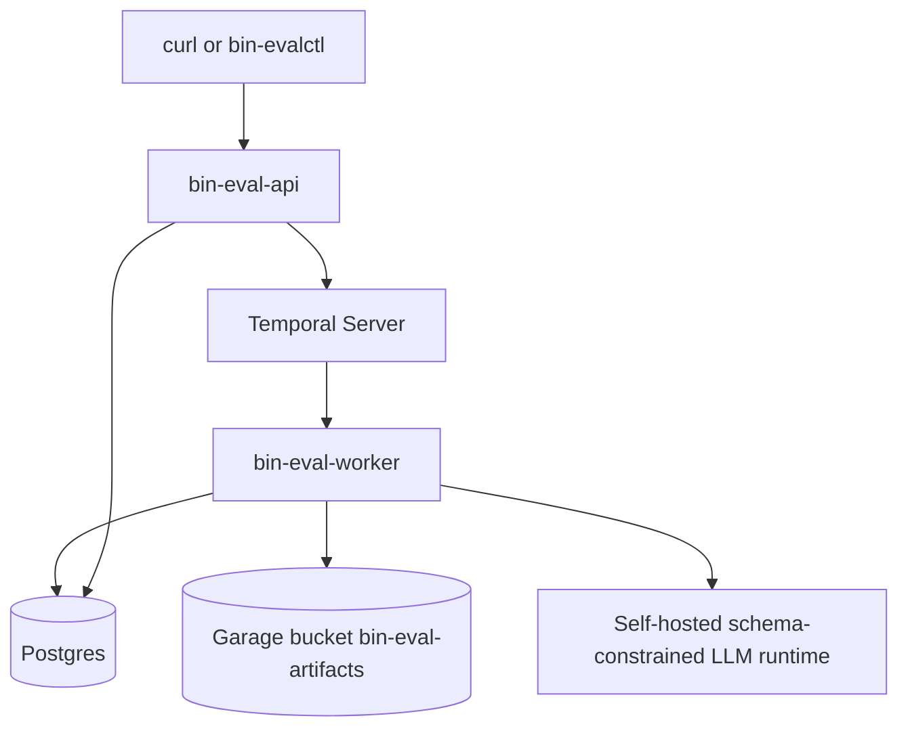

# bin-eval Binary Checklist Evaluation MVP Implementation Plan

## 1. Title and metadata

- Project name: bin-eval
- Version: 1.0.0
- Owners: Kirill, product and engineering
- Date: 2026-07-07
- Document ID: PLAN-BIN-EVAL-001
- Summary: This plan defines the implementation path for bin-eval, a self-hosted Go service that evaluates model answers through generated binary yes/no questions. The MVP has one checklist creation path, one answer evaluation path, one LLM client boundary, one Temporal workflow per product action, one Postgres schema, one Garage artifact layout, and one deterministic Go scoring formula. The LLM generates candidate questions, assigns weights from 0 to 4, and judges answers with yes/no verdicts plus evidence. Weight 0 marks a generated question as excluded from the active checklist; active questions have weight 1 to 4. The judge never receives weights and never emits scalar scores.

## 2. Design consensus and trade-offs

- Topic: Project naming
  - Verdict: DECISION
  - Rationale: All binaries, packages, commands, and docs use bin-eval naming. The repository path remains `/home/kirill/p/self-imp-bin-eval`, and the Go module path is grounded in the current Git remote, `github.com/kirilligum/self-imp-bin-eval`.
- Topic: Judge emits scalar quality scores
  - Verdict: AGAINST
  - Rationale: The judge returns only one `yes` or `no` verdict per active question with brief evidence. Go owns `satisfied_points`, `total_possible_points`, `checklist_pass_rate`, and `failed_question_ids`, which keeps scoring deterministic and reproducible from persisted rows.
- Topic: Weight range
  - Verdict: DECISION
  - Rationale: The MVP uses LLM-assigned integer weights from 0 to 4. Weight 0 excludes a candidate question from the active checklist, allowing weight assignment to remove duplicate, redundant, too broad, or not useful questions without adding a separate deduplication or rewrite step.
- Topic: Duplicate handling during weight assignment
  - Verdict: DECISION
  - Rationale: The weight assignment prompt can use weight 0 for redundant candidate questions, but it must still return exactly one weight object per generated question ID. Duplicate weight rows, missing weights, and unknown question IDs are invalid semantic output.
- Topic: Question ID ownership
  - Verdict: DECISION
  - Rationale: Go assigns persistent IDs `q1..qN` in candidate array order. IDs are not renumbered after weight 0 exclusions, preserving auditability between candidate questions, assigned weights, Garage artifacts, and persisted structured state.
- Topic: Split context fields
  - Verdict: AGAINST
  - Rationale: The API accepts one canonical `context` field for all evaluator-side input available before seeing the answer. Splitting into system instruction, rubric, source documents, or product requirements would multiply schemas and prompt paths without MVP value.
- Topic: Dimensions, category scores, and reason codes
  - Verdict: AGAINST
  - Rationale: These are out of MVP scope. The score is one weighted pass rate over active binary questions. Per-question evidence provides diagnostic detail without adding additional scoring axes.
- Topic: Question deduplication or rewrite step
  - Verdict: AGAINST
  - Rationale: The MVP keeps one direct LLM sequence: question generation, weight assignment, binary judging. Weight 0 is the single exclusion mechanism; no separate question merge, rewrite, or cleanup activity is added.
- Topic: Prompt optimization loops
  - Verdict: AGAINST
  - Rationale: bin-eval is a reusable evaluation service MVP, not a prompt self-improvement product. Model behavior quality is measured through model conformance and golden-answer evals.
- Topic: Fallback providers, plain-text parsers, and schema repair prompts
  - Verdict: AGAINST
  - Rationale: The LLM boundary assumes schema-constrained JSON from one configured self-hosted runtime. Invalid JSON, schema violations, and semantic violations fail fast. Infrastructure failures use bounded retries only.
- Topic: Garage and Postgres ownership
  - Verdict: DECISION
  - Rationale: Postgres owns canonical structured state. Garage owns raw task, context, model answer, prompt request, and prompt response artifacts. Postgres stores artifact keys where the API needs them; deterministic Garage key construction covers raw LLM payload lookup.
- Topic: Temporal side effects
  - Verdict: DECISION
  - Rationale: External side effects stay in Temporal activities. Pure validation, ID assignment, active-question filtering, and scoring stay in Go functions.
- Topic: Production dashboarding
  - Verdict: AGAINST
  - Rationale: Grafana, Loki, Tempo, Langfuse dashboards, and rich reporting are outside the MVP. The plan keeps structured logs and smoke output as the operational baseline.

## 3. PRD / stakeholder and system needs

- Problem: LLM answer evaluation through scalar judge scores is opaque, hard to debug, and difficult to reproduce. bin-eval decomposes evaluation into binary, task-specific questions and aggregates independent yes/no verdicts through deterministic Go scoring.
- Users: Internal engineers who evaluate model answers for a fixed task and context, reuse a checklist across multiple answers, and inspect question-level failures.
- Value: Reusable answer-independent checklists, explicit removal of weak or duplicate questions through weight 0, per-question evidence, deterministic weighted scoring, immutable persisted records, and raw-payload auditability.
- Business goals: Ship the smallest clean self-hosted implementation of binary checklist evaluation using Go, Temporal, Postgres, Garage, and one schema-constrained LLM boundary.
- Success metrics: All REQ acceptance criteria pass, all TEST definitions pass, EVAL-001 through EVAL-004 meet thresholds, and the smoke path creates a checklist, evaluates an answer, and returns a succeeded weighted pass rate.
- Scope: `POST /checklists`, `GET /checklists/{id}`, `POST /evaluations`, `GET /evaluations/{id}`, question generation, Go ID assignment, weight assignment with 0 to 4 weights, active-question filtering, binary judging, Go scoring, Temporal workflows, Postgres persistence, Garage artifacts, model conformance CLI, and a curl-based smoke script.
- Non-goals: Dimensions, category-level scores, materialized weighted questions, reason-code enums, separate question deduplication, question rewrite steps, multi-judge scoring, learned weight calibration, manual review workflow, prompt optimization loops, legacy migration paths, fallback model providers, storage adapters for unused backends, dashboarding, and reporting UI.
- Dependencies: Go toolchain, Docker Engine with Compose v2, Postgres, Temporal, Garage, and a configured self-hosted LLM runtime reachable at `BIN_EVAL_LLM_BASE_URL` that supports schema-constrained JSON.
- Risks: The configured LLM may produce structurally valid but low-quality candidate questions, overuse weight 0, underuse weight 0 for duplicates, or fail to separate good and bad answers. Garage and Temporal local integration may be environment-sensitive. Docker image tags may need replacement through ADR if unavailable.
- Assumptions: The repo currently has no Go module, Makefile, source tree, or CI config. The file `AGENTS.md` documents a minimal workspace. The artifact `2606.27226` is research context only and is not executable source. The current Git remote is `https://github.com/kirilligum/self-imp-bin-eval.git`.

## 4. SRS / canonical requirements

### Functional requirements

- REQ-001 (func): `POST /checklists` accepts `{task, context}`, starts `CreateChecklistWorkflow`, and returns `{checklist_id, status: "running"}`. Acceptance: a ULID-based checklist ID is returned, a running checklist row exists, and a Temporal workflow execution is started for that ID.
- REQ-002 (func): `question_generation` returns schema-valid JSON containing at least one candidate question with non-empty `rationale` and `question`. Acceptance: empty question lists, blank rationales, and blank question text fail validation.
- REQ-003 (func): Go assigns persistent candidate question IDs `q1..qN` in array order after parsing. Acceptance: IDs are dense, stable, deterministic, and never supplied by the LLM.
- REQ-004 (func): `weight_assignment` returns exactly one weight object for every candidate question ID, with integer weight from 0 to 4. Acceptance: weight 0 marks exclusion from the active checklist; weights 1 to 4 mark active importance; missing, duplicate, out-of-range, or unknown-ID weights fail validation.
- REQ-005 (func): Checklist creation persists candidate questions, question rationales, weights, weight rationales, and artifact keys. Acceptance: successful checklists are immutable; semantic content is not edited after success.
- REQ-006 (func): `POST /evaluations` accepts `{checklist_id, model_answer}`, starts `EvaluateAnswerWorkflow` for an existing succeeded checklist, and returns `{evaluation_id, status: "running"}`. Acceptance: unknown or non-succeeded checklists do not start a running evaluation.
- REQ-007 (func): `binary_judging` receives task, context, model answer, and active questions only, with no weights and no rationales. Acceptance: the judging request payload contains question ID and question text only for weight 1 to 4 questions.
- REQ-008 (func): `binary_judging` returns exactly one judgment per active question with `question_id`, `evidence`, and `answer` in `{"yes","no"}`. Acceptance: missing, duplicate, inactive, unknown, or non-enum judgments fail validation.
- REQ-009 (func): `ScoreChecklist` computes `satisfied_points`, `total_possible_points`, `checklist_pass_rate`, and `failed_question_ids` over active questions only. Acceptance: weight 0 questions require no judgment, never contribute to totals, and never appear in failed question IDs; all-zero checklists fail creation.
- REQ-010 (func): `GET /checklists/{id}` and `GET /evaluations/{id}` return documented running, succeeded, and failed response shapes. Acceptance: checklist success returns candidate questions and all weights including zero; evaluation success returns weighted score, failed active question IDs, and judgments.
- REQ-011 (func): Raw text artifacts are stored in Garage for task, context, model answer, question generation requests/responses, weight assignment requests/responses, and binary judging requests/responses. Acceptance: deterministic key construction locates each raw payload by checklist or evaluation ID.
- REQ-012 (func): Temporal runs one workflow per product action: `CreateChecklistWorkflow` and `EvaluateAnswerWorkflow`. Acceptance: external side effects execute only in activities; pure validation and scoring execute in Go functions.
- REQ-013 (func): `bin-evalctl model-test checklist-evaluator` validates schema conformance and semantic behavior for question generation, weight assignment, and binary judging. Acceptance: command exits non-zero when any conformance threshold fails.
- REQ-014 (func): `scripts/smoke_curl.sh` drives create checklist, poll checklist, create evaluation, poll evaluation, and print final score. Acceptance: script exits zero only on succeeded checklist and evaluation with parseable score output.

### Interface/API requirements

- REQ-020 (int): The only LLM interface is `LLMClient.GenerateJSON(ctx, req, out)`. Acceptance: Go code targets one configured schema-constrained HTTP JSON endpoint under `BIN_EVAL_LLM_BASE_URL`; no provider SDK, fallback provider, plain-text parser, or repair prompt exists.
- REQ-021 (int): The async HTTP API exposes exactly four MVP routes: `POST /checklists`, `GET /checklists/{checklist_id}`, `POST /evaluations`, and `GET /evaluations/{evaluation_id}`. Acceptance: request and response payloads match the API contract field-for-field.

### Data requirements

- REQ-030 (data): Postgres implements tables `checklists`, `questions`, `weights`, `evaluations`, and `judgments`. Acceptance: migrations produce the specified columns, primary keys, foreign keys, status constraints, and unique coverage constraints.
- REQ-031 (data): Garage implements one bucket named `bin-eval-artifacts` with deterministic key layout for raw text and raw LLM payloads. Acceptance: key builder emits exactly the documented paths and byte-identical reads match writes.
- REQ-032 (data): Checklists and evaluations are immutable after success. Acceptance: allowed lifecycle transitions are `running -> succeeded` and `running -> failed`; no update endpoints exist.

### Non-functional requirements

- REQ-040 (reliability): Bounded retries apply only to infrastructure errors: network timeout, temporary LLM endpoint failure, temporary Garage failure, and temporary Postgres or Temporal connectivity failure. Acceptance: invalid JSON, schema violation, missing weight, invalid weight, missing judgment, invalid answer, and unknown question ID are non-retryable.
- REQ-041 (security): Secrets load only from environment variables and are not written to logs, Garage, Postgres text fields, or smoke output. Acceptance: config validation fails fast on missing required variables and tests assert secret redaction for logging and artifacts.
- REQ-042 (nfr): bin-eval logs JSON to stdout with request ID, workflow ID, entity IDs, activity type, prompt name, model profile, status, error class, duration, and git SHA when available. Acceptance: unit tests assert log field presence and low-cardinality labels.
- REQ-043 (perf): `ScoreChecklist` scores a 10,000 active-question checklist in under 100 ms on reference hardware. Acceptance: benchmark output is below threshold.
- REQ-044 (nfr): The repo provides reproducible top-level commands `make lint`, `make build`, `make test`, `make test-integration`, and `make test-e2e`. Acceptance: commands exist after P00 and exit zero at relevant phase boundaries.

### Error handling and telemetry expectations

- Invalid model output uses a typed semantic or schema error and fails the current workflow without a repair prompt.
- Infrastructure errors use bounded Temporal retries with capped attempts and backoff.
- Workflow failure persists `error_message` and terminal `failed` status.
- Activity logs include `error_class` values from: `invalid_json`, `schema_violation`, `semantic_failure`, and `infra_retry`.
- Smoke output includes entity IDs, final status, score fields, and failed active question IDs.

### Architecture diagram



C4-style ASCII representation:

```text
[Person: Engineer]
  -> [bin-eval HTTP API: Go]
  -> [Temporal Server]
  -> [bin-eval Worker: Go workflows and activities]

[bin-eval Worker]
  -> [Postgres: checklists, questions, weights, evaluations, judgments]
  -> [Garage: raw task/context/answer and raw LLM payload artifacts]
  -> [Self-hosted LLM runtime: schema-constrained JSON]

[bin-evalctl]
  -> [Self-hosted LLM runtime] for model-test
  -> [bin-eval HTTP API] for smoke and operator workflows
```

## 5. Iterative implementation and test plan

### Phase strategy

- Build order: toolchain and commands, pure domain logic, LLM boundary and model-test CLI, persistence, Temporal workflows, HTTP API, local Compose stack, e2e smoke and docs.
- Verification-first: every behavior-changing implementation subtask follows failing coverage for the same REQ and TEST command.
- Quality-first gate: live model conformance evals run after the LLM CLI exists and before persistence/workflow implementation absorbs more complexity.
- Compute controls: `branch_limits = 2`, `reflection_passes = 1`, `early_stop% = 30`.
- Standards tailoring note: This plan is standards-informed and does not claim ISO/IEEE/FAA compliance. For safety-critical use, add development assurance level assumptions, independence expectations, review and analysis evidence, structural coverage expectations, tool qualification assumptions, and certification data outputs.
- Git tags such as `phase-p00-complete` are phase-boundary checkpoints only.

### Risk register

- Risk: Model creates duplicate or low-value questions. Trigger: EVAL-001 duplicate rate exceeds threshold. Mitigation: revise question prompt through ADR; retain weight 0 as exclusion mechanism.
- Risk: Model overuses weight 0 and removes useful questions. Trigger: EVAL-002 active coverage falls below threshold. Mitigation: revise weight prompt through ADR; no separate dedup step.
- Risk: Model underuses weight 0 on intentionally redundant fixtures. Trigger: EVAL-002 duplicate-removal rate below threshold. Mitigation: revise weight prompt through ADR.
- Risk: Schema-constrained JSON is unsupported by the configured runtime. Trigger: TEST-007 or EVAL-001 fails at the protocol layer. Mitigation: mark runtime unsupported and suspend until a compatible self-hosted endpoint is configured.
- Risk: Temporal or Garage local integration is unstable. Trigger: integration test flakiness above one failure per ten repeats. Mitigation: pin image tags and add readiness polling; replacing a test double requires ADR.
- Risk: Secrets leak to logs or artifacts. Trigger: TEST-009 or TEST-011 detects a secret value. Mitigation: central redaction helper and denylist of secret environment variable names.

### Suspension/resumption criteria

- Suspend when model conformance thresholds fail, an external image or runtime contract is unavailable, or a requirement ambiguity blocks reliable implementation.
- Resume after an ADR records the decision and the phase's full TEST and EVAL set passes from the last green phase checkpoint.

### Phase P00: Reproducible Go workspace and runtime foundations exist

Phase goal: The repo has a Go module, canonical Makefile commands, binary stubs, config loading, and structured logging foundations.

Scope and objectives: REQ-041, REQ-042, REQ-044.

Impacted surfaces: `go.mod`, `Makefile`, `.gitignore`, `cmd/bin-eval-api/main.go`, `cmd/bin-eval-worker/main.go`, `cmd/bin-evalctl/main.go`, `internal/config/config.go`, `internal/config/config_test.go`, `internal/observability/log.go`, `internal/observability/log_test.go`, `AGENTS.md`.

Lifecycle evidence:
- Requirements evidence: REQ-041, REQ-042, REQ-044.
- Design/code surface evidence: Go module path, Makefile targets, config package, observability package.
- Verification method: TEST-009 and TEST-017.
- Validation purpose: every later phase relies on consistent commands, secret-safe config, and JSON logs.
- Configuration checkpoint: `phase-p00-complete`.
- Risks and assumptions: Go 1.23.x or newer is installed; no existing source tree is present.

Plan-and-Solve subtasks:

- `P00.S01 Add failing coverage for top-level command contract`
  - Action: Record the missing Makefile baseline for the top-level command contract.
  - Why now: Command creation must be validated before later phases reference Makefile targets.
  - Files/surfaces: `Makefile`.
  - Requirement link: REQ-044.
  - Verification link: TEST-017.
  - Verification mode: RED.
  - Command/procedure: `make lint build test`
  - Expected result: Non-zero exit because `Makefile` does not exist.
  - Evidence produced: Terminal output in execution log.
  - Stop/escalate condition: None.
  - Unlocks: P00.S02
- `P00.S02 Create Go module, binary stubs, and Makefile targets`
  - Action: Add `go.mod` with module `github.com/kirilligum/self-imp-bin-eval`, create three binary stubs, create `Makefile` targets `lint`, `build`, `test`, `test-integration`, and `test-e2e`, and extend `.gitignore` for generated debug artifacts.
  - Why now: Later tests and phases need stable commands before use.
  - Files/surfaces: `go.mod`, `Makefile`, `.gitignore`, `cmd/bin-eval-api/main.go`, `cmd/bin-eval-worker/main.go`, `cmd/bin-evalctl/main.go`.
  - Requirement link: REQ-044.
  - Verification link: TEST-017.
  - Verification mode: GREEN.
  - Command/procedure: `make lint build test`
  - Expected result: Exit 0.
  - Evidence produced: Code diff and passing command output.
  - Stop/escalate condition: Escalate if local Go toolchain cannot compile an empty module.
  - Unlocks: P00.S03
- `P00.S03 Add failing coverage for config and structured logging`
  - Action: Add tests for required environment variables, secret redaction, and required JSON log fields.
  - Why now: Config and log behavior must be specified before implementation.
  - Files/surfaces: `internal/config/config_test.go`, `internal/observability/log_test.go`.
  - Requirement link: REQ-041, REQ-042.
  - Verification link: TEST-009.
  - Verification mode: RED.
  - Command/procedure: `go test ./internal/config ./internal/observability -run 'TestConfigValidation|TestStructuredLogFields' -count=1`
  - Expected result: Compile failure because packages are absent.
  - Evidence produced: Test files with `// TEST-009` tags and failing output.
  - Stop/escalate condition: None.
  - Unlocks: P00.S04
- `P00.S04 Implement config loading and JSON log setup`
  - Action: Implement `internal/config` env loading and `internal/observability` JSON log setup with redaction of configured secret values.
  - Why now: Binaries, activities, and CLI commands share these foundations.
  - Files/surfaces: `internal/config/config.go`, `internal/observability/log.go`.
  - Requirement link: REQ-041, REQ-042.
  - Verification link: TEST-009.
  - Verification mode: GREEN.
  - Command/procedure: `go test ./internal/config ./internal/observability -run 'TestConfigValidation|TestStructuredLogFields' -count=1`
  - Expected result: Exit 0.
  - Evidence produced: Code diff and passing output.
  - Stop/escalate condition: Escalate if required env names conflict with later deployment configuration.
  - Unlocks: P00.S05
- `P00.S05 Update repository guidance for the selected Go layout`
  - Action: Update `AGENTS.md` to list Go commands, `cmd/`, `internal/`, `migrations/`, `deploy/compose/`, `scripts/`, `fixtures/`, and `plans/`.
  - Why now: The repository guide currently describes a minimal workspace and must match the selected implementation layout.
  - Files/surfaces: `AGENTS.md`.
  - Requirement link: REQ-044.
  - Verification link: TEST-017.
  - Verification mode: VERIFY.
  - Command/procedure: `make lint build test`
  - Expected result: Exit 0. No refactor needed because the phase creates only small foundation packages and binary stubs.
  - Evidence produced: Documentation diff and passing output.
  - Stop/escalate condition: Escalate if repository guidance conflicts with user-owned edits.
  - Unlocks: Phase exit

Exit gates:
- Proceed: TEST-009 and TEST-017 pass.
- Escalate: missing Go toolchain, env naming ambiguity, or repository guidance conflict.
- Stop: top-level commands cannot be made reproducible in this repo.

Phase metrics:
- Confidence %: 95 - Standard Go scaffolding in a sparse repo.
- Long-term robustness %: 90 - Stable command and config foundations.
- Internal interactions: 2 - Config and observability are shared by all binaries.
- External interactions: 0 - No runtime services in this phase.
- Complexity %: 15 - Mostly scaffolding.
- Feature creep %: 0 - Only foundations required by later phases.
- Technical debt %: 5 - Binary stubs carry no product behavior.
- YAGNI score: 9 - Commands and packages are directly consumed later.
- MoSCoW: Must.
- Local/non-local scope: Local.
- Architectural changes count: 1.

### Phase P01: Pure evalcore domain logic handles candidate, active, and excluded questions

Phase goal: Go domain functions assign IDs, validate candidate outputs, validate weights with 0 exclusions, validate judgments, filter active questions, and score only active questions.

Scope and objectives: REQ-002, REQ-003, REQ-004, REQ-007, REQ-008, REQ-009, REQ-043.

Impacted surfaces: `internal/evalcore/types.go`, `internal/evalcore/ids.go`, `internal/evalcore/validate.go`, `internal/evalcore/score.go`, `internal/evalcore/*_test.go`.

Lifecycle evidence:
- Requirements evidence: REQ-002, REQ-003, REQ-004, REQ-007, REQ-008, REQ-009, REQ-043.
- Design/code surface evidence: Domain types, active-question filtering, validation helpers, scoring function.
- Verification method: TEST-001, TEST-002, TEST-003, TEST-004, TEST-005, TEST-016.
- Validation purpose: Scoring and validation are the product trust boundary.
- Configuration checkpoint: `phase-p01-complete`.
- Risks and assumptions: Pure Go logic has no external dependencies.

Plan-and-Solve subtasks:

- `P01.S01 Add failing coverage for Go question ID assignment and active filtering`
  - Action: Add tests for `AssignQuestionIDs` and `ActiveQuestions`, including stable IDs after weight 0 exclusion.
  - Why now: ID stability and active filtering define how weight 0 works across the system.
  - Files/surfaces: `internal/evalcore/ids_test.go`.
  - Requirement link: REQ-003, REQ-004, REQ-009.
  - Verification link: TEST-002.
  - Verification mode: RED.
  - Command/procedure: `go test ./internal/evalcore -run 'TestAssignQuestionIDs|TestActiveQuestions' -count=1`
  - Expected result: Compile failure because package and functions are absent.
  - Evidence produced: Test file with `// TEST-002` tag and failing output.
  - Stop/escalate condition: None.
  - Unlocks: P01.S02
- `P01.S02 Implement question ID assignment and active filtering`
  - Action: Implement domain types, `AssignQuestionIDs`, and `ActiveQuestions` that returns only questions with weight 1 to 4 while preserving original IDs.
  - Why now: Validators and scoring depend on these types and helpers.
  - Files/surfaces: `internal/evalcore/types.go`, `internal/evalcore/ids.go`.
  - Requirement link: REQ-003, REQ-004, REQ-009.
  - Verification link: TEST-002.
  - Verification mode: GREEN.
  - Command/procedure: `go test ./internal/evalcore -run 'TestAssignQuestionIDs|TestActiveQuestions' -count=1`
  - Expected result: Exit 0.
  - Evidence produced: Code diff and passing output.
  - Stop/escalate condition: Escalate if active filtering semantics conflict with API response shape.
  - Unlocks: P01.S03
- `P01.S03 Add failing coverage for structural validators`
  - Action: Add validator tests for question generation, weights 0 to 4, exact weight coverage, duplicate weight rows, unknown weight IDs, active coverage, judgment coverage over active questions, inactive judgment rejection, and answer enum values.
  - Why now: Invalid model output must fail before implementation.
  - Files/surfaces: `internal/evalcore/validate_test.go`.
  - Requirement link: REQ-002, REQ-004, REQ-007, REQ-008.
  - Verification link: TEST-003, TEST-004, TEST-005.
  - Verification mode: RED.
  - Command/procedure: `go test ./internal/evalcore -run 'TestValidateQuestionGeneration|TestValidateWeights|TestValidateJudgments' -count=1`
  - Expected result: Compile failure because validators are absent.
  - Evidence produced: Test file with `// TEST-003`, `// TEST-004`, and `// TEST-005` tags plus failing output.
  - Stop/escalate condition: None.
  - Unlocks: P01.S04
- `P01.S04 Implement centralized structural validators`
  - Action: Implement `ValidateQuestionGeneration`, `ValidateWeights`, and `ValidateJudgments` with typed semantic errors.
  - Why now: LLM activities and workflows use these validators before persistence and scoring.
  - Files/surfaces: `internal/evalcore/validate.go`.
  - Requirement link: REQ-002, REQ-004, REQ-007, REQ-008.
  - Verification link: TEST-003, TEST-004, TEST-005.
  - Verification mode: GREEN.
  - Command/procedure: `go test ./internal/evalcore -run 'TestValidateQuestionGeneration|TestValidateWeights|TestValidateJudgments' -count=1`
  - Expected result: Exit 0.
  - Evidence produced: Code diff and passing output.
  - Stop/escalate condition: Escalate if semantic error taxonomy needs more categories than the retry policy recognizes.
  - Unlocks: P01.S05
- `P01.S05 Add failing coverage for deterministic weighted scoring`
  - Action: Add table-driven scoring tests for happy paths, weight 0 exclusions, all-zero failure, missing active judgment, inactive judgment rejection, duplicate rows, invalid weights, invalid answers, and failed active question ID ordering.
  - Why now: Scoring must be specified before implementation.
  - Files/surfaces: `internal/evalcore/score_test.go`.
  - Requirement link: REQ-009.
  - Verification link: TEST-001.
  - Verification mode: RED.
  - Command/procedure: `go test ./internal/evalcore -run TestScoreChecklist -count=1`
  - Expected result: Compile failure because `ScoreChecklist` is absent.
  - Evidence produced: Test file with `// TEST-001` tag and failing output.
  - Stop/escalate condition: None.
  - Unlocks: P01.S06
- `P01.S06 Implement ScoreChecklist over active questions only`
  - Action: Implement `ScoreChecklist` so weight 0 questions contribute no points, require no judgment, and cannot appear in `failed_question_ids`.
  - Why now: Evaluation workflow depends on deterministic scoring.
  - Files/surfaces: `internal/evalcore/score.go`.
  - Requirement link: REQ-009.
  - Verification link: TEST-001.
  - Verification mode: GREEN.
  - Command/procedure: `go test ./internal/evalcore -run TestScoreChecklist -count=1`
  - Expected result: Exit 0.
  - Evidence produced: Code diff and passing output.
  - Stop/escalate condition: Escalate if API consumers need excluded-question diagnostics beyond persisted weights.
  - Unlocks: P01.S07
- `P01.S07 Measure 10,000-question scoring throughput`
  - Action: Add and execute a benchmark with 10,000 active questions and a mixed yes/no judgment set.
  - Why now: This phase owns scoring performance.
  - Files/surfaces: `internal/evalcore/score_bench_test.go`.
  - Requirement link: REQ-043.
  - Verification link: TEST-016.
  - Verification mode: MEASURE.
  - Command/procedure: `go test ./internal/evalcore -run '^$' -bench BenchmarkScoreChecklist10k -benchtime=1x -count=1`
  - Expected result: `ns/op` is less than `100000000`.
  - Evidence produced: Benchmark file with `// TEST-016` tag and metric output.
  - Stop/escalate condition: Escalate if the threshold is missed; threshold changes require ADR.
  - Unlocks: P01.S08
- `P01.S08 Refactor shared validation helpers`
  - Action: Extract private helpers for ID set construction, duplicate detection, and active-question coverage.
  - Why now: Validator and scoring implementation will otherwise duplicate coverage logic.
  - Files/surfaces: `internal/evalcore/validate.go`, `internal/evalcore/score.go`.
  - Requirement link: REQ-002, REQ-004, REQ-007, REQ-008, REQ-009.
  - Verification link: TEST-001, TEST-002, TEST-003, TEST-004, TEST-005.
  - Verification mode: REFACTOR.
  - Command/procedure: `go test ./internal/evalcore -count=1`
  - Expected result: Exit 0 with unchanged behavior.
  - Evidence produced: Refactor diff and passing output.
  - Stop/escalate condition: Revert refactor if any evalcore behavior regresses.
  - Unlocks: Phase exit

Exit gates:
- Proceed: TEST-001 through TEST-005 pass and TEST-016 meets threshold.
- Escalate: weight 0 semantics, active filtering, or all-zero checklist behavior becomes ambiguous.
- Stop: deterministic scoring cannot satisfy the PRD formula with exclusions.

Phase metrics:
- Confidence %: 95 - Pure functions with table-driven tests.
- Long-term robustness %: 95 - Stable scoring semantics and narrow surface.
- Internal interactions: 3 - Used by LLM validation, workflows, and API DTOs.
- External interactions: 0 - No I/O.
- Complexity %: 30 - Weight 0 active filtering adds edge cases.
- Feature creep %: 0 - No dimensions or rewrite step.
- Technical debt %: 5 - Shared helpers remove duplication.
- YAGNI score: 10 - Every function is consumed by later phases.
- MoSCoW: Must.
- Local/non-local scope: Local.
- Architectural changes count: 0.

### Phase P02: One schema-constrained LLM boundary and model-test CLI exist

Phase goal: The LLM client, prompt schemas, fakes, and `bin-evalctl model-test` can validate configured model behavior before persistence and workflows are built.

Scope and objectives: REQ-002, REQ-004, REQ-007, REQ-008, REQ-013, REQ-020, REQ-040.

Impacted surfaces: `internal/llm/client.go`, `internal/llm/errors.go`, `internal/llm/prompts.go`, `internal/llm/schemas.go`, `internal/llm/fake.go`, `internal/llm/testdata/`, `cmd/bin-evalctl/main.go`, `cmd/bin-evalctl/modeltest.go`, `cmd/bin-evalctl/modeltest_test.go`.

Lifecycle evidence:
- Requirements evidence: REQ-002, REQ-004, REQ-007, REQ-008, REQ-013, REQ-020, REQ-040.
- Design/code surface evidence: One LLM interface, schema definitions, prompt builders, fake client, model-test command.
- Verification method: TEST-006, TEST-007, TEST-008, EVAL-001, EVAL-002, EVAL-003.
- Validation purpose: Model conformance and weight 0 behavior are proven before stateful services are added.
- Configuration checkpoint: `phase-p02-complete`.
- Risks and assumptions: `BIN_EVAL_LLM_BASE_URL` points to a self-hosted runtime supporting schema-constrained JSON.

Plan-and-Solve subtasks:

- `P02.S01 Add failing coverage for LLM output schemas and prompts`
  - Action: Add tests for question generation, weight assignment, and binary judging schemas; assert weight schema allows 0 to 4 and judging schema excludes weights and rationales.
  - Why now: Schema and prompt contracts must exist before an HTTP client sends requests.
  - Files/surfaces: `internal/llm/schema_test.go`, `internal/llm/testdata/*.json`.
  - Requirement link: REQ-002, REQ-004, REQ-007, REQ-008, REQ-020.
  - Verification link: TEST-006.
  - Verification mode: RED.
  - Command/procedure: `go test ./internal/llm -run TestOutputSchemasAndPrompts -count=1`
  - Expected result: Compile failure because LLM package is absent.
  - Evidence produced: Test file with `// TEST-006` tag and fixtures.
  - Stop/escalate condition: None.
  - Unlocks: P02.S02
- `P02.S02 Implement LLM schemas and prompt builders`
  - Action: Implement schema definitions and prompt builders for `question_generation`, `weight_assignment`, and `binary_judging`, including weight 0 exclusion instructions.
  - Why now: Client and model-test command depend on stable request construction.
  - Files/surfaces: `internal/llm/schemas.go`, `internal/llm/prompts.go`.
  - Requirement link: REQ-002, REQ-004, REQ-007, REQ-008, REQ-020.
  - Verification link: TEST-006.
  - Verification mode: GREEN.
  - Command/procedure: `go test ./internal/llm -run TestOutputSchemasAndPrompts -count=1`
  - Expected result: Exit 0.
  - Evidence produced: Code diff and passing output.
  - Stop/escalate condition: Escalate if schema-constrained output cannot represent evidence-before-answer ordering.
  - Unlocks: P02.S03
- `P02.S03 Add failing coverage for LLM client error behavior`
  - Action: Add HTTP stub tests asserting schema request payload, bearer token use, valid decode, invalid JSON non-retryable behavior, schema violation non-retryable behavior, and no fallback endpoint call.
  - Why now: The one LLM boundary must be specified before implementation.
  - Files/surfaces: `internal/llm/client_test.go`.
  - Requirement link: REQ-020, REQ-040.
  - Verification link: TEST-007.
  - Verification mode: RED.
  - Command/procedure: `go test ./internal/llm -run TestGenerateJSONClient -count=1`
  - Expected result: Compile failure because client is absent.
  - Evidence produced: Test file with `// TEST-007` tag and failing output.
  - Stop/escalate condition: None.
  - Unlocks: P02.S04
- `P02.S04 Implement one LLM client and scripted fake client`
  - Action: Implement `LLMClient.GenerateJSON`, typed errors, configured base URL, API key handling, schema-constrained request body, and fake scripted responses.
  - Why now: CLI, activities, and workflow tests need one shared boundary.
  - Files/surfaces: `internal/llm/client.go`, `internal/llm/errors.go`, `internal/llm/fake.go`.
  - Requirement link: REQ-020, REQ-040.
  - Verification link: TEST-007.
  - Verification mode: GREEN.
  - Command/procedure: `go test ./internal/llm -run TestGenerateJSONClient -count=1`
  - Expected result: Exit 0.
  - Evidence produced: Code diff and passing output.
  - Stop/escalate condition: Escalate if runtime API contract requires provider-specific SDK code.
  - Unlocks: P02.S05
- `P02.S05 Add failing coverage for model-test command behavior`
  - Action: Add command tests using fake LLM scripts for conformant outputs, duplicate candidate questions handled through weight 0, all-zero failure, invalid weight, missing weight, invalid judgment, inactive judgment, and malformed JSON.
  - Why now: Operator model gating must be specified before CLI implementation.
  - Files/surfaces: `cmd/bin-evalctl/modeltest_test.go`, `internal/llm/testdata/modeltest/`.
  - Requirement link: REQ-013.
  - Verification link: TEST-008.
  - Verification mode: RED.
  - Command/procedure: `go test ./cmd/bin-evalctl -run TestModelTestCommand -count=1`
  - Expected result: Compile failure because command is absent.
  - Evidence produced: Test file with `// TEST-008` tag and fixtures.
  - Stop/escalate condition: None.
  - Unlocks: P02.S06
- `P02.S06 Implement bin-evalctl model-test`
  - Action: Implement `bin-evalctl model-test checklist-evaluator` with `--step`, `--runs`, `--seed`, `--golden`, and `--out` flags, using the same LLM client and evalcore validators as the service.
  - Why now: Live model behavior must be measurable before persistence and workflows.
  - Files/surfaces: `cmd/bin-evalctl/main.go`, `cmd/bin-evalctl/modeltest.go`.
  - Requirement link: REQ-013.
  - Verification link: TEST-008.
  - Verification mode: GREEN.
  - Command/procedure: `go test ./cmd/bin-evalctl -run TestModelTestCommand -count=1`
  - Expected result: Exit 0.
  - Evidence produced: Code diff and passing output.
  - Stop/escalate condition: Escalate if CLI logic duplicates evalcore validation instead of calling shared functions.
  - Unlocks: P02.S07
- `P02.S07 Measure live model conformance for question generation, weighting, and judging`
  - Action: Execute model conformance evals against the configured self-hosted runtime.
  - Why now: This is the earliest point where the model can be judged without stateful service infrastructure.
  - Files/surfaces: `cmd/bin-evalctl`, `internal/llm/testdata/modeltest/`, `debug/modeltest/`.
  - Requirement link: REQ-013, REQ-020.
  - Verification link: EVAL-001, EVAL-002, EVAL-003.
  - Verification mode: MEASURE.
  - Command/procedure: `BIN_EVAL_LLM_BASE_URL="$BIN_EVAL_LLM_BASE_URL" BIN_EVAL_LLM_API_KEY="$BIN_EVAL_LLM_API_KEY" go run ./cmd/bin-evalctl model-test checklist-evaluator --runs 5 --out ./debug/modeltest`
  - Expected result: EVAL-001, EVAL-002, and EVAL-003 thresholds pass.
  - Evidence produced: JSON eval reports and raw model output samples under `debug/modeltest/`.
  - Stop/escalate condition: Suspend if any threshold fails; threshold changes require ADR.
  - Unlocks: P02.S08
- `P02.S08 Confirm no refactor needed for the LLM boundary`
  - Action: Inspect `internal/llm` and `cmd/bin-evalctl` for duplicate schema, validation, or prompt construction logic.
  - Why now: Model-test command implementation may tempt duplicate validator logic.
  - Files/surfaces: `internal/llm`, `cmd/bin-evalctl`.
  - Requirement link: REQ-013, REQ-020.
  - Verification link: TEST-006, TEST-007, TEST-008.
  - Verification mode: VERIFY.
  - Command/procedure: `go test ./internal/llm ./cmd/bin-evalctl -count=1`
  - Expected result: Exit 0. No refactor needed because prompt construction lives in `internal/llm` and semantic validation lives in `internal/evalcore`.
  - Evidence produced: Passing output and inspection note.
  - Stop/escalate condition: Convert to REFACTOR if validation is duplicated.
  - Unlocks: Phase exit

Exit gates:
- Proceed: TEST-006, TEST-007, TEST-008, EVAL-001, EVAL-002, and EVAL-003 pass.
- Escalate: schema-constrained runtime contract or model behavior fails thresholds.
- Stop: no configured self-hosted runtime can satisfy the MVP LLM contract.

Phase metrics:
- Confidence %: 80 - The client is small, but live model behavior is uncertain.
- Long-term robustness %: 85 - One boundary isolates runtime changes.
- Internal interactions: 3 - evalcore, config, observability.
- External interactions: 1 - Self-hosted LLM runtime.
- Complexity %: 40 - Schema outputs and CLI aggregation add edge cases.
- Feature creep %: 0 - No fallback path.
- Technical debt %: 5 - Fake client supports later tests.
- YAGNI score: 9 - All CLI flags support model gating or golden evals.
- MoSCoW: Must.
- Local/non-local scope: Local plus external runtime.
- Architectural changes count: 0.

### Phase P03: Postgres and Garage persistence match the MVP data contract

Phase goal: Postgres migrations and Garage artifact writer persist canonical structured state and raw payload artifacts with deterministic lookup.

Scope and objectives: REQ-005, REQ-011, REQ-030, REQ-031, REQ-032, REQ-041.

Impacted surfaces: `migrations/0001_init.sql`, `internal/db/queries.sql`, `internal/db/sqlc.yaml`, `internal/db/pool.go`, `internal/db/db_integration_test.go`, `internal/artifacts/keys.go`, `internal/artifacts/writer.go`, `internal/artifacts/artifacts_integration_test.go`, `internal/artifacts/testdata/garage.toml`.

Lifecycle evidence:
- Requirements evidence: REQ-005, REQ-011, REQ-030, REQ-031, REQ-032, REQ-041.
- Design/code surface evidence: Migration DDL, sqlc queries, Garage key builder, artifact writer.
- Verification method: TEST-010 and TEST-011.
- Validation purpose: Persistence must protect immutable structured state and raw-payload auditability.
- Configuration checkpoint: `phase-p03-complete`.
- Risks and assumptions: Docker is available for integration tests; Garage image `dxflrs/garage:v2.3.0` and Postgres image `postgres:16.4` are pullable.

Plan-and-Solve subtasks:

- `P03.S01 Add failing coverage for Postgres migrations and queries`
  - Action: Add an integration test using a disposable Postgres container to apply migrations, inspect schema, insert running and succeeded checklists, persist questions and weights including weight 0, create evaluations, persist judgments and score, and reject invalid lifecycle transitions.
  - Why now: Schema and immutability must be specified before migrations.
  - Files/surfaces: `internal/db/db_integration_test.go`.
  - Requirement link: REQ-005, REQ-030, REQ-032.
  - Verification link: TEST-010.
  - Verification mode: RED.
  - Command/procedure: `go test -tags integration ./internal/db -run TestMigrationsAndQueries -count=1 -timeout 10m`
  - Expected result: Failure because migrations and db package are absent.
  - Evidence produced: Test file with `// TEST-010` tag and failing output.
  - Stop/escalate condition: Escalate if Docker is unavailable.
  - Unlocks: P03.S02
- `P03.S02 Implement migrations and sqlc data access`
  - Action: Add DDL for `checklists`, `questions`, `weights`, `evaluations`, and `judgments`; add sqlc queries for lifecycle transitions and read models; generate pgx-based code.
  - Why now: Workflows and API reads depend on persisted state.
  - Files/surfaces: `migrations/0001_init.sql`, `internal/db/queries.sql`, `internal/db/sqlc.yaml`, `internal/db/pool.go`, generated sqlc files.
  - Requirement link: REQ-005, REQ-030, REQ-032.
  - Verification link: TEST-010.
  - Verification mode: GREEN.
  - Command/procedure: `go test -tags integration ./internal/db -run TestMigrationsAndQueries -count=1 -timeout 10m`
  - Expected result: Exit 0.
  - Evidence produced: Migration and generated code diff plus passing output.
  - Stop/escalate condition: Escalate if schema cannot express exact weight coverage and immutable lifecycle constraints.
  - Unlocks: P03.S03
- `P03.S03 Add failing coverage for Garage artifact layout`
  - Action: Add an integration test for deterministic keys, bucket writes, byte-identical reads, and secret-value redaction before artifact writes.
  - Why now: Raw artifact storage must be specified before writer implementation.
  - Files/surfaces: `internal/artifacts/artifacts_integration_test.go`, `internal/artifacts/testdata/garage.toml`.
  - Requirement link: REQ-011, REQ-031, REQ-041.
  - Verification link: TEST-011.
  - Verification mode: RED.
  - Command/procedure: `go test -tags integration ./internal/artifacts -run TestArtifactWriterAndKeys -count=1 -timeout 10m`
  - Expected result: Failure because artifact package is absent.
  - Evidence produced: Test file with `// TEST-011` tag, Garage config fixture, and failing output.
  - Stop/escalate condition: Escalate if Garage container cannot start after two attempts.
  - Unlocks: P03.S04
- `P03.S04 Implement Garage key builder and artifact writer`
  - Action: Implement deterministic key construction and S3-compatible Garage writes for checklist inputs, evaluation inputs, and all LLM request/response payloads.
  - Why now: Temporal activities write artifacts before and after LLM calls.
  - Files/surfaces: `internal/artifacts/keys.go`, `internal/artifacts/writer.go`.
  - Requirement link: REQ-011, REQ-031, REQ-041.
  - Verification link: TEST-011.
  - Verification mode: GREEN.
  - Command/procedure: `go test -tags integration ./internal/artifacts -run TestArtifactWriterAndKeys -count=1 -timeout 10m`
  - Expected result: Exit 0.
  - Evidence produced: Code diff and passing output.
  - Stop/escalate condition: Escalate if Garage S3 API behavior differs from the expected path-style contract.
  - Unlocks: P03.S05
- `P03.S05 Confirm no refactor needed for persistence`
  - Action: Inspect query and artifact packages for duplicate key construction, raw text duplication in Postgres, or unused storage abstractions.
  - Why now: This phase touches two storage systems and must keep ownership boundaries clear.
  - Files/surfaces: `internal/db`, `internal/artifacts`.
  - Requirement link: REQ-011, REQ-030, REQ-031.
  - Verification link: TEST-010, TEST-011.
  - Verification mode: VERIFY.
  - Command/procedure: `go test -tags integration ./internal/db ./internal/artifacts -count=1 -timeout 10m`
  - Expected result: Exit 0. No refactor needed because Postgres stores structured state and Garage stores raw payload bytes through one key builder.
  - Evidence produced: Passing integration output and inspection note.
  - Stop/escalate condition: Convert to REFACTOR if raw text is duplicated into Postgres.
  - Unlocks: Phase exit

Exit gates:
- Proceed: TEST-010 and TEST-011 pass.
- Escalate: container availability, schema ambiguity, or Garage key ambiguity.
- Stop: canonical structured state and raw artifact split cannot be implemented without new storage scope.

Phase metrics:
- Confidence %: 85 - Declarative schema and deterministic keys are testable.
- Long-term robustness %: 90 - Storage ownership is explicit.
- Internal interactions: 3 - db, artifacts, config.
- External interactions: 2 - Postgres and Garage.
- Complexity %: 35 - Integration tests and lifecycle constraints.
- Feature creep %: 0 - No alternate storage adapters.
- Technical debt %: 5 - sqlc limits hand-written data access.
- YAGNI score: 10 - Tables and keys map directly to PRD.
- MoSCoW: Must.
- Local/non-local scope: Non-local.
- Architectural changes count: 0.

### Phase P04: Temporal workflows execute checklist creation and answer evaluation

Phase goal: `CreateChecklistWorkflow` and `EvaluateAnswerWorkflow` orchestrate activities, apply retry policy, persist lifecycle status, and call pure evalcore functions.

Scope and objectives: REQ-001, REQ-002, REQ-003, REQ-004, REQ-006, REQ-007, REQ-008, REQ-009, REQ-012, REQ-040.

Impacted surfaces: `internal/workflows/create_checklist.go`, `internal/workflows/evaluate_answer.go`, `internal/workflows/*_test.go`, `internal/activities/llm.go`, `internal/activities/postgres.go`, `internal/activities/garage.go`, `internal/activities/errors.go`, `internal/activities/retry_test.go`, `cmd/bin-eval-worker/main.go`.

Lifecycle evidence:
- Requirements evidence: REQ-001 through REQ-009, REQ-012, REQ-040.
- Design/code surface evidence: Workflow definitions, activity interfaces, activity error mapping.
- Verification method: TEST-012 and TEST-018.
- Validation purpose: The product actions are durable and side effects are isolated in activities.
- Configuration checkpoint: `phase-p04-complete`.
- Risks and assumptions: Temporal Go SDK testsuite supports activity mocking required for order and payload assertions.

Plan-and-Solve subtasks:

- `P04.S01 Add failing coverage for checklist and evaluation workflows`
  - Action: Add Temporal testsuite coverage for happy paths, question exclusion through weight 0, all-zero checklist failure, judge payload excluding weights/rationales, missing weight failure, missing judgment failure, and non-succeeded checklist rejection.
  - Why now: Workflow behavior must be specified before orchestration code.
  - Files/surfaces: `internal/workflows/create_checklist_test.go`, `internal/workflows/evaluate_answer_test.go`, `internal/workflows/testdata/`.
  - Requirement link: REQ-001, REQ-002, REQ-003, REQ-004, REQ-006, REQ-007, REQ-008, REQ-009, REQ-012.
  - Verification link: TEST-012.
  - Verification mode: RED.
  - Command/procedure: `go test ./internal/workflows -run 'TestCreateChecklistWorkflow|TestEvaluateAnswerWorkflow' -count=1`
  - Expected result: Compile failure because workflows are absent.
  - Evidence produced: Test files with `// TEST-012` tags and fixtures.
  - Stop/escalate condition: None.
  - Unlocks: P04.S02
- `P04.S02 Implement workflows and activity interfaces`
  - Action: Implement both workflows, activity interfaces, worker registration, checklist lifecycle handling, evaluation lifecycle handling, artifact writes, LLM calls, validation, active filtering, scoring, and persistence.
  - Why now: This completes durable product behavior after pure logic and persistence exist.
  - Files/surfaces: `internal/workflows/create_checklist.go`, `internal/workflows/evaluate_answer.go`, `internal/activities/llm.go`, `internal/activities/postgres.go`, `internal/activities/garage.go`, `cmd/bin-eval-worker/main.go`.
  - Requirement link: REQ-001, REQ-002, REQ-003, REQ-004, REQ-006, REQ-007, REQ-008, REQ-009, REQ-012.
  - Verification link: TEST-012.
  - Verification mode: GREEN.
  - Command/procedure: `go test ./internal/workflows -run 'TestCreateChecklistWorkflow|TestEvaluateAnswerWorkflow' -count=1`
  - Expected result: Exit 0.
  - Evidence produced: Code diff and passing output.
  - Stop/escalate condition: Escalate if workflow determinism conflicts with direct helper calls.
  - Unlocks: P04.S03
- `P04.S03 Add failing coverage for retry classification`
  - Action: Add tests mapping infra errors to retryable Temporal application errors and invalid JSON, schema violations, and semantic failures to non-retryable errors.
  - Why now: Retry behavior must be specified before wiring activity options.
  - Files/surfaces: `internal/activities/retry_test.go`.
  - Requirement link: REQ-040.
  - Verification link: TEST-018.
  - Verification mode: RED.
  - Command/procedure: `go test ./internal/activities -run TestRetryClassification -count=1`
  - Expected result: Compile failure because classification code is absent.
  - Evidence produced: Test file with `// TEST-018` tag and failing output.
  - Stop/escalate condition: None.
  - Unlocks: P04.S04
- `P04.S04 Implement bounded retry policy and error mapping`
  - Action: Implement activity error mapping and workflow activity options with bounded attempts and backoff.
  - Why now: Workflows need correct failure semantics before API exposure.
  - Files/surfaces: `internal/activities/errors.go`, `internal/workflows/create_checklist.go`, `internal/workflows/evaluate_answer.go`.
  - Requirement link: REQ-040.
  - Verification link: TEST-018.
  - Verification mode: GREEN.
  - Command/procedure: `go test ./internal/activities -run TestRetryClassification -count=1`
  - Expected result: Exit 0.
  - Evidence produced: Code diff and passing output.
  - Stop/escalate condition: Escalate if an error class cannot be represented safely in Temporal retries.
  - Unlocks: P04.S05
- `P04.S05 Refactor shared activity plumbing`
  - Action: Extract shared LLM call artifact writing and prompt execution code used by the three LLM activities.
  - Why now: The green workflow implementation introduces repeated request/response artifact handling.
  - Files/surfaces: `internal/activities/llm.go`.
  - Requirement link: REQ-011, REQ-012, REQ-020.
  - Verification link: TEST-012, TEST-018.
  - Verification mode: REFACTOR.
  - Command/procedure: `go test ./internal/workflows ./internal/activities -count=1`
  - Expected result: Exit 0 with unchanged behavior.
  - Evidence produced: Refactor diff and passing output.
  - Stop/escalate condition: Revert refactor if workflow or retry tests regress.
  - Unlocks: Phase exit

Exit gates:
- Proceed: TEST-012 and TEST-018 pass.
- Escalate: Temporal testsuite limitation, retry ambiguity, or workflow determinism issue.
- Stop: product workflows cannot meet the single-path contract.

Phase metrics:
- Confidence %: 80 - Largest orchestration surface.
- Long-term robustness %: 85 - Activity boundaries isolate side effects.
- Internal interactions: 6 - evalcore, llm, db, artifacts, config, observability.
- External interactions: 3 - Temporal, Postgres, Garage.
- Complexity %: 55 - Durable orchestration and failure handling.
- Feature creep %: 0 - One workflow per product action.
- Technical debt %: 10 - Refactor handles repeated LLM activity plumbing.
- YAGNI score: 9 - Workflow structure maps directly to PRD.
- MoSCoW: Must.
- Local/non-local scope: Non-local.
- Architectural changes count: 1.

### Phase P05: Async HTTP API exposes checklist and evaluation contracts

Phase goal: The Go API exposes four async routes with exact request and response payloads backed by Temporal and Postgres reads.

Scope and objectives: REQ-001, REQ-006, REQ-010, REQ-021, REQ-032.

Impacted surfaces: `internal/api/router.go`, `internal/api/checklists.go`, `internal/api/evaluations.go`, `internal/api/api_test.go`, `cmd/bin-eval-api/main.go`.

Lifecycle evidence:
- Requirements evidence: REQ-001, REQ-006, REQ-010, REQ-021, REQ-032.
- Design/code surface evidence: HTTP handlers, DTOs, fake workflow starter, db read interfaces.
- Verification method: TEST-013.
- Validation purpose: API consumers rely on exact async contracts and immutable read shapes.
- Configuration checkpoint: `phase-p05-complete`.
- Risks and assumptions: Authentication is outside MVP; deployment access control is handled by environment and network boundary.

Plan-and-Solve subtasks:

- `P05.S01 Add failing coverage for API contracts`
  - Action: Add httptest coverage for the four routes, exact request validation, exact running/succeeded/failed response shapes, checklist success with weight 0 retained, evaluation success with active-only judgments, and unknown or non-succeeded checklist rejection.
  - Why now: API behavior must be specified before handler implementation.
  - Files/surfaces: `internal/api/api_test.go`.
  - Requirement link: REQ-001, REQ-006, REQ-010, REQ-021, REQ-032.
  - Verification link: TEST-013.
  - Verification mode: RED.
  - Command/procedure: `go test ./internal/api -run TestAPIContracts -count=1`
  - Expected result: Compile failure because API package is absent.
  - Evidence produced: Test file with `// TEST-013` tag and failing output.
  - Stop/escalate condition: None.
  - Unlocks: P05.S02
- `P05.S02 Implement HTTP router and handlers`
  - Action: Implement route registration, DTO validation, Temporal workflow starts, Postgres read adapters, and JSON error responses.
  - Why now: Workflows and persistence are available for API wiring.
  - Files/surfaces: `internal/api/router.go`, `internal/api/checklists.go`, `internal/api/evaluations.go`, `cmd/bin-eval-api/main.go`.
  - Requirement link: REQ-001, REQ-006, REQ-010, REQ-021, REQ-032.
  - Verification link: TEST-013.
  - Verification mode: GREEN.
  - Command/procedure: `go test ./internal/api -run TestAPIContracts -count=1`
  - Expected result: Exit 0.
  - Evidence produced: Code diff and passing output.
  - Stop/escalate condition: Escalate if API response fields conflict with persisted schema.
  - Unlocks: P05.S03
- `P05.S03 Confirm no refactor needed for API layer`
  - Action: Inspect DTO mapping and handler dependencies for duplicated response construction.
  - Why now: Handler code can drift from exact contract shapes if response construction is scattered.
  - Files/surfaces: `internal/api`.
  - Requirement link: REQ-010, REQ-021.
  - Verification link: TEST-013.
  - Verification mode: VERIFY.
  - Command/procedure: `go test ./internal/api -count=1`
  - Expected result: Exit 0. No refactor needed because route handlers use shared response DTO builders.
  - Evidence produced: Passing output and inspection note.
  - Stop/escalate condition: Convert to REFACTOR if response DTOs are duplicated.
  - Unlocks: Phase exit

Exit gates:
- Proceed: TEST-013 passes.
- Escalate: API contract ambiguity or route behavior conflict.
- Stop: exact async API contract cannot be met without adding routes.

Phase metrics:
- Confidence %: 90 - Handlers are straightforward with fakes.
- Long-term robustness %: 85 - DTO tests lock the contract.
- Internal interactions: 3 - API, db reads, Temporal client.
- External interactions: 1 - Temporal at runtime.
- Complexity %: 30 - Async status shapes add cases.
- Feature creep %: 0 - Four routes only.
- Technical debt %: 5 - Shared DTO helpers prevent drift.
- YAGNI score: 10 - No auth/session/UI scope.
- MoSCoW: Must.
- Local/non-local scope: Non-local.
- Architectural changes count: 0.

### Phase P06: Local Compose stack starts the service dependencies

Phase goal: Docker Compose starts Postgres, Temporal, Garage, bin-eval API, and bin-eval worker with pinned service images and an externally configured self-hosted LLM endpoint.

Scope and objectives: REQ-011, REQ-012, REQ-031, REQ-040, REQ-044.

Impacted surfaces: `deploy/compose/docker-compose.yml`, `deploy/compose/.env.example`, `deploy/compose/garage.toml`, `deploy/compose/README.md`, `Dockerfile`.

Lifecycle evidence:
- Requirements evidence: REQ-011, REQ-012, REQ-031, REQ-040, REQ-044.
- Design/code surface evidence: Compose services, container builds, environment template, Garage config.
- Verification method: TEST-014.
- Validation purpose: e2e smoke needs reproducible local dependencies and service startup.
- Configuration checkpoint: `phase-p06-complete`.
- Risks and assumptions: The LLM runtime is self-hosted but managed outside this Compose file through `BIN_EVAL_LLM_BASE_URL`.

Plan-and-Solve subtasks:

- `P06.S01 Add failing coverage for Compose static validation`
  - Action: Add `.env.example` with non-secret placeholders and record the missing Compose baseline.
  - Why now: Compose config validation must fail before the stack file exists.
  - Files/surfaces: `deploy/compose/.env.example`, `deploy/compose/docker-compose.yml`.
  - Requirement link: REQ-044.
  - Verification link: TEST-014.
  - Verification mode: RED.
  - Command/procedure: `docker compose -f deploy/compose/docker-compose.yml --env-file deploy/compose/.env.example config -q`
  - Expected result: Non-zero exit because `docker-compose.yml` is absent.
  - Evidence produced: Env template and command output.
  - Stop/escalate condition: None.
  - Unlocks: P06.S02
- `P06.S02 Implement Dockerfile and Compose stack`
  - Action: Add a multi-stage Go `Dockerfile` and Compose services for `postgres:16.4`, `temporalio/auto-setup:1.28.4`, `dxflrs/garage:v2.3.0`, `bin-eval-api`, and `bin-eval-worker`; document the external self-hosted LLM endpoint contract.
  - Why now: Local e2e needs a repeatable dependency stack.
  - Files/surfaces: `Dockerfile`, `deploy/compose/docker-compose.yml`, `deploy/compose/garage.toml`, `deploy/compose/README.md`.
  - Requirement link: REQ-011, REQ-012, REQ-031, REQ-040, REQ-044.
  - Verification link: TEST-014.
  - Verification mode: GREEN.
  - Command/procedure: `docker compose -f deploy/compose/docker-compose.yml --env-file deploy/compose/.env.example config -q`
  - Expected result: Exit 0.
  - Evidence produced: Docker and Compose config diffs plus passing output.
  - Stop/escalate condition: Escalate if a pinned image tag is unavailable; tag changes require ADR.
  - Unlocks: P06.S03
- `P06.S03 Confirm no refactor needed for deployment configuration`
  - Action: Inspect Compose for services outside the MVP dependency set and for duplicate env variable names.
  - Why now: Deployment scope must not grow into dashboarding or extra storage backends.
  - Files/surfaces: `deploy/compose/docker-compose.yml`, `deploy/compose/.env.example`.
  - Requirement link: REQ-044.
  - Verification link: TEST-014.
  - Verification mode: VERIFY.
  - Command/procedure: `docker compose -f deploy/compose/docker-compose.yml --env-file deploy/compose/.env.example config -q`
  - Expected result: Exit 0. No refactor needed because the service list is limited to Postgres, Temporal, Garage, API, and worker.
  - Evidence produced: Passing output and inspection note.
  - Stop/escalate condition: Remove any service that is not required by the MVP.
  - Unlocks: Phase exit

Exit gates:
- Proceed: TEST-014 passes.
- Escalate: image availability or self-hosted runtime endpoint ambiguity.
- Stop: local dependency stack cannot be represented with pinned containers.

Phase metrics:
- Confidence %: 80 - Static validation catches structure; runtime behavior is proven in P07.
- Long-term robustness %: 85 - Pinned images reduce drift.
- Internal interactions: 2 - API and worker image builds.
- External interactions: 4 - Postgres, Temporal, Garage, external LLM endpoint.
- Complexity %: 35 - Multi-service config.
- Feature creep %: 0 - No dashboard stack.
- Technical debt %: 10 - External LLM endpoint remains an operator dependency.
- YAGNI score: 9 - Every service maps to PRD architecture.
- MoSCoW: Must.
- Local/non-local scope: Non-local.
- Architectural changes count: 1.

### Phase P07: End-to-end smoke path and docs prove MVP acceptance

Phase goal: A curl-first smoke script and operator docs prove checklist creation, answer evaluation, active-only judging, deterministic scoring, persistence, artifacts, and failure behavior.

Scope and objectives: REQ-001 through REQ-014, REQ-020, REQ-021, REQ-030 through REQ-032, REQ-040 through REQ-044.

Impacted surfaces: `scripts/smoke_curl.sh`, `docs/curl.md`, `fixtures/smoke/task.json`, `fixtures/smoke/model_answer_good.txt`, `fixtures/smoke/model_answer_bad.txt`, `debug/smoke/`.

Lifecycle evidence:
- Requirements evidence: All REQs.
- Design/code surface evidence: Smoke script, curl docs, fixtures, e2e report.
- Verification method: TEST-015 and EVAL-004.
- Validation purpose: The full user workflow is exercised against running services and the configured model.
- Configuration checkpoint: `phase-p07-complete`.
- Risks and assumptions: Docker Compose stack is running; self-hosted LLM runtime is reachable; `jq` and `curl` are installed.

Plan-and-Solve subtasks:

- `P07.S01 Add failing coverage for e2e smoke command`
  - Action: Add smoke fixtures and record the missing script baseline.
  - Why now: The e2e command must fail before the script exists.
  - Files/surfaces: `fixtures/smoke/task.json`, `fixtures/smoke/model_answer_good.txt`, `fixtures/smoke/model_answer_bad.txt`, `scripts/smoke_curl.sh`.
  - Requirement link: REQ-014.
  - Verification link: TEST-015.
  - Verification mode: RED.
  - Command/procedure: `BIN_EVAL_URL=http://localhost:8080 bash scripts/smoke_curl.sh`
  - Expected result: Non-zero exit because `scripts/smoke_curl.sh` is absent.
  - Evidence produced: Fixtures and command output.
  - Stop/escalate condition: None.
  - Unlocks: P07.S02
- `P07.S02 Implement smoke script and curl documentation`
  - Action: Implement script steps for create checklist, poll checklist, create evaluation, poll evaluation, print score, print failed active question IDs, and capture JSON responses under `debug/smoke/`; add curl docs for the four routes.
  - Why now: API, workflows, persistence, and Compose are available.
  - Files/surfaces: `scripts/smoke_curl.sh`, `docs/curl.md`.
  - Requirement link: REQ-001, REQ-006, REQ-010, REQ-014, REQ-021.
  - Verification link: TEST-015.
  - Verification mode: GREEN.
  - Command/procedure: `BIN_EVAL_URL=http://localhost:8080 bash scripts/smoke_curl.sh`
  - Expected result: Exit 0 with succeeded checklist and evaluation JSON plus final score output.
  - Evidence produced: Script diff, docs diff, smoke JSON outputs, and terminal output.
  - Stop/escalate condition: Escalate on timeout or failed terminal status; attach captured JSON to execution log.
  - Unlocks: P07.S03
- `P07.S03 Measure golden-answer separation`
  - Action: Execute `--golden` model-test over good and bad answer fixtures.
  - Why now: The end-to-end scoring surface is complete and can be checked against model-quality thresholds.
  - Files/surfaces: `fixtures/smoke/`, `debug/golden/`.
  - Requirement link: REQ-009, REQ-013.
  - Verification link: EVAL-004.
  - Verification mode: MEASURE.
  - Command/procedure: `BIN_EVAL_LLM_BASE_URL="$BIN_EVAL_LLM_BASE_URL" BIN_EVAL_LLM_API_KEY="$BIN_EVAL_LLM_API_KEY" go run ./cmd/bin-evalctl model-test checklist-evaluator --golden --runs 3 --out ./debug/golden`
  - Expected result: EVAL-004 thresholds pass.
  - Evidence produced: Golden eval JSON report and metric output.
  - Stop/escalate condition: Suspend on threshold miss; threshold changes require ADR.
  - Unlocks: P07.S04
- `P07.S04 Refactor smoke and docs for one canonical e2e path`
  - Action: Remove duplicated fixture payload construction between docs and script by making docs reference the committed fixture files.
  - Why now: The smoke implementation and docs can diverge after green e2e.
  - Files/surfaces: `scripts/smoke_curl.sh`, `docs/curl.md`, `fixtures/smoke/`.
  - Requirement link: REQ-014, REQ-044.
  - Verification link: TEST-015.
  - Verification mode: REFACTOR.
  - Command/procedure: `BIN_EVAL_URL=http://localhost:8080 bash scripts/smoke_curl.sh`
  - Expected result: Exit 0 with unchanged smoke behavior.
  - Evidence produced: Refactor diff and passing smoke output.
  - Stop/escalate condition: Revert refactor if smoke output changes unexpectedly.
  - Unlocks: Phase exit

Exit gates:
- Proceed: TEST-015 passes and EVAL-004 meets thresholds.
- Escalate: live stack instability, unavailable self-hosted runtime, or golden quality miss.
- Stop: MVP acceptance criteria cannot be demonstrated through the four-route API.

Phase metrics:
- Confidence %: 75 - Live e2e depends on local services and model behavior.
- Long-term robustness %: 85 - Smoke becomes the acceptance path.
- Internal interactions: 7 - API, worker, workflows, activities, db, artifacts, llm.
- External interactions: 4 - Temporal, Postgres, Garage, LLM runtime.
- Complexity %: 45 - Full-stack orchestration and polling.
- Feature creep %: 0 - No UI or dashboards.
- Technical debt %: 10 - Shell smoke is linear but sufficient for MVP.
- YAGNI score: 9 - Script and docs directly support acceptance.
- MoSCoW: Must.
- Local/non-local scope: Non-local.
- Architectural changes count: 0.

## 6. Evaluations

```yaml
evals:
  - id: EVAL-001
    purpose: dev
    metrics:
      - schema_valid_rate
      - min_one_question_rate
      - rationale_and_question_presence_rate
      - duplicate_candidate_question_rate
      - judgeable_question_rate
    thresholds:
      schema_valid_rate: 1.0
      min_one_question_rate: 1.0
      rationale_and_question_presence_rate: 1.0
      duplicate_candidate_question_rate: "<=0.20"
      judgeable_question_rate: ">=0.90"
    seeds: "modeltest seeds 1-5 from internal/llm/testdata/modeltest"
    runtime_budget: 5m
  - id: EVAL-002
    purpose: adversarial
    metrics:
      - schema_valid_rate
      - exact_weight_coverage_rate
      - weight_range_0_4_rate
      - duplicate_fixture_exclusion_rate
      - active_coverage_rate
      - all_zero_rate
    thresholds:
      schema_valid_rate: 1.0
      exact_weight_coverage_rate: 1.0
      weight_range_0_4_rate: 1.0
      duplicate_fixture_exclusion_rate: ">=0.80"
      active_coverage_rate: ">=0.70"
      all_zero_rate: 0.0
    seeds: "weight-assignment fixtures include redundant, broad, and useful candidate questions"
    runtime_budget: 5m
  - id: EVAL-003
    purpose: adversarial
    metrics:
      - schema_valid_rate
      - one_judgment_per_active_question_rate
      - inactive_question_judgment_rate
      - answer_enum_rate
      - evidence_presence_rate
    thresholds:
      schema_valid_rate: 1.0
      one_judgment_per_active_question_rate: 1.0
      inactive_question_judgment_rate: 0.0
      answer_enum_rate: 1.0
      evidence_presence_rate: 1.0
    seeds: "binary-judging fixtures include long answers, incomplete answers, near-miss answers, and empty answers"
    runtime_budget: 5m
  - id: EVAL-004
    purpose: holdout
    metrics:
      - good_answer_mean_pass_rate
      - bad_answer_mean_pass_rate
      - pass_rate_gap
      - judgment_coverage
    thresholds:
      good_answer_mean_pass_rate: ">=0.80"
      bad_answer_mean_pass_rate: "<=0.50"
      pass_rate_gap: ">=0.30"
      judgment_coverage: 1.0
    seeds: "fixtures/smoke/model_answer_good.txt and fixtures/smoke/model_answer_bad.txt over 3 runs"
    runtime_budget: 10m
```

Any metric threshold change requires an ADR.

## 7. Tests

### 7.1 Test inventory

- Current repo state: no `package.json`, no Makefile, no Go module, no `scripts/`, and no CI config are present before P00.
- P00 creates exact commands:
  - `make lint`
  - `make build`
  - `make test`
  - `make test-integration`
  - `make test-e2e`
- Test runners after P00:
  - Go `testing`
  - Go benchmark runner
  - testcontainers-go for Postgres and Garage integration tests
  - Temporal Go SDK testsuite for workflow tests
  - Bash with `curl` and `jq` for e2e smoke
  - Docker Compose CLI for static stack validation
- File globs after implementation:
  - Unit tests: `internal/**/*_test.go`, `cmd/**/*_test.go`
  - Integration tests: files with `//go:build integration`
  - E2E smoke: `scripts/smoke_curl.sh`
  - Fixtures: `fixtures/**`, `internal/**/testdata/**`

### 7.2 Test suites overview

- name: Unit
  - purpose: Pure logic, schemas, client behavior, API handlers, CLI logic, retry mapping.
  - runner: Go `testing`
  - command: `make test`
  - runtime budget: 90s
  - when it runs: pre-commit and CI
- name: Integration
  - purpose: Postgres migrations, queries, Garage artifact layout, and storage behavior.
  - runner: Go `testing` with testcontainers
  - command: `make test-integration`
  - runtime budget: 10m
  - when it runs: CI
- name: E2E
  - purpose: Four-route API acceptance path over running services.
  - runner: Bash, curl, jq
  - command: `make test-e2e`
  - runtime budget: 6m
  - when it runs: nightly and release gate
- name: Perf
  - purpose: Score throughput at 10,000 active questions.
  - runner: Go benchmark runner
  - command: `go test ./internal/evalcore -run '^$' -bench BenchmarkScoreChecklist10k -benchtime=1x -count=1`
  - runtime budget: 60s
  - when it runs: CI
- name: Static
  - purpose: Formatting, vetting, build, and Compose config validation.
  - runner: Make and Docker Compose CLI
  - command: `make lint build`
  - runtime budget: 60s
  - when it runs: pre-commit and CI

### 7.3 Test definitions

- id: TEST-001
  - name: ScoreChecklist active-only weighted scoring
  - type: unit
  - verifies: REQ-009
  - location: `internal/evalcore/score_test.go`
  - command: `go test ./internal/evalcore -run TestScoreChecklist -count=1`
  - fixtures/mocks/data: Table cases for active weights, excluded weight 0 questions, all-zero failure, duplicate rows, invalid weights, invalid answers, and failed IDs.
  - deterministic controls: Pure functions; `-count=1`.
  - pass_criteria: Expected score fields and exact error classes match every table case.
  - expected_runtime: <5s
- id: TEST-002
  - name: Question ID assignment and active filtering
  - type: unit
  - verifies: REQ-003, REQ-004, REQ-009
  - location: `internal/evalcore/ids_test.go`
  - command: `go test ./internal/evalcore -run 'TestAssignQuestionIDs|TestActiveQuestions' -count=1`
  - fixtures/mocks/data: Draft question slices and weight slices containing 0, 1, and 4.
  - deterministic controls: Pure functions; `-count=1`.
  - pass_criteria: IDs are `q1..qN`; active questions exclude weight 0 and preserve original IDs.
  - expected_runtime: <5s
- id: TEST-003
  - name: Question generation validation
  - type: unit
  - verifies: REQ-002
  - location: `internal/evalcore/validate_test.go`
  - command: `go test ./internal/evalcore -run TestValidateQuestionGeneration -count=1`
  - fixtures/mocks/data: Empty lists, blank rationales, blank questions, and valid draft lists.
  - deterministic controls: Pure functions; `-count=1`.
  - pass_criteria: Valid inputs pass; each structural violation returns typed semantic error.
  - expected_runtime: <5s
- id: TEST-004
  - name: Weight assignment validation with exclusion
  - type: unit
  - verifies: REQ-004
  - location: `internal/evalcore/validate_test.go`
  - command: `go test ./internal/evalcore -run TestValidateWeights -count=1`
  - fixtures/mocks/data: Missing weight, duplicate weight, unknown ID, weight -1, weight 0, weight 4, weight 5, all-zero set.
  - deterministic controls: Pure functions; `-count=1`.
  - pass_criteria: Exactly one weight per candidate, range 0 to 4, and at least one active question are enforced.
  - expected_runtime: <5s
- id: TEST-005
  - name: Binary judgment validation over active questions
  - type: unit
  - verifies: REQ-007, REQ-008
  - location: `internal/evalcore/validate_test.go`
  - command: `go test ./internal/evalcore -run TestValidateJudgments -count=1`
  - fixtures/mocks/data: Active and excluded questions, missing judgment, duplicate judgment, inactive judgment, unknown ID, empty evidence, answer `maybe`.
  - deterministic controls: Pure functions; `-count=1`.
  - pass_criteria: Exactly one judgment per active question and no inactive judgments.
  - expected_runtime: <5s
- id: TEST-006
  - name: LLM output schemas and prompt payloads
  - type: unit
  - verifies: REQ-002, REQ-004, REQ-007, REQ-008, REQ-020
  - location: `internal/llm/schema_test.go`
  - command: `go test ./internal/llm -run TestOutputSchemasAndPrompts -count=1`
  - fixtures/mocks/data: JSON fixtures for valid and invalid question generation, weight assignment, and binary judging.
  - deterministic controls: Committed fixtures; `-count=1`.
  - pass_criteria: Valid fixtures pass schema validation, invalid fixtures fail, weight schema allows 0 to 4, judge prompt excludes weights and rationales.
  - expected_runtime: <5s
- id: TEST-007
  - name: GenerateJSON client contract
  - type: unit
  - verifies: REQ-020, REQ-040
  - location: `internal/llm/client_test.go`
  - command: `go test ./internal/llm -run TestGenerateJSONClient -count=1`
  - fixtures/mocks/data: `httptest.Server` responses for valid JSON, invalid JSON, schema violation, and transient 503.
  - deterministic controls: In-process HTTP server; fixed response sequence; `-count=1`.
  - pass_criteria: Valid responses decode, invalid model output is non-retryable, transient infrastructure error is classified retryable, and no fallback endpoint is called.
  - expected_runtime: <10s
- id: TEST-008
  - name: bin-evalctl model-test command
  - type: unit
  - verifies: REQ-013
  - location: `cmd/bin-evalctl/modeltest_test.go`
  - command: `go test ./cmd/bin-evalctl -run TestModelTestCommand -count=1`
  - fixtures/mocks/data: Fake LLM scripts for conformant, duplicate, all-zero, invalid-weight, missing-judgment, inactive-judgment, and malformed JSON cases.
  - deterministic controls: Scripted fake clients; fixed seeds; `-count=1`.
  - pass_criteria: Exit code and JSON report fields match expected pass or fail outcomes.
  - expected_runtime: <15s
- id: TEST-009
  - name: Config validation and structured logging
  - type: unit
  - verifies: REQ-041, REQ-042
  - location: `internal/config/config_test.go`, `internal/observability/log_test.go`
  - command: `go test ./internal/config ./internal/observability -run 'TestConfigValidation|TestStructuredLogFields' -count=1`
  - fixtures/mocks/data: `t.Setenv` values and captured JSON log buffer.
  - deterministic controls: Isolated test env; fixed secret sentinel values; `-count=1`.
  - pass_criteria: Missing env names are reported without values, secret values are redacted, required log fields exist.
  - expected_runtime: <5s
- id: TEST-010
  - name: Postgres migrations and queries
  - type: integration
  - verifies: REQ-005, REQ-030, REQ-032
  - location: `internal/db/db_integration_test.go`
  - command: `go test -tags integration ./internal/db -run TestMigrationsAndQueries -count=1 -timeout 10m`
  - fixtures/mocks/data: Fresh `postgres:16.4` container and in-test seed rows.
  - deterministic controls: Fresh database per test; UTC timestamps; `-count=1`.
  - pass_criteria: Schema matches snapshot, lifecycle transitions are enforced, persisted weight 0 rows and active scores round-trip.
  - expected_runtime: <3m
- id: TEST-011
  - name: Garage artifact writer and key layout
  - type: integration
  - verifies: REQ-011, REQ-031, REQ-041
  - location: `internal/artifacts/artifacts_integration_test.go`
  - command: `go test -tags integration ./internal/artifacts -run TestArtifactWriterAndKeys -count=1 -timeout 10m`
  - fixtures/mocks/data: `dxflrs/garage:v2.3.0`, `internal/artifacts/testdata/garage.toml`, sample payloads.
  - deterministic controls: Fresh bucket per test; byte-for-byte comparison; `-count=1`.
  - pass_criteria: Keys match contract, read bytes equal written bytes, secret sentinel values are rejected before writes.
  - expected_runtime: <3m
- id: TEST-012
  - name: Temporal workflow orchestration
  - type: integration
  - verifies: REQ-001, REQ-002, REQ-003, REQ-004, REQ-006, REQ-007, REQ-008, REQ-009, REQ-012
  - location: `internal/workflows/create_checklist_test.go`, `internal/workflows/evaluate_answer_test.go`
  - command: `go test ./internal/workflows -run 'TestCreateChecklistWorkflow|TestEvaluateAnswerWorkflow' -count=1`
  - fixtures/mocks/data: Temporal testsuite, fake activities, scripted LLM outputs.
  - deterministic controls: Testsuite virtual time; fixed fixtures; `-count=1`.
  - pass_criteria: Workflow step order, terminal statuses, active-only judging payload, and persisted score match expectations.
  - expected_runtime: <20s
- id: TEST-013
  - name: HTTP API contracts
  - type: unit
  - verifies: REQ-001, REQ-006, REQ-010, REQ-021, REQ-032
  - location: `internal/api/api_test.go`
  - command: `go test ./internal/api -run TestAPIContracts -count=1`
  - fixtures/mocks/data: `httptest`, fake workflow starter, fake db reads.
  - deterministic controls: In-process HTTP server; fixed JSON payloads; `-count=1`.
  - pass_criteria: Four routes return exact running, succeeded, and failed payloads; invalid requests return stable JSON errors.
  - expected_runtime: <10s
- id: TEST-014
  - name: Compose configuration static validation
  - type: static
  - verifies: REQ-044
  - location: `deploy/compose/docker-compose.yml`
  - command: `docker compose -f deploy/compose/docker-compose.yml --env-file deploy/compose/.env.example config -q`
  - fixtures/mocks/data: `deploy/compose/.env.example`
  - deterministic controls: Static render; pinned service images.
  - pass_criteria: Compose config renders successfully with no undefined variables.
  - expected_runtime: <10s
- id: TEST-015
  - name: End-to-end smoke path
  - type: e2e
  - verifies: REQ-001, REQ-002, REQ-003, REQ-004, REQ-005, REQ-006, REQ-007, REQ-008, REQ-009, REQ-010, REQ-011, REQ-012, REQ-014, REQ-021, REQ-040
  - location: `scripts/smoke_curl.sh`
  - command: `BIN_EVAL_URL=http://localhost:8080 bash scripts/smoke_curl.sh`
  - fixtures/mocks/data: `fixtures/smoke/task.json`, `fixtures/smoke/model_answer_good.txt`
  - deterministic controls: 300s poll ceiling, fixed fixtures, configured self-hosted LLM runtime.
  - pass_criteria: Script exits zero, checklist and evaluation both succeed, final score JSON parses, active failed question IDs are printed.
  - expected_runtime: <6m
- id: TEST-016
  - name: ScoreChecklist 10,000-question benchmark
  - type: perf
  - verifies: REQ-043
  - location: `internal/evalcore/score_bench_test.go`
  - command: `go test ./internal/evalcore -run '^$' -bench BenchmarkScoreChecklist10k -benchtime=1x -count=1`
  - fixtures/mocks/data: Generated 10,000-question active dataset.
  - deterministic controls: Fixed dataset size; single benchmark iteration.
  - pass_criteria: `ns/op < 100000000`.
  - expected_runtime: <30s
- id: TEST-017
  - name: Top-level Makefile command contract
  - type: static
  - verifies: REQ-044
  - location: `Makefile`
  - command: `make lint build test`
  - fixtures/mocks/data: None.
  - deterministic controls: Go module mode; `-count=1` inside `make test`.
  - pass_criteria: Command exits zero.
  - expected_runtime: <90s
- id: TEST-018
  - name: Activity retry classification
  - type: unit
  - verifies: REQ-040
  - location: `internal/activities/retry_test.go`
  - command: `go test ./internal/activities -run TestRetryClassification -count=1`
  - fixtures/mocks/data: Constructed infra, invalid JSON, schema, and semantic error instances.
  - deterministic controls: Pure mapping; `-count=1`.
  - pass_criteria: Retryable and non-retryable mappings match REQ-040.
  - expected_runtime: <5s

### 7.4 Manual checks, optional

No CHECK items are required for this MVP plan. All acceptance controls use executable TEST or EVAL entries.

## 8. Data contract

### Schema snapshot

Postgres:

- `checklists(id primary key, status, task_artifact_key, context_artifact_key, error_message null, created_at, completed_at null)`
- `questions(checklist_id references checklists(id), id, ordinal, rationale, question, primary key(checklist_id, id))`
- `weights(checklist_id, question_id, rationale, weight, primary key(checklist_id, question_id), foreign key(checklist_id, question_id) references questions(checklist_id, id))`
- `evaluations(id primary key, checklist_id references checklists(id), status, answer_artifact_key, satisfied_points null, total_possible_points null, checklist_pass_rate null, error_message null, created_at, completed_at null)`
- `judgments(evaluation_id references evaluations(id), question_id, evidence, answer, primary key(evaluation_id, question_id))`

Garage bucket: `bin-eval-artifacts`.

Garage key layout:

- `checklists/{checklist_id}/inputs/task.txt`
- `checklists/{checklist_id}/inputs/context.txt`
- `checklists/{checklist_id}/llm/question_generation/request.json`
- `checklists/{checklist_id}/llm/question_generation/response.json`
- `checklists/{checklist_id}/llm/weight_assignment/request.json`
- `checklists/{checklist_id}/llm/weight_assignment/response.json`
- `evaluations/{evaluation_id}/inputs/model_answer.txt`
- `evaluations/{evaluation_id}/llm/binary_judging/request.json`
- `evaluations/{evaluation_id}/llm/binary_judging/response.json`

### Invariants

- Checklist and evaluation statuses are `running`, `succeeded`, or `failed`.
- Allowed terminal transitions are `running -> succeeded` and `running -> failed`.
- Candidate question IDs are stable `q1..qN`.
- Every candidate question has exactly one weight row.
- Weight 0 means excluded from active checklist.
- Active questions have weights 1 to 4.
- At least one active question is required for a succeeded checklist.
- Every active question has exactly one judgment per succeeded evaluation.
- Excluded questions have no judgments.
- Score is recomputable from persisted questions, weights, and judgments.
- No update endpoint changes semantic content after success.

### Privacy/data quality constraints

- `task`, `context`, `model_answer`, candidate questions, active questions, and LLM payloads are sent only to the configured self-hosted LLM runtime.
- Secrets are read from environment variables and redacted before logs or artifacts.
- Operators must not place secrets in task, context, or model answer payloads.
- Weight 0 is the only exclusion mechanism; there is no question rewrite, merge, or separate cleanup step.

## 9. Reproducibility

- Seeds: model-test fixture seeds 1 through 5; golden fixtures in `fixtures/smoke/`; Go tests use fixed fixtures and `-count=1`.
- Hardware assumptions: x86_64 or arm64 host, 4 vCPU, 8 GB RAM, SSD, Docker Engine 27 or newer with Compose v2.
- OS/driver/container tag assumptions: Ubuntu 24.04 LTS or equivalent, Go 1.23.x or newer, `postgres:16.4`, `temporalio/auto-setup:1.28.4`, `dxflrs/garage:v2.3.0`.
- Container tag references: Garage docs identify `dxflrs/garage` and recommend fixed tags such as `v2.3.0` (https://garagehq.deuxfleurs.fr/documentation/cookbook/real-world/); Temporal release listings publish server image tags such as `1.28.4` (https://github.com/temporalio/temporal/releases).
- Relevant environment variables: `BIN_EVAL_ENV`, `BIN_EVAL_DATABASE_URL`, `BIN_EVAL_TEMPORAL_ADDRESS`, `BIN_EVAL_GARAGE_ENDPOINT`, `BIN_EVAL_GARAGE_ACCESS_KEY`, `BIN_EVAL_GARAGE_SECRET_KEY`, `BIN_EVAL_ARTIFACT_BUCKET`, `BIN_EVAL_LLM_BASE_URL`, `BIN_EVAL_LLM_API_KEY`, `BIN_EVAL_MODEL_PROFILE`, `BIN_EVAL_URL`.
- Test determinism controls: UTC timestamps in tests, fresh containers for integration tests, fixed model-test seeds, and 300s smoke poll ceiling.

## 10. Requirements Traceability Matrix

| Phase | REQ-### | TEST-### | Test Path | Command |
|---|---|---|---|---|
| P04 | REQ-001 | TEST-012 | `internal/workflows/create_checklist_test.go` | `go test ./internal/workflows -run 'TestCreateChecklistWorkflow|TestEvaluateAnswerWorkflow' -count=1` |
| P05 | REQ-001 | TEST-013 | `internal/api/api_test.go` | `go test ./internal/api -run TestAPIContracts -count=1` |
| P07 | REQ-001 | TEST-015 | `scripts/smoke_curl.sh` | `BIN_EVAL_URL=http://localhost:8080 bash scripts/smoke_curl.sh` |
| P01 | REQ-002 | TEST-003 | `internal/evalcore/validate_test.go` | `go test ./internal/evalcore -run TestValidateQuestionGeneration -count=1` |
| P02 | REQ-002 | TEST-006 | `internal/llm/schema_test.go` | `go test ./internal/llm -run TestOutputSchemasAndPrompts -count=1` |
| P01 | REQ-003 | TEST-002 | `internal/evalcore/ids_test.go` | `go test ./internal/evalcore -run 'TestAssignQuestionIDs|TestActiveQuestions' -count=1` |
| P01 | REQ-004 | TEST-004 | `internal/evalcore/validate_test.go` | `go test ./internal/evalcore -run TestValidateWeights -count=1` |
| P02 | REQ-004 | TEST-006 | `internal/llm/schema_test.go` | `go test ./internal/llm -run TestOutputSchemasAndPrompts -count=1` |
| P03 | REQ-005 | TEST-010 | `internal/db/db_integration_test.go` | `go test -tags integration ./internal/db -run TestMigrationsAndQueries -count=1 -timeout 10m` |
| P04 | REQ-006 | TEST-012 | `internal/workflows/evaluate_answer_test.go` | `go test ./internal/workflows -run 'TestCreateChecklistWorkflow|TestEvaluateAnswerWorkflow' -count=1` |
| P05 | REQ-006 | TEST-013 | `internal/api/api_test.go` | `go test ./internal/api -run TestAPIContracts -count=1` |
| P01 | REQ-007 | TEST-005 | `internal/evalcore/validate_test.go` | `go test ./internal/evalcore -run TestValidateJudgments -count=1` |
| P02 | REQ-007 | TEST-006 | `internal/llm/schema_test.go` | `go test ./internal/llm -run TestOutputSchemasAndPrompts -count=1` |
| P01 | REQ-008 | TEST-005 | `internal/evalcore/validate_test.go` | `go test ./internal/evalcore -run TestValidateJudgments -count=1` |
| P01 | REQ-009 | TEST-001 | `internal/evalcore/score_test.go` | `go test ./internal/evalcore -run TestScoreChecklist -count=1` |
| P01 | REQ-009 | TEST-002 | `internal/evalcore/ids_test.go` | `go test ./internal/evalcore -run 'TestAssignQuestionIDs|TestActiveQuestions' -count=1` |
| P05 | REQ-010 | TEST-013 | `internal/api/api_test.go` | `go test ./internal/api -run TestAPIContracts -count=1` |
| P03 | REQ-011 | TEST-011 | `internal/artifacts/artifacts_integration_test.go` | `go test -tags integration ./internal/artifacts -run TestArtifactWriterAndKeys -count=1 -timeout 10m` |
| P04 | REQ-012 | TEST-012 | `internal/workflows/create_checklist_test.go` | `go test ./internal/workflows -run 'TestCreateChecklistWorkflow|TestEvaluateAnswerWorkflow' -count=1` |
| P02 | REQ-013 | TEST-008 | `cmd/bin-evalctl/modeltest_test.go` | `go test ./cmd/bin-evalctl -run TestModelTestCommand -count=1` |
| P07 | REQ-014 | TEST-015 | `scripts/smoke_curl.sh` | `BIN_EVAL_URL=http://localhost:8080 bash scripts/smoke_curl.sh` |
| P02 | REQ-020 | TEST-006 | `internal/llm/schema_test.go` | `go test ./internal/llm -run TestOutputSchemasAndPrompts -count=1` |
| P02 | REQ-020 | TEST-007 | `internal/llm/client_test.go` | `go test ./internal/llm -run TestGenerateJSONClient -count=1` |
| P05 | REQ-021 | TEST-013 | `internal/api/api_test.go` | `go test ./internal/api -run TestAPIContracts -count=1` |
| P03 | REQ-030 | TEST-010 | `internal/db/db_integration_test.go` | `go test -tags integration ./internal/db -run TestMigrationsAndQueries -count=1 -timeout 10m` |
| P03 | REQ-031 | TEST-011 | `internal/artifacts/artifacts_integration_test.go` | `go test -tags integration ./internal/artifacts -run TestArtifactWriterAndKeys -count=1 -timeout 10m` |
| P03 | REQ-032 | TEST-010 | `internal/db/db_integration_test.go` | `go test -tags integration ./internal/db -run TestMigrationsAndQueries -count=1 -timeout 10m` |
| P04 | REQ-040 | TEST-018 | `internal/activities/retry_test.go` | `go test ./internal/activities -run TestRetryClassification -count=1` |
| P07 | REQ-040 | TEST-015 | `scripts/smoke_curl.sh` | `BIN_EVAL_URL=http://localhost:8080 bash scripts/smoke_curl.sh` |
| P00 | REQ-041 | TEST-009 | `internal/config/config_test.go`, `internal/observability/log_test.go` | `go test ./internal/config ./internal/observability -run 'TestConfigValidation|TestStructuredLogFields' -count=1` |
| P03 | REQ-041 | TEST-011 | `internal/artifacts/artifacts_integration_test.go` | `go test -tags integration ./internal/artifacts -run TestArtifactWriterAndKeys -count=1 -timeout 10m` |
| P00 | REQ-042 | TEST-009 | `internal/config/config_test.go`, `internal/observability/log_test.go` | `go test ./internal/config ./internal/observability -run 'TestConfigValidation|TestStructuredLogFields' -count=1` |
| P01 | REQ-043 | TEST-016 | `internal/evalcore/score_bench_test.go` | `go test ./internal/evalcore -run '^$' -bench BenchmarkScoreChecklist10k -benchtime=1x -count=1` |
| P00 | REQ-044 | TEST-017 | `Makefile` | `make lint build test` |
| P06 | REQ-044 | TEST-014 | `deploy/compose/docker-compose.yml` | `docker compose -f deploy/compose/docker-compose.yml --env-file deploy/compose/.env.example config -q` |

## 11. Execution log template

```markdown
# Execution Log - PLAN-BIN-EVAL-001

## Phase Pxx: ______
- Phase Status: Pending/Done
- Checkpoint tag: phase-pxx-complete
- Commit: ______

### Completed Steps
- [ ] Pxx.S01 - result: ______ - evidence: ______
- [ ] Pxx.S02 - result: ______ - evidence: ______

### Quantitative Results
- Metric: ______ - mean +/- std: ______ - 95% CI: ______ - threshold: ______ - pass/fail: ______

### Issues/Resolutions
- Issue: ______ - Resolution: ______

### Failed Attempts
- Attempt: ______ - Subtask: ______ - Why it failed: ______ - Branch limit remaining: ______

### Deviations
- Deviation from plan: ______ - Justification: ______ - ADR: ______

### Lessons Learned
- ______

### ADR Updates
- ADR-###: ______
```

## 12. Appendix: ADR index

- ADR-001: Project and binary names use bin-eval throughout.
- ADR-002: Weight scale is 0 to 4; weight 0 excludes a candidate question from the active checklist.
- ADR-003: Go assigns stable IDs before weighting and does not renumber after exclusions.
- ADR-004: Weight assignment is the only removal mechanism; no separate deduplication or rewrite step.
- ADR-005: Judge receives active question IDs and question text only; no weights or rationales.
- ADR-006: Invalid JSON, schema violations, and semantic model output errors are non-retryable.
- ADR-007: One schema-constrained `LLMClient.GenerateJSON` boundary; no provider SDK, fallback provider, plain-text parser, or repair prompt.
- ADR-008: One canonical `context` field carries all evaluator-side input.
- ADR-009: Postgres owns structured state; Garage owns raw payload artifacts.
- ADR-010: Local Compose packages Postgres, Temporal, Garage, API, and worker; the self-hosted LLM endpoint is configured externally.
- ADR-011: Any EVAL threshold or pinned container tag change requires a new ADR.

## 13. Consistency check

- All REQs appear in the RTM.
- All TEST IDs referenced in phases, evals, or RTM are defined in Section 7.3.
- Every phase has ordered Plan-and-Solve subtasks with explicit verification modes.
- Every behavior-changing implementation subtask is preceded by a RED coverage subtask.
- No behavior-changing implementation subtask uses CHECK-### as its only verification link.
- Every phase has populated metrics.
- Every subtask includes a TEST-###, EVAL-###, or CHECK-### link plus an exact command/procedure.
- No invented commands are referenced before P00 creates them.
- No placeholder or context-dependent references remain.
