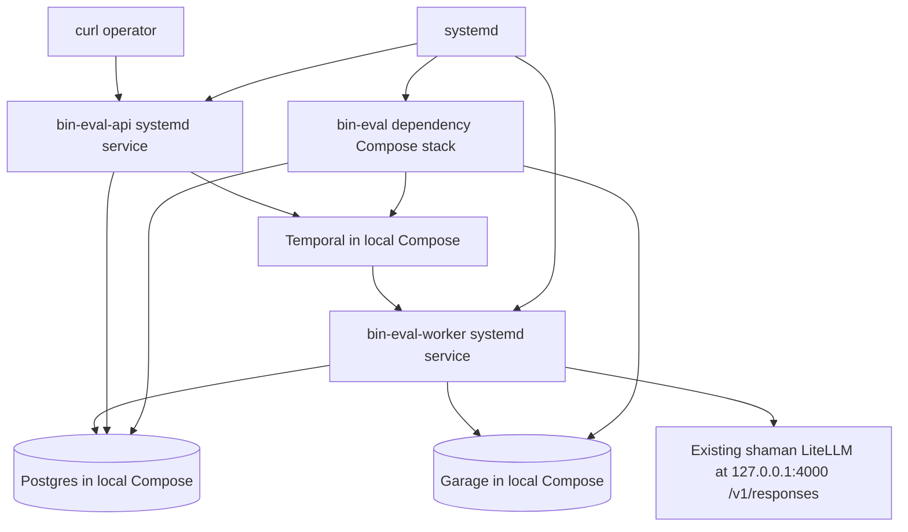

# bin-eval Local Service and Curl Completion Plan

## 1. Title and metadata

- Project name: bin-eval
- Version: 1.0.0
- Owners: Kirill, product and engineering
- Date: 2026-07-07
- Document ID: PLAN-BIN-EVAL-LOCAL-CURL-002
- Summary: This plan completes bin-eval from a locally green MVP into a persistently runnable local service on shaman with an operator-ready curl workflow. The service will use the existing LiteLLM runtime from `/home/kirill/p/litellm-chatgpt`, model `gpt-5.4-mini`, and the OpenAI-compatible Responses API at `http://127.0.0.1:4000/v1/responses`. The final acceptance artifact is a tested curl sequence that creates a checklist, polls generated binary questions and weights, creates an evaluation, polls the deterministic score, and prints score fields and failed question IDs from the running API.

## 2. Design consensus and trade-offs

- Topic: Reuse existing LiteLLM on shaman
  - Verdict: DECISION
  - Rationale: `/home/kirill/p/litellm-chatgpt` already runs `shaman-api-litellm-1` on `127.0.0.1:4000`, exposes `/v1/models`, and is already consumed by `/home/kirill/p/utility-llm`. bin-eval must use this runtime instead of introducing another LLM container or provider path.
- Topic: Responses API instead of Chat Completions
  - Verdict: DECISION
  - Rationale: `/home/kirill/p/litellm-chatgpt/communications/utility-llm-shaman-litellm-contract.md` states that prompt execution uses `POST /v1/responses`, streaming SSE, and model `gpt-5.4-mini`; it explicitly says not to use Chat Completions for this profile. `internal/llm/client.go` already targets `/v1/responses`.
- Topic: Service exposure
  - Verdict: DECISION
  - Rationale: The current bin-eval API has no auth middleware. The local service must bind to `127.0.0.1:8080` by default and may later bind to a Tailscale-only address, but it must not be exposed on a public interface without an auth or proxy decision.
- Topic: Persistent runtime shape
  - Verdict: DECISION
  - Rationale: shaman already runs long-lived local services through systemd and Docker Compose. bin-eval should add repo-managed systemd unit templates and install scripts for API, worker, and dependency stack startup rather than relying on the e2e smoke script, which starts transient API and worker processes.
- Topic: Curl flow shape
  - Verdict: DECISION
  - Rationale: bin-eval routes are asynchronous by design. The operator flow is four API actions: create checklist, poll checklist, create evaluation, poll evaluation. A single curl request cannot both generate questions and score an answer without changing the API contract, so the deliverable is a copy-paste curl sequence and a script that performs the same sequence.
- Topic: Secrets in repo artifacts
  - Verdict: AGAINST
  - Rationale: `LITELLM_MASTER_KEY`, Garage secrets, and database credentials must stay in ignored local environment files or `/etc/bin-eval/bin-eval.env`; committed docs and scripts may name variables but must not contain secret values.

## 3. PRD / stakeholder and system needs

- Problem: The MVP code is implemented and tested, but an operator still lacks a persistent service on shaman and a tested direct curl example against the running API.
- Users: Kirill and internal engineers who want to call bin-eval from shell scripts, local tools, or remote private-network clients.
- Value: A reliable local service path that reuses the existing LiteLLM runtime and returns deterministic checklist/evaluation JSON through curl.
- Business goals: Finish the MVP all the way to an operator-usable service endpoint and a documented curl transcript.
- Success metrics: Local services can be installed, started, queried, and stopped through repo-managed commands; `gpt-5.4-mini` Responses API contract passes; the tested curl flow creates one checklist, evaluates one answer, and returns `succeeded` status with score fields; committed docs include the exact curl sequence.
- Scope: systemd unit templates, install/start/status scripts, Makefile targets for local service operations, env templates for `/etc/bin-eval/bin-eval.env` and ignored repo-local user mode, curl example script, docs update, and live validation against the existing LiteLLM.
- Non-goals: Public internet exposure, auth middleware, hosted production deployment, UI, dashboarding, multi-provider fallback, schema repair prompts, alternate LLM runtime, and API contract changes beyond docs and operational tooling.
- Dependencies: Go 1.23 or newer, Docker Engine with Compose v2, existing `shaman-api-litellm-1` service from `/home/kirill/p/litellm-chatgpt`, `LITELLM_MASTER_KEY` available from local secret storage, Postgres `postgres:16.4`, Temporal `temporalio/auto-setup:1.28.4`, Garage `dxflrs/garage:v2.3.0`, `curl`, and `jq`.
- Risks: LiteLLM may be down or token files may be missing; system-level install requires sudo; user-level systemd may inherit a stale group list and need a Docker group wrapper; port `127.0.0.1:8080` may already be in use; local Compose volumes may contain stale data; no API auth means wrong bind address is unsafe.
- Assumptions: The current repo root is `/home/kirill/p/self-imp-bin-eval`; `make lint build test`, `make test-integration`, and `make test-e2e` are green; `origin/master` contains commit `6a10a16 feat: implement bin-eval MVP`; the existing LiteLLM profile uses model `gpt-5.4-mini` and Responses API mode.

## 4. SRS / canonical requirements

### Functional requirements

- REQ-001 (func): The repo provides a persistent local startup path for bin-eval dependencies, API, and worker. Acceptance: a repo-managed command or script installs unit templates for the dependency stack, API, and worker.
- REQ-002 (func): The local API service starts on a deterministic default URL. Acceptance: `BIN_EVAL_URL=http://127.0.0.1:8080` reaches the four existing API routes after service startup.
- REQ-003 (func): The worker service processes checklist and evaluation workflows from the same Temporal task queue as the API starts. Acceptance: creating a checklist through curl reaches `succeeded` without a transient smoke-owned worker process.
- REQ-004 (func): The curl flow creates a checklist from `{task, context}` and prints generated candidate questions and weights. Acceptance: `GET /checklists/{id}` returns `status: "succeeded"`, non-empty `questions`, and all `weights` including zero.
- REQ-005 (func): The curl flow evaluates a model answer against the created checklist and prints deterministic score fields. Acceptance: `GET /evaluations/{id}` returns `status: "succeeded"`, `satisfied_points`, `total_possible_points`, `checklist_pass_rate`, `failed_question_ids`, and `judgments`.
- REQ-006 (func): The repo includes a copy-paste curl example and an executable script version of the same flow. Acceptance: docs and script use the same routes, request fields, and polling behavior.

### Interface/API requirements

- REQ-020 (int): bin-eval uses the existing LiteLLM Responses API endpoint. Acceptance: local validation calls `POST http://127.0.0.1:4000/v1/responses` with model `gpt-5.4-mini` and bearer auth, and bin-eval does not require Chat Completions.
- REQ-021 (int): The operator API remains the existing four-route asynchronous contract. Acceptance: no new product routes are required for the curl workflow.
- REQ-022 (int): Local runtime commands expose explicit environment variable contracts. Acceptance: examples name `BIN_EVAL_DATABASE_URL`, `BIN_EVAL_TEMPORAL_ADDRESS`, `BIN_EVAL_GARAGE_*`, `BIN_EVAL_ARTIFACT_BUCKET`, `BIN_EVAL_LLM_BASE_URL`, `BIN_EVAL_LLM_API_KEY`, `BIN_EVAL_MODEL_PROFILE`, `BIN_EVAL_URL`, and `BIN_EVAL_LISTEN_ADDR`.

### Data requirements

- REQ-030 (data): The persistent local runtime uses the existing Postgres schema from `migrations/0001_init.sql`. Acceptance: service startup applies migrations before serving API traffic.
- REQ-031 (data): The persistent local runtime uses the existing Garage bucket and key contract. Acceptance: checklist inputs, evaluation inputs, and LLM payloads continue to use `internal/artifacts/keys.go`.
- REQ-032 (data): Generated binaries, smoke logs, and live curl captures remain out of commits. Acceptance: `.gitignore` covers `bin/` and `debug/`; operator scripts write captures under ignored paths.

### Non-functional requirements

- REQ-040 (reliability): Local services restart under systemd. Acceptance: API and worker unit templates include restart policy, dependency ordering, and a shared environment file.
- REQ-041 (security): Secrets are loaded from local environment files and are not printed by scripts. Acceptance: validation output redacts or omits `BIN_EVAL_LLM_API_KEY`, Garage secret key, and database password.
- REQ-042 (nfr): Operators can inspect service status and logs through repo-managed commands. Acceptance: status command prints unit state, API URL, dependency container state, and last smoke summary path without secret values.
- REQ-043 (nfr): The local curl path is reproducible. Acceptance: the repo has one command for service install, one for service start, one for service status, one for service stop, and one for live curl validation.

### Error handling and telemetry expectations

- Scripts must fail non-zero on missing LiteLLM key, unreachable LiteLLM, unreachable API, failed checklist, failed evaluation, or unparseable JSON.
- Scripts must print entity IDs, final statuses, score fields, and failed active question IDs.
- Scripts must not print raw secret values.
- Service logs remain in journald for systemd units and in `debug/live-curl/` only for operator captures.

### Architecture diagram



C4-style ASCII representation:

```text
[Person: Operator]
  -> [curl shell]
  -> [bin-eval HTTP API: Go, localhost-bound]
  -> [Temporal Server: local Compose]
  -> [bin-eval Worker: Go systemd service]

[bin-eval API]
  -> [Postgres: structured reads and ID reservation]
  -> [Temporal: workflow start]

[bin-eval Worker]
  -> [Postgres: checklists, questions, weights, evaluations, judgments]
  -> [Garage: raw task/context/answer and LLM payload artifacts]
  -> [Existing LiteLLM: /v1/responses, model gpt-5.4-mini]
```

## 5. Iterative implementation and test plan

### Phase strategy

- Build order: static command contract, env and LiteLLM validation, persistent service install/start path, live curl script and docs, full local service validation, commit/push.
- Verification-first controls: behavior-changing implementation subtasks are preceded by failing coverage; matching RED and GREEN subtasks use the same command and TEST ID.
- Compute controls: `branch_limits = 2`, `reflection_passes = 1`, `early_stop% = 30`.
- Standards tailoring note: This plan is standards-informed and does not claim ISO/IEEE/FAA compliance. For safety-critical use, add development assurance level assumptions, independence expectations, review and analysis evidence, structural coverage expectations, tool qualification assumptions, and certification data outputs.

### Risk register

- Risk: LiteLLM key is unavailable to service env generation. Trigger: validation cannot call `/v1/models`. Mitigation: script reports missing key source and stops before installing units.
- Risk: Port `127.0.0.1:8080` is occupied. Trigger: API unit cannot bind. Mitigation: env file supports `BIN_EVAL_LISTEN_ADDR`; docs show how to choose another localhost port.
- Risk: API is accidentally bound publicly. Trigger: `BIN_EVAL_LISTEN_ADDR` uses `0.0.0.0`. Mitigation: validation rejects public bind unless an explicit override flag is present.
- Risk: system-level systemd install needs sudo. Trigger: install script cannot write `/etc/bin-eval` or `/etc/systemd/system`. Mitigation: dry-run test stays unprivileged; live install auto-selects user-level systemd when passwordless sudo is unavailable.
- Risk: persistent dependency stack conflicts with test Compose volumes. Trigger: migrations or data state differs across runs. Mitigation: scripts use the same `deploy/compose/docker-compose.yml` and do not add another stack.

### Suspension/resumption criteria

- Suspend when LiteLLM `/v1/responses` is unreachable, local secret source is missing, Docker Compose cannot start dependencies, or systemd unit install is blocked by host policy.
- Resume after the missing external contract or host setup issue is corrected, then rerun the phase's full TEST and EVAL set from the last green phase checkpoint.

### Phase P00: Local Runtime Command Contract Exists

Phase goal: The repo has a verifiable command and file contract for installing, starting, stopping, inspecting, and curl-testing the local service path.

Scope and objectives, including impacted REQ-###: REQ-001, REQ-006, REQ-022, REQ-043.

Impacted surfaces: `Makefile`, `scripts/validate_local_runtime_contract.sh`, `deploy/systemd/*.service`, `scripts/install-local-systemd.sh`, `scripts/start-local.sh`, `scripts/stop-local.sh`, `scripts/status-local.sh`, `scripts/live_curl_example.sh`, `docs/curl.md`.

Lifecycle evidence:
- Requirements evidence: REQ-001, REQ-006, REQ-022, REQ-043.
- Design/code surface evidence: command contract script, Makefile target list, expected systemd and script paths.
- Verification method: TEST-001.
- Validation purpose: later phases can reference local service commands without inventing them.
- Configuration checkpoint: `phase-p00-local-command-contract`.
- Risks and assumptions: current Makefile lacks local service targets; scripts and units are not present at phase start.

Plan-and-Solve subtasks:

- `P00.S01 Add failing coverage for local runtime command contract`
  - Action: Add `scripts/validate_local_runtime_contract.sh` with `# TEST-001` and assertions for expected Makefile targets, executable scripts, systemd unit templates, and docs anchors.
  - Why now: The command surface must be specified before implementation subtasks create it.
  - Files/surfaces: `scripts/validate_local_runtime_contract.sh`.
  - Requirement link: REQ-001, REQ-006, REQ-022, REQ-043.
  - Verification link: TEST-001.
  - Verification mode: RED.
  - Command/procedure: `bash scripts/validate_local_runtime_contract.sh`
  - Expected result: Non-zero exit because local service targets, scripts, units, and docs anchors are absent.
  - Evidence produced: test script with `# TEST-001` tag and failing output.
  - Stop/escalate condition: Stop if current repo already has incompatible local-service command names.
  - Unlocks: P00.S02
- `P00.S02 Implement local runtime command contract`
  - Action: Add Makefile targets `install-local`, `start-local`, `stop-local`, `status-local`, and `test-live-curl`; add placeholder scripts and systemd unit templates with stable names.
  - Why now: Later implementation and validation phases require stable command names and file paths.
  - Files/surfaces: `Makefile`, `deploy/systemd/bin-eval-deps.service`, `deploy/systemd/bin-eval-api.service`, `deploy/systemd/bin-eval-worker.service`, `scripts/install-local-systemd.sh`, `scripts/start-local.sh`, `scripts/stop-local.sh`, `scripts/status-local.sh`, `scripts/live_curl_example.sh`, `docs/curl.md`.
  - Requirement link: REQ-001, REQ-006, REQ-022, REQ-043.
  - Verification link: TEST-001.
  - Verification mode: GREEN.
  - Command/procedure: `bash scripts/validate_local_runtime_contract.sh`
  - Expected result: Exit 0 with all command and file contract checks passing.
  - Evidence produced: Makefile diff, script diffs, unit template diffs, docs diff, passing output.
  - Stop/escalate condition: Escalate if target names conflict with an existing operator convention.
  - Unlocks: P00.S03
- `P00.S03 Confirm no refactor needed for command contract`
  - Action: Inspect Makefile and script names for duplicate command paths.
  - Why now: Command names become operator-facing and should not churn in later phases.
  - Files/surfaces: `Makefile`, `scripts/`, `deploy/systemd/`.
  - Requirement link: REQ-043.
  - Verification link: TEST-001.
  - Verification mode: VERIFY.
  - Command/procedure: `bash scripts/validate_local_runtime_contract.sh`
  - Expected result: Exit 0. No refactor needed because each operator action has one target.
  - Evidence produced: passing output and inspection note.
  - Stop/escalate condition: Convert to REFACTOR if one action has multiple competing scripts.
  - Unlocks: Phase exit

Exit gates:
- Proceed: TEST-001 passes.
- Escalate: command naming conflict or missing operator decision.
- Stop: the local service command surface cannot be made stable.

Phase metrics with estimated value and one-sentence rationale:
- Confidence %: 95 - Static command/file validation is straightforward.
- Long-term robustness %: 85 - Stable commands reduce operational drift.
- Internal interactions: 2 - Makefile and scripts.
- External interactions: 0 - No live services in this phase.
- Complexity %: 15 - Mostly static contract work.
- Feature creep %: 0 - Only service-operation commands are added.
- Technical debt %: 5 - Placeholder scripts are replaced in later phases.
- YAGNI score: 9 - Every command supports the user's requested curl outcome.
- MoSCoW: Must.
- Local/non-local scope: Local.
- Architectural changes count: 0.

### Phase P01: Existing LiteLLM Contract Is Validated

Phase goal: bin-eval validates that the existing shaman LiteLLM runtime supports the Responses API contract required by the running service.

Scope and objectives, including impacted REQ-###: REQ-020, REQ-022, REQ-041.

Impacted surfaces: `scripts/validate_litellm_responses.sh`, `internal/llm/client_test.go`, `docs/curl.md`.

Lifecycle evidence:
- Requirements evidence: REQ-020, REQ-022, REQ-041.
- Design/code surface evidence: LiteLLM validation script and existing Responses API client test.
- Verification method: TEST-002, TEST-006.
- Validation purpose: service startup must fail early if the required model profile or key is not available.
- Configuration checkpoint: `phase-p01-litellm-contract`.
- Risks and assumptions: `LITELLM_MASTER_KEY` or `BIN_EVAL_LLM_API_KEY` is available in the operator shell or local secret source.

Plan-and-Solve subtasks:

- `P01.S01 Add failing coverage for LiteLLM Responses validation`
  - Action: Add `scripts/validate_litellm_responses.sh` with `# TEST-002`; it calls `/v1/models`, confirms `gpt-5.4-mini`, posts a schema-constrained streaming `/v1/responses` request, parses `response.output_text.done`, and omits secret values from output.
  - Why now: Persistent service install should not proceed unless the configured LLM contract is live.
  - Files/surfaces: `scripts/validate_litellm_responses.sh`.
  - Requirement link: REQ-020, REQ-022, REQ-041.
  - Verification link: TEST-002.
  - Verification mode: RED.
  - Command/procedure: `BIN_EVAL_LLM_BASE_URL=http://127.0.0.1:4000 BIN_EVAL_MODEL_PROFILE=gpt-5.4-mini bash scripts/validate_litellm_responses.sh`
  - Expected result: Non-zero exit before script implementation is complete.
  - Evidence produced: script with `# TEST-002` tag and failing output.
  - Stop/escalate condition: Stop if local LiteLLM is not reachable at `127.0.0.1:4000`.
  - Unlocks: P01.S02
- `P01.S02 Implement LiteLLM Responses validation`
  - Action: Implement the validation script, including API key discovery from `BIN_EVAL_LLM_API_KEY` or `LITELLM_MASTER_KEY`, JSON parsing with `jq`, SSE parsing, and redacted output.
  - Why now: Later install/start scripts can call this script as a preflight.
  - Files/surfaces: `scripts/validate_litellm_responses.sh`.
  - Requirement link: REQ-020, REQ-022, REQ-041.
  - Verification link: TEST-002.
  - Verification mode: GREEN.
  - Command/procedure: `BIN_EVAL_LLM_BASE_URL=http://127.0.0.1:4000 BIN_EVAL_MODEL_PROFILE=gpt-5.4-mini bash scripts/validate_litellm_responses.sh`
  - Expected result: Exit 0 with model ID and `ok: true` output, no secret values.
  - Evidence produced: script diff and passing output.
  - Stop/escalate condition: Escalate if LiteLLM only works through a public hostname or Cloudflare Access headers.
  - Unlocks: P01.S03
- `P01.S03 Preserve LLM client Responses regression coverage`
  - Action: Confirm the existing `internal/llm/client_test.go` test covers `/v1/responses`, streaming SSE, schema request shape, invalid JSON, schema violation, and retryable HTTP failure.
  - Why now: The service relies on the Go client, not only the shell preflight.
  - Files/surfaces: `internal/llm/client_test.go`, `internal/llm/client.go`.
  - Requirement link: REQ-020, REQ-041.
  - Verification link: TEST-006.
  - Verification mode: VERIFY.
  - Command/procedure: `go test ./internal/llm -run TestGenerateJSONClient -count=1`
  - Expected result: Exit 0 with Responses API client contract passing.
  - Evidence produced: passing output.
  - Stop/escalate condition: Add RED/GREEN subtasks if the test no longer asserts `/v1/responses`.
  - Unlocks: Phase exit

Exit gates:
- Proceed: TEST-002 and TEST-006 pass.
- Escalate: missing key, unreachable LiteLLM, unsupported model, or endpoint mismatch.
- Stop: existing LiteLLM cannot satisfy the Responses API contract.

Phase metrics with estimated value and one-sentence rationale:
- Confidence %: 90 - The endpoint has already been probed successfully with `gpt-5.4-mini`.
- Long-term robustness %: 90 - A preflight catches external runtime drift.
- Internal interactions: 2 - shell validation and Go LLM client.
- External interactions: 1 - existing LiteLLM service.
- Complexity %: 25 - SSE parsing and secret-safe output add edge cases.
- Feature creep %: 0 - No new model provider is added.
- Technical debt %: 5 - The script is narrowly scoped.
- YAGNI score: 10 - This directly gates the requested curl flow.
- MoSCoW: Must.
- Local/non-local scope: Non-local.
- Architectural changes count: 0.

### Phase P02: Persistent Local Services Run Under systemd

Phase goal: bin-eval dependencies, API, and worker can be installed and started as local persistent services on shaman.

Scope and objectives, including impacted REQ-###: REQ-001, REQ-002, REQ-003, REQ-030, REQ-031, REQ-040, REQ-041, REQ-042, REQ-043.

Impacted surfaces: `deploy/systemd/*.service`, `scripts/install-local-systemd.sh`, `scripts/start-local.sh`, `scripts/stop-local.sh`, `scripts/status-local.sh`, `deploy/local/bin-eval.env.example`, `Makefile`, `cmd/bin-eval-api/main.go`, `cmd/bin-eval-worker/main.go`.

Lifecycle evidence:
- Requirements evidence: REQ-001, REQ-002, REQ-003, REQ-030, REQ-031, REQ-040, REQ-041, REQ-042, REQ-043.
- Design/code surface evidence: systemd unit templates, env file template, install/start/stop/status scripts.
- Verification method: TEST-003, TEST-004.
- Validation purpose: replace transient smoke-owned processes with a real local service path.
- Configuration checkpoint: `phase-p02-systemd-runtime`.
- Risks and assumptions: system mode requires sudo, user mode requires a running user systemd manager, and scripts must not overwrite an existing secret env file without confirmation.

Plan-and-Solve subtasks:

- `P02.S01 Add failing coverage for installer dry-run`
  - Action: Extend `scripts/install-local-systemd.sh --dry-run` behavior and add `# TEST-003` assertions that the script renders target paths, unit names, env file paths, and binary build commands without writing privileged locations.
  - Why now: Installer behavior must be specified before it can alter host service state.
  - Files/surfaces: `scripts/install-local-systemd.sh`.
  - Requirement link: REQ-001, REQ-030, REQ-031, REQ-040, REQ-041, REQ-043.
  - Verification link: TEST-003.
  - Verification mode: RED.
  - Command/procedure: `bash scripts/install-local-systemd.sh --dry-run`
  - Expected result: Non-zero exit until dry-run installer behavior is implemented.
  - Evidence produced: script with `# TEST-003` tag and failing output.
  - Stop/escalate condition: Stop if systemd is unavailable on the target host.
  - Unlocks: P02.S02
- `P02.S02 Implement systemd unit templates and installer`
  - Action: Implement `deploy/systemd/bin-eval-deps.service`, `bin-eval-api.service`, and `bin-eval-worker.service`; implement installer dry-run, system mode, and user mode; build binaries into repo-local `bin/`; install rendered units; create the selected env file from template without overwriting secrets.
  - Why now: API and worker need persistent service ownership before live curl validation.
  - Files/surfaces: `deploy/systemd/*.service`, `deploy/local/bin-eval.env.example`, `scripts/install-local-systemd.sh`.
  - Requirement link: REQ-001, REQ-002, REQ-003, REQ-030, REQ-031, REQ-040, REQ-041, REQ-043.
  - Verification link: TEST-003.
  - Verification mode: GREEN.
  - Command/procedure: `bash scripts/install-local-systemd.sh --dry-run`
  - Expected result: Exit 0 and print planned file operations with no secret values.
  - Evidence produced: unit template diffs, env template diff, installer diff, passing dry-run output.
  - Stop/escalate condition: Escalate if both system-level and user-level systemd installation paths are rejected.
  - Unlocks: P02.S03
- `P02.S03 Add failing coverage for local service status`
  - Action: Implement `scripts/status-local.sh --json` contract with `# TEST-004` to report dependency container state, systemd unit state, API URL, model profile, and redacted config status.
  - Why now: Operators need a status command before using the curl flow.
  - Files/surfaces: `scripts/status-local.sh`.
  - Requirement link: REQ-002, REQ-003, REQ-040, REQ-041, REQ-042, REQ-043.
  - Verification link: TEST-004.
  - Verification mode: RED.
  - Command/procedure: `bash scripts/status-local.sh --json`
  - Expected result: Non-zero exit until status script behavior is implemented.
  - Evidence produced: script with `# TEST-004` tag and failing output.
  - Stop/escalate condition: Stop if status cannot avoid printing secret values.
  - Unlocks: P02.S04
- `P02.S04 Implement start, stop, and status scripts`
  - Action: Implement `scripts/start-local.sh`, `scripts/stop-local.sh`, and `scripts/status-local.sh`; wire Makefile targets; call LiteLLM preflight before starting API/worker; reject public bind by default.
  - Why now: Live curl validation needs running API and worker services.
  - Files/surfaces: `scripts/start-local.sh`, `scripts/stop-local.sh`, `scripts/status-local.sh`, `Makefile`.
  - Requirement link: REQ-001, REQ-002, REQ-003, REQ-040, REQ-041, REQ-042, REQ-043.
  - Verification link: TEST-004.
  - Verification mode: GREEN.
  - Command/procedure: `bash scripts/status-local.sh --json`
  - Expected result: Exit 0 on a configured host or clear non-zero preflight error with no secrets.
  - Evidence produced: script diffs, Makefile diff, status JSON output.
  - Stop/escalate condition: Escalate if host policy blocks systemd or Docker Compose access.
  - Unlocks: P02.S05
- `P02.S05 Measure local service startup`
  - Action: Execute the install/start/status sequence on shaman and record service states.
  - Why now: A dry-run cannot prove the persistent service path works.
  - Files/surfaces: systemd units, `/etc/bin-eval/bin-eval.env`, `debug/live-curl/service-status.json`.
  - Requirement link: REQ-001, REQ-002, REQ-003, REQ-040, REQ-042.
  - Verification link: EVAL-001.
  - Verification mode: MEASURE.
  - Command/procedure: `make install-local && make start-local && make status-local`
  - Expected result: dependencies, API, and worker report active; API responds on `127.0.0.1:8080`.
  - Evidence produced: status JSON, unit state output, journal pointers.
  - Stop/escalate condition: Suspend on sudo denial, unit failure, missing env file, or unhealthy dependency container.
  - Unlocks: Phase exit

Exit gates:
- Proceed: TEST-003, TEST-004, and EVAL-001 pass.
- Escalate: host service policy, unsafe bind address, or Docker/systemd conflict that cannot be solved by user mode or the Docker group wrapper.
- Stop: persistent services cannot be installed on shaman without changing deployment scope.

Phase metrics with estimated value and one-sentence rationale:
- Confidence %: 82 - systemd patterns are standard, but host privileges and env files are external.
- Long-term robustness %: 90 - persistent services are the durable local runtime path.
- Internal interactions: 5 - Makefile, scripts, units, API binary, worker binary.
- External interactions: 4 - systemd, Docker Compose, Temporal, Garage/Postgres.
- Complexity %: 45 - startup ordering and secret-safe env handling add operational edge cases.
- Feature creep %: 0 - No public deployment or auth is added.
- Technical debt %: 8 - Shell/systemd scripts are simple but host-coupled.
- YAGNI score: 9 - The service path is required for direct curl usage.
- MoSCoW: Must.
- Local/non-local scope: Non-local.
- Architectural changes count: 1.

### Phase P03: Operator Curl Flow Creates and Evaluates

Phase goal: The repo provides a tested curl flow that creates generated questions and evaluates an answer through the running local API.

Scope and objectives, including impacted REQ-###: REQ-004, REQ-005, REQ-006, REQ-021, REQ-032, REQ-043.

Impacted surfaces: `scripts/live_curl_example.sh`, `docs/curl.md`, `fixtures/smoke/cases/*`, `debug/live-curl/`, `Makefile`.

Lifecycle evidence:
- Requirements evidence: REQ-004, REQ-005, REQ-006, REQ-021, REQ-032, REQ-043.
- Design/code surface evidence: live curl script and docs using only four existing routes.
- Verification method: TEST-005, TEST-007, EVAL-002.
- Validation purpose: prove the user can copy a curl sequence and get checklist and evaluation JSON from the running service.
- Configuration checkpoint: `phase-p03-live-curl-flow`.
- Risks and assumptions: API and worker are already running from P02.

Plan-and-Solve subtasks:

- `P03.S01 Add failing coverage for live curl workflow`
  - Action: Implement `scripts/live_curl_example.sh` with `# TEST-005` scaffold that posts checklist JSON, polls checklist, posts evaluation JSON, polls evaluation, prints score fields, and writes captures under `debug/live-curl/`.
  - Why now: The live curl acceptance behavior must be specified before docs present it.
  - Files/surfaces: `scripts/live_curl_example.sh`.
  - Requirement link: REQ-004, REQ-005, REQ-006, REQ-021, REQ-032, REQ-043.
  - Verification link: TEST-005.
  - Verification mode: RED.
  - Command/procedure: `BIN_EVAL_URL=http://127.0.0.1:8080 bash scripts/live_curl_example.sh`
  - Expected result: Non-zero exit until the full workflow script is implemented or services are running.
  - Evidence produced: script with `# TEST-005` tag and failing output.
  - Stop/escalate condition: Stop if the script requires routes outside the four-route API contract.
  - Unlocks: P03.S02
- `P03.S02 Implement live curl workflow script`
  - Action: Complete `scripts/live_curl_example.sh` with JSON payload creation through `jq`, polling timeouts, failed-status reporting, score extraction, and secret-safe output.
  - Why now: A tested script provides the source of truth for the docs curl block.
  - Files/surfaces: `scripts/live_curl_example.sh`, `Makefile`.
  - Requirement link: REQ-004, REQ-005, REQ-006, REQ-021, REQ-032, REQ-043.
  - Verification link: TEST-005.
  - Verification mode: GREEN.
  - Command/procedure: `BIN_EVAL_URL=http://127.0.0.1:8080 bash scripts/live_curl_example.sh`
  - Expected result: Exit 0 with checklist ID, evaluation ID, `status: succeeded`, score fields, judgments, and capture files.
  - Evidence produced: script diff, Makefile target, captured JSON, passing output.
  - Stop/escalate condition: Escalate if generated model behavior cannot produce valid checklist or judgment output through the running service.
  - Unlocks: P03.S03
- `P03.S03 Add failing coverage for documented curl block`
  - Action: Add `scripts/validate_docs_curl.sh` with `# TEST-007` to assert `docs/curl.md` contains the direct curl sequence, route names, `jq` polling fields, and no secret literals.
  - Why now: The user-facing docs must stay aligned with the tested script.
  - Files/surfaces: `scripts/validate_docs_curl.sh`, `docs/curl.md`.
  - Requirement link: REQ-006, REQ-021, REQ-032, REQ-043.
  - Verification link: TEST-007.
  - Verification mode: RED.
  - Command/procedure: `bash scripts/validate_docs_curl.sh`
  - Expected result: Non-zero exit until docs contain the complete curl sequence.
  - Evidence produced: script with `# TEST-007` tag and failing output.
  - Stop/escalate condition: Stop if docs would need to include secret values.
  - Unlocks: P03.S04
- `P03.S04 Implement operator curl documentation`
  - Action: Update `docs/curl.md` with setup prerequisites, service start/status commands, exact copy-paste curl sequence, expected response fields, and troubleshooting for failed checklist/evaluation statuses.
  - Why now: The tested script behavior is known and can be reflected accurately.
  - Files/surfaces: `docs/curl.md`.
  - Requirement link: REQ-006, REQ-021, REQ-032, REQ-043.
  - Verification link: TEST-007.
  - Verification mode: GREEN.
  - Command/procedure: `bash scripts/validate_docs_curl.sh`
  - Expected result: Exit 0 with docs and script in sync.
  - Evidence produced: docs diff and passing output.
  - Stop/escalate condition: Escalate if the documented curl sequence diverges from the tested script.
  - Unlocks: P03.S05
- `P03.S05 Measure live curl golden output`
  - Action: Execute the running-service curl workflow and record the returned checklist/evaluation JSON and score fields.
  - Why now: The final deliverable is the curl transcript from the running local service.
  - Files/surfaces: `debug/live-curl/summary.json`, `debug/live-curl/checklist.json`, `debug/live-curl/evaluation.json`.
  - Requirement link: REQ-004, REQ-005, REQ-006.
  - Verification link: EVAL-002.
  - Verification mode: MEASURE.
  - Command/procedure: `make test-live-curl`
  - Expected result: Exit 0 with one succeeded checklist, one succeeded evaluation, parseable score fields, and failed question IDs array.
  - Evidence produced: terminal output and ignored JSON captures.
  - Stop/escalate condition: Suspend if live model output fails validation or API/worker services are unhealthy.
  - Unlocks: Phase exit

Exit gates:
- Proceed: TEST-005, TEST-007, and EVAL-002 pass.
- Escalate: live model failure, route contract mismatch, or docs/script divergence.
- Stop: the four-route API cannot support the requested curl flow without changing scope.

Phase metrics with estimated value and one-sentence rationale:
- Confidence %: 90 - The current smoke path already proves the same API workflow.
- Long-term robustness %: 88 - Docs generated from tested script behavior reduce operator drift.
- Internal interactions: 4 - docs, script, fixtures, Makefile.
- External interactions: 4 - API, worker, Temporal, LiteLLM.
- Complexity %: 30 - Polling and JSON parsing are simple but asynchronous.
- Feature creep %: 0 - No new API route is introduced.
- Technical debt %: 5 - Shell flow is intentionally direct.
- YAGNI score: 10 - This is the user-requested deliverable.
- MoSCoW: Must.
- Local/non-local scope: Non-local.
- Architectural changes count: 0.

### Phase P04: Final Local Acceptance Is Committed and Pushed

Phase goal: All local-service and curl artifacts are verified, committed, pushed, and ready for operator use.

Scope and objectives, including impacted REQ-###: REQ-001 through REQ-006, REQ-020 through REQ-022, REQ-030 through REQ-032, REQ-040 through REQ-043.

Impacted surfaces: full repo, git state, `docs/curl.md`, `debug/live-curl/summary.json`.

Lifecycle evidence:
- Requirements evidence: all REQs.
- Design/code surface evidence: final diff and commit.
- Verification method: TEST-001 through TEST-011, EVAL-001, EVAL-002.
- Validation purpose: confirm no uncommitted implementation drift remains after the local service path is accepted.
- Configuration checkpoint: `phase-p04-final-local-curl-accepted`.
- Risks and assumptions: remote `origin` is writable; ignored debug artifacts remain uncommitted.

Plan-and-Solve subtasks:

- `P04.S01 Execute final static and unit verification`
  - Action: Run the full existing static and unit command.
  - Why now: Local-service changes must not regress MVP code.
  - Files/surfaces: all Go packages and Makefile.
  - Requirement link: REQ-001 through REQ-006, REQ-020 through REQ-022, REQ-030 through REQ-032, REQ-040 through REQ-043.
  - Verification link: TEST-008.
  - Verification mode: VERIFY.
  - Command/procedure: `make lint build test`
  - Expected result: Exit 0.
  - Evidence produced: passing output.
  - Stop/escalate condition: Stop on any regression.
  - Unlocks: P04.S02
- `P04.S02 Execute final integration verification`
  - Action: Run the existing Compose-backed integration target.
  - Why now: persistent service changes must still align with migration and artifact contracts.
  - Files/surfaces: `deploy/compose/docker-compose.yml`, `migrations/0001_init.sql`, `internal/db`, `internal/artifacts`.
  - Requirement link: REQ-030, REQ-031, REQ-032.
  - Verification link: TEST-009.
  - Verification mode: VERIFY.
  - Command/procedure: `make test-integration`
  - Expected result: Exit 0.
  - Evidence produced: passing output.
  - Stop/escalate condition: Stop on Compose, migration, or artifact regression.
  - Unlocks: P04.S03
- `P04.S03 Execute final local service and curl verification`
  - Action: Run the LiteLLM preflight, status command, and live curl command against the persistent local services.
  - Why now: This is the final acceptance path for the user's requested curl call.
  - Files/surfaces: `scripts/validate_litellm_responses.sh`, `scripts/status-local.sh`, `scripts/live_curl_example.sh`, `debug/live-curl/`.
  - Requirement link: REQ-001 through REQ-006, REQ-020 through REQ-022, REQ-040 through REQ-043.
  - Verification link: TEST-010, EVAL-001, EVAL-002.
  - Verification mode: MEASURE.
  - Command/procedure: `bash scripts/validate_litellm_responses.sh && make status-local && make test-live-curl`
  - Expected result: Exit 0 with live service status and curl summary.
  - Evidence produced: command output and ignored `debug/live-curl/summary.json`.
  - Stop/escalate condition: Suspend on unavailable LiteLLM, failed services, failed checklist, or failed evaluation.
  - Unlocks: P04.S04
- `P04.S04 Commit and push accepted local runtime artifacts`
  - Action: Stage source, scripts, unit templates, docs, fixtures, and tests; exclude ignored binaries and debug captures; commit and push to `origin/master`.
  - Why now: The accepted local service path must be durable in Git.
  - Files/surfaces: git tracked files.
  - Requirement link: REQ-001 through REQ-006, REQ-020 through REQ-022, REQ-030 through REQ-032, REQ-040 through REQ-043.
  - Verification link: TEST-011.
  - Verification mode: VERIFY.
  - Command/procedure: `git status --short --branch && git log --oneline -1`
  - Expected result: pushed commit on `origin/master`; ignored `bin/` and `debug/` remain untracked.
  - Evidence produced: commit hash, push output, final git status.
  - Stop/escalate condition: Stop if unrelated user changes are present or push is rejected.
  - Unlocks: Phase exit

Exit gates:
- Proceed: all tests and evals pass, docs contain exact curl flow, and commit is pushed.
- Escalate: git conflict, push rejection, or untracked non-ignored artifacts with unclear ownership.
- Stop: final curl acceptance cannot be met without changing API or deployment scope.

Phase metrics with estimated value and one-sentence rationale:
- Confidence %: 88 - Most behavior reuses green MVP paths, but service install is host-specific.
- Long-term robustness %: 92 - committed service and curl tooling make the result repeatable.
- Internal interactions: 8 - Makefile, scripts, docs, API, worker, db, artifacts, LLM client.
- External interactions: 5 - systemd, Docker, Postgres, Temporal, Garage, LiteLLM.
- Complexity %: 35 - final verification combines several mature paths.
- Feature creep %: 0 - final phase only validates and publishes.
- Technical debt %: 5 - no new abstraction is expected.
- YAGNI score: 10 - every artifact supports direct operation.
- MoSCoW: Must.
- Local/non-local scope: Non-local.
- Architectural changes count: 0.

## 6. Evaluations

```yaml
evals:
  - id: EVAL-001
    purpose: dev
    metrics:
      - deps_service_active
      - api_service_active
      - worker_service_active
      - api_reachable
      - litellm_reachable
    thresholds:
      deps_service_active: true
      api_service_active: true
      worker_service_active: true
      api_reachable: true
      litellm_reachable: true
    seeds: "deploy/systemd/*.service, deploy/local/bin-eval.env.example, /etc/bin-eval/bin-eval.env"
    runtime_budget: 3m
  - id: EVAL-002
    purpose: holdout
    metrics:
      - checklist_status
      - evaluation_status
      - has_questions
      - has_weights
      - has_judgments
      - has_score_fields
      - failed_question_ids_is_array
    thresholds:
      checklist_status: "succeeded"
      evaluation_status: "succeeded"
      has_questions: true
      has_weights: true
      has_judgments: true
      has_score_fields: true
      failed_question_ids_is_array: true
    seeds: "scripts/live_curl_example.sh inline payload or fixtures/smoke/cases/release_notes/task.json"
    runtime_budget: 5m
```

## 7. Tests

### 7.1 Test inventory

- Existing runners:
  - Go `testing`
  - Bash
  - Docker Compose v2
  - curl and jq
- Existing commands:
  - `make lint`
  - `make build`
  - `make test`
  - `make test-integration`
  - `make test-e2e`
- Commands to create before use:
  - `make install-local`
  - `make start-local`
  - `make stop-local`
  - `make status-local`
  - `make test-live-curl`
- File globs and locations:
  - Unit tests: `internal/**/*_test.go`
  - Integration tests: `internal/**/*_integration_test.go` with `//go:build integration`
  - Shell validation: `scripts/*.sh`
  - Service units: `deploy/systemd/*.service`
  - Docs: `docs/curl.md`

### 7.2 Test suites overview

- name: Unit
  - purpose: Verify Go package behavior and Responses API client contract.
  - runner: Go `testing`
  - command: `make test`
  - runtime budget: 90s
  - when it runs: pre-commit and CI
- name: Integration
  - purpose: Verify migrations, concrete Postgres store, Garage artifacts, and Compose dependency rendering.
  - runner: Docker Compose plus Go `testing`
  - command: `make test-integration`
  - runtime budget: 10m
  - when it runs: CI and local acceptance
- name: E2E
  - purpose: Verify transient full-stack smoke path.
  - runner: Bash, curl, jq
  - command: `make test-e2e`
  - runtime budget: 6m
  - when it runs: release gate
- name: Local Service
  - purpose: Verify persistent local API/worker/dependency services and direct curl workflow.
  - runner: Bash, systemd, curl, jq
  - command: `make test-live-curl`
  - runtime budget: 5m
  - when it runs: local service acceptance
- name: Static
  - purpose: Verify command, docs, and unit-template contracts.
  - runner: Bash
  - command: `bash scripts/validate_local_runtime_contract.sh && bash scripts/validate_docs_curl.sh`
  - runtime budget: 30s
  - when it runs: pre-commit

### 7.3 Test definitions

- id: TEST-001
  - name: Local runtime command contract
  - type: static
  - verifies: REQ-001, REQ-006, REQ-022, REQ-043
  - location: `scripts/validate_local_runtime_contract.sh`
  - command: `bash scripts/validate_local_runtime_contract.sh`
  - fixtures/mocks/data: Makefile target names, systemd unit template paths, script paths, docs anchors.
  - deterministic controls: Static file inspection only; no network.
  - pass_criteria: Required targets, scripts, unit templates, and docs anchors exist; scripts are executable.
  - expected_runtime: <5s
- id: TEST-002
  - name: Existing LiteLLM Responses API contract
  - type: e2e
  - verifies: REQ-020, REQ-022, REQ-041
  - location: `scripts/validate_litellm_responses.sh`
  - command: `BIN_EVAL_LLM_BASE_URL=http://127.0.0.1:4000 BIN_EVAL_MODEL_PROFILE=gpt-5.4-mini bash scripts/validate_litellm_responses.sh`
  - fixtures/mocks/data: local LiteLLM `/v1/models` and `/v1/responses`; API key from `BIN_EVAL_LLM_API_KEY` or `LITELLM_MASTER_KEY`.
  - deterministic controls: fixed model `gpt-5.4-mini`, fixed JSON schema, fixed expected text, 30s curl timeout.
  - pass_criteria: model exists, Responses request returns `ok: true`, output omits secret values.
  - expected_runtime: <30s
- id: TEST-003
  - name: Local systemd installer dry-run
  - type: static
  - verifies: REQ-001, REQ-030, REQ-031, REQ-040, REQ-041, REQ-043
  - location: `scripts/install-local-systemd.sh`
  - command: `bash scripts/install-local-systemd.sh --dry-run`
  - fixtures/mocks/data: `deploy/systemd/*.service`, `deploy/local/bin-eval.env.example`, current repo path.
  - deterministic controls: dry-run mode writes no privileged files; output redacts secret variables.
  - pass_criteria: planned operations include binary build, env file path, unit installation, daemon reload, enable, and start operations; no secret values appear.
  - expected_runtime: <10s
- id: TEST-004
  - name: Local service status JSON
  - type: integration
  - verifies: REQ-002, REQ-003, REQ-040, REQ-041, REQ-042, REQ-043
  - location: `scripts/status-local.sh`
  - command: `bash scripts/status-local.sh --json`
  - fixtures/mocks/data: systemd unit state, Docker Compose service state, configured `BIN_EVAL_URL`.
  - deterministic controls: JSON output; fixed field names; no raw secret output.
  - pass_criteria: output includes dependency, API, worker, URL, model profile, and redaction status fields; exits non-zero with a clear reason if services are not installed.
  - expected_runtime: <15s
- id: TEST-005
  - name: Live curl checklist and evaluation flow
  - type: e2e
  - verifies: REQ-004, REQ-005, REQ-006, REQ-021, REQ-032, REQ-043
  - location: `scripts/live_curl_example.sh`
  - command: `BIN_EVAL_URL=http://127.0.0.1:8080 bash scripts/live_curl_example.sh`
  - fixtures/mocks/data: inline task/context/model_answer payload or `fixtures/smoke/cases/release_notes/*`.
  - deterministic controls: 300s poll ceiling, `jq` JSON parsing, fixed payload, running local services.
  - pass_criteria: checklist and evaluation reach `succeeded`; questions, weights, judgments, score fields, and failed question IDs array parse successfully.
  - expected_runtime: <5m
- id: TEST-006
  - name: Go Responses API client regression
  - type: unit
  - verifies: REQ-020, REQ-041
  - location: `internal/llm/client_test.go`
  - command: `go test ./internal/llm -run TestGenerateJSONClient -count=1`
  - fixtures/mocks/data: `httptest.Server` streaming SSE events, valid JSON, invalid JSON, schema violation, HTTP 503.
  - deterministic controls: in-process server; fixed responses; `-count=1`.
  - pass_criteria: client posts to `/v1/responses`, decodes streaming JSON, rejects invalid model output as non-retryable, and classifies HTTP 503 as retryable infrastructure.
  - expected_runtime: <10s
- id: TEST-007
  - name: Documented curl sequence contract
  - type: static
  - verifies: REQ-006, REQ-021, REQ-032, REQ-043
  - location: `scripts/validate_docs_curl.sh`
  - command: `bash scripts/validate_docs_curl.sh`
  - fixtures/mocks/data: `docs/curl.md`
  - deterministic controls: static grep and JSON-snippet checks; no network.
  - pass_criteria: docs include POST and GET examples for checklists and evaluations, polling description, score fields, no secret literal patterns, and reference `scripts/live_curl_example.sh`.
  - expected_runtime: <5s
- id: TEST-008
  - name: Full static and unit regression
  - type: unit
  - verifies: REQ-001, REQ-006, REQ-020, REQ-021, REQ-022, REQ-040, REQ-041, REQ-043
  - location: `Makefile`
  - command: `make lint build test`
  - fixtures/mocks/data: unit fixtures under `fixtures/` and in-process test doubles.
  - deterministic controls: Go unit tests and static checks only; no live network dependency.
  - pass_criteria: lint, build, and unit test targets exit 0.
  - expected_runtime: <2m
- id: TEST-009
  - name: Existing Compose integration regression
  - type: integration
  - verifies: REQ-030, REQ-031, REQ-032
  - location: `deploy/compose/docker-compose.yml`
  - command: `make test-integration`
  - fixtures/mocks/data: local Postgres, Temporal, and Garage containers.
  - deterministic controls: Compose-managed dependency names and ports; migration fixtures committed in `migrations/`.
  - pass_criteria: integration target exits 0 and exercises migration, database, artifact, and dependency contracts.
  - expected_runtime: <10m
- id: TEST-010
  - name: Final local service curl acceptance command
  - type: e2e
  - verifies: REQ-001, REQ-002, REQ-003, REQ-004, REQ-005, REQ-006, REQ-020, REQ-021, REQ-022, REQ-040, REQ-041, REQ-042, REQ-043
  - location: `scripts/validate_litellm_responses.sh`, `scripts/status-local.sh`, `scripts/live_curl_example.sh`
  - command: `bash scripts/validate_litellm_responses.sh && make status-local && make test-live-curl`
  - fixtures/mocks/data: existing LiteLLM on `127.0.0.1:4000`, running local bin-eval API and worker, committed smoke payload.
  - deterministic controls: fixed model profile, fixed payload, bounded polling, JSON parsing through `jq`, secret redaction.
  - pass_criteria: LiteLLM preflight passes, local status reports ready services, and live curl flow reaches succeeded checklist and evaluation states.
  - expected_runtime: <6m
- id: TEST-011
  - name: Final git publication state
  - type: static
  - verifies: REQ-001, REQ-006, REQ-043
  - location: `.git`
  - command: `git status --short --branch && git log --oneline -1`
  - fixtures/mocks/data: local branch state and latest commit metadata.
  - deterministic controls: read-only git commands; ignored artifacts stay ignored by `.gitignore`.
  - pass_criteria: branch is aligned with `origin/master`, no unexpected tracked changes remain, and the latest commit is the pushed local-runtime implementation.
  - expected_runtime: <5s

### 7.4 Manual checks, optional

No CHECK items are required. Host-level systemd state is covered by TEST-004 and EVAL-001.

## 8. Data contract

### Schema snapshot

Postgres schema remains defined by `migrations/0001_init.sql`:

- `checklists(id, status, task_artifact_key, context_artifact_key, error_message, created_at, completed_at)`
- `questions(checklist_id, id, ordinal, rationale, question)`
- `weights(checklist_id, question_id, rationale, weight)`
- `evaluations(id, checklist_id, status, answer_artifact_key, satisfied_points, total_possible_points, checklist_pass_rate, error_message, created_at, completed_at)`
- `judgments(evaluation_id, checklist_id, question_id, evidence, answer)`

Garage key layout remains defined by `internal/artifacts/keys.go`:

- `checklists/{checklist_id}/inputs/task.txt`
- `checklists/{checklist_id}/inputs/context.txt`
- `checklists/{checklist_id}/llm/{prompt}/request.json`
- `checklists/{checklist_id}/llm/{prompt}/response.json`
- `evaluations/{evaluation_id}/inputs/model_answer.txt`
- `evaluations/{evaluation_id}/llm/binary_judging/request.json`
- `evaluations/{evaluation_id}/llm/binary_judging/response.json`

### Invariants

- API and worker use the same `BIN_EVAL_TEMPORAL_TASK_QUEUE`.
- API applies migrations before serving requests.
- Worker writes raw artifacts to Garage and structured state to Postgres.
- Checklist and evaluation success responses remain immutable after terminal status.
- Weight 0 excludes a question from active judging and scoring.
- `failed_question_ids` is always an array on succeeded evaluation responses.
- Live curl captures are ignored under `debug/live-curl/`.

### Privacy/data quality constraints

- `BIN_EVAL_LLM_API_KEY`, Garage secret key, database password, and local LiteLLM bearer key are never committed or printed.
- Raw task, context, model answer, and LLM payloads are stored as Garage artifacts by product design.
- Operators must avoid placing secrets in task, context, or model answer text.
- The local API binds to localhost by default because auth is outside current scope.

## 9. Reproducibility

- Seeds: `fixtures/smoke/cases/release_notes/*`, `fixtures/smoke/cases/incident_response/*`, and the inline payload in `scripts/live_curl_example.sh`.
- Hardware assumptions: shaman host with Docker Engine, systemd, Go 1.23 or newer, 4 vCPU, 8 GB RAM.
- OS/driver/container tag: Ubuntu-like Linux with systemd; Docker Compose v2; `postgres:16.4`; `temporalio/auto-setup:1.28.4`; `dxflrs/garage:v2.3.0`; existing `docker.litellm.ai/berriai/litellm:main-stable`.
- Relevant environment variables: `BIN_EVAL_ENV`, `BIN_EVAL_DATABASE_URL`, `BIN_EVAL_TEMPORAL_ADDRESS`, `BIN_EVAL_TEMPORAL_TASK_QUEUE`, `BIN_EVAL_GARAGE_ENDPOINT`, `BIN_EVAL_GARAGE_ACCESS_KEY`, `BIN_EVAL_GARAGE_SECRET_KEY`, `BIN_EVAL_ARTIFACT_BUCKET`, `BIN_EVAL_LLM_BASE_URL`, `BIN_EVAL_LLM_API_KEY`, `BIN_EVAL_MODEL_PROFILE`, `BIN_EVAL_URL`, `BIN_EVAL_LISTEN_ADDR`, `LITELLM_MASTER_KEY`, `LITELLM_PORT`.

## 10. Requirements Traceability Matrix

| Phase | REQ-### | TEST-### | Test Path | Command |
|---|---|---|---|---|
| P00 | REQ-001 | TEST-001 | `scripts/validate_local_runtime_contract.sh` | `bash scripts/validate_local_runtime_contract.sh` |
| P02 | REQ-001 | TEST-003 | `scripts/install-local-systemd.sh` | `bash scripts/install-local-systemd.sh --dry-run` |
| P02 | REQ-002 | TEST-004 | `scripts/status-local.sh` | `bash scripts/status-local.sh --json` |
| P02 | REQ-003 | TEST-004 | `scripts/status-local.sh` | `bash scripts/status-local.sh --json` |
| P03 | REQ-004 | TEST-005 | `scripts/live_curl_example.sh` | `BIN_EVAL_URL=http://127.0.0.1:8080 bash scripts/live_curl_example.sh` |
| P03 | REQ-005 | TEST-005 | `scripts/live_curl_example.sh` | `BIN_EVAL_URL=http://127.0.0.1:8080 bash scripts/live_curl_example.sh` |
| P00 | REQ-006 | TEST-001 | `scripts/validate_local_runtime_contract.sh` | `bash scripts/validate_local_runtime_contract.sh` |
| P03 | REQ-006 | TEST-007 | `scripts/validate_docs_curl.sh` | `bash scripts/validate_docs_curl.sh` |
| P01 | REQ-020 | TEST-002 | `scripts/validate_litellm_responses.sh` | `BIN_EVAL_LLM_BASE_URL=http://127.0.0.1:4000 BIN_EVAL_MODEL_PROFILE=gpt-5.4-mini bash scripts/validate_litellm_responses.sh` |
| P01 | REQ-020 | TEST-006 | `internal/llm/client_test.go` | `go test ./internal/llm -run TestGenerateJSONClient -count=1` |
| P03 | REQ-021 | TEST-005 | `scripts/live_curl_example.sh` | `BIN_EVAL_URL=http://127.0.0.1:8080 bash scripts/live_curl_example.sh` |
| P03 | REQ-021 | TEST-007 | `scripts/validate_docs_curl.sh` | `bash scripts/validate_docs_curl.sh` |
| P00 | REQ-022 | TEST-001 | `scripts/validate_local_runtime_contract.sh` | `bash scripts/validate_local_runtime_contract.sh` |
| P01 | REQ-022 | TEST-002 | `scripts/validate_litellm_responses.sh` | `BIN_EVAL_LLM_BASE_URL=http://127.0.0.1:4000 BIN_EVAL_MODEL_PROFILE=gpt-5.4-mini bash scripts/validate_litellm_responses.sh` |
| P02 | REQ-030 | TEST-003 | `scripts/install-local-systemd.sh` | `bash scripts/install-local-systemd.sh --dry-run` |
| P04 | REQ-030 | TEST-003 | `scripts/install-local-systemd.sh` | `bash scripts/install-local-systemd.sh --dry-run` |
| P02 | REQ-031 | TEST-003 | `scripts/install-local-systemd.sh` | `bash scripts/install-local-systemd.sh --dry-run` |
| P03 | REQ-032 | TEST-005 | `scripts/live_curl_example.sh` | `BIN_EVAL_URL=http://127.0.0.1:8080 bash scripts/live_curl_example.sh` |
| P03 | REQ-032 | TEST-007 | `scripts/validate_docs_curl.sh` | `bash scripts/validate_docs_curl.sh` |
| P02 | REQ-040 | TEST-003 | `scripts/install-local-systemd.sh` | `bash scripts/install-local-systemd.sh --dry-run` |
| P02 | REQ-040 | TEST-004 | `scripts/status-local.sh` | `bash scripts/status-local.sh --json` |
| P01 | REQ-041 | TEST-002 | `scripts/validate_litellm_responses.sh` | `BIN_EVAL_LLM_BASE_URL=http://127.0.0.1:4000 BIN_EVAL_MODEL_PROFILE=gpt-5.4-mini bash scripts/validate_litellm_responses.sh` |
| P01 | REQ-041 | TEST-006 | `internal/llm/client_test.go` | `go test ./internal/llm -run TestGenerateJSONClient -count=1` |
| P02 | REQ-041 | TEST-004 | `scripts/status-local.sh` | `bash scripts/status-local.sh --json` |
| P02 | REQ-042 | TEST-004 | `scripts/status-local.sh` | `bash scripts/status-local.sh --json` |
| P00 | REQ-043 | TEST-001 | `scripts/validate_local_runtime_contract.sh` | `bash scripts/validate_local_runtime_contract.sh` |
| P03 | REQ-043 | TEST-005 | `scripts/live_curl_example.sh` | `BIN_EVAL_URL=http://127.0.0.1:8080 bash scripts/live_curl_example.sh` |
| P03 | REQ-043 | TEST-007 | `scripts/validate_docs_curl.sh` | `bash scripts/validate_docs_curl.sh` |
| P04 | REQ-001 | TEST-008 | `Makefile` | `make lint build test` |
| P04 | REQ-004 | TEST-010 | `scripts/validate_litellm_responses.sh`, `scripts/status-local.sh`, `scripts/live_curl_example.sh` | `bash scripts/validate_litellm_responses.sh && make status-local && make test-live-curl` |
| P04 | REQ-005 | TEST-010 | `scripts/validate_litellm_responses.sh`, `scripts/status-local.sh`, `scripts/live_curl_example.sh` | `bash scripts/validate_litellm_responses.sh && make status-local && make test-live-curl` |
| P04 | REQ-006 | TEST-011 | `.git` | `git status --short --branch && git log --oneline -1` |
| P04 | REQ-020 | TEST-008 | `Makefile` | `make lint build test` |
| P04 | REQ-030 | TEST-009 | `deploy/compose/docker-compose.yml` | `make test-integration` |
| P04 | REQ-031 | TEST-009 | `deploy/compose/docker-compose.yml` | `make test-integration` |
| P04 | REQ-032 | TEST-009 | `deploy/compose/docker-compose.yml` | `make test-integration` |
| P04 | REQ-041 | TEST-010 | `scripts/validate_litellm_responses.sh`, `scripts/status-local.sh`, `scripts/live_curl_example.sh` | `bash scripts/validate_litellm_responses.sh && make status-local && make test-live-curl` |
| P04 | REQ-043 | TEST-011 | `.git` | `git status --short --branch && git log --oneline -1` |

## 11. Execution log template

```markdown
# Execution Log - PLAN-BIN-EVAL-LOCAL-CURL-002

## Phase Pxx: ______
- Phase Status: Pending/Done
- Checkpoint tag: ______
- Commit: ______

### Completed Steps
- [ ] Pxx.S01 - result: ______ - evidence: ______
- [ ] Pxx.S02 - result: ______ - evidence: ______

### Quantitative Results
- Metric: ______ - mean +/- std: ______ - 95% CI: ______ - threshold: ______ - pass/fail: ______

### Issues/Resolutions
- Issue: ______ - Resolution: ______

### Failed Attempts
- Attempt: ______ - Subtask: ______ - Why it failed: ______ - Branch limit remaining: ______

### Deviations
- Deviation from plan: ______ - Justification: ______ - ADR: ______

### Lessons Learned
- ______

### ADR Updates
- ADR-###: ______
```

## 12. Appendix: ADR index

- ADR-001: bin-eval uses the existing shaman LiteLLM runtime from `/home/kirill/p/litellm-chatgpt`.
- ADR-002: The local LLM contract is OpenAI-compatible Responses API mode at `/v1/responses`, not Chat Completions.
- ADR-003: Default API binding is localhost because API auth is outside the current scope.
- ADR-004: Persistent local runtime uses systemd units for API and worker plus the repo Compose stack for dependencies.
- ADR-005: system mode uses `/etc/bin-eval/bin-eval.env`; user mode uses ignored `deploy/local/bin-eval.env`; both may reference the existing LiteLLM secret source without committing secrets.
- ADR-006: The operator curl flow remains the existing four-route asynchronous API sequence.
- ADR-007: Generated binaries and live curl captures stay ignored under `bin/` and `debug/`.
