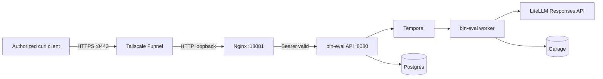

# bin-eval Public Tailscale Deployment Plan

## 1. Title and metadata

- Project name: bin-eval
- Version: 1.0
- Owners: Kirill Igum, bin-eval maintainers
- Date: 2026-07-13
- Document ID: BIN-EVAL-PUBLIC-TAILSCALE-001
- Summary: Deploy the existing four-route bin-eval API from the `shaman` computer through Tailscale Funnel without changing rubric generation, scoring, Temporal workflows, persistence contracts, or the local development API. The production edge is a localhost-only Nginx gateway that enforces bearer authentication, request throttling, bounded request bodies, and redacted diagnostics before forwarding to the existing `127.0.0.1:8080` API. Tailscale terminates public TLS on port `8443` and forwards only to the gateway.

## 2. Design consensus and trade-offs

- Topic: Production host
  - Verdict: DECISION
  - Rationale: The service runs on the existing `shaman` computer, where Postgres, Temporal, Garage, LiteLLM, the API, worker, and self-hosted GitHub Actions runner are already persistent and verified.
- Topic: Tailscale Serve versus Funnel
  - Verdict: DECISION
  - Rationale: Funnel is required because callers outside the tailnet must reach the API. Serve is tailnet-only. Port `8443` isolates bin-eval from future port `443` services.
- Topic: Direct API exposure
  - Verdict: AGAINST
  - Rationale: `BIN_EVAL_LISTEN_ADDR=127.0.0.1:8080` remains mandatory. Funnel targets an authenticated loopback gateway, never the unauthenticated application port.
- Topic: Authentication boundary
  - Verdict: DECISION
  - Rationale: A dedicated random bearer token is enforced by the ingress gateway for all four API routes. GitHub and NPM credentials are unrelated and must not be reused as API credentials.
- Topic: Application authentication middleware
  - Verdict: AGAINST
  - Rationale: Authentication is an ingress concern for this single-host deployment. Keeping it in the gateway avoids topology branches in the API and preserves one local application contract.
- Topic: Gateway implementation
  - Verdict: DECISION
  - Rationale: Use pinned `nginx:1.28.2-alpine` with a committed configuration template. Nginx supplies standard request limiting and proxy behavior without adding custom gateway code.
- Topic: Public verification
  - Verdict: DECISION
  - Rationale: Reuse `scripts/smoke_curl.sh` for full public evaluation by teaching its shared HTTP helper to add the configured bearer header. A separate ingress test verifies health, unauthorized, invalid-token, and authorized responses without duplicating the checklist workflow; the isolated gateway test verifies request throttling deterministically.

## 3. PRD / stakeholder and system needs

- Problem: bin-eval is operational only on loopback and has no authenticated public route.
- Users: Kirill and authorized API clients running outside the host.
- Value: A stable HTTPS endpoint usable by curl while retaining the existing local runtime and real LiteLLM path.
- Business goals: Make the service externally callable, fail closed without credentials, survive reboot, retain evidence, and support operator rollback.
- Success metrics: public root returns a non-sensitive JSON service document with HTTPS security headers; public health returns `204`; missing or invalid authorization returns JSON `401`; valid authorization reaches the API; excess requests produce `429`; the full public curl workflow succeeds; secrets never appear in tracked files or diagnostics; all canonical gates and both CI jobs pass.
- Scope: Nginx gateway, public env contract, Tailscale Funnel lifecycle scripts, status and ingress tests, backup and rollback scripts, docs, verification manifest, Make targets, and live CI ingress validation.
- Non-goals: custom domains, browser UI, OAuth, user accounts, multi-host failover, provider routing, changes to rubric/scoring behavior, and replacing existing Cloudflare or Caddy services owned by other repositories.
- Dependencies: Docker Compose, `nginx:1.28.2-alpine`, Tailscale 1.98 or newer with Funnel capability, curl, jq, OpenSSL, systemd user services, existing bin-eval local services, and existing LiteLLM.
- Risks: Funnel may require an administrator approval; public requests share one gateway rate bucket because the HTTP proxy is loopback; host downtime makes the API unavailable; backup operations briefly stop API writes; exposed bearer tokens require rotation.
- Assumptions: `shaman.tail71d19c.ts.net` remains the node DNS name; local API remains on `127.0.0.1:8080`; public HTTPS uses `8443`; Docker and user systemd start at boot; repository secrets can be configured through `gh`.

## 4. SRS / canonical requirements

- REQ-052 (security): The application API remains bound to `127.0.0.1:8080`; no Compose or systemd production change binds it to a public, LAN, or tailnet address.
- REQ-053 (int): Tailscale Funnel exposes HTTPS port `8443` and forwards to one gateway bound to `127.0.0.1:18081`.
- REQ-054 (security): The gateway returns a JSON `401` bearer challenge for missing or invalid tokens and forwards valid requests to all four existing API routes; the non-sensitive root service document and health endpoint remain unauthenticated.
- REQ-055 (security): The gateway limits request bodies to 1 MiB and applies a shared `10 requests/second` rate with burst `20`, returning `429` when exceeded.
- REQ-056 (data): A 32-byte random bearer token is stored only in ignored mode-`0600` local configuration and GitHub Actions secrets; logs and status output contain no token value.
- REQ-057 (reliability): Gateway and Funnel start, stop, status, and installation commands are idempotent and report actionable component state without exposing secrets; public responses include HSTS and restrictive API security headers.
- REQ-058 (int): The canonical curl runner can add the public bearer header without changing checklist, evaluation, or score assertions.
- REQ-059 (reliability): Live CI verifies public health, authentication rejection, and authorized API reachability on the published commit after the local live quality gate.
- REQ-060 (reliability): An operator backup captures all Postgres databases and stopped Garage metadata/data volumes with SHA-256 checksums while API and worker writes are suspended, then restores normal service state.
- REQ-061 (reliability): Rollback disables Funnel and the gateway without stopping the loopback API, worker, dependencies, or LiteLLM.

Error handling and telemetry expectations:
- Gateway access logs contain timestamp, method, URI, status, request duration, and remote address but never the Authorization header.
- Start commands fail if the token is blank, local API is unreachable, gateway checks fail, Funnel cannot be configured, or public checks fail.
- Status reports local gateway health, Funnel route, public URL, and authentication probe results with secret values redacted.
- Backup failure triggers service restart through a trap and leaves an incomplete backup without a checksum manifest.



```text
[Public client]
    | HTTPS :8443
[Tailscale Funnel on shaman]
    | 127.0.0.1:18081
[Nginx auth/rate gateway]
    | 127.0.0.1:8080
[bin-eval API] -> [Temporal] -> [worker] -> [LiteLLM]
       |                         |
   [Postgres]                 [Garage]
```

## 5. Iterative implementation and test plan

- Phase strategy: contract first, isolated gateway runtime second, host deployment third, public validation and publication last.
- Compute controls: `branch_limits=2`, `reflection_passes=1`, `early_stop%=30`.
- Standards tailoring note: This plan is standards-informed and does not claim ISO/IEEE/FAA compliance.
- Suspension criteria: stop before Funnel activation if authentication or loopback binding tests fail; stop publication if external ingress or either CI job fails.
- Resumption criteria: resume from the first failed TEST after the external capability, service, or credential issue is corrected.

Risk register:
- Funnel approval unavailable. Trigger: CLI requests admin approval. Mitigation: retain the healthy local gateway and resume after tailnet approval.
- Token leakage. Trigger: tracked secret, log match, or unredacted output. Mitigation: ignored `0600` file, exact log format, CI secret, and static checks.
- Gateway blocks polling. Trigger: legitimate smoke receives `429`. Mitigation: 10 requests/second with burst 20, while canonical polling is one request every two seconds.
- Backup inconsistency. Trigger: Garage write during volume copy. Mitigation: stop API/worker, then stop Garage before volume archive.

### Phase P00: Public deployment contract is executable

Phase goal: Make the selected topology and security invariants fail under automated tests before runtime implementation.

Scope and objectives, including impacted requirements: REQ-052 through REQ-061.

Impacted surfaces: `plans/bin-eval-public-tailscale-deployment-plan.md`, `docs/test-matrix.yml`, `scripts/validate_public_runtime_contract.sh`, `scripts/test_public_gateway.sh`, `Makefile`, and `.gitignore`.

Lifecycle evidence: requirements are this plan and manifest entries; design/code evidence is the expected file/command contract; verification uses TEST-109 and TEST-110; validation proves fail-closed design; configuration checkpoint is the P00 commit; risk is an incomplete contract; assumption is Docker availability.

- P00.S01 Add failing public runtime contract coverage
  - Action: Add TEST-109 assertions for commands, ignored secrets, loopback bindings, gateway controls, Funnel port, backup, rollback, docs, and CI wiring.
  - Why now: Every behavior change must be preceded by executable failing coverage.
  - Files/surfaces: `scripts/validate_public_runtime_contract.sh`, `docs/test-matrix.yml`.
  - Requirement link: REQ-052, REQ-053, REQ-054, REQ-055, REQ-056, REQ-057, REQ-059, REQ-060, REQ-061.
  - Verification link: TEST-109.
  - Verification mode: RED.
  - Command/procedure: `make verify-plan TEST=TEST-109`.
  - Expected result: Fails because public runtime files and targets do not exist.
  - Evidence produced: TEST-109 output.
  - Stop/escalate condition: The test can pass without the required controls.
  - Unlocks: P00.S02.
- P00.S02 Add failing isolated gateway behavior coverage
  - Action: Add a Docker-backed test for health, missing token, invalid token, valid forwarding, body limit, throttling, and secret-free logs.
  - Why now: Static configuration assertions cannot prove Nginx request behavior.
  - Files/surfaces: `scripts/test_public_gateway.sh`.
  - Requirement link: REQ-054, REQ-055, REQ-056.
  - Verification link: TEST-110.
  - Verification mode: RED.
  - Command/procedure: `make verify-plan TEST=TEST-110`.
  - Expected result: Fails because the gateway template is absent.
  - Evidence produced: TEST-110 output.
  - Stop/escalate condition: Docker cannot execute host-network integration tests.
  - Unlocks: Phase P01.

Exit gates: Proceed when both tests fail for intended missing behavior; escalate on unsupported Docker networking; stop if the backend must bind publicly.

Phase metrics: Confidence 95%; long-term robustness 90%; internal interactions 3; external interactions 2; complexity 30%; feature creep 5%; technical debt 0%; YAGNI 9/10; MoSCoW Must; local/non-local scope both; architectural changes count 1.

### Phase P01: Authenticated gateway passes isolated verification

Phase goal: Run one loopback-only gateway with fail-closed authentication and throttling.

Scope and objectives, including impacted requirements: REQ-052, REQ-054, REQ-055, REQ-056.

Impacted surfaces: `deploy/compose/docker-compose.yml`, `deploy/compose/nginx-public.conf.template`, `deploy/local/bin-eval-public.env.example`, `.gitignore`, and HTTP helper scripts.

Lifecycle evidence: committed config and Compose service; TEST-109 and TEST-110; validation proves the edge policy independent of Tailscale; configuration checkpoint is a rendered `nginx -t`; risks are proxy syntax and shared rate buckets.

- P01.S01 Implement the public gateway and secret contract
  - Action: Add the pinned Nginx service, loopback template, ignored public env example, non-sensitive root service document, HTTPS security headers, JSON bearer policy, size limit, rate limit, health route, redacted logs, and optional bearer support in the shared curl helper.
  - Why now: This is the smallest implementation satisfying the failing contracts.
  - Files/surfaces: `deploy/compose/docker-compose.yml`, `deploy/compose/nginx-public.conf.template`, `deploy/local/bin-eval-public.env.example`, `.gitignore`, `scripts/lib/http.sh`, `scripts/lib/local_env.sh`.
  - Requirement link: REQ-052, REQ-054, REQ-055, REQ-056, REQ-058.
  - Verification link: TEST-109, TEST-110.
  - Verification mode: GREEN.
  - Command/procedure: `make verify-plan TEST=TEST-109 && make verify-plan TEST=TEST-110`.
  - Expected result: Static and runtime gateway tests pass.
  - Evidence produced: Nginx test output and HTTP status evidence.
  - Stop/escalate condition: Valid requests bypass auth or secrets appear in logs.
  - Unlocks: P01.S02.
- P01.S02 Verify the gateway has one direct configuration path
  - Action: Inspect for duplicate auth logic, alternate public proxies, or topology branches in Go code.
  - Why now: The implementation should remain an ingress-only concern.
  - Files/surfaces: changed production files and `internal/`.
  - Requirement link: REQ-052, REQ-054.
  - Verification link: TEST-109, TEST-110.
  - Verification mode: VERIFY.
  - Command/procedure: `make verify-plan TEST=TEST-109 && make verify-plan TEST=TEST-110`.
  - Expected result: No refactor needed because policy exists only in one Nginx template and one shared HTTP helper.
  - Evidence produced: passing tests and diff review.
  - Stop/escalate condition: Authentication is duplicated in application code or scripts.
  - Unlocks: Phase P02.

Exit gates: Proceed when TEST-109 and TEST-110 pass; escalate on Nginx runtime incompatibility; stop on public backend binding.

Phase metrics: Confidence 92%; long-term robustness 88%; internal interactions 4; external interactions 1; complexity 38%; feature creep 3%; technical debt 3%; YAGNI 9/10; MoSCoW Must; local/non-local scope local; architectural changes count 1.

### Phase P02: Host operations are persistent and recoverable

Phase goal: Install idempotent lifecycle, diagnostics, backup, and rollback commands around the gateway and Funnel.

Scope and objectives, including impacted requirements: REQ-053, REQ-056, REQ-057, REQ-060, REQ-061.

Impacted surfaces: `scripts/install-public.sh`, `scripts/public-gateway.sh`, `scripts/status-public.sh`, `scripts/backup-public.sh`, `scripts/test_public_ingress.sh`, `Makefile`, and `docs/public-deployment.md`.

Lifecycle evidence: executable operator scripts and redacted JSON status; TEST-109 and TEST-111; validation proves restart/rollback and backup manifests; checkpoint is installed gateway plus Funnel status; risks are Funnel approval and backup downtime.

- P02.S01 Add failing host lifecycle assertions
  - Action: Extend TEST-109 to require idempotent install/start/status/stop/backup commands and exact security diagnostics.
  - Why now: Host behavior needs a binding contract before scripts are implemented.
  - Files/surfaces: `scripts/validate_public_runtime_contract.sh`.
  - Requirement link: REQ-053, REQ-056, REQ-057, REQ-060, REQ-061.
  - Verification link: TEST-109.
  - Verification mode: RED.
  - Command/procedure: `make verify-plan TEST=TEST-109`.
  - Expected result: Fails on missing lifecycle implementations.
  - Evidence produced: focused static output.
  - Stop/escalate condition: Tests cannot distinguish start from rollback.
  - Unlocks: P02.S02.
- P02.S02 Implement host lifecycle, backup, and rollback
  - Action: Generate a random mode-0600 token, start the gateway, configure persistent Funnel, expose redacted status, create checksummed consistent backups, and disable only public exposure on stop.
  - Why now: Gateway policy is already verified in isolation.
  - Files/surfaces: lifecycle scripts, `Makefile`, `docs/public-deployment.md`.
  - Requirement link: REQ-053, REQ-056, REQ-057, REQ-060, REQ-061.
  - Verification link: TEST-109, TEST-111.
  - Verification mode: GREEN.
  - Command/procedure: `make verify-plan TEST=TEST-109`.
  - Expected result: Contract passes and scripts emit no secret values.
  - Evidence produced: script output, status JSON schema, backup manifest.
  - Stop/escalate condition: Backup cannot suspend writes or stop cannot preserve local service.
  - Unlocks: Phase P03.

Exit gates: Proceed when lifecycle contract passes and local services remain healthy after rollback; escalate if Funnel permission requires administrator action; stop if token storage cannot be mode 0600.

Phase metrics: Confidence 88%; long-term robustness 85%; internal interactions 6; external interactions 2; complexity 48%; feature creep 8%; technical debt 5%; YAGNI 8/10; MoSCoW Must; local/non-local scope both; architectural changes count 1.

### Phase P03: Public curl and CI prove the published deployment

Phase goal: Make an authenticated external curl call through Funnel and retain commit-addressed CI evidence.

Scope and objectives, including impacted requirements: REQ-053, REQ-054, REQ-058, REQ-059.

Impacted surfaces: `.github/workflows/ci.yml`, `scripts/test_public_ingress.sh`, `scripts/run_e2e.sh`, `docs/curl.md`, `docs/public-deployment.md`, and GitHub secret/variable configuration.

Lifecycle evidence: external HTTPS results, canonical public curl summary, CI artifacts, and publication check; verification uses TEST-008, TEST-111, canonical gates, and TEST-011; checkpoint is published `master`; risks are model latency and DNS propagation.

- P03.S01 Deploy and test the public route
  - Action: Install the public token, start Nginx and Funnel, verify health/auth/rate controls, then run the canonical full curl workflow through the public URL.
  - Why now: Local behavior and lifecycle contracts are green.
  - Files/surfaces: host runtime, `debug/public-curl/`, Tailscale Funnel state.
  - Requirement link: REQ-053, REQ-054, REQ-058.
  - Verification link: TEST-008, TEST-111.
  - Verification mode: MEASURE.
  - Command/procedure: `make start-public && make test-public-ingress && make test-public-curl`.
  - Expected result: Public controls pass and checklist/evaluation quality thresholds remain green.
  - Evidence produced: redacted ingress output and `debug/public-curl/summary.json`.
  - Stop/escalate condition: Public DNS, TLS, authorization, or model quality fails.
  - Unlocks: P03.S02.
- P03.S02 Publish and verify CI evidence
  - Action: Commit, push `master`, wait for deterministic and live jobs including public ingress, then run publication verification.
  - Why now: Publication must contain exactly the externally validated state.
  - Files/surfaces: git, `.github/workflows/ci.yml`, GitHub Actions.
  - Requirement link: REQ-059.
  - Verification link: TEST-011, TEST-111.
  - Verification mode: VERIFY.
  - Command/procedure: `make verify-plan TEST=TEST-011` after the pushed CI run succeeds.
  - Expected result: Clean worktree, matching `master` and `origin/master`, and both CI jobs green.
  - Evidence produced: commit SHA and GitHub Actions run URL.
  - Stop/escalate condition: Any required CI job or public probe fails.
  - Unlocks: Plan completion.

Exit gates: Proceed when public TEST-008, TEST-111, all canonical gates, CI, and TEST-011 pass; escalate on tailnet approval or DNS propagation; stop on unauthenticated public access.

Phase metrics: Confidence 90%; long-term robustness 86%; internal interactions 5; external interactions 4; complexity 45%; feature creep 4%; technical debt 3%; YAGNI 9/10; MoSCoW Must; local/non-local scope both; architectural changes count 0.

## 6. Evaluations

```yaml
- id: EVAL-001
  purpose: holdout
  metrics: [public_root_status, public_security_headers, public_health_status, unauthorized_status, authorized_api_status, public_smoke_invariant_success]
  thresholds: {public_root_status: 200, public_security_headers: 1, public_health_status: 204, unauthorized_status: 401, authorized_api_status: 404, public_smoke_invariant_success: 1}
  seeds: [committed-smoke-fixtures]
  runtime_budget: 3600s
```

## 7. Tests

### 7.1 Test inventory

- Go tests: `go test ./... -count=1` under `internal/` and `cmd/`.
- Static shell contracts: `scripts/validate_public_runtime_contract.sh`.
- Docker integration: `scripts/test_public_gateway.sh`.
- Full-stack curl: `scripts/run_e2e.sh` through TEST-008.
- Public ingress: `scripts/test_public_ingress.sh`.
- Canonical commands: `make lint`, `make build`, `make test`, `make test-race`, `make test-integration`, `make test-e2e`.

### 7.2 Test suites overview

- Static: verify files and invariant configuration; runner shell; `make verify-plan TEST=TEST-109`; under one minute; pre-commit and CI.
- Integration: run isolated Nginx/backend containers; runner Docker; `make verify-plan TEST=TEST-110`; under two minutes; pre-commit and CI.
- E2E: exercise public ingress controls; runner curl; `make verify-plan TEST=TEST-111`; under two minutes; deployment and live CI.
- E2E quality: canonical checklist/evaluation path; runner shell/curl; `make test-public-curl`; under 60 minutes; deployment.

### 7.3 Test definitions

- id: TEST-008
  - name: OpenAI-compatible full-stack curl smoke
  - type: e2e
  - verifies: REQ-058
  - location: `scripts/run_e2e.sh`
  - command: `scripts/run_e2e.sh`
  - fixtures/mocks/data: committed smoke fixtures and configured real LiteLLM
  - deterministic controls: explicit endpoint class, git SHA, evaluation runs, and timeouts
  - pass_criteria: existing quality and evidence invariants pass through the public URL
  - expected_runtime: 3600 seconds
- id: TEST-109
  - name: Public runtime contract
  - type: static
  - verifies: REQ-052 through REQ-061
  - location: `scripts/validate_public_runtime_contract.sh`
  - command: `scripts/validate_public_runtime_contract.sh`
  - fixtures/mocks/data: committed deployment files
  - deterministic controls: exact grep assertions and no network access
  - pass_criteria: every topology, secret, lifecycle, backup, docs, and CI assertion passes
  - expected_runtime: 30 seconds
- id: TEST-110
  - name: Authenticated public gateway behavior
  - type: integration
  - verifies: REQ-052, REQ-054, REQ-055, REQ-056
  - location: `scripts/test_public_gateway.sh`
  - command: `scripts/test_public_gateway.sh`
  - fixtures/mocks/data: isolated Nginx backend and fixed test token
  - deterministic controls: unique container names, fixed loopback ports, cleanup trap
  - pass_criteria: root JSON 200 with security headers, health 204, missing/invalid JSON 401, valid 200, oversized 413, burst includes 429, and logs omit token
  - expected_runtime: 120 seconds
- id: TEST-111
  - name: Public Tailscale ingress
  - type: e2e
  - verifies: REQ-053, REQ-054, REQ-056, REQ-057, REQ-059, REQ-061
  - location: `scripts/test_public_ingress.sh`
  - command: `scripts/test_public_ingress.sh`
  - fixtures/mocks/data: deployed Funnel URL and local public env
  - deterministic controls: bounded retries, fixed missing entity path, redacted output
  - pass_criteria: root JSON 200 with security headers, health 204, missing/invalid JSON 401, valid API 404, and status identifies Funnel without secrets
  - expected_runtime: 120 seconds
- id: TEST-011
  - name: Publication state
  - type: static
  - verifies: REQ-059
  - location: `scripts/verify_publication.sh`
  - command: `scripts/verify_publication.sh`
  - fixtures/mocks/data: git repository and origin
  - deterministic controls: exact branch SHA comparison and clean status
  - pass_criteria: local and remote SHA match and worktree is clean
  - expected_runtime: 60 seconds

### 7.4 Manual checks

No manual check is an acceptance gate. Tailnet administrator approval, if prompted by Tailscale, is an external capability prerequisite.

## 8. Data contract

- Public env schema: `BIN_EVAL_PUBLIC_BEARER_TOKEN`, `BIN_EVAL_PUBLIC_GATEWAY_PORT`, `BIN_EVAL_PUBLIC_HTTPS_PORT`, `BIN_EVAL_PUBLIC_BACKEND_URL`, and derived `BIN_EVAL_PUBLIC_URL`.
- Invariants: token length is at least 64 hexadecimal characters; gateway/backend are loopback; HTTPS port is 8443; public status is redacted.
- Privacy/data quality constraints: Authorization and model content are absent from gateway logs; backup files are mode 0600 and checksum-addressed.

## 9. Reproducibility

- Seeds: fixed gateway token in TEST-110 only; production token from `openssl rand -hex 32`.
- Hardware assumptions: current x86_64 Linux host with Docker.
- OS/driver/container tag: host Tailscale 1.98.4 or newer; `nginx:1.28.2-alpine`.
- Relevant environment variables: all public env schema fields plus existing `BIN_EVAL_URL` and `BIN_EVAL_SYSTEMD_MODE`.

## 10. Requirements Traceability Matrix

| Phase | REQ-### | TEST-### | Test Path | Command |
|---|---|---|---|---|
| P00 | REQ-052 | TEST-109 | scripts/validate_public_runtime_contract.sh | scripts/validate_public_runtime_contract.sh |
| P00 | REQ-053 | TEST-109 | scripts/validate_public_runtime_contract.sh | scripts/validate_public_runtime_contract.sh |
| P01 | REQ-054 | TEST-110 | scripts/test_public_gateway.sh | scripts/test_public_gateway.sh |
| P01 | REQ-055 | TEST-110 | scripts/test_public_gateway.sh | scripts/test_public_gateway.sh |
| P01 | REQ-056 | TEST-110 | scripts/test_public_gateway.sh | scripts/test_public_gateway.sh |
| P02 | REQ-057 | TEST-109 | scripts/validate_public_runtime_contract.sh | scripts/validate_public_runtime_contract.sh |
| P03 | REQ-058 | TEST-008 | scripts/run_e2e.sh | scripts/run_e2e.sh |
| P03 | REQ-059 | TEST-111 | scripts/test_public_ingress.sh | scripts/test_public_ingress.sh |
| P02 | REQ-060 | TEST-109 | scripts/validate_public_runtime_contract.sh | scripts/validate_public_runtime_contract.sh |
| P02 | REQ-061 | TEST-111 | scripts/test_public_ingress.sh | scripts/test_public_ingress.sh |

## 11. Execution log template

- Phase Status: Pending
- Completed Steps:
- Quantitative Results: metrics mean +/- std, 95% CI
- Issues/Resolutions:
- Failed Attempts:
- Deviations:
- Lessons Learned:
- ADR Updates:

## 12. Appendix: ADR index

- ADR-PUBLIC-001: Use Tailscale Funnel port 8443 on the existing host.
- ADR-PUBLIC-002: Enforce bearer auth and throttling in one loopback Nginx gateway.
- ADR-PUBLIC-003: Reuse the canonical curl workflow for public quality validation.

## 13. Consistency check

- REQ-052 through REQ-061 appear in the RTM.
- TEST-008, TEST-011, and TEST-109 through TEST-111 are defined.
- Every behavior-changing subtask follows matching failing coverage.
- Every subtask has an exact command and evidence result.
- Phase metrics and lifecycle evidence are populated.
- No alternate application, provider, scoring, or curl implementation is introduced.
