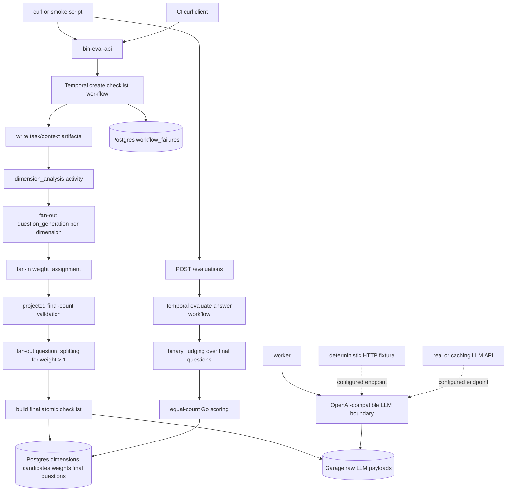

# bin-eval Rubric Decomposition and Refinement DAG Implementation Plan

## 1. Title and metadata

- Project name: bin-eval
- Version: 2.3.0-plan
- Owners: Kirill, product and engineering
- Date: 2026-07-13
- Document ID: PLAN-BIN-EVAL-RUBRIC-REFINEMENT-003
- Status: Complete. P00 through P07 are implemented and passed canonical, deterministic full-stack, real LiteLLM, and persistent local curl verification on 2026-07-13. Publication verification completes after the resulting commit is pushed and CI passes.
- Summary: This plan changes bin-eval from a single-pass weighted checklist into a rubric-driven binary evaluation pipeline. The implemented pipeline decomposes task and context into dimensions, generates candidates per dimension, assigns diagnostic split counts, and judges equal-value final questions. P06 closes verified reliability gaps through one manifest, one limit path, one terminal-failure record, retry-safe direct Temporal operations, one LLM trace boundary, one repeated-evaluation contract, and one full-stack HTTP test topology. P07 removes the remaining duplicate executable curl workflow without changing product behavior.

## 2. Design consensus and trade-offs

- Topic: Fixed question count in generation prompt
  - Verdict: AGAINST
  - Rationale: The former global prompt asked for 5 to 8 questions. The rubric fan-out makes a fixed global count less meaningful; coverage comes from dimensions and rubrics rather than a hard-coded question range.
- Topic: Comparative strong/weak framing in prompts
  - Verdict: AGAINST
  - Rationale: The former question generation prompt asked questions to distinguish a strong answer from a weak answer. The implemented prompt asks only for verifiable requirements from task, context, and rubric, avoiding subjective comparative language.
- Topic: Prompt-level JSON shape instructions
  - Verdict: AGAINST
  - Rationale: `internal/llm/client.go` sends one forced strict function tool whose parameters are the output JSON Schema. Prompt text should not duplicate schema shape examples because the schema is the binding output contract. This is the canonical transport because the machine's LiteLLM ChatGPT Responses adapter preserves forced tools but intentionally drops `text.format`; there is no prompt-level JSON fallback or provider branch.
- Topic: Current scoring-multiplier `weight` semantics
  - Verdict: AGAINST
  - Rationale: A diagnostic weight is not subjective importance. `2..4` is the number of independently judgeable obligations combined in a compound candidate and therefore the exact split count. Importance is expressed through dimension/rubric coverage and candidate generation. An already atomic requirement remains weight 1 even when it is important.
- Topic: Keep `weights` as diagnostic assignment data
  - Verdict: DECISION
  - Rationale: The response should keep weight-assignment information because it is useful for LLM/operator diagnostics. The target model keeps one public `weights` array with diagnostic semantics: `0` delete, `1` keep, `2..4` split into that many final questions. These weights are not score multipliers, and the API should not also expose a duplicate `refinements` array.
- Topic: Dimensions and rubrics before question generation
  - Verdict: DECISION
  - Rationale: The repository includes research artifact `2606.27226`, and the intended product direction is closer to rubric decomposition than one global checklist pass. A dimension/rubric step gives stable structure for fan-out question generation and better coverage.
- Topic: Shared question requirements text
  - Verdict: DECISION
  - Rationale: Initial question generation and split generation both need the same rules: binary yes/no, atomic, answer-independent, one concrete requirement, answerable from a future model answer. A shared prompt fragment in `internal/llm/prompts.go` prevents drift.
- Topic: Final scoring
  - Verdict: DECISION
  - Rationale: Final score should count satisfied final atomic questions. `satisfied_points` becomes yes count, `total_possible_points` becomes final question count, and `checklist_pass_rate` remains the ratio. This keeps deterministic Go-owned scoring while avoiding broad all-or-nothing weighted questions.
- Topic: Existing four-route API
  - Verdict: DECISION
  - Rationale: `internal/api/router.go` already exposes `POST /checklists`, `GET /checklists/{id}`, `POST /evaluations`, and `GET /evaluations/{id}`. The route surface remains stable; response bodies gain dimension, diagnostic-weight, and final-question data.
- Topic: Current local service work
  - Verdict: DECISION
  - Rationale: The existing local service commands in `Makefile`, scripts in `scripts/`, and LiteLLM contract validation remain useful. This plan changes evaluation logic, not the local runtime shell.
- Topic: One canonical implementation path
  - Verdict: DECISION
  - Rationale: The implementation should delete obsolete weighted-scoring code paths and replace them with the rubric refinement path directly. The runtime should have one current checklist model, one response shape, and one scoring path.
- Topic: Rubric refinement limits
  - Verdict: DECISION
  - Rationale: Checklist creation should use one central configurable limit set with defaults `max_dimensions=6`, `max_candidates_per_dimension=8`, `max_split_count=4`, and `max_final_questions=64`. Limit failures should produce structured diagnostics so the limits can be adjusted from evidence; `max_split_count` remains 4 because that is the diagnostic weight scale.
- Topic: Duplicate handling
  - Verdict: DECISION
  - Rationale: The MVP should not add a separate dedupe stage or exact duplicate detector. The weight assignment prompt should instruct the model to assign `weight=0` to semantically duplicate candidates.
- Topic: Model-output structural validation
  - Verdict: DECISION
  - Rationale: Earlier "semantic validation" wording should be read as deterministic Go checks over schema-parsed output and cross-object invariants. It is structure and relationship validation, not validation by meaning, not regex-based natural-language judgment, and not an extra LLM repair call.
- Topic: LLM-call fixing boundary
  - Verdict: DECISION
  - Rationale: This plan should use one existing LLM-call module boundary in `internal/llm`. It should not add prompt-specific repair loops, provider adapters, or a new repair service. If JSON repair or structured-output retries are added later, they belong inside that one client boundary.
- Topic: Canonical verification manifest
  - Verdict: DECISION
  - Rationale: `docs/test-matrix.yml` is the single machine-readable source of truth for requirement IDs, test IDs, verification groups, structured argument-vector commands, and evidence. Each test owns one command and belongs to one or more groups selected by the canonical Make targets. A typed validator rejects duplicate IDs or commands, missing requirement coverage, missing files, and focused Go test selectors that match no tests. The prose plan owns rationale and phase ordering only.
- Topic: Structured workflow failure persistence
  - Verdict: DECISION
  - Rationale: Each terminally failed checklist or evaluation gets one immutable `workflow_failures` record with a safe message, stable code, stage, final attempt metadata, diagnostics, and artifact references. Checklist and evaluation rows own lifecycle status; Garage owns per-attempt raw LLM evidence; Temporal owns retry history. This avoids copying every retry into Postgres or retaining a second `error_message` source on entity rows.
- Topic: Temporal start and terminal activity reliability
  - Verdict: DECISION
  - Rationale: Keep direct API-to-Temporal starts with stable workflow IDs. Treat already-started executions as success, resolve ambiguous start errors by workflow ID, and mark an entity failed only when non-start is definitive. Terminal store operations are idempotent for identical input and reject conflicting replays. Failure-persistence activity errors are never discarded.
- Topic: Raw LLM artifacts
  - Verdict: DECISION
  - Rationale: `internal/llm` captures the exact serialized HTTP request and response bytes read within one central size bound for every completed call, including failed structured output. Activities persist the trace before returning under attempt-aware Garage keys. Over-limit capture is explicit. Typed errors contain classification, HTTP metadata, and artifact references but no raw model content. The plan does not claim atomic evidence persistence across a worker-process crash between the external call and Garage write.
- Topic: Request-level evaluation repetitions
  - Verdict: DECISION
  - Rationale: The initial `POST /checklists` request accepts `evaluation_runs`, default 3, so repetition policy belongs to the reusable checklist rather than the smoke harness. Allowed values are odd positive integers through one configured maximum whose default is 5. Evaluation uses majority aggregation per question, run-indexed judgment persistence, and one API judgment object per question containing every run plus the derived majority. This avoids ties, fractional score semantics, duplicate canonical rows, and evidence loss.
- Topic: Self-contained CI and real LLM coverage
  - Verdict: DECISION
  - Rationale: CI has two independent gates that reuse the same Compose definition and curl runner. The deterministic gate runs on a GitHub-hosted runner for every change with a schema-conformant OpenAI-compatible fixture and proves product contracts, not model quality. The required live gate runs only on trusted `master` and release events on the repository-scoped `bin-eval-live` runner colocated with the local LiteLLM service; the job attaches that private container to the bin-eval Compose network without exposing it publicly. A deterministic success never substitutes for a live failure. When the separately developed caching LLM API is ready, CI changes only `BIN_EVAL_LLM_BASE_URL` and may move the live job back to a hosted runner; cache hit, miss, and upstream policy remain that service's responsibility, and bin-eval gains no cache-specific branch or adapter.
- Topic: One executable curl workflow
  - Verdict: DECISION
  - Rationale: `scripts/smoke_curl.sh`, invoked through TEST-008, becomes the only executable checklist-and-evaluation curl workflow. `make test-e2e`, `make test-live-curl`, and both CI modes select TEST-008 with environment configuration appropriate to their topology. `scripts/live_curl_example.sh` and TEST-009 are deleted rather than retained as a wrapper or alternate path. The Fish commands in `docs/curl.md` remain operator documentation, not a second script implementation.
- Topic: Public production deployment boundary and topology
  - Verdict: FOLLOW-ON
  - Rationale: The production topology is this computer using its existing Tailscale public ingress. TLS, authentication, secret management, rate limiting, persistence, backup, monitoring, deployment, and rollback details belong in a separate production-deployment plan and must not add branches or adapters to the completed rubric pipeline.

## 3. PRD / stakeholder and system needs

- Problem: The current service can assign high point weights to broad yes/no questions. This creates coarse all-or-nothing scoring and hides which sub-requirements were actually satisfied.
- Users: Internal engineers evaluating model answers who need reproducible, inspectable, fine-grained binary question coverage.
- Value: Rubric-guided coverage, automatic deletion of duplicate or low-value candidates, decomposition of compound candidates into independently judgeable final questions, repeated evaluation when requested, and deterministic Go-owned scoring over final binary judgments.
- Business goals: Improve evaluation accuracy and diagnosability while retaining the running local service, persistent workflow architecture, and direct curl workflow.
- Success metrics: Final checklists include dimensions, candidates, diagnostic weights, final atomic questions, and persisted repetition policy; no final question has a multiplier weight; projected final count is rejected before split fan-out when over budget; all workflow failures are structurally inspectable; retried terminal activities are idempotent; exact LLM attempt artifacts are addressable; deterministic and live CI jobs exercise the real bin-eval API; good answers score high and bad answers score low across the selected repetition count.
- Scope: Existing rubric-refinement behavior plus a canonical executable verification manifest, pre-split budget validation, immutable terminal failure persistence, idempotent Temporal boundary operations, exact bounded LLM transport capture, request-level `evaluation_runs`, full-stack CI, deterministic OpenAI-compatible LLM fixtures, a required live LLM quality job, and consolidation onto one executable curl workflow.
- Non-goals: Public API exposure, auth, UI, learned calibration, category-level score reporting, prompt-specific schema repair loops, external paper parsing, cache implementation inside bin-eval, additional model-provider routing, and public deployment within this plan. Public deployment is the next separate plan. The parallel caching LLM service is an external dependency behind the existing OpenAI-compatible endpoint; it is not implemented in this repository.
- Dependencies: Go toolchain, Temporal Go SDK, Postgres, Garage, Docker Compose, local LiteLLM Responses API at `http://127.0.0.1:4000/v1/responses`, one repository-scoped self-hosted runner labeled `bin-eval-live`, an OpenAI-compatible deterministic CI fixture, future caching LLM API service, canonical Make commands, and smoke fixtures under `fixtures/smoke/cases/`.
- Risks: Fan-out and repeated judging increase LLM calls; a request-selected repetition count can create ambiguous score semantics unless aggregation is fixed; exact response capture can increase Garage volume; live CI can be nondeterministic or unavailable; direct workflow starts have a small pre-start crash window; API response changes can break curl docs.
- Assumptions: Existing local service is on `master`; canonical Make commands are available; the trusted live runner remains online with Docker access and receives LLM credentials through repository secrets; the caching service will remain OpenAI API compatible; deterministic fixtures can implement the same schema-constrained Responses endpoint; and no CI job calls an internal bin-eval package directly instead of the HTTP API for end-to-end acceptance.

## 4. SRS / canonical requirements

### Functional requirements

- REQ-001 (func): Checklist creation analyzes `{task, context}` into dimensions and rubrics before question generation. Acceptance: a succeeded checklist has at least one persisted dimension with non-empty `name` and `rubric`.
- REQ-002 (func): Question generation runs separately for each dimension/rubric. Acceptance: generated candidate questions include a dimension ID, non-empty rationale, and non-empty question text.
- REQ-003 (func): Question generation prompts contain no fixed required question count and no comparative strong/weak wording. Acceptance: prompt tests reject those phrases in `BuildQuestionGenerationRequest`.
- REQ-004 (func): Prompt text does not instruct the model to return a literal JSON shape. Acceptance: prompt tests reject `Return only JSON shaped as` and equivalent schema examples in new prompt builders.
- REQ-005 (func): A shared question requirements prompt fragment is used by both dimension question generation and split question generation. Acceptance: tests confirm both prompt builders include the same exported fragment value.
- REQ-006 (func): Weight assignment returns one diagnostic weight object for every candidate question ID, marks semantic duplicates with `weight=0`, and assigns `2..4` only when the candidate contains that many independently judgeable obligations. Acceptance: missing, duplicate, unknown, blank-rationale, or out-of-range rows fail validation; prompt tests require duplicate removal and compositional split semantics and contain no instruction to increase weight merely because an atomic requirement is important.
- REQ-007 (func): Diagnostic weight semantics are `0` delete, `1` keep an atomic candidate, and `2..4` split a compound candidate into exactly that many independently judgeable final questions. Acceptance: final checklist construction drops `0`, keeps `1`, and replaces `2..4` with exact-length split output; importance language does not create duplicate or correlated split questions.
- REQ-008 (func): Split generation runs once per candidate with `weight > 1`. Acceptance: each split activity receives one source candidate and returns exactly the requested count of specific binary questions.
- REQ-009 (func): Final checklist questions are atomic and equal-value. Acceptance: evaluation scoring counts one point per final question and stores no point multiplier on final questions.
- REQ-010 (func): Binary judging receives only final question IDs and question text. Acceptance: judge request payload contains no candidate diagnostic weights, no candidate rationales, and no source candidate text unless it is also a final question.
- REQ-011 (func): The async API route surface remains the existing four routes. Acceptance: no new route is required for create checklist, get checklist, create evaluation, or get evaluation.
- REQ-012 (func): Curl smoke paths print dimensions, diagnostic weights, final question count, score fields, failed question IDs, and judgment count. Acceptance: `make test-e2e` and `make test-live-curl` parse those fields from succeeded responses.
- REQ-013 (func): `POST /checklists` accepts optional `evaluation_runs`, defaults it to `3`, accepts odd positive values through one configured maximum that defaults to `5`, and persists it as checklist policy. Acceptance: succeeded checklist responses return the selected value and subsequent evaluation behavior uses it.
- REQ-014 (func): The workflow computes projected final count immediately after weight assignment and before starting any split activity. Acceptance: projected count is the sum of positive diagnostic weights; a count over `max_final_questions` terminally fails with structured diagnostics and executes zero split LLM calls.

### Interface/API requirements

- REQ-020 (int): `GET /checklists/{id}` success response returns `dimensions`, `candidate_questions`, diagnostic `weights`, and final `questions`. Acceptance: each field has stable JSON names and arrays are present on succeeded checklists; `weights` uses the new diagnostic 0/1/2..4 semantics and no duplicate `refinements` field is returned.
- REQ-021 (int): `GET /evaluations/{id}` success response keeps `satisfied_points`, `total_possible_points`, `checklist_pass_rate`, `failed_question_ids`, and one `judgments` array. Acceptance: score fields reflect equal-count final questions; when repetition is enabled, each question's judgment contains all run-indexed evidence and one deterministically derived answer rather than parallel raw and canonical arrays.
- REQ-022 (int): New LLM prompt names are stable Garage artifact identifiers. Acceptance: artifact keys include `dimension_analysis`, `question_generation/<dimension_id>`, `weight_assignment`, and `question_splitting/<source_question_id>`.
- REQ-023 (int): Strict JSON schemas are the only structured-output contract. Acceptance: prompt text omits literal JSON object examples and schemas define all required output fields.
- REQ-024 (int): Failed checklist and evaluation responses project their immutable terminal `workflow_failures` record through the existing GET routes. Acceptance: failed responses include stable failure ID, safe message, error code, stage, final attempt metadata, diagnostics, and safe artifact references; they contain no raw prompt, answer, model response, or secret.
- REQ-025 (int): CI end-to-end jobs call only the real bin-eval HTTP API. Acceptance: deterministic and live jobs use the four public routes; their only product-level difference is the configured `BIN_EVAL_LLM_BASE_URL` and credentials.

### Data requirements

- REQ-030 (data): Postgres persists dimensions, candidate questions, diagnostic weights, final questions, and judgments with stable IDs. Acceptance: migrations create tables or columns that can round-trip all listed entities.
- REQ-031 (data): Final question IDs are stable and dense within a checklist. Acceptance: IDs are assigned in deterministic dimension/candidate/split order and are not generated by the LLM.
- REQ-032 (data): Candidate IDs remain stable and traceable to dimensions. Acceptance: every candidate row has a candidate ID and dimension ID.
- REQ-033 (data): Split final questions remain traceable to source candidates. Acceptance: every split final question stores `source_candidate_id`; kept questions also store their source candidate ID.
- REQ-034 (data): Diagnostic weights are not used for final scoring. Acceptance: new scoring reads final questions and judgments only; diagnostic weights do not contribute points directly.
- REQ-035 (data): Raw LLM requests and responses are stored in Garage for every prompt family. Acceptance: dimension, question generation, weight assignment, splitting, and judging payloads have deterministic artifact keys.
- REQ-036 (data): Postgres persists exactly one immutable terminal `workflow_failures` record for each failed checklist or evaluation without replacing entity lifecycle ownership. Acceptance: exactly one of `checklist_id` and `evaluation_id` is a valid foreign key; the record includes workflow ID, stage, stable error class/code, safe message, final attempt metadata, structured diagnostics, safe artifact references, and timestamp. Per-attempt raw data and retry history remain in Garage and Temporal rather than being duplicated in Postgres.
- REQ-037 (data): Garage stores the exact serialized LLM HTTP request body and exact response bytes read for every completed client call, including invalid output and provider failures with bodies. Acceptance: activities persist traces before returning; attempt-aware deterministic keys prevent retry overwrite; payloads within the central response-size bound round-trip identically; over-limit responses fail with an explicit truncation diagnostic; Postgres and Temporal errors contain artifact references rather than raw content.

### Non-functional requirements

- REQ-040 (reliability): The workflow limits fan-out to bounded counts. Acceptance: validation rejects more than the configured maximum dimensions, candidates per dimension, split count, or final questions; default limits are `max_dimensions=6`, `max_candidates_per_dimension=8`, `max_split_count=4`, and `max_final_questions=64`; limit failures record `limit_name`, `configured_limit`, `observed_count`, `checklist_id`, and workflow/prompt stage where available.
- REQ-041 (security): Prompts and logs do not include secrets. Acceptance: new tests keep secret redaction behavior and no prompt builder reads secret env vars.
- REQ-042 (nfr): The pipeline remains deterministic after LLM outputs are parsed. Acceptance: Go-owned ID assignment, final question ordering, and scoring are deterministic for fixed LLM outputs.
- REQ-043 (reliability): Invalid structured model output is classified consistently and persists failed workflow status. Acceptance: schema and deterministic invariant validation errors map to structured workflow failures; this plan adds no prompt-specific repair loops and no new repair service.
- REQ-044 (nfr): Local operator commands remain valid. Acceptance: `make status-local`, `make test-live-curl`, and documented Fish curl snippets still work after response updates.
- REQ-045 (maintainability): The implementation has one canonical rubric-refinement path and no old weighted-scoring path. Acceptance: runtime Go code has no old multiplier-weight assignment path, no duplicate `refinements` response field beside `weights`, no old response mode, no call-through layer around old weighted scoring, and no duplicated prompt requirements or final-question scoring logic.
- REQ-046 (verification): `docs/test-matrix.yml` is the canonical executable verification manifest. Acceptance: a typed validator rejects duplicate requirement or test IDs; duplicate test argument vectors; missing canonical requirement coverage; missing files; malformed entries; unknown verification groups; and focused Go selectors that match zero tests. Each test has one structured argument vector, canonical Make targets select groups, and `make verify-plan` executes selected tests without recursive invocation.
- REQ-047 (reliability): Direct API-to-Temporal starts and terminal persistence are retry-safe. Acceptance: stable workflow IDs treat already-started as accepted; ambiguous starts are resolved by workflow lookup; definitive non-start marks the row failed; identical terminal retries return success; conflicting retries return a typed conflict; failure-persistence errors are returned and tested rather than ignored.
- REQ-048 (reliability): Live evaluation defaults to three request-selected runs and reports every run plus one deterministic per-question aggregate after the aggregation contract is approved. Acceptance: CI and local curl pass `evaluation_runs` explicitly, validate the persisted policy, enforce per-run minimum/maximum quality bounds plus aggregate separation, and retain commit-addressed evidence without persisting duplicate canonical judgment rows.
- REQ-049 (reliability): Configured checklist limits have one meaning at every boundary. Acceptance: schema, LLM decoding, activity validation, workflow validation, and persistence consume the same effective limits; `max_split_count` cannot exceed the fixed diagnostic scale of 4; increasing supported dimension, candidate, or final limits does not trigger hidden default-limit rejection.
- REQ-050 (verification): CI provides independent deterministic and live full-stack gates using one topology and one curl runner. Acceptance: both start Postgres, Temporal, Garage, API, and worker; deterministic jobs use an OpenAI-compatible HTTP fixture; required trusted `master` and release jobs use the real LLM API, or the external caching API once adopted; all product assertions enter through curl against bin-eval; deterministic success cannot mask live failure; reports and exact LLM artifacts are retained as CI evidence.
- REQ-051 (maintainability): All executable curl checklist/evaluation verification uses TEST-008 and `scripts/smoke_curl.sh`. Acceptance: TEST-008 belongs to both `e2e` and `live` groups; `make test-e2e`, `make test-live-curl`, and both CI jobs invoke that manifest-owned command; persistent-local execution explicitly sets `BIN_EVAL_EXTERNAL_STACK=true`, `BIN_EVAL_LOAD_LOCAL_ENV=true`, and its evidence directory; `scripts/live_curl_example.sh` and TEST-009 do not exist; no replacement wrapper duplicates the HTTP sequence or assertions.

### Error handling and telemetry expectations

- Empty dimensions, empty candidate question lists for all dimensions, all diagnostic weights deleted, split count mismatches, and over-budget final question counts fail checklist creation with terminal failed status and structured diagnostics.
- Projected over-budget counts fail immediately after weighting and before split activity scheduling.
- Infrastructure failures retain existing bounded Temporal retry behavior.
- Structured model-output validation failures remain distinct from infrastructure failures.
- Raw LLM content is written only to Garage and is referenced by attempt artifact key from safe structured failures.
- Ambiguous workflow starts and ambiguous terminal commits resolve through stable identities and idempotent comparison rather than fallback execution paths.
- Logs include prompt name, checklist ID, evaluation ID where applicable, error class, and limit diagnostics when a configured limit is hit, but do not log raw prompts or answers.
- Smoke output includes checklist ID, evaluation ID, final question count, judgment count, score fields, failed final question IDs, per-case good/bad classification, and limit-hit counts.
- Obsolete weighted-scoring behavior is removed rather than adapted, hidden, or kept behind a mode switch; diagnostic weights remain as audit data only.

### Architecture diagram

## 5. Iterative implementation and test plan

- Phase strategy: P00 through P05 contain the implemented rubric path; P06 closes verified reliability and evidence gaps; P07 removes the remaining duplicate curl workflow and publishes the single-path result.
- Implementation policy: keep one direct path through the system. Delete obsolete weighted-scoring runtime code as the rubric refinement path lands; the final runtime should have one current data model, one response contract, and one scoring implementation.
- Verification-first controls: every P06 behavior starts with a failing canonical manifest entry. `make verify-plan` must prove that each focused Go pattern matches at least one test before running it; `[no tests to run]` is always failure.
- Standards tailoring note: This plan borrows traceability and verification ideas from requirements engineering, but it intentionally does not add certification artifacts, extra assurance processes, or parallel code paths outside the local service objective.

### Risk register

- Risk: Fan-out increases LLM cost and latency. Trigger: final question count or workflow duration exceeds thresholds. Mitigation: bounded dimension, candidate, split, and final-question limits with smoke metrics and structured limit-hit diagnostics.
- Risk: Rubric decomposition creates overlapping dimensions. Trigger: duplicate final questions or weak good/bad separation. Mitigation: weight assignment prompt marks semantic duplicates with `weight=0`; no separate dedupe stage or exact duplicate detector is added in this plan.
- Risk: API response changes break docs. Trigger: `scripts/validate_docs_curl.sh` or smoke scripts fail. Mitigation: update docs and scripts in the API phase with executable contract coverage.
- Risk: Existing local data has old weighted checklists. Trigger: migrations encounter rows without dimensions. Mitigation: local development data is reset before applying the new migration; the codebase keeps only the new canonical data model.
- Risk: Split outputs are less atomic than source questions. Trigger: split validation accepts multi-part questions. Mitigation: prompt requirements and deterministic structure/invariant validation reject invalid model output; quality eval diagnostics inspect final question granularity.
- Risk: Request-level repetition is confused with smoke repetition. Trigger: `evaluation_runs` changes only scripts or produces multiple scores without one canonical aggregation contract. Mitigation: persist policy on the checklist and block implementation until P06.S01 fixes one aggregation rule.
- Risk: Exact LLM traces leak through errors. Trigger: raw content appears in Temporal history, Postgres failures, logs, or API responses. Mitigation: Garage-only raw bytes, bounded capture, safe artifact references, and explicit leakage tests.
- Risk: Real LLM CI is nondeterministic or unavailable. Trigger: required live job fails due to provider instability rather than product behavior. Mitigation: deterministic full-stack contract job remains independently required; the live job records provider classification and uses the caching endpoint when available, without fallback inside bin-eval.
- Risk: Verification manifest duplicates plan commands. Trigger: commands drift between Markdown and YAML. Mitigation: after P06, executable details live only in `docs/test-matrix.yml`; the plan references test IDs.
- Risk: Consolidating the local curl script changes environment loading or accidentally weakens quality assertions. Trigger: persistent-local TEST-008 cannot reach the running API, or transient and CI modes execute different assertions. Mitigation: move local environment loading into the canonical runner, vary only environment configuration, and require the same TEST-008 command and assertions in every topology.

### Completed Baseline: P00 through P05

P00 through P05 are implemented and remain the required foundation for P06. They are summarized here so the active plan does not duplicate historical step commands, test ownership, or execution logs:

- P00: LLM contracts define dimension analysis, per-dimension generation, compositional diagnostic weights, and split generation.
- P01: `evalcore` builds deterministic equal-value final questions and scores binary judgments by count.
- P02: Postgres and Garage persist rubric traceability and artifacts.
- P03: Temporal executes dimension analysis, generation fan-out, weighting fan-in, split fan-out, and final persistence.
- P04: The existing four-route API, Fish curl documentation, and smoke scripts expose the rubric checklist and equal-count score.
- P05: Canonical lint, build, unit, integration, e2e, invariant, and publication gates verified the baseline.

This baseline is not an alternate path. P06 modifies it in place. Historical commands and exact test mappings live only in git history and the canonical verification manifest.

### Phase P06: Reliability Audit Corrections and Self-Contained CI Are Complete

Phase goal: Close every verified audit gap without adding a legacy path, make verification incapable of false-green focused tests, and exercise the complete service through its real HTTP boundaries in local and CI environments.

Scope and objectives, including impacted `REQ-###`: REQ-004, REQ-006, REQ-007, REQ-013, REQ-014, REQ-024, REQ-025, REQ-035 through REQ-037, and REQ-046 through REQ-050.

Impacted surfaces: `docs/test-matrix.yml`, verification tooling, prompts, limit validation, workflows, API, migrations, Postgres store, LLM client, Garage artifacts, curl scripts, Compose, and `.github/workflows/`.

Lifecycle evidence:
- Requirements evidence: the P06 requirement set and selected decisions in `ask_me/reliability-audit-corrections.md`.
- Design/code surface evidence: canonical manifest, migrations, typed failure records, idempotent terminal methods, exact LLM traces, request repetition policy, CI stack definitions.
- Verification method: TEST-008, TEST-009, and TEST-101 through TEST-107.
- Validation purpose: replace prior green-but-incomplete evidence with mechanically complete, full-stack verification.
- Configuration checkpoint: `phase-p06-reliability-complete`.
- Risks and assumptions: repeated judgment aggregation uses the selected odd-count majority contract; required live CI has credentials for a real OpenAI-compatible LLM endpoint.

Plan-and-Solve subtasks:

- `P06.S01 Resolve repeated-judgment aggregation semantics`
  - Action: Record the selected contract: allow odd run counts only through configured maximum 5 by default, default to 3, persist only run-indexed judgments, derive a majority answer per question in pure Go, score those majority answers, derive failed IDs from them, and return one judgment object per question containing all run evidence plus the majority result.
  - Why now: Request-level repetition changes scoring and data contracts and cannot be implemented as a test-only argument.
  - Requirement link: REQ-013, REQ-048.
  - Verification mode: DECIDED.
  - Expected result: one selected aggregation contract with no tie behavior, fractional score, evidence-selection rule, duplicate canonical rows, or alternate runtime mode.
  - Stop/escalate condition: Stop if implementation introduces even-count ties, duplicate canonical rows, or an alternate aggregation mode.
  - Unlocks: P06.S12
- `P06.S02 Add failing verification-manifest coverage`
  - Action: Add validator tests for duplicate IDs and test argument vectors, missing requirement coverage, malformed YAML, missing files, unknown groups, recursive targets, and focused Go selectors matching zero tests.
  - Requirement link: REQ-046.
  - Verification link: TEST-101.
  - Verification mode: RED.
  - Command/procedure: `make verify-plan TEST=TEST-101`; add this stable target first and keep it as the only entrypoint while its implementation moves from RED to GREEN.
  - Expected result: Non-zero against the current mismatched manifest and validator.
  - Unlocks: P06.S03
- `P06.S03 Replace traceability with one typed executable manifest`
  - Action: Make `docs/test-matrix.yml` match the current plan, remove obsolete source tags and command duplication, give each test one structured argument vector and one or more verification groups, add a typed parser/executor, make canonical Make targets select groups, prove focused Go test discovery before execution, and add one non-recursive `make verify-plan` target.
  - Requirement link: REQ-046.
  - Verification link: TEST-101.
  - Verification mode: GREEN.
  - Expected result: TEST-101 passes and every manifest command executes intended tests.
  - Unlocks: P06.S04
- `P06.S04 Add failing compositional-weight and limit-consistency coverage`
  - Action: Cover semantic-only prompts, absence of response-shape prose, no importance-based splitting, fixed `max_split_count <= 4`, configured-limit propagation, and projected final-count rejection before any split activity.
  - Requirement link: REQ-004, REQ-006, REQ-007, REQ-014, REQ-049.
  - Verification link: TEST-102.
  - Verification mode: RED.
  - Command/procedure: `make verify-plan TEST=TEST-102`.
  - Expected result: Non-zero against current prompt ambiguity, hidden default limits, and late budget validation.
  - Unlocks: P06.S05
- `P06.S05 Implement one compositional-weight and effective-limit path`
  - Action: Simplify prompts to semantics only, remove default-limit validation from limit-unaware decoded output types, pass effective limits through all validators and persistence boundaries, fix split scale at 4, and validate projected count before split fan-out.
  - Requirement link: REQ-004, REQ-006, REQ-007, REQ-014, REQ-049.
  - Verification link: TEST-102.
  - Verification mode: GREEN.
  - Expected result: TEST-102 passes and over-budget workflows schedule no split calls.
  - Unlocks: P06.S06
- `P06.S06 Add failing terminal workflow-failure coverage`
  - Action: Add migration/store/API/workflow tests for one immutable terminal failure per failed entity, exactly-one-entity foreign-key integrity, final attempt metadata, stable diagnostics, safe artifact references, and raw-content exclusion.
  - Requirement link: REQ-024, REQ-036.
  - Verification link: TEST-103.
  - Verification mode: RED.
  - Command/procedure: `make verify-plan TEST=TEST-103`.
  - Expected result: Non-zero because current failures are flattened to `error_message`.
  - Unlocks: P06.S07
- `P06.S07 Implement terminal workflow failure persistence`
  - Action: Add the `workflow_failures` migration and store methods, atomically insert one terminal failure while marking its entity failed, preserve typed application-error details across Temporal boundaries, and project that record in existing GET responses. Remove entity `error_message` ownership; do not copy retry events already owned by Temporal or raw attempts owned by Garage.
  - Requirement link: REQ-024, REQ-036.
  - Verification link: TEST-103.
  - Verification mode: GREEN.
  - Expected result: TEST-103 passes with exact structured diagnostics and no raw payload leakage.
  - Unlocks: P06.S08
- `P06.S08 Add failing Temporal idempotency and start-resolution coverage`
  - Action: Simulate already-started workflows, ambiguous starts, committed terminal writes followed by response loss, identical retries, conflicting retries, and failure-persistence activity failures.
  - Requirement link: REQ-047.
  - Verification link: TEST-104.
  - Verification mode: RED.
  - Command/procedure: `make verify-plan TEST=TEST-104`.
  - Expected result: Non-zero against current orphan and ambiguous-commit behavior.
  - Unlocks: P06.S09
- `P06.S09 Implement retry-safe direct Temporal boundaries`
  - Action: Resolve starts by stable workflow ID, mark definitive non-start failures, make all terminal store methods compare-and-return idempotently, surface conflicts, and return failure-persistence errors.
  - Requirement link: REQ-047.
  - Verification link: TEST-104.
  - Verification mode: GREEN.
  - Expected result: TEST-104 passes without adding an outbox, fallback workflow, or reconciliation service.
  - Unlocks: P06.S10
- `P06.S10 Add failing exact LLM transport-artifact coverage`
  - Action: Cover byte-identical request/response traces for success, invalid structured output, HTTP errors with bodies, streamed errors, multiple attempts, response-size overflow, safe error strings, and deterministic attempt keys.
  - Requirement link: REQ-035, REQ-037.
  - Verification link: TEST-105.
  - Verification mode: RED.
  - Command/procedure: `make verify-plan TEST=TEST-105`.
  - Expected result: Non-zero because current artifacts are reconstructed and retries overwrite prompt keys.
  - Unlocks: P06.S11
- `P06.S11 Implement exact attempt-aware LLM tracing`
  - Action: Return one trace type from `LLMClient.GenerateJSON`, capture the exact serialized body and exact response bytes within one central size bound, mark over-limit capture explicitly, persist each completed call in Garage under the Temporal attempt number before the activity returns, and replace raw-content errors with safe artifact references. Do not capture authorization headers.
  - Requirement link: REQ-035, REQ-037.
  - Verification link: TEST-105.
  - Verification mode: GREEN.
  - Expected result: TEST-105 passes and no raw output enters Temporal or Postgres errors.
  - Unlocks: P06.S12
- `P06.S12 Add failing request-level repetition coverage`
  - Action: After P06.S01, cover omitted/default/valid/invalid and even `evaluation_runs`, run-indexed persistence, repeated judge calls, majority aggregation, all-run diagnostics, score recomputation, and curl behavior.
  - Requirement link: REQ-013, REQ-048.
  - Verification link: TEST-106.
  - Verification mode: RED.
  - Command/procedure: `make verify-plan TEST=TEST-106`.
  - Expected result: Non-zero because the request and data contracts do not yet contain repetition policy.
  - Unlocks: P06.S13
- `P06.S13 Implement the selected repeated-evaluation contract`
  - Action: Add and persist `evaluation_runs`, execute that many independent judge calls, persist each judgment once with `run_index`, derive per-question majority and score through one pure function, expose all evidence and the derived answer in one `judgments` array, and update Fish curl examples.
  - Requirement link: REQ-013, REQ-048.
  - Verification link: TEST-106, TEST-008.
  - Verification mode: GREEN and MEASURE.
  - Expected result: default three-run and caller-selected behavior are deterministic after LLM outputs and visible through existing routes.
  - Unlocks: P06.S14
- `P06.S14 Add failing self-contained CI contract coverage`
  - Action: Validate that CI starts one full-stack Compose topology, deterministic and live jobs both call bin-eval over HTTP, the mock implements only the existing OpenAI-compatible boundary, the live job requires an LLM endpoint, and no bin-eval cache branch exists.
  - Requirement link: REQ-025, REQ-050.
  - Verification link: TEST-107.
  - Verification mode: RED.
  - Command/procedure: `make verify-plan TEST=TEST-107`.
  - Expected result: Non-zero because CI configuration is absent.
  - Unlocks: P06.S15
- `P06.S15 Implement deterministic and live full-stack CI jobs`
  - Action: Add CI that runs canonical static/unit/race/integration gates and reuses one Compose definition and curl e2e runner. The GitHub-hosted deterministic job runs for every change with `BIN_EVAL_LLM_BASE_URL` set to the fixture. The separately required trusted `master` and release job runs on the repository-scoped local runner, privately attaches the existing LiteLLM container to the Compose network, sets the same variable to that endpoint or later to the caching API, and fails independently on credentials, reachability, or quality. Upload commit-addressed reports and artifacts and stop only the live app containers after the job.
  - Requirement link: REQ-025, REQ-050.
  - Verification link: TEST-107, TEST-008.
  - Verification mode: GREEN and MEASURE.
  - Expected result: deterministic and live jobs use the same bin-eval binaries and HTTP routes; only the configured external LLM endpoint differs.
  - Unlocks: P06.S16
- `P06.S16 Execute final canonical verification and publish`
  - Action: Run `make verify-plan`, lint, build, unit, race, integration, deterministic TEST-008, live TEST-008, local TEST-009, and diff checks; retain evidence, clean transient binaries/logs, commit, and push only the verified state.
  - Requirement link: all P06 requirements.
  - Verification link: TEST-008, TEST-009, and TEST-101 through TEST-107.
  - Verification mode: FINAL.
  - Expected result: every manifest test executes at least one intended test, every gate is green, and branch publication matches the verified commit.
  - Stop/escalate condition: Stop on any false-green, unclassified failure, live threshold miss, or unresolved aggregation contract.
  - Unlocks: P06 completion

Exit gates:
- Proceed: TEST-008, TEST-009, and TEST-101 through TEST-107 pass through the canonical manifest, CI evidence is retained, and the verified commit is published.
- Escalate: real/caching LLM API credentials, reachability, or aggregation semantics are unavailable.
- Stop: any path bypasses bin-eval's HTTP API, introduces cache/provider branching inside bin-eval, or reports success with zero matching tests.

### Phase P07: Consolidate Curl Verification and Publish Is Complete

Phase goal: Remove the last duplicated executable HTTP workflow while preserving the documented Fish sequence, transient local verification, persistent local verification, and both CI endpoint classes.

Scope and objectives, including impacted `REQ-###`: REQ-012, REQ-025, REQ-044, REQ-046, REQ-048, REQ-050, and REQ-051.

Impacted surfaces: `scripts/smoke_curl.sh`, `scripts/live_curl_example.sh`, `scripts/run_e2e.sh`, `scripts/lib/local_env.sh`, `docs/curl.md`, `docs/test-matrix.yml`, `Makefile`, `.github/workflows/ci.yml`, `internal/verification/manifest_test.go`, and `internal/config/config_test.go` for inherited-environment isolation discovered by the aggregate release gate.

Plan-and-Solve subtasks:

- `P07.S01 Add failing single-curl-runner coverage`
  - Action: Add TEST-108 to verify that TEST-008 is the only manifest entry owning the curl workflow, belongs to both `e2e` and `live`, is selected by both Make targets and both CI jobs, supports the persistent local environment, and has no `scripts/live_curl_example.sh` replacement or duplicate HTTP sequence.
  - Requirement link: REQ-046, REQ-050, REQ-051.
  - Verification link: TEST-108.
  - Verification mode: RED.
  - Expected result: Non-zero while TEST-009 and `scripts/live_curl_example.sh` remain.
  - Unlocks: P07.S02
- `P07.S02 Implement one executable curl workflow`
  - Action: Move persistent-local environment loading needed by the canonical TEST-008 runner into `scripts/run_e2e.sh`; make TEST-008 a member of both `e2e` and `live`; make `make test-live-curl` select TEST-008 with explicit external-stack, local-environment, and evidence-directory configuration; update both CI jobs to invoke the manifest-owned e2e target; remove TEST-009 and delete `scripts/live_curl_example.sh`; update documentation validation without adding a wrapper, mode-specific assertion set, or second quality implementation.
  - Requirement link: REQ-012, REQ-025, REQ-044, REQ-048, REQ-050, REQ-051.
  - Verification link: TEST-008, TEST-108.
  - Verification mode: GREEN.
  - Expected result: Every topology executes the same API sequence, invariants, quality thresholds, and artifact capture through TEST-008; only endpoint and stack ownership configuration differ.
  - Unlocks: P07.S03
- `P07.S03 Run canonical and live verification`
  - Action: Run TEST-108, lint, build, unit, race, integration, the deterministic full-stack TEST-008 path, persistent-local `make test-live-curl` against the served LiteLLM stack, and diff/cleanup checks.
  - Requirement link: all P07 requirements.
  - Verification link: TEST-008, TEST-101 through TEST-108.
  - Verification mode: FINAL.
  - Expected result: All gates pass, TEST-008 retains the established quality thresholds and exact artifact checks, and no transient binaries or logs remain as tracked files.
  - Stop/escalate condition: Stop on a changed quality threshold, skipped real-LLM run, endpoint-specific assertion branch, duplicate runner, or unclassified failure.
  - Unlocks: P07.S04
- `P07.S04 Publish and verify publication`
  - Action: Commit the plan correction and curl consolidation, push `master`, wait for deterministic and required live CI to pass on the pushed SHA, then run TEST-011 against the clean published worktree.
  - Requirement link: REQ-044, REQ-050, REQ-051.
  - Verification link: TEST-011.
  - Verification mode: PUBLISH.
  - Expected result: `master` equals `origin/master`, the worktree is clean, and both CI evidence sets identify the published commit.
  - Unlocks: Plan completion and the separate public-production-deployment plan

Exit gates:
- Proceed: TEST-008 and TEST-101 through TEST-108 pass, deterministic and live CI pass for the published SHA, TEST-011 confirms publication, and no duplicate executable curl workflow remains.
- Escalate: the persistent local stack or trusted live runner cannot reach the configured real LiteLLM endpoint.
- Stop: any implementation retains TEST-009, `scripts/live_curl_example.sh`, a wrapper that repeats the workflow, or topology-specific product assertions.

## 6. Evaluation acceptance

TEST-008 is the only executable curl workflow and the only active model-quality gate. Transient local, persistent local, deterministic CI, and live CI modes use the committed smoke fixtures and the same runner against the full stack. The documented Fish sequence remains a manually executable API example, not another test implementation.

- Deterministic mode proves full-stack API, workflow, persistence, artifact, and score invariants against the OpenAI-compatible fixture.
- Live mode uses the request-selected run count and requires every good-answer run to score at least 0.70, every bad-answer run to score at most 0.60, aggregate good and bad scores of at least 0.80 and at most 0.50, and an aggregate gap of at least 0.30.
- Every successful smoke checklist has at least eight final questions, every run covers every final question ID, and exact request/response artifacts are captured. TEST-102 verifies projected-limit rejection before split fan-out; TEST-103 verifies structured terminal-failure diagnostics. Successful smoke cases require zero limit hits rather than failure diagnostics.
- Evidence records fixture version, commit SHA, configured endpoint class, per-run results, aggregate results, and artifact references without secrets.
- Run counts are odd positive values through the configured maximum. The request default is 3, the configured maximum defaults to 5, and majority is derived per final question.

## 7. Tests

### 7.1 Test inventory

- Unit: prompt contracts, domain invariants, activity boundaries, workflows, API handlers, and manifest tooling.
- Integration: migrations, Postgres stores, Garage artifacts, and Compose service contracts.
- End-to-end: the four HTTP routes through the complete stack with deterministic and live OpenAI-compatible endpoints.
- Static: formatting, vet, docs, scripts, runtime configuration, and CI topology.
- Release: all deterministic gates plus persistent-local and CI-live executions of TEST-008 and publication-state verification.

### 7.2 Command ownership

`docs/test-matrix.yml` gives every test one structured argument vector, verification groups, runtime budget, files, requirement links, and evidence. `Makefile` exposes the repository-level operator targets required by `AGENTS.md`; each target calls the same manifest runner with a group selector. Manifest commands invoke tools and scripts directly, never a selecting Make target, so execution cannot recurse. After P07, both `e2e` and `live` select TEST-008; the live Make target supplies only persistent-stack environment configuration. This plan references only the stable `make verify-plan` entrypoint and test IDs; it does not duplicate underlying test commands.

### 7.3 Manual checks, optional

No CHECK items are required for this implementation plan.

## 8. Data contract

Implemented schema after P06:

- `checklists(id, status, evaluation_runs, task_artifact_key, context_artifact_key, created_at, completed_at)`
- `checklist_dimensions(checklist_id, id, ordinal, name, rubric, rationale)`
- `candidate_questions(checklist_id, id, dimension_id, ordinal, rationale, question)`
- `question_weights(checklist_id, candidate_question_id, rationale, weight)`
- `questions(checklist_id, id, ordinal, dimension_id, source_candidate_id, rationale, question)`
- `evaluations(id, checklist_id, status, answer_artifact_key, satisfied_points, total_possible_points, checklist_pass_rate, failed_question_ids, created_at, completed_at)`
- `judgments(evaluation_id, run_index, checklist_id, question_id, evidence, answer)`
- `workflow_failures(id, checklist_id, evaluation_id, workflow_id, stage, error_class, error_code, message, retryable, attempt_count, diagnostics, artifact_references, created_at)`

`workflow_failures` has a check constraint requiring exactly one entity foreign key and partial unique constraints allowing one terminal failure per entity. Failure insertion and the entity's transition to `failed` occur in one transaction. The implemented judgment representation stores each model result once; majority answers, failed IDs, and scores are derived without canonical duplicate rows.

Invariants:

- Every succeeded checklist has at least one dimension.
- Every candidate question references one dimension.
- Every candidate question has exactly one diagnostic weight.
- `weight` is an integer from 0 to 4.
- Weight 0 candidates do not appear in final questions.
- Weight 1 candidates appear as exactly one final question.
- Weights 2..4 candidates appear as exactly that many final questions.
- Projected final count equals the sum of positive diagnostic weights and is validated before split activities.
- Every final question references one source candidate and one dimension.
- Every succeeded evaluation has exactly `evaluation_runs` judgments per final question, one for each dense `run_index`.
- The approved aggregation function produces exactly one answer per final question; score and failed IDs are recomputable from those derived answers without diagnostic weights.
- Default checklist limits are `max_dimensions=6`, `max_candidates_per_dimension=8`, `max_split_count=4`, and `max_final_questions=64`.
- Checklist limits are loaded through one config path and included in diagnostics when a limit is hit.
- `max_split_count` is fixed at or below 4 across config, schema, Go validation, and Postgres constraints.
- Each failed entity has one immutable `workflow_failures` row; entity tables do not duplicate its message or details.
- Terminal store operations are idempotent for identical input and conflicting for different input.
- Exact LLM request bodies and response bytes within the central size bound use attempt-aware Garage keys and cannot be overwritten by retries; over-limit capture is explicit.

Privacy/data quality constraints:

- Raw task, context, model answer, and LLM payloads remain in Garage, not Postgres or Temporal error text. Exact request capture excludes authorization headers and other secrets; safe transport metadata may be stored structurally.
- Secrets load from environment variables only.
- Logs and smoke output do not print secret environment values.
- Operator-provided task/context/model answer may contain sensitive data and should be treated as local-only.

## 9. Reproducibility

- Seeds: committed fixtures under `fixtures/smoke/cases/incident_response` and `fixtures/smoke/cases/release_notes`.
- Hardware assumptions: local shaman host with Docker Engine, systemd/user services, and Go toolchain; hosted CI with Docker Compose capacity sufficient for Postgres, Temporal, Garage, API, worker, and deterministic LLM fixture.
- OS/driver/container tag: Ubuntu-like Linux, Docker Compose v2, `postgres:16.4`, `temporalio/auto-setup:1.28.4`, `dxflrs/garage:v2.3.0`, existing LiteLLM image from `/home/kirill/p/litellm-chatgpt`.
- Relevant environment variables: existing bin-eval variables plus `BIN_EVAL_MAX_EVALUATION_RUNS`; CI sets the existing `BIN_EVAL_LLM_BASE_URL`, `BIN_EVAL_LLM_API_KEY`, and `BIN_EVAL_MODEL_PROFILE` for deterministic, direct-real, or cached-real endpoints without adding provider-specific bin-eval configuration.
- Request reproducibility: every checklist creation response records explicit `evaluation_runs` and effective checklist limits; CI evidence records model profile, git SHA, and exact attempt artifact keys.
- CI reproducibility: deterministic jobs retain fixture version and full-stack report; live jobs retain endpoint class (`real` or `cache`), provider request IDs where available, per-run metrics, commit SHA, and no secret values.
- Curl reproducibility: TEST-008 owns one command and one assertion set; transient, persistent-local, deterministic CI, and live CI execution differ only through environment configuration and external endpoint ownership.

## 10. Requirements Traceability Matrix

The executable matrix lives only in `docs/test-matrix.yml`. P07 removes TEST-009, assigns TEST-008 to both curl verification groups, and adds TEST-108 for the single-runner contract. The typed manifest validator enforces complete coverage of canonical requirements; unique requirement and test IDs; unique test argument vectors; known groups; existing test paths; non-recursive execution; nonzero focused-test discovery; and evidence ownership. This plan intentionally does not duplicate executable rows or commands.

## 11. Completion record

- P00 through P07 are complete on `master`; TEST-011 establishes publication after the completion commit is pushed.
- Executable requirement and test ownership lives only in `docs/test-matrix.yml`.
- Commit-addressed deterministic and live reports are retained by CI; local ignored evidence is written under `debug/`.
- TEST-011 verifies the clean published commit after push because publication cannot be established by a pre-push test.
- Detailed implementation history and deviations remain in git history rather than a second hand-maintained execution ledger.

## 12. Follow-on production deployment

After P07, create a separate public-production-deployment plan for this computer and its existing Tailscale public ingress. It must inventory the active Tailscale exposure, define the public hostname and route, and specify TLS, authentication, authorization scope, secret delivery, ingress and rate limits, persistent Postgres/Garage/Temporal operation, backups, monitoring, deployment verification, and rollback. It must expose the existing four-route API without changing the rubric DAG, scoring contract, LLM boundary, or local development path.
