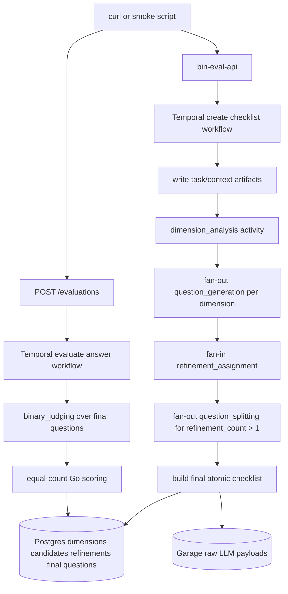

# bin-eval Rubric Decomposition and Refinement DAG Implementation Plan

## 1. Title and metadata

- Project name: bin-eval
- Version: 2.0.0-plan
- Owners: Kirill, product and engineering
- Date: 2026-07-11
- Document ID: PLAN-BIN-EVAL-RUBRIC-REFINEMENT-003
- Summary: This plan changes bin-eval from a single-pass weighted checklist into a rubric-driven, multi-step binary evaluation pipeline. The current implementation generates candidate questions, assigns integer weights, and scores weighted yes/no answers. The target pipeline first decomposes the task and context into dimensions and rubrics, generates candidate binary questions per dimension, assigns a refinement count where `0` deletes a candidate, `1` keeps it, and `2..4` means the candidate must be split into that many more specific questions, then judges final atomic questions with equal point value. The plan preserves the existing local Go service, Temporal, Postgres, Garage, LiteLLM Responses API, and four-route HTTP API shape while replacing the checklist creation internals and scoring semantics.

## 2. Design consensus and trade-offs

- Topic: Fixed question count in generation prompt
  - Verdict: AGAINST
  - Rationale: `internal/llm/prompts.go` currently asks for 5 to 8 questions in one global pass. The new rubric fan-out makes a fixed global count less meaningful; coverage comes from dimensions and rubrics rather than a hard-coded question range.
- Topic: Comparative strong/weak framing in prompts
  - Verdict: AGAINST
  - Rationale: The current question generation prompt says questions should distinguish a strong answer from a weak answer. The target prompt should ask only for verifiable requirements from task, context, and rubric. This avoids subjective comparative language.
- Topic: Prompt-level JSON shape instructions
  - Verdict: AGAINST
  - Rationale: `internal/llm/client.go` already sends `text.format` with a strict JSON schema through the Responses API. Prompt text should not duplicate schema shape examples because the schema is the binding output contract.
- Topic: Current `weight` semantics
  - Verdict: AGAINST
  - Rationale: `internal/evalcore/score.go` currently treats weights as point multipliers. A `4` is one broad binary question worth four points, which conflicts with binary decomposition. The target design treats `2..4` as a refinement count that produces more final atomic questions before scoring.
- Topic: Rename `weight` to refinement count
  - Verdict: DECISION
  - Rationale: The field name `weight` causes ambiguous reasoning. The target model uses `refinement_count`: `0` delete, `1` keep, `2..4` split into that many final questions. The API and persistence layer should expose `refinements`, not `weights`, for new checklists.
- Topic: Dimensions and rubrics before question generation
  - Verdict: DECISION
  - Rationale: The repository includes research artifact `2606.27226`, and the intended product direction is closer to rubric decomposition than one global checklist pass. A dimension/rubric step gives stable structure for fan-out question generation and better coverage.
- Topic: Shared question requirements text
  - Verdict: DECISION
  - Rationale: Initial question generation and split generation both need the same rules: binary yes/no, atomic, answer-independent, one concrete requirement, answerable from a future model answer. A shared prompt fragment in `internal/llm/prompts.go` prevents drift.
- Topic: Final scoring
  - Verdict: DECISION
  - Rationale: Final score should count satisfied final atomic questions. `satisfied_points` becomes yes count, `total_possible_points` becomes final question count, and `checklist_pass_rate` remains the ratio. This keeps deterministic Go-owned scoring while avoiding broad all-or-nothing weighted questions.
- Topic: Existing four-route API
  - Verdict: DECISION
  - Rationale: `internal/api/router.go` already exposes `POST /checklists`, `GET /checklists/{id}`, `POST /evaluations`, and `GET /evaluations/{id}`. The route surface remains stable; response bodies gain rubric/refinement/final-question data.
- Topic: Current local service work
  - Verdict: DECISION
  - Rationale: The existing local service commands in `Makefile`, scripts in `scripts/`, and LiteLLM contract validation remain useful. This plan changes evaluation logic, not the local runtime shell.

## 3. PRD / stakeholder and system needs

- Problem: The current service can assign high point weights to broad yes/no questions. This creates coarse all-or-nothing scoring and hides which sub-requirements were actually satisfied.
- Users: Internal engineers evaluating model answers who need reproducible, inspectable, fine-grained binary question coverage.
- Value: Rubric-guided coverage, automatic deletion of weak candidates, explicit splitting of broad or important candidates into atomic final questions, and simple equal-count scoring over final yes/no judgments.
- Business goals: Improve evaluation accuracy and diagnosability while retaining the running local service, persistent workflow architecture, and direct curl workflow.
- Success metrics: Final checklists include dimensions, candidate questions, refinements, and final atomic questions; no final checklist question has a multiplier weight; good smoke answers score high, bad smoke answers score low; `make test-e2e` and `make test-live-curl` return succeeded evaluations with final-question counts and judgment coverage.
- Scope: LLM schemas and prompts for dimension analysis, per-dimension question generation, refinement assignment, and split generation; evalcore final checklist construction and equal scoring; Temporal DAG fan-out/fan-in workflow; Postgres migration and store updates; API response contract updates; Garage artifact key additions; docs and smoke script updates.
- Non-goals: Public API exposure, auth, UI, learned calibration, multi-judge voting, category-level score reporting, provider fallback, schema repair prompts, external paper parsing, and public deployment.
- Dependencies: Go toolchain, Temporal Go SDK, Postgres, Garage, Docker Compose, local LiteLLM Responses API at `http://127.0.0.1:4000/v1/responses`, existing Makefile commands, and existing smoke fixtures under `fixtures/smoke/cases/`.
- Risks: Fan-out can increase LLM calls; dimension count and split count can create too many final questions; prompt changes can lower smoke separation; migrations can break existing local data; API response changes can break curl docs.
- Assumptions: Existing local service is on `master`; `make lint`, `make build`, `make test`, `make test-integration`, `make test-e2e`, and `make test-live-curl` are available; current code stores candidates in `questions` and weights in `weights`; new implementation can add migrations without preserving production data beyond best-effort compatibility for current local rows.

## 4. SRS / canonical requirements

### Functional requirements

- REQ-001 (func): Checklist creation analyzes `{task, context}` into dimensions and rubrics before question generation. Acceptance: a succeeded checklist has at least one persisted dimension with non-empty `name` and `rubric`.
- REQ-002 (func): Question generation runs separately for each dimension/rubric. Acceptance: generated candidate questions include a dimension ID, non-empty rationale, and non-empty question text.
- REQ-003 (func): Question generation prompts contain no fixed required question count and no comparative strong/weak wording. Acceptance: prompt tests reject those phrases in `BuildQuestionGenerationRequest`.
- REQ-004 (func): Prompt text does not instruct the model to return a literal JSON shape. Acceptance: prompt tests reject `Return only JSON shaped as` and equivalent schema examples in new prompt builders.
- REQ-005 (func): A shared question requirements prompt fragment is used by both dimension question generation and split question generation. Acceptance: tests confirm both prompt builders include the same exported fragment value.
- REQ-006 (func): Refinement assignment returns one refinement object for every candidate question ID. Acceptance: missing, duplicate, unknown, blank-rationale, or out-of-range refinement rows fail validation.
- REQ-007 (func): Refinement count semantics are `0` delete, `1` keep, and `2..4` split into that many final questions. Acceptance: final checklist construction drops `0`, keeps `1`, and replaces `2..4` with split outputs of exact requested length.
- REQ-008 (func): Split generation runs once per candidate with `refinement_count > 1`. Acceptance: each split activity receives one source candidate and returns exactly the requested count of specific binary questions.
- REQ-009 (func): Final checklist questions are atomic and equal-value. Acceptance: evaluation scoring counts one point per final question and stores no point multiplier on final questions.
- REQ-010 (func): Binary judging receives only final question IDs and question text. Acceptance: judge request payload contains no candidate refinement counts, no candidate rationales, and no source candidate text unless it is also a final question.
- REQ-011 (func): The async API route surface remains the existing four routes. Acceptance: no new route is required for create checklist, get checklist, create evaluation, or get evaluation.
- REQ-012 (func): Curl smoke paths print dimensions, final question count, score fields, failed question IDs, and judgment count. Acceptance: `make test-e2e` and `make test-live-curl` parse those fields from succeeded responses.

### Interface/API requirements

- REQ-020 (int): `GET /checklists/{id}` success response returns `dimensions`, `candidate_questions`, `refinements`, and final `questions`. Acceptance: each field has stable JSON names and arrays are present on succeeded checklists.
- REQ-021 (int): `GET /evaluations/{id}` success response keeps `satisfied_points`, `total_possible_points`, `checklist_pass_rate`, `failed_question_ids`, and `judgments`. Acceptance: score fields reflect equal-count final questions.
- REQ-022 (int): New LLM prompt names are stable Garage artifact identifiers. Acceptance: artifact keys include `dimension_analysis`, `question_generation/<dimension_id>`, `refinement_assignment`, and `question_splitting/<source_question_id>`.
- REQ-023 (int): Strict JSON schemas are the only structured-output contract. Acceptance: prompt text omits literal JSON object examples and schemas define all required output fields.

### Data requirements

- REQ-030 (data): Postgres persists dimensions, candidate questions, refinements, final questions, and judgments with stable IDs. Acceptance: migrations create tables or columns that can round-trip all listed entities.
- REQ-031 (data): Final question IDs are stable and dense within a checklist. Acceptance: IDs are assigned in deterministic dimension/candidate/split order and are not generated by the LLM.
- REQ-032 (data): Candidate IDs remain stable and traceable to dimensions. Acceptance: every candidate row has a candidate ID and dimension ID.
- REQ-033 (data): Split final questions remain traceable to source candidates. Acceptance: every split final question stores `source_candidate_id`; kept questions also store their source candidate ID.
- REQ-034 (data): Old `weights` semantics are not used for final scoring. Acceptance: new scoring reads final questions and judgments only; refinement counts do not contribute points directly.
- REQ-035 (data): Raw LLM requests and responses are stored in Garage for every prompt family. Acceptance: dimension, question generation, refinement assignment, splitting, and judging payloads have deterministic artifact keys.

### Non-functional requirements

- REQ-040 (reliability): The workflow limits fan-out to bounded counts. Acceptance: validation rejects more than the configured maximum dimensions, candidates per dimension, split count, or final questions.
- REQ-041 (security): Prompts and logs do not include secrets. Acceptance: new tests keep secret redaction behavior and no prompt builder reads secret env vars.
- REQ-042 (nfr): The pipeline remains deterministic after LLM outputs are parsed. Acceptance: Go-owned ID assignment, final question ordering, and scoring are deterministic for fixed LLM outputs.
- REQ-043 (reliability): Invalid model output is non-retryable and persists failed workflow status. Acceptance: schema and semantic validation errors map to existing non-retryable Temporal errors.
- REQ-044 (nfr): Local operator commands remain valid. Acceptance: `make status-local`, `make test-live-curl`, and documented Fish curl snippets still work after response updates.

### Error handling and telemetry expectations

- Empty dimensions, empty candidate question lists for all dimensions, all refinements deleted, split count mismatches, and over-budget final question counts fail checklist creation with terminal failed status.
- Infrastructure failures retain existing bounded Temporal retry behavior.
- Semantic model-output failures remain non-retryable.
- Logs include prompt name, checklist ID, evaluation ID where applicable, and error class, but do not log raw prompts or answers.
- Smoke output includes final question count, judgment count, score fields, and failed final question IDs.

### Architecture diagram



C4-style ASCII representation:

```text
[Person: Operator]
  -> [bin-eval HTTP API: existing four async routes]
  -> [Temporal Workflows]

[CreateChecklistWorkflow]
  -> [DimensionAnalysis Activity]
  -> [QuestionGeneration Activities: one per dimension]
  -> [RefinementAssignment Activity: all candidates]
  -> [QuestionSplitting Activities: one per candidate with count > 1]
  -> [SucceedChecklist Activity]

[EvaluateAnswerWorkflow]
  -> [LoadChecklist Activity]
  -> [BinaryJudging Activity over final questions]
  -> [ScoreChecklist: equal-count scoring]
  -> [SucceedEvaluation Activity]

[Persistence]
  -> [Postgres: dimensions, candidate questions, refinements, final questions, evaluations, judgments]
  -> [Garage: raw task/context/answer and all LLM request/response payloads]
```

## 5. Iterative implementation and test plan

- Phase strategy: introduce new schemas and prompt contracts first, then domain construction/scoring, persistence, workflow activities, API/docs, and full smoke acceptance.
- Verification-first controls: every behavior-changing phase starts with failing coverage tagged by `TEST-###`; matching implementation subtasks use the same command.
- Compute controls: `branch_limits = 2`, `reflection_passes = 1`, `early_stop% = 30`.
- Standards tailoring note: This plan is standards-informed and does not claim ISO/IEEE/FAA compliance. For safety-critical use, add development assurance level assumptions, independence expectations, review and analysis evidence, structural coverage expectations, tool qualification assumptions, and certification data outputs before treating the plan as safety-critical.

### Risk register

- Risk: Fan-out increases LLM cost and latency. Trigger: final question count or workflow duration exceeds thresholds. Mitigation: bounded dimension, candidate, split, and final-question limits with smoke metrics.
- Risk: Rubric decomposition creates overlapping dimensions. Trigger: duplicate final questions or weak good/bad separation. Mitigation: refinement assignment can delete duplicates, and follow-up dedupe can be added after metrics.
- Risk: API response changes break docs. Trigger: `scripts/validate_docs_curl.sh` or smoke scripts fail. Mitigation: update docs and scripts in the API phase with executable contract coverage.
- Risk: Existing local data has old weighted checklists. Trigger: migrations encounter rows without dimensions. Mitigation: migration can create compatibility rows or local operators can reset dev data; integration tests document selected behavior.
- Risk: Split outputs are less atomic than source questions. Trigger: split validation accepts multi-part questions. Mitigation: prompt requirements and semantic validation reject blank output; later quality evals inspect final question granularity.

### Suspension/resumption criteria

- Suspend when LiteLLM is unavailable, Temporal tests become nondeterministic, Postgres migration compatibility cannot be decided, or the final API response contract needs an owner decision.
- Resume by recording the decision in the plan or ADR index, then continue from the last phase with all phase tests passing.

### Phase P00: LLM Contracts Express Rubrics and Refinement Counts

Phase goal: The LLM package exposes rubric decomposition, per-dimension question generation, refinement assignment, and split-generation prompt/schema contracts without wiring them into workflows.

Scope and objectives, including impacted `REQ-###`: REQ-001, REQ-002, REQ-003, REQ-004, REQ-005, REQ-006, REQ-007, REQ-008, REQ-020, REQ-022, REQ-023, REQ-040.

Impacted surfaces: `internal/llm/prompts.go`, `internal/llm/schemas.go`, `internal/llm/schema_test.go`, `internal/evalcore/types.go`, `internal/artifacts/keys.go`.

Lifecycle evidence:
- Requirements evidence: REQ-001 through REQ-008, REQ-020, REQ-022, REQ-023, REQ-040.
- Design/code surface evidence: LLM prompt builders, JSON schemas, prompt-name constants, traceability-tagged tests.
- Verification method: TEST-001.
- Validation purpose: new prompt and schema contracts are stable before workflow rewiring.
- Configuration checkpoint: `phase-p00-llm-contracts`.
- Risks and assumptions: prompt wording changes are not wired into the running workflow until later phases.

Plan-and-Solve subtasks:

- `P00.S01 Add failing coverage for rubric and refinement prompt contracts`
  - Action: Add `// TEST-001` coverage in `internal/llm/schema_test.go` for dimension schema, refinement schema, split schema, shared question requirements fragment reuse, absence of fixed question counts, absence of comparative strong/weak wording, and absence of literal JSON shape examples.
  - Why now: Prompt and schema semantics must be pinned before adding workflow behavior.
  - Files/surfaces: `internal/llm/schema_test.go`.
  - Requirement link: REQ-001, REQ-002, REQ-003, REQ-004, REQ-005, REQ-006, REQ-007, REQ-008, REQ-020, REQ-023.
  - Verification link: TEST-001.
  - Verification mode: RED.
  - Command/procedure: `go test ./internal/llm -run TestRubricRefinementSchemasAndPrompts -count=1`
  - Expected result: Non-zero because new schemas and prompt builders are absent.
  - Evidence produced: failing test diff with `// TEST-001`.
  - Stop/escalate condition: Stop if prompt terminology for refinement count is rejected.
  - Unlocks: P00.S02
- `P00.S02 Implement rubric and refinement prompt contracts`
  - Action: Add `QuestionRequirementsPrompt`, `BuildDimensionAnalysisRequest`, updated per-dimension `BuildQuestionGenerationRequest`, `BuildRefinementAssignmentRequest`, and `BuildQuestionSplittingRequest`; add schemas and output validators for dimensions, refinements, and split questions.
  - Why now: Workflow and activity phases need typed request builders.
  - Files/surfaces: `internal/llm/prompts.go`, `internal/llm/schemas.go`, `internal/evalcore/types.go`, `internal/artifacts/keys.go`.
  - Requirement link: REQ-001, REQ-002, REQ-003, REQ-004, REQ-005, REQ-006, REQ-007, REQ-008, REQ-020, REQ-022, REQ-023, REQ-040.
  - Verification link: TEST-001.
  - Verification mode: GREEN.
  - Command/procedure: `go test ./internal/llm -run TestRubricRefinementSchemasAndPrompts -count=1`
  - Expected result: Exit 0 with schema and prompt contract coverage passing.
  - Evidence produced: prompt/schema code diff and passing output.
  - Stop/escalate condition: Stop if strict schema cannot represent dynamic split count; handle exact split count in Go validation.
  - Unlocks: P00.S03
- `P00.S03 Confirm LLM contract structure needs no refactor`
  - Action: Inspect new prompt builders for duplicated question requirements text and move any duplicated rule text into the shared fragment.
  - Why now: Prompt drift is easier to prevent before activities depend on the builders.
  - Files/surfaces: `internal/llm/prompts.go`, `internal/llm/schema_test.go`.
  - Requirement link: REQ-005, REQ-023.
  - Verification link: TEST-001.
  - Verification mode: REFACTOR.
  - Command/procedure: `go test ./internal/llm -run TestRubricRefinementSchemasAndPrompts -count=1`
  - Expected result: Exit 0 with one shared question requirements fragment used by both prompt builders.
  - Evidence produced: refactor diff or inspection note in execution log.
  - Stop/escalate condition: Stop if prompt builders need generated text templates beyond simple Go constants.
  - Unlocks: Phase exit

Exit gates:
- Proceed: TEST-001 passes.
- Escalate: prompt naming, field naming, or split-count semantics need a product decision.
- Stop: strict schema output cannot support the target prompt families.

Phase metrics with estimated value and one-sentence rationale:
- Confidence %: 90 - Prompt and schema contracts are local Go changes.
- Long-term robustness %: 88 - Shared prompt text reduces drift.
- Internal interactions: 4 - LLM prompts, schemas, evalcore types, artifact keys.
- External interactions: 0 - No live LLM call in this phase.
- Complexity %: 30 - Several new schemas but no workflow execution.
- Feature creep %: 10 - Rubrics and splitting are in scope for the redesign.
- Technical debt %: 8 - Old weight names may remain until later phases.
- YAGNI score: 8 - Every schema maps to a target workflow step.
- MoSCoW: Must.
- Local/non-local scope: Local.
- Architectural changes count: 1.

### Phase P01: Evalcore Builds Equal-Value Final Checklists

Phase goal: Pure domain logic transforms dimensions, candidates, refinements, and split outputs into deterministic final questions and scores judgments equally.

Scope and objectives, including impacted `REQ-###`: REQ-006, REQ-007, REQ-008, REQ-009, REQ-010, REQ-031, REQ-032, REQ-033, REQ-034, REQ-040, REQ-042, REQ-043.

Impacted surfaces: `internal/evalcore/types.go`, `internal/evalcore/ids.go`, `internal/evalcore/active.go`, `internal/evalcore/validate.go`, `internal/evalcore/score.go`, `internal/evalcore/*_test.go`.

Lifecycle evidence:
- Requirements evidence: refinement semantics, final question identity, equal scoring.
- Design/code surface evidence: evalcore types, builders, validators, scoring tests.
- Verification method: TEST-002.
- Validation purpose: scoring and final checklist construction become deterministic before persistence and workflows.
- Configuration checkpoint: `phase-p01-evalcore-final-checklist`.
- Risks and assumptions: existing `Weight` types can remain temporarily but must not drive final scoring after this phase.

Plan-and-Solve subtasks:

- `P01.S01 Add failing coverage for final checklist construction and equal scoring`
  - Action: Add `// TEST-002` coverage for `BuildFinalChecklist`, refinement validation, exact split count matching, deterministic final question IDs, all-deleted failure, over-budget failure, and equal-count `ScoreChecklist`.
  - Why now: Domain semantics must fail before replacing weighted scoring.
  - Files/surfaces: `internal/evalcore/refinement_test.go`, `internal/evalcore/score_test.go`.
  - Requirement link: REQ-006, REQ-007, REQ-008, REQ-009, REQ-031, REQ-032, REQ-033, REQ-034, REQ-040, REQ-042.
  - Verification link: TEST-002.
  - Verification mode: RED.
  - Command/procedure: `go test ./internal/evalcore -run TestEvalcoreRubricRefinement -count=1`
  - Expected result: Non-zero because final checklist construction and equal scoring are absent.
  - Evidence produced: failing tests with `// TEST-002`.
  - Stop/escalate condition: Stop if existing public response must keep weighted scoring fields.
  - Unlocks: P01.S02
- `P01.S02 Implement final checklist construction and equal scoring`
  - Action: Add evalcore types for dimensions, candidate questions with dimension IDs, refinements, split outputs, and final questions; implement validation and deterministic final question ID assignment; update scoring to count final questions equally.
  - Why now: Persistence and workflow phases need stable domain functions.
  - Files/surfaces: `internal/evalcore/types.go`, `internal/evalcore/ids.go`, `internal/evalcore/active.go`, `internal/evalcore/validate.go`, `internal/evalcore/score.go`.
  - Requirement link: REQ-006, REQ-007, REQ-008, REQ-009, REQ-010, REQ-031, REQ-032, REQ-033, REQ-034, REQ-040, REQ-042, REQ-043.
  - Verification link: TEST-002.
  - Verification mode: GREEN.
  - Command/procedure: `go test ./internal/evalcore -run TestEvalcoreRubricRefinement -count=1`
  - Expected result: Exit 0 with final checklist and scoring tests passing.
  - Evidence produced: evalcore code diff and passing output.
  - Stop/escalate condition: Stop if old weighted tests cannot be migrated without losing required API fields.
  - Unlocks: P01.S03
- `P01.S03 Remove duplicate active-question logic from evalcore`
  - Action: Refactor validators and scoring to use one final-question coverage helper instead of the previous weight-based active projection.
  - Why now: Duplicate coverage maps would make split and score behavior drift.
  - Files/surfaces: `internal/evalcore/active.go`, `internal/evalcore/validate.go`, `internal/evalcore/score.go`.
  - Requirement link: REQ-009, REQ-010, REQ-034, REQ-042.
  - Verification link: TEST-002.
  - Verification mode: REFACTOR.
  - Command/procedure: `go test ./internal/evalcore -run TestEvalcoreRubricRefinement -count=1`
  - Expected result: Exit 0 with a single shared final-question coverage path.
  - Evidence produced: refactor diff and passing output.
  - Stop/escalate condition: Stop if old weight-based helper must remain for compatibility and creates ambiguity.
  - Unlocks: Phase exit

Exit gates:
- Proceed: TEST-002 passes.
- Escalate: old weighted scoring compatibility is required.
- Stop: final scoring cannot be equal-count without API contract changes beyond this plan.

Phase metrics with estimated value and one-sentence rationale:
- Confidence %: 85 - Domain logic is deterministic and testable.
- Long-term robustness %: 90 - Equal scoring simplifies future judging.
- Internal interactions: 5 - Types, validators, ID assignment, scoring, tests.
- External interactions: 0 - Pure Go.
- Complexity %: 45 - It changes core semantics.
- Feature creep %: 8 - All changes support final atomic scoring.
- Technical debt %: 10 - Compatibility wrappers may linger temporarily.
- YAGNI score: 9 - Final checklist builder is central to the redesign.
- MoSCoW: Must.
- Local/non-local scope: Local.
- Architectural changes count: 1.

### Phase P02: Postgres and Garage Persist Rubric Refinement State

Phase goal: Structured and raw persistence can round-trip dimensions, candidate questions, refinements, final questions, and all new prompt payloads.

Scope and objectives, including impacted `REQ-###`: REQ-020, REQ-022, REQ-030, REQ-031, REQ-032, REQ-033, REQ-035, REQ-041, REQ-042.

Impacted surfaces: `migrations/0002_rubric_refinement.sql`, `internal/db/store.go`, `internal/db/db_integration_test.go`, `internal/artifacts/keys.go`, `internal/artifacts/artifacts_integration_test.go`.

Lifecycle evidence:
- Requirements evidence: data requirements and artifact contracts.
- Design/code surface evidence: migration, store methods, artifact key builders, integration tests.
- Verification method: TEST-003 and TEST-004.
- Validation purpose: persistence contract supports the new workflow before activity wiring.
- Configuration checkpoint: `phase-p02-persistence-rubric-refinement`.
- Risks and assumptions: migration can add tables while leaving old tables available for compatibility.

Plan-and-Solve subtasks:

- `P02.S01 Add failing coverage for rubric refinement persistence`
  - Action: Add `// TEST-003` integration coverage for applying migrations, inserting dimensions, candidate questions, refinements, final questions, evaluations, judgments, and reading a full checklist with traceability links.
  - Why now: Schema changes must be pinned before migration implementation.
  - Files/surfaces: `internal/db/db_integration_test.go`.
  - Requirement link: REQ-030, REQ-031, REQ-032, REQ-033, REQ-034, REQ-042.
  - Verification link: TEST-003.
  - Verification mode: RED.
  - Command/procedure: `go test -tags integration ./internal/db -run TestRubricRefinementPersistence -count=1 -timeout 10m`
  - Expected result: Non-zero because migration and store methods are absent.
  - Evidence produced: failing integration test with `// TEST-003`.
  - Stop/escalate condition: Stop if migration compatibility for existing local rows needs owner input.
  - Unlocks: P02.S02
- `P02.S02 Implement rubric refinement persistence`
  - Action: Add migration and store methods for dimensions, candidate questions, refinements, final questions, and full checklist loading; update existing store success paths to persist final questions as the judged question set.
  - Why now: Activities need durable writes and reads.
  - Files/surfaces: `migrations/0002_rubric_refinement.sql`, `internal/db/store.go`.
  - Requirement link: REQ-030, REQ-031, REQ-032, REQ-033, REQ-034, REQ-042.
  - Verification link: TEST-003.
  - Verification mode: GREEN.
  - Command/procedure: `go test -tags integration ./internal/db -run TestRubricRefinementPersistence -count=1 -timeout 10m`
  - Expected result: Exit 0 with full round-trip coverage.
  - Evidence produced: migration, store diff, passing integration output.
  - Stop/escalate condition: Stop if current `judgments` foreign keys cannot point to final questions without unsafe migration.
  - Unlocks: P02.S03
- `P02.S03 Add failing coverage for new Garage artifact keys`
  - Action: Add `// TEST-004` coverage for deterministic keys for dimension analysis, per-dimension question generation, refinement assignment, per-candidate question splitting, and binary judging.
  - Why now: Raw LLM audit paths must exist before activity implementation.
  - Files/surfaces: `internal/artifacts/artifacts_integration_test.go`.
  - Requirement link: REQ-022, REQ-035, REQ-041.
  - Verification link: TEST-004.
  - Verification mode: RED.
  - Command/procedure: `go test -tags integration ./internal/artifacts -run TestRubricRefinementArtifactKeys -count=1 -timeout 10m`
  - Expected result: Non-zero because new keys are absent.
  - Evidence produced: failing integration test with `// TEST-004`.
  - Stop/escalate condition: Stop if artifact path naming conflicts with existing keys.
  - Unlocks: P02.S04
- `P02.S04 Implement new Garage artifact keys`
  - Action: Add prompt constants and key builders for all new LLM prompt families while preserving existing judging key paths where compatible.
  - Why now: Activity code will write raw request and response payloads through these helpers.
  - Files/surfaces: `internal/artifacts/keys.go`.
  - Requirement link: REQ-022, REQ-035, REQ-041.
  - Verification link: TEST-004.
  - Verification mode: GREEN.
  - Command/procedure: `go test -tags integration ./internal/artifacts -run TestRubricRefinementArtifactKeys -count=1 -timeout 10m`
  - Expected result: Exit 0 with deterministic key assertions passing.
  - Evidence produced: artifact key code diff and passing output.
  - Stop/escalate condition: Stop if path format needs cross-service compatibility input.
  - Unlocks: P02.S05
- `P02.S05 Confirm persistence helpers need no refactor`
  - Action: Inspect store and artifact helpers for duplicated SQL row mapping or path concatenation and extract small helpers where repeated logic appears.
  - Why now: Repeated persistence code would make later workflow changes brittle.
  - Files/surfaces: `internal/db/store.go`, `internal/artifacts/keys.go`.
  - Requirement link: REQ-030, REQ-035, REQ-042.
  - Verification link: TEST-003, TEST-004.
  - Verification mode: REFACTOR.
  - Command/procedure: `go test -tags integration ./internal/db -run TestRubricRefinementPersistence -count=1 -timeout 10m`; `go test -tags integration ./internal/artifacts -run TestRubricRefinementArtifactKeys -count=1 -timeout 10m`
  - Expected result: Exit 0 with no duplicated key or row-mapping blocks left in the touched code.
  - Evidence produced: refactor diff or execution log note.
  - Stop/escalate condition: Stop if helper extraction would alter established store contracts outside this feature.
  - Unlocks: Phase exit

Exit gates:
- Proceed: TEST-003 and TEST-004 pass.
- Escalate: migration compatibility or artifact naming is ambiguous.
- Stop: persistence cannot represent final-question traceability.

Phase metrics with estimated value and one-sentence rationale:
- Confidence %: 78 - Schema changes are clear but migration details can be subtle.
- Long-term robustness %: 88 - Explicit tables make audit and debugging simpler.
- Internal interactions: 5 - Migrations, store, artifacts, db tests, artifact tests.
- External interactions: 3 - Postgres, Garage, Docker Compose.
- Complexity %: 55 - Data model changes touch integration paths.
- Feature creep %: 12 - Traceability tables are required by the new design.
- Technical debt %: 12 - Compatibility handling may add temporary branches.
- YAGNI score: 8 - Persisted traceability is useful for every evaluation.
- MoSCoW: Must.
- Local/non-local scope: Local.
- Architectural changes count: 1.

### Phase P03: Temporal Workflow Executes Rubric Fan-Out and Split Fan-Out

Phase goal: Checklist creation uses the new Temporal DAG while evaluation judges final atomic questions only.

Scope and objectives, including impacted `REQ-###`: REQ-001, REQ-002, REQ-006, REQ-007, REQ-008, REQ-009, REQ-010, REQ-022, REQ-035, REQ-040, REQ-043.

Impacted surfaces: `internal/activities/llm.go`, `internal/activities/llm_test.go`, `internal/activities/register.go`, `internal/workflows/create_checklist.go`, `internal/workflows/evaluate_answer.go`, `internal/workflows/create_checklist_test.go`, `internal/workflows/evaluate_answer_test.go`.

Lifecycle evidence:
- Requirements evidence: workflow and activity requirements.
- Design/code surface evidence: Temporal activity structs, registered names, workflow fan-out/fan-in code.
- Verification method: TEST-005 and TEST-006.
- Validation purpose: the runtime DAG matches the target architecture with deterministic failure behavior.
- Configuration checkpoint: `phase-p03-temporal-rubric-dag`.
- Risks and assumptions: Temporal testsuite can model fan-out with deterministic activity mocks.

Plan-and-Solve subtasks:

- `P03.S01 Add failing coverage for rubric refinement LLM activities`
  - Action: Add `// TEST-005` activity tests for dimension analysis, per-dimension question generation payloads, refinement assignment payloads, split payloads, artifact writes, and invalid model-output classification.
  - Why now: Activity payloads and artifact writes must be pinned before workflow wiring.
  - Files/surfaces: `internal/activities/llm_test.go`.
  - Requirement link: REQ-001, REQ-002, REQ-006, REQ-007, REQ-008, REQ-022, REQ-035, REQ-043.
  - Verification link: TEST-005.
  - Verification mode: RED.
  - Command/procedure: `go test ./internal/activities -run TestRubricRefinementActivities -count=1`
  - Expected result: Non-zero because new activities are absent.
  - Evidence produced: failing activity tests with `// TEST-005`.
  - Stop/escalate condition: Stop if activity granularity needs fewer LLM calls.
  - Unlocks: P03.S02
- `P03.S02 Implement rubric refinement LLM activities`
  - Action: Add activity constants, input/output structs, registrations, and methods for `AnalyzeDimensions`, `GenerateQuestionsForDimension`, `AssignRefinements`, and `SplitQuestion`; update `JudgeAnswer` to use final questions only.
  - Why now: Workflow code depends on registered activities.
  - Files/surfaces: `internal/activities/llm.go`, `internal/activities/register.go`.
  - Requirement link: REQ-001, REQ-002, REQ-006, REQ-007, REQ-008, REQ-010, REQ-022, REQ-035, REQ-043.
  - Verification link: TEST-005.
  - Verification mode: GREEN.
  - Command/procedure: `go test ./internal/activities -run TestRubricRefinementActivities -count=1`
  - Expected result: Exit 0 with activity payload and artifact assertions passing.
  - Evidence produced: activity code diff and passing output.
  - Stop/escalate condition: Stop if final question payload still contains refinement counts.
  - Unlocks: P03.S03
- `P03.S03 Add failing coverage for rubric refinement workflow DAG`
  - Action: Add `// TEST-006` workflow tests that assert dimension analysis precedes fan-out question generation, refinement assignment fans in all candidates, split activities run for counts greater than one, final checklist persistence receives final questions, and failures persist terminal failed status.
  - Why now: DAG ordering is the behavior-changing workflow contract.
  - Files/surfaces: `internal/workflows/create_checklist_test.go`, `internal/workflows/evaluate_answer_test.go`.
  - Requirement link: REQ-001, REQ-002, REQ-007, REQ-008, REQ-009, REQ-010, REQ-040, REQ-043.
  - Verification link: TEST-006.
  - Verification mode: RED.
  - Command/procedure: `go test ./internal/workflows -run TestRubricRefinementWorkflows -count=1`
  - Expected result: Non-zero because the workflow still uses the old sequence.
  - Evidence produced: failing workflow tests with `// TEST-006`.
  - Stop/escalate condition: Stop if Temporal testsuite cannot represent needed fan-out ordering.
  - Unlocks: P03.S04
- `P03.S04 Implement rubric refinement workflow DAG`
  - Action: Rewrite `CreateChecklistWorkflow` to write inputs, analyze dimensions, fan out question generation, assign refinements, fan out splitting, build final checklist, validate budgets, and persist success; update `EvaluateAnswerWorkflow` to load final questions and score equally.
  - Why now: Activities and domain/persistence layers are available.
  - Files/surfaces: `internal/workflows/create_checklist.go`, `internal/workflows/evaluate_answer.go`.
  - Requirement link: REQ-001, REQ-002, REQ-007, REQ-008, REQ-009, REQ-010, REQ-040, REQ-043.
  - Verification link: TEST-006.
  - Verification mode: GREEN.
  - Command/procedure: `go test ./internal/workflows -run TestRubricRefinementWorkflows -count=1`
  - Expected result: Exit 0 with workflow DAG tests passing.
  - Evidence produced: workflow code diff and passing output.
  - Stop/escalate condition: Stop if fan-out causes nondeterministic ordering in workflow replay.
  - Unlocks: P03.S05
- `P03.S05 Remove obsolete weighted workflow assumptions`
  - Action: Refactor touched workflow and activity code so old `AssignWeights` names are replaced or wrapped by refinement terminology, and no path scores directly from refinement counts.
  - Why now: Mixed terminology would hide semantic bugs.
  - Files/surfaces: `internal/activities/llm.go`, `internal/workflows/create_checklist.go`, `internal/workflows/evaluate_answer.go`.
  - Requirement link: REQ-007, REQ-009, REQ-010, REQ-034, REQ-042.
  - Verification link: TEST-005, TEST-006.
  - Verification mode: REFACTOR.
  - Command/procedure: `go test ./internal/activities -run TestRubricRefinementActivities -count=1`; `go test ./internal/workflows -run TestRubricRefinementWorkflows -count=1`
  - Expected result: Exit 0 with refinement terminology in all changed workflow surfaces.
  - Evidence produced: refactor diff and passing output.
  - Stop/escalate condition: Stop if public response compatibility requires retaining `weights` in outward-facing structs.
  - Unlocks: Phase exit

Exit gates:
- Proceed: TEST-005 and TEST-006 pass.
- Escalate: workflow ordering or terminology compatibility is ambiguous.
- Stop: Temporal fan-out cannot be implemented deterministically.

Phase metrics with estimated value and one-sentence rationale:
- Confidence %: 72 - Workflow fan-out and persistence integration are the highest-risk parts.
- Long-term robustness %: 86 - Explicit DAG mirrors the intended evaluation model.
- Internal interactions: 7 - Activities, workflows, evalcore, db, artifacts, tests, registrations.
- External interactions: 1 - Temporal testsuite.
- Complexity %: 70 - This is the core architecture change.
- Feature creep %: 15 - Dimensions and splitting are the agreed product change.
- Technical debt %: 15 - Some old names may require transitional wrappers.
- YAGNI score: 8 - Each activity corresponds to a required pipeline step.
- MoSCoW: Must.
- Local/non-local scope: Local.
- Architectural changes count: 2.

### Phase P04: API, Docs, and Curl Paths Expose Final Atomic Scoring

Phase goal: API responses, docs, and smoke scripts expose dimensions, refinements, final questions, and equal-count scores through the existing route surface.

Scope and objectives, including impacted `REQ-###`: REQ-011, REQ-012, REQ-020, REQ-021, REQ-044.

Impacted surfaces: `internal/api/router.go`, `internal/api/api_test.go`, `scripts/smoke_curl.sh`, `scripts/live_curl_example.sh`, `scripts/validate_docs_curl.sh`, `docs/curl.md`.

Lifecycle evidence:
- Requirements evidence: API and operator requirements.
- Design/code surface evidence: response structs, API tests, docs, curl scripts.
- Verification method: TEST-007, TEST-008, EVAL-001, EVAL-002.
- Validation purpose: external operator behavior matches new scoring semantics.
- Configuration checkpoint: `phase-p04-api-docs-curl`.
- Risks and assumptions: clients accept response additions and `weights` can be removed or replaced by `refinements` for new checklists.

Plan-and-Solve subtasks:

- `P04.S01 Add failing coverage for rubric refinement API responses`
  - Action: Add `// TEST-007` API tests for checklist success responses containing dimensions, candidate questions, refinements, and final questions; add evaluation success tests for equal-count score fields.
  - Why now: API response shape must be pinned before script and docs changes.
  - Files/surfaces: `internal/api/api_test.go`.
  - Requirement link: REQ-011, REQ-020, REQ-021.
  - Verification link: TEST-007.
  - Verification mode: RED.
  - Command/procedure: `go test ./internal/api -run TestRubricRefinementAPIResponses -count=1`
  - Expected result: Non-zero because response fields are absent.
  - Evidence produced: failing API tests with `// TEST-007`.
  - Stop/escalate condition: Stop if response field names need owner approval.
  - Unlocks: P04.S02
- `P04.S02 Implement rubric refinement API responses`
  - Action: Update router response structs and store mapping so succeeded checklists return dimensions, candidate questions, refinements, and final questions; update succeeded evaluations to report equal-count score fields.
  - Why now: Docs and smoke scripts need the new response contract.
  - Files/surfaces: `internal/api/router.go`, `internal/db/store.go`.
  - Requirement link: REQ-011, REQ-020, REQ-021.
  - Verification link: TEST-007.
  - Verification mode: GREEN.
  - Command/procedure: `go test ./internal/api -run TestRubricRefinementAPIResponses -count=1`
  - Expected result: Exit 0 with API response tests passing.
  - Evidence produced: API/store diff and passing output.
  - Stop/escalate condition: Stop if old clients require a compatibility response mode.
  - Unlocks: P04.S03
- `P04.S03 Add failing coverage for updated curl docs and scripts`
  - Action: Update `scripts/validate_docs_curl.sh` with traceability shell comments for `TEST-008` assertions covering dimensions, refinements, final question count, and equal-count score fields in docs and scripts.
  - Why now: Operator documentation must match response changes.
  - Files/surfaces: `scripts/validate_docs_curl.sh`.
  - Requirement link: REQ-012, REQ-044.
  - Verification link: TEST-008.
  - Verification mode: RED.
  - Command/procedure: `bash scripts/validate_docs_curl.sh`
  - Expected result: Non-zero because docs and scripts still show old `weights` flow.
  - Evidence produced: failing docs validator update with `# TEST-008`.
  - Stop/escalate condition: Stop if docs should keep an old weighted example.
  - Unlocks: P04.S04
- `P04.S04 Implement updated curl docs and scripts`
  - Action: Update `docs/curl.md`, `scripts/smoke_curl.sh`, and `scripts/live_curl_example.sh` to parse and print dimensions, refinements, final question count, score fields, and judgment count.
  - Why now: The operator path must prove the new API contract through curl.
  - Files/surfaces: `docs/curl.md`, `scripts/smoke_curl.sh`, `scripts/live_curl_example.sh`.
  - Requirement link: REQ-012, REQ-044.
  - Verification link: TEST-008.
  - Verification mode: GREEN.
  - Command/procedure: `bash scripts/validate_docs_curl.sh`
  - Expected result: Exit 0 with docs and scripts matching the rubric refinement contract.
  - Evidence produced: docs/script diff and passing output.
  - Stop/escalate condition: Stop if Fish snippets cannot be kept executable.
  - Unlocks: P04.S05
- `P04.S05 Measure transient smoke quality`
  - Action: Execute the canonical transient smoke path and record final question counts, pass-rate separation, and judgment coverage.
  - Why now: This phase changes externally visible evaluation behavior.
  - Files/surfaces: `scripts/smoke_curl.sh`, `fixtures/smoke/cases/`.
  - Requirement link: REQ-012, REQ-040, REQ-044.
  - Verification link: EVAL-001.
  - Verification mode: MEASURE.
  - Command/procedure: `make test-e2e`
  - Expected result: Exit 0 with good mean pass rate >= 0.80, bad mean pass rate <= 0.50, gap >= 0.30, judgment coverage 1.0, and final question count >= 8 per case.
  - Evidence produced: smoke output and `debug/smoke/summary.json`.
  - Stop/escalate condition: Stop if quality thresholds fail twice with the same prompt/schema revision.
  - Unlocks: P04.S06
- `P04.S06 Measure persistent local curl path`
  - Action: Execute the persistent local service curl path and record final score fields from a running API/worker.
  - Why now: The local service is the operator-facing delivery path.
  - Files/surfaces: `scripts/live_curl_example.sh`, `docs/curl.md`.
  - Requirement link: REQ-012, REQ-044.
  - Verification link: EVAL-002.
  - Verification mode: MEASURE.
  - Command/procedure: `make test-live-curl`
  - Expected result: Exit 0 with succeeded checklist and evaluation, final question count >= 8, judgment count equal to final question count, and parseable equal-count score fields.
  - Evidence produced: live curl output and `debug/live-curl/summary.json`.
  - Stop/escalate condition: Stop if local services are unavailable or output uses obsolete weight fields.
  - Unlocks: Phase exit

Exit gates:
- Proceed: TEST-007, TEST-008, EVAL-001, and EVAL-002 pass.
- Escalate: response compatibility or quality thresholds need revision.
- Stop: curl workflow cannot show the new contract through existing routes.

Phase metrics with estimated value and one-sentence rationale:
- Confidence %: 76 - API/doc changes are straightforward but eval quality depends on model output.
- Long-term robustness %: 84 - External response now matches final atomic scoring semantics.
- Internal interactions: 6 - API, db, scripts, docs, fixtures, eval output.
- External interactions: 5 - API, worker, Temporal, Garage, LiteLLM.
- Complexity %: 60 - This is the first full-system behavior measurement.
- Feature creep %: 10 - Script output changes follow the new contract.
- Technical debt %: 10 - Compatibility decisions can add response clutter.
- YAGNI score: 8 - Operator evidence is required for deployment confidence.
- MoSCoW: Must.
- Local/non-local scope: Local.
- Architectural changes count: 1.

### Phase P05: Full Regression and Release Checkpoint Are Green

Phase goal: The complete repo passes canonical commands and the rubric refinement implementation is ready for commit and push.

Scope and objectives, including impacted `REQ-###`: REQ-001 through REQ-012, REQ-020 through REQ-023, REQ-030 through REQ-035, REQ-040 through REQ-044.

Impacted surfaces: full repository, local services, git state.

Lifecycle evidence:
- Requirements evidence: all requirements.
- Design/code surface evidence: final diff, test output, smoke output.
- Verification method: TEST-009, TEST-010, EVAL-001, EVAL-002.
- Validation purpose: no regressions remain outside focused phase tests.
- Configuration checkpoint: `phase-p05-final-accepted`.
- Risks and assumptions: local LiteLLM and Compose dependencies are available.

Plan-and-Solve subtasks:

- `P05.S01 Execute full static and unit regression`
  - Action: Execute the canonical static, build, and unit command.
  - Why now: Focused tests are green; full package coverage must pass before integration.
  - Files/surfaces: all Go packages and `Makefile`.
  - Requirement link: REQ-001 through REQ-012, REQ-020 through REQ-023, REQ-030 through REQ-035, REQ-040 through REQ-044.
  - Verification link: TEST-009.
  - Verification mode: VERIFY.
  - Command/procedure: `make lint build test`
  - Expected result: Exit 0.
  - Evidence produced: passing command output.
  - Stop/escalate condition: Stop on any package regression.
  - Unlocks: P05.S02
- `P05.S02 Execute full integration regression`
  - Action: Execute the canonical Compose-backed integration command.
  - Why now: Migration and Garage changes need full integration coverage.
  - Files/surfaces: `deploy/compose/docker-compose.yml`, `migrations/`, `internal/db`, `internal/artifacts`.
  - Requirement link: REQ-030, REQ-031, REQ-032, REQ-033, REQ-035.
  - Verification link: TEST-010.
  - Verification mode: VERIFY.
  - Command/procedure: `make test-integration`
  - Expected result: Exit 0.
  - Evidence produced: passing command output.
  - Stop/escalate condition: Stop on migration, Postgres, Garage, or Compose failure.
  - Unlocks: P05.S03
- `P05.S03 Re-measure transient smoke`
  - Action: Execute final transient smoke after full integration.
  - Why now: End-to-end quality is the final product acceptance control.
  - Files/surfaces: `scripts/smoke_curl.sh`, `fixtures/smoke/cases/`.
  - Requirement link: REQ-012, REQ-040, REQ-044.
  - Verification link: EVAL-001.
  - Verification mode: MEASURE.
  - Command/procedure: `make test-e2e`
  - Expected result: Exit 0 with thresholds from Section 6 met.
  - Evidence produced: smoke output and summary artifact under ignored `debug/smoke/`.
  - Stop/escalate condition: Stop if thresholds fail twice with unchanged code.
  - Unlocks: P05.S04
- `P05.S04 Re-measure persistent curl path`
  - Action: Execute final persistent local curl acceptance path.
  - Why now: The user-facing curl workflow must be green after all changes.
  - Files/surfaces: local systemd/user services, `scripts/live_curl_example.sh`.
  - Requirement link: REQ-012, REQ-044.
  - Verification link: EVAL-002.
  - Verification mode: MEASURE.
  - Command/procedure: `make test-live-curl`
  - Expected result: Exit 0 with succeeded checklist and evaluation using final atomic questions.
  - Evidence produced: live curl output and ignored `debug/live-curl/summary.json`.
  - Stop/escalate condition: Stop if local services or LiteLLM are unavailable.
  - Unlocks: P05.S05
- `P05.S05 Confirm git publication state`
  - Action: Inspect final branch state and latest commit after committing and pushing implementation work.
  - Why now: The implementation is accepted only after source control contains the verified state.
  - Files/surfaces: git branch state.
  - Requirement link: REQ-044.
  - Verification link: TEST-011.
  - Verification mode: VERIFY.
  - Command/procedure: `git status --short --branch && git log --oneline -1`
  - Expected result: Branch aligned with `origin/master` and no unexpected tracked changes.
  - Evidence produced: git status and commit hash.
  - Stop/escalate condition: Stop if unrelated user changes are present or push is rejected.
  - Unlocks: Phase exit

Exit gates:
- Proceed: all tests and evals pass and commit is pushed.
- Escalate: external service outage blocks final eval.
- Stop: acceptance thresholds cannot be met without changing product scope.

Phase metrics with estimated value and one-sentence rationale:
- Confidence %: 82 - Full verification has live LLM variability but deterministic thresholds.
- Long-term robustness %: 86 - Canonical command coverage protects future changes.
- Internal interactions: 10 - Full repo.
- External interactions: 5 - Postgres, Garage, Temporal, LiteLLM, systemd/user services.
- Complexity %: 35 - Verification-heavy phase with little new implementation.
- Feature creep %: 0 - No new product behavior.
- Technical debt %: 5 - Remaining debt is captured in ADRs.
- YAGNI score: 10 - Final verification is required for release.
- MoSCoW: Must.
- Local/non-local scope: Local.
- Architectural changes count: 0.

## 6. Evaluations

```yaml
evals:
  - id: EVAL-001
    purpose: dev
    metrics:
      - good_answer_mean_pass_rate
      - bad_answer_mean_pass_rate
      - mean_pass_rate_gap
      - final_question_count_min
      - judgment_coverage
    thresholds:
      good_answer_mean_pass_rate: ">= 0.80"
      bad_answer_mean_pass_rate: "<= 0.50"
      mean_pass_rate_gap: ">= 0.30"
      final_question_count_min: ">= 8 per case"
      judgment_coverage: "== 1.0"
    seeds: "fixtures/smoke/cases/*"
    runtime_budget: "10m"
  - id: EVAL-002
    purpose: dev
    metrics:
      - checklist_status
      - evaluation_status
      - final_question_count
      - judgment_count
      - score_fields_parse
    thresholds:
      checklist_status: "succeeded"
      evaluation_status: "succeeded"
      final_question_count: ">= 8"
      judgment_count: "== final_question_count"
      score_fields_parse: "true"
    seeds: "fixtures/smoke/cases/release_notes"
    runtime_budget: "6m"
```

## 7. Tests

### 7.1 Test inventory

- Go unit tests: `go test ./... -count=1`, files `internal/**/*_test.go`.
- Go focused package tests: exact `go test ./internal/<package> -run <pattern> -count=1` commands.
- Go integration tests: `go test -tags integration ./internal/db ./internal/artifacts -count=1 -timeout 10m`, backed by `deploy/compose/docker-compose.yml`.
- E2E smoke: `make test-e2e`, implemented by `scripts/smoke_curl.sh`.
- Live local curl smoke: `make test-live-curl`, implemented by `scripts/live_curl_example.sh`.
- Static docs/runtime checks: `bash scripts/validate_docs_curl.sh` and `bash scripts/validate_local_runtime_contract.sh`.
- Canonical aggregate commands: `make lint`, `make build`, `make test`, `make test-integration`, `make test-e2e`.

### 7.2 Test suites overview

- name: Unit
  - purpose: Validate prompt contracts, evalcore semantics, activity payloads, workflow DAG behavior, API response contracts.
  - runner: Go test
  - command: `make test`
  - runtime budget: 2m
  - when it runs: pre-commit and CI
- name: Integration
  - purpose: Validate Postgres migrations, store round trips, Garage artifact keys.
  - runner: Go test with integration tag and Docker Compose
  - command: `make test-integration`
  - runtime budget: 10m
  - when it runs: pre-commit before push and CI
- name: E2E
  - purpose: Validate transient service path with committed fixtures and live LiteLLM.
  - runner: Bash, curl, jq, Go binaries
  - command: `make test-e2e`
  - runtime budget: 10m
  - when it runs: release acceptance
- name: Live Local
  - purpose: Validate persistent local service curl path.
  - runner: Bash, curl, jq, systemd/user services
  - command: `make test-live-curl`
  - runtime budget: 6m
  - when it runs: local service acceptance
- name: Static
  - purpose: Validate docs, command contracts, and script syntax expectations.
  - runner: Bash
  - command: `bash scripts/validate_docs_curl.sh && bash scripts/validate_local_runtime_contract.sh`
  - runtime budget: 30s
  - when it runs: pre-commit

### 7.3 Test definitions

- id: TEST-001
  - name: Rubric refinement LLM schemas and prompts
  - type: unit
  - verifies: REQ-001, REQ-002, REQ-003, REQ-004, REQ-005, REQ-006, REQ-007, REQ-008, REQ-020, REQ-023
  - location: `internal/llm/schema_test.go`
  - command: `go test ./internal/llm -run TestRubricRefinementSchemasAndPrompts -count=1`
  - fixtures/mocks/data: prompt builder calls with fixed task, context, dimension, candidate, and split count.
  - deterministic controls: no network, fixed strings, schema inspection through JSON marshaling.
  - pass_criteria: new schemas exist; prompt text omits fixed question count, comparative strong/weak phrasing, and literal JSON examples; shared question requirements fragment appears in both question-generation prompts.
  - expected_runtime: <10s
- id: TEST-002
  - name: Final checklist construction and equal scoring
  - type: unit
  - verifies: REQ-006, REQ-007, REQ-008, REQ-009, REQ-010, REQ-031, REQ-032, REQ-033, REQ-034, REQ-040, REQ-042, REQ-043
  - location: `internal/evalcore/refinement_test.go`, `internal/evalcore/score_test.go`
  - command: `go test ./internal/evalcore -run TestEvalcoreRubricRefinement -count=1`
  - fixtures/mocks/data: in-memory dimensions, candidates, refinements with counts 0, 1, 2, 4, split outputs, and judgments.
  - deterministic controls: fixed input slices and no external services.
  - pass_criteria: final questions are deterministic; count 0 deletes; count 1 keeps; counts 2..4 require exact split output; score counts yes judgments equally.
  - expected_runtime: <10s
- id: TEST-003
  - name: Rubric refinement persistence
  - type: integration
  - verifies: REQ-030, REQ-031, REQ-032, REQ-033, REQ-034, REQ-042
  - location: `internal/db/db_integration_test.go`
  - command: `go test -tags integration ./internal/db -run TestRubricRefinementPersistence -count=1 -timeout 10m`
  - fixtures/mocks/data: local Postgres from `deploy/compose/docker-compose.yml`, migration files under `migrations/`.
  - deterministic controls: test-owned rows, cleanup through truncate, fixed IDs where needed.
  - pass_criteria: migrations apply; dimensions, candidates, refinements, final questions, evaluations, and judgments round-trip with traceability links.
  - expected_runtime: <2m
- id: TEST-004
  - name: Rubric refinement artifact keys
  - type: integration
  - verifies: REQ-022, REQ-035, REQ-041
  - location: `internal/artifacts/artifacts_integration_test.go`
  - command: `go test -tags integration ./internal/artifacts -run TestRubricRefinementArtifactKeys -count=1 -timeout 10m`
  - fixtures/mocks/data: local Garage from `deploy/compose/docker-compose.yml`, fixed checklist/evaluation IDs.
  - deterministic controls: fixed key inputs, byte-identical write/read assertions.
  - pass_criteria: all new prompt families have deterministic request and response keys with no secret values.
  - expected_runtime: <2m
- id: TEST-005
  - name: Rubric refinement LLM activities
  - type: unit
  - verifies: REQ-001, REQ-002, REQ-006, REQ-007, REQ-008, REQ-010, REQ-022, REQ-035, REQ-043
  - location: `internal/activities/llm_test.go`
  - command: `go test ./internal/activities -run TestRubricRefinementActivities -count=1`
  - fixtures/mocks/data: fake artifact writer, fake LLM client, fixed dimensions, candidates, refinements, split outputs.
  - deterministic controls: in-memory fakes, exact prompt-name assertions, no network.
  - pass_criteria: every new activity writes raw request and response artifacts, sends the correct payload, and maps invalid model output to non-retryable errors.
  - expected_runtime: <10s
- id: TEST-006
  - name: Rubric refinement Temporal workflow DAG
  - type: unit
  - verifies: REQ-001, REQ-002, REQ-007, REQ-008, REQ-009, REQ-010, REQ-040, REQ-043
  - location: `internal/workflows/create_checklist_test.go`, `internal/workflows/evaluate_answer_test.go`
  - command: `go test ./internal/workflows -run TestRubricRefinementWorkflows -count=1`
  - fixtures/mocks/data: Temporal testsuite, mocked activities, deterministic dimensions/candidates/refinements/split outputs.
  - deterministic controls: mocked activity responses and fixed workflow inputs.
  - pass_criteria: create workflow calls dimension analysis, fans out question generation, fans in refinement assignment, fans out splitting, persists final checklist, and failure path persists terminal failed status; evaluation judges final questions only.
  - expected_runtime: <15s
- id: TEST-007
  - name: Rubric refinement API responses
  - type: unit
  - verifies: REQ-011, REQ-020, REQ-021
  - location: `internal/api/api_test.go`
  - command: `go test ./internal/api -run TestRubricRefinementAPIResponses -count=1`
  - fixtures/mocks/data: fake store and fake Temporal starter returning succeeded checklist/evaluation data.
  - deterministic controls: in-memory fakes and fixed IDs.
  - pass_criteria: succeeded checklist response contains dimensions, candidate_questions, refinements, and final questions; evaluation score fields reflect equal-count scoring.
  - expected_runtime: <10s
- id: TEST-008
  - name: Rubric refinement docs and curl scripts
  - type: static
  - verifies: REQ-012, REQ-044
  - location: `scripts/validate_docs_curl.sh`
  - command: `bash scripts/validate_docs_curl.sh`
  - fixtures/mocks/data: `docs/curl.md`, `scripts/smoke_curl.sh`, `scripts/live_curl_example.sh`.
  - deterministic controls: static file inspection and no network.
  - pass_criteria: docs and scripts reference dimensions, refinements, final question count, equal score fields, and no obsolete weight-as-score wording.
  - expected_runtime: <5s
- id: TEST-009
  - name: Full static and unit regression
  - type: unit
  - verifies: REQ-001, REQ-002, REQ-003, REQ-004, REQ-005, REQ-006, REQ-007, REQ-008, REQ-009, REQ-010, REQ-011, REQ-012, REQ-020, REQ-021, REQ-022, REQ-023, REQ-040, REQ-041, REQ-042, REQ-043, REQ-044
  - location: `Makefile`
  - command: `make lint build test`
  - fixtures/mocks/data: all Go unit fixtures and package fakes.
  - deterministic controls: no live LLM dependency in unit packages.
  - pass_criteria: formatting validation, `go vet`, build, and unit test packages exit 0.
  - expected_runtime: <3m
- id: TEST-010
  - name: Full integration regression
  - type: integration
  - verifies: REQ-030, REQ-031, REQ-032, REQ-033, REQ-034, REQ-035
  - location: `Makefile`
  - command: `make test-integration`
  - fixtures/mocks/data: Compose Postgres and Garage services.
  - deterministic controls: Compose env from `deploy/compose/.env.example`, integration tag, 10m timeout.
  - pass_criteria: database and artifact integration packages exit 0.
  - expected_runtime: <10m
- id: TEST-011
  - name: Final git publication state
  - type: static
  - verifies: REQ-044
  - location: `.git`
  - command: `git status --short --branch && git log --oneline -1`
  - fixtures/mocks/data: local branch state and latest commit.
  - deterministic controls: read-only git commands.
  - pass_criteria: branch aligned with `origin/master`, no unexpected tracked changes, and latest commit is the verified implementation.
  - expected_runtime: <5s

### 7.4 Manual checks, optional

No CHECK items are required for this implementation plan.

## 8. Data contract

Schema snapshot after migration:

- `checklists(id, status, task_artifact_key, context_artifact_key, error_message, created_at, completed_at)`
- `checklist_dimensions(checklist_id, id, ordinal, name, rubric, rationale)`
- `candidate_questions(checklist_id, id, dimension_id, ordinal, rationale, question)`
- `question_refinements(checklist_id, candidate_question_id, rationale, refinement_count)`
- `questions(checklist_id, id, ordinal, dimension_id, source_candidate_id, rationale, question)`
- `evaluations(id, checklist_id, status, answer_artifact_key, satisfied_points, total_possible_points, checklist_pass_rate, failed_question_ids, error_message, created_at, completed_at)`
- `judgments(evaluation_id, checklist_id, question_id, evidence, answer)`

Invariants:

- Every succeeded checklist has at least one dimension.
- Every candidate question references one dimension.
- Every candidate question has exactly one refinement.
- `refinement_count` is an integer from 0 to 4.
- Count 0 candidates do not appear in final questions.
- Count 1 candidates appear as exactly one final question.
- Count 2..4 candidates appear as exactly that many final questions.
- Every final question references one source candidate and one dimension.
- Every succeeded evaluation has exactly one judgment per final question.
- Score is recomputable from final questions and judgments without refinement counts.

Privacy/data quality constraints:

- Raw task, context, model answer, and LLM payloads remain in Garage, not Postgres structured text columns beyond existing artifact keys and generated evaluation metadata.
- Secrets load from environment variables only.
- Logs and smoke output do not print secret environment values.
- Operator-provided task/context/model answer may contain sensitive data and should be treated as local-only.

## 9. Reproducibility

- Seeds: committed fixtures under `fixtures/smoke/cases/incident_response` and `fixtures/smoke/cases/release_notes`.
- Hardware assumptions: local shaman host with Docker Engine, systemd/user services, Go toolchain, 4 vCPU, 8 GB RAM.
- OS/driver/container tag: Ubuntu-like Linux, Docker Compose v2, `postgres:16.4`, `temporalio/auto-setup:1.28.4`, `dxflrs/garage:v2.3.0`, existing LiteLLM image from `/home/kirill/p/litellm-chatgpt`.
- Relevant environment variables: `BIN_EVAL_ENV`, `BIN_EVAL_DATABASE_URL`, `BIN_EVAL_TEMPORAL_ADDRESS`, `BIN_EVAL_TEMPORAL_TASK_QUEUE`, `BIN_EVAL_GARAGE_ENDPOINT`, `BIN_EVAL_GARAGE_ACCESS_KEY`, `BIN_EVAL_GARAGE_SECRET_KEY`, `BIN_EVAL_ARTIFACT_BUCKET`, `BIN_EVAL_LLM_BASE_URL`, `BIN_EVAL_LLM_API_KEY`, `BIN_EVAL_MODEL_PROFILE`, `BIN_EVAL_URL`, `BIN_EVAL_LISTEN_ADDR`, `LITELLM_MASTER_KEY`, `LITELLM_PORT`.

## 10. Requirements Traceability Matrix

| Phase | REQ-### | TEST-### | Test Path | Command |
|---|---|---|---|---|
| P00 | REQ-001 | TEST-001 | `internal/llm/schema_test.go` | `go test ./internal/llm -run TestRubricRefinementSchemasAndPrompts -count=1` |
| P00 | REQ-002 | TEST-001 | `internal/llm/schema_test.go` | `go test ./internal/llm -run TestRubricRefinementSchemasAndPrompts -count=1` |
| P00 | REQ-003 | TEST-001 | `internal/llm/schema_test.go` | `go test ./internal/llm -run TestRubricRefinementSchemasAndPrompts -count=1` |
| P00 | REQ-004 | TEST-001 | `internal/llm/schema_test.go` | `go test ./internal/llm -run TestRubricRefinementSchemasAndPrompts -count=1` |
| P00 | REQ-005 | TEST-001 | `internal/llm/schema_test.go` | `go test ./internal/llm -run TestRubricRefinementSchemasAndPrompts -count=1` |
| P00 | REQ-006 | TEST-001 | `internal/llm/schema_test.go` | `go test ./internal/llm -run TestRubricRefinementSchemasAndPrompts -count=1` |
| P01 | REQ-006 | TEST-002 | `internal/evalcore/refinement_test.go`, `internal/evalcore/score_test.go` | `go test ./internal/evalcore -run TestEvalcoreRubricRefinement -count=1` |
| P01 | REQ-007 | TEST-002 | `internal/evalcore/refinement_test.go`, `internal/evalcore/score_test.go` | `go test ./internal/evalcore -run TestEvalcoreRubricRefinement -count=1` |
| P01 | REQ-008 | TEST-002 | `internal/evalcore/refinement_test.go`, `internal/evalcore/score_test.go` | `go test ./internal/evalcore -run TestEvalcoreRubricRefinement -count=1` |
| P01 | REQ-009 | TEST-002 | `internal/evalcore/refinement_test.go`, `internal/evalcore/score_test.go` | `go test ./internal/evalcore -run TestEvalcoreRubricRefinement -count=1` |
| P03 | REQ-010 | TEST-006 | `internal/workflows/create_checklist_test.go`, `internal/workflows/evaluate_answer_test.go` | `go test ./internal/workflows -run TestRubricRefinementWorkflows -count=1` |
| P04 | REQ-011 | TEST-007 | `internal/api/api_test.go` | `go test ./internal/api -run TestRubricRefinementAPIResponses -count=1` |
| P04 | REQ-012 | TEST-008 | `scripts/validate_docs_curl.sh` | `bash scripts/validate_docs_curl.sh` |
| P00 | REQ-020 | TEST-001 | `internal/llm/schema_test.go` | `go test ./internal/llm -run TestRubricRefinementSchemasAndPrompts -count=1` |
| P04 | REQ-020 | TEST-007 | `internal/api/api_test.go` | `go test ./internal/api -run TestRubricRefinementAPIResponses -count=1` |
| P04 | REQ-021 | TEST-007 | `internal/api/api_test.go` | `go test ./internal/api -run TestRubricRefinementAPIResponses -count=1` |
| P02 | REQ-022 | TEST-004 | `internal/artifacts/artifacts_integration_test.go` | `go test -tags integration ./internal/artifacts -run TestRubricRefinementArtifactKeys -count=1 -timeout 10m` |
| P00 | REQ-023 | TEST-001 | `internal/llm/schema_test.go` | `go test ./internal/llm -run TestRubricRefinementSchemasAndPrompts -count=1` |
| P02 | REQ-030 | TEST-003 | `internal/db/db_integration_test.go` | `go test -tags integration ./internal/db -run TestRubricRefinementPersistence -count=1 -timeout 10m` |
| P01 | REQ-031 | TEST-002 | `internal/evalcore/refinement_test.go`, `internal/evalcore/score_test.go` | `go test ./internal/evalcore -run TestEvalcoreRubricRefinement -count=1` |
| P02 | REQ-031 | TEST-003 | `internal/db/db_integration_test.go` | `go test -tags integration ./internal/db -run TestRubricRefinementPersistence -count=1 -timeout 10m` |
| P02 | REQ-032 | TEST-003 | `internal/db/db_integration_test.go` | `go test -tags integration ./internal/db -run TestRubricRefinementPersistence -count=1 -timeout 10m` |
| P02 | REQ-033 | TEST-003 | `internal/db/db_integration_test.go` | `go test -tags integration ./internal/db -run TestRubricRefinementPersistence -count=1 -timeout 10m` |
| P01 | REQ-034 | TEST-002 | `internal/evalcore/refinement_test.go`, `internal/evalcore/score_test.go` | `go test ./internal/evalcore -run TestEvalcoreRubricRefinement -count=1` |
| P02 | REQ-035 | TEST-004 | `internal/artifacts/artifacts_integration_test.go` | `go test -tags integration ./internal/artifacts -run TestRubricRefinementArtifactKeys -count=1 -timeout 10m` |
| P01 | REQ-040 | TEST-002 | `internal/evalcore/refinement_test.go`, `internal/evalcore/score_test.go` | `go test ./internal/evalcore -run TestEvalcoreRubricRefinement -count=1` |
| P03 | REQ-040 | TEST-006 | `internal/workflows/create_checklist_test.go`, `internal/workflows/evaluate_answer_test.go` | `go test ./internal/workflows -run TestRubricRefinementWorkflows -count=1` |
| P02 | REQ-041 | TEST-004 | `internal/artifacts/artifacts_integration_test.go` | `go test -tags integration ./internal/artifacts -run TestRubricRefinementArtifactKeys -count=1 -timeout 10m` |
| P01 | REQ-042 | TEST-002 | `internal/evalcore/refinement_test.go`, `internal/evalcore/score_test.go` | `go test ./internal/evalcore -run TestEvalcoreRubricRefinement -count=1` |
| P03 | REQ-043 | TEST-005 | `internal/activities/llm_test.go` | `go test ./internal/activities -run TestRubricRefinementActivities -count=1` |
| P05 | REQ-044 | TEST-011 | `.git` | `git status --short --branch && git log --oneline -1` |

## 11. Execution log template

```markdown
# Execution Log - PLAN-BIN-EVAL-RUBRIC-REFINEMENT-003

## Phase Status
- P00: Pending
- P01: Pending
- P02: Pending
- P03: Pending
- P04: Pending
- P05: Pending

## Completed Steps
- Phase:
- Subtask:
- Commit:
- Evidence:

## Quantitative Results
- Metric:
- Mean:
- Std:
- 95% CI:
- Sample size:
- Command:

## Issues/Resolutions
- Issue:
- Resolution:
- Evidence:

## Failed Attempts
- Attempt:
- Failure mode:
- Root cause:
- Next action:

## Deviations
- Planned behavior:
- Actual behavior:
- Reason:
- ADR update:

## Lessons Learned
- Observation:
- Impact:
- Future change:

## ADR Updates
- ADR:
- Status:
- Decision:
```

## 12. Appendix: ADR index

- ADR-001: Replace weighted single-question scoring with final atomic equal-count scoring.
- ADR-002: Rename public semantics from `weight` to `refinement_count`.
- ADR-003: Add dimension/rubric analysis before question generation.
- ADR-004: Use shared question requirements prompt text for generation and splitting.
- ADR-005: Keep the four-route async HTTP API and change succeeded response payloads.
- ADR-006: Bound fan-out and final question counts through validation.
- ADR-007: Store raw prompt payloads in Garage for every new LLM prompt family.
- ADR-008: Preserve local service commands and LiteLLM Responses API contract.
